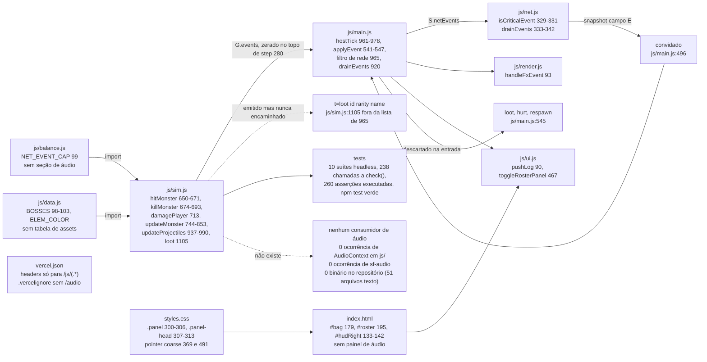
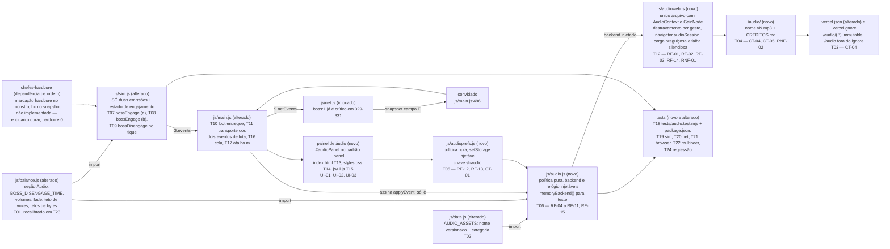

# Implementation Plan

## Request Summary

- **Objective**: dar som ao jogo — destravamento por gesto, música ambiente da masmorra, faixa própria da **luta** do chefe HARDCORE (início e fim sincronizados por evento crítico de simulação), efeitos para as cinco categorias já emitidas, e controle de mudo e volume num painel próprio, persistido em `sf-audio`.
- **Scope**:
  - **In**: `js/balance.js` (seção de áudio, incluindo o prazo de desengajamento); `js/data.js` (tabela `AUDIO_ASSETS`); dois módulos puros novos (`js/audioprefs.js`, `js/audio.js`) e um backend de navegador (`js/audioweb.js`); **exatamente duas emissões novas em `js/sim.js`** (`bossEngage` CT-06 e `bossDisengage` CT-07) mais o estado mínimo de engajamento que elas exigem; encaminhamento de `loot` (CT-02) e dos dois eventos de luta na composição; painel de áudio em `index.html`/`styles.css`/`js/ui.js` com gatilho e atalho `m`; diretório `/audio/` com manifesto de procedência, header de cache imutável em `vercel.json` e a permanência de `/audio/` fora do `.vercelignore`; suíte nova `tests/audio.test.mjs` e extensão de `tests/sim.test.mjs`, `tests/net.test.mjs`, `tests/browser.mjs` e `tests/multipeer.mjs`.
  - **Out**: os arquivos de áudio em si (entrada externa, CT-05, critério 9); qualquer outra alteração em `js/sim.js`; faixa para menu, lobby e fila; faixa própria de chefe não HARDCORE; implementação de `bossSpawn` (pertence a `chefes-hardcore`, T06/T14 do PLAN dela); voz, áudio posicional, ducking, tela de créditos; Git LFS; dependência npm de runtime e passo de build.
- **Tier**: complete
- **Architecture references**: `AGENTS.md`, `docs/agents/architecture.md`, `docs/agents/coding_guidelines.md`, `docs/agents/api_contracts.md` (apoio lido: `.spec/features/chefes-hardcore/SPEC.md`, `.spec/features/chefes-hardcore/PLAN.md`, `.spec/features/chefes-hardcore/PHASES.md`, `.spec/init/design/tokens-componentes.md`, `.spec/init/design/hud-grupo-mobile.md`, `.spec/init/project-phases.md`)

### Ordem de implementação — dependência externa declarada

**`chefes-hardcore` primeiro, `camada-audio` depois** (`## Metadata` da SPEC). O que esta feature consome de lá é a **marcação** HARDCORE do chefe (campo `hardcore` no monstro, RF-03/RF-04 daquela SPEC; campo opcional `hc` no snapshot, CT-01 dela) — é dela que sai o campo `hardcore` de CT-06 e CT-07. Estado verificado hoje: **não implementada** (`grep -rn 'bossSpawn\|hardcore\|\bhc\b' js/ tests/ index.html` → zero). Consequências práticas, registradas para não virarem surpresa na execução:

- As tasks T07–T09 escrevem `hardcore: m.hardcore ? 1 : 0`, portanto **funcionam antes** de `chefes-hardcore` existir e produzem `hardcore: 0` — que é exatamente o caminho RF-07 (código presente e dormente, ambiente segue tocando, zero erro).
- O que **não** é verificável antes da ordem ser respeitada é o caminho positivo de RF-05 (faixa da luta trocando de verdade) e o `hc` do snapshot. Se a ordem for invertida, T19/T22 só cobrem o lado negativo e a feature entrega som sem a faixa do chefe.
- CT-03 permanece como contrato de **entrada** só nesse papel: `bossSpawn` **não** é gatilho de música (M-01). A convivência exigida é passiva: quando T14 daquela feature começar a mandar `bossSpawn` pela rede, a camada de áudio precisa tratá-lo como tipo não mapeado → zero pedido de reprodução (RF-10), o que T06 garante por construção (mapa explícito, `default` inerte).
- Um acoplamento a mais foi verificado e **neutralizado de propósito**: T04 de `chefes-hardcore` cria `G.pendingEvents` e passa a entregar o `{ t: 'floor' }` que hoje é descartado (`js/sim.js:280` zera `G.events` antes de qualquer consumidor). O caminho 2 de RF-06 **não** depende disso: T16 chama o fim de faixa nos dois pontos de composição que já existem hoje (`js/main.js:966-976` no host e `case 'floor'` em `js/main.js:506-514` no convidado), não no evento de simulação.

### Regras de camada que governam esta decomposição

| Regra                                                                                                                                                          | Fonte                                                                                                   | Efeito nas tasks                                                                                                                                                                                                                                                           |
| -------------------------------------------------------------------------------------------------------------------------------------------------------------- | ------------------------------------------------------------------------------------------------------- | -------------------------------------------------------------------------------------------------------------------------------------------------------------------------------------------------------------------------------------------------------------------------- |
| `js/sim.js` é estado puro, zero DOM; `node tests/sim.test.mjs` roda em Node puro                                                                               | `AGENTS.md:37`, `AGENTS.md:56`, `docs/agents/architecture.md` (tabela de camadas)                       | T07–T09 são as **únicas** tasks que tocam `js/sim.js`, e só empilham evento por `pushEvent` — nenhuma chamada de áudio, nenhum `document`/`window`/`Audio`/`AudioContext`; portão de `grep` em T24 (RNF-03)                                                                |
| Emitir evento de simulação **não é** chamada de apresentação: `pushEvent` já é o canal por onde a simulação conta o que aconteceu                              | `AGENTS.md:37`, `js/sim.js:677`, `js/sim.js:736`, tabela de camadas                                     | É a justificativa inteira de T07–T09; os nomes descrevem o jogo (`bossEngage`/`bossDisengage`), nunca a apresentação (`bossMusic` é proibido)                                                                                                                              |
| Apresentação não muta estado de simulação; composição (`main.js`) é cola, não regra                                                                            | `docs/agents/architecture.md` (tabela de camadas)                                                       | T06 e T12 só **leem** evento e snapshot; T10/T11 só acrescentam tipos a duas listas; T16/T17 instanciam e encaminham, sem decidir nada de jogo                                                                                                                             |
| Todo número de tuning mora em `js/balance.js`; nada de literal solto na lógica                                                                                 | `AGENTS.md:38`, `AGENTS.md:57`, `docs/agents/coding_guidelines.md` §1                                   | T01 nasce antes de todo código; T06, T07, T09 e T12 importam de lá; T23 recalibra `BOSS_DISENGAGE_TIME` no mesmo arquivo, sem espalhar o número                                                                                                                            |
| Tabela de conteúdo mora em `js/data.js` (precedente: `VOCATIONS[].skills`, `MONSTERS[].poison`)                                                                | `docs/agents/architecture.md` (camada Conteúdo/config), `docs/agents/data_model.md`                     | T02 declara `AUDIO_ASSETS` como dado (nome versionado + categoria), não como `switch` dentro de `js/audio.js`                                                                                                                                                              |
| Módulo de política é puro, sem DOM e sem global, com colaborador injetável (`setStorage()` / `memoryStorage()`, relógio injetado em `ChatGate.allow(id, now)`) | `docs/agents/coding_guidelines.md` §2, `js/save.js:39-45`, `js/save.js:308-319`, `js/chatgate.js:17-21` | T05 e T06 adotam a forma verbatim: `js/audioprefs.js` com storage injetável, `js/audio.js` com **backend** e **relógio** injetáveis e `memoryBackend()` de teste — é o que torna a política de faixa testável em Node (decisão detalhada em `## Decisão de testabilidade`) |
| Evento com `boss` é crítico e escapa do teto de 120 de `drainEvents`                                                                                           | `docs/agents/api_contracts.md` (controle de fluxo e descarte), `js/net.js:327-331`, `js/balance.js:99`  | T07 e T09 marcam `boss: 1`; T11 põe os dois tipos na lista que alimenta `drainEvents` (`js/main.js:920`, `js/main.js:965`); T20 assere a sobrevivência com fila saturada                                                                                                   |
| Nunca adicionar dependência de runtime no npm; nunca introduzir passo de build                                                                                 | `AGENTS.md:60`, `AGENTS.md:61`, `vercel.json` (`framework: null`, `buildCommand` `echo 'sem build'`)    | T12 usa Web Audio nativo; T02 versiona asset por **nome de arquivo** (não há hash de build); T18 não acrescenta `dependencies`, só uma linha no script `test`                                                                                                              |
| `localStorage` é colaborador que pode falhar: avisa uma vez e a partida segue                                                                                  | `docs/agents/architecture.md` (pontos de integração), `js/save.js:294-301`                              | T05 cai no padrão de `js/balance.js` em memória quando a chave está ausente, ilegível, com versão desconhecida ou fora de faixa, sem lançar e sem apagar a chave                                                                                                           |
| Teste sem framework: `check()` local duplicado por arquivo, `process.exit(failures ? 1 : 0)`, rótulo pt-BR `área: comportamento`                               | `AGENTS.md:43`, `docs/agents/coding_guidelines.md` §5                                                   | T18–T22 repetem o helper verbatim; T18 é a **única** suíte nova e a única linha nova no script `test` de `package.json`                                                                                                                                                    |
| pt-BR em comentário, log e UI; identificadores em inglês                                                                                                       | `AGENTS.md:45`, `AGENTS.md:51`                                                                          | Rótulos do painel (T13), comentários das constantes (T01), `console.warn` de RF-14 (T12) e todos os rótulos de teste em pt-BR; `AudioLayer`, `unlockAudio`, `playSfx`, `setMusicTrack`, `loadAudioPrefs` em inglês                                                         |

### Decisão de testabilidade — sim, o molde de `js/save.js`

**Adotado, sem ressalva.** O precedente do repositório para testar dependência que só existe no navegador é `js/save.js`: o backend entra por `setStorage()` e o teste injeta `memoryStorage()` (`js/save.js:39-45`, `js/save.js:308-319`, usado em `tests/save.test.mjs:27`). É isso que faz o formato do save ser verificável em Node puro. A camada de áudio recebe o mesmo molde, em **dois eixos**:

1. **Preferência** (`js/audioprefs.js`, T05) — `setStorage(s)` idêntico ao de `js/save.js`, e os testes injetam o `memoryStorage()` que `js/save.js` **já exporta** (zero duplicação de helper). Cobre RF-12, RF-13 e CT-01 em Node.
2. **Política de áudio** (`js/audio.js`, T06) — `createAudioLayer({ backend, now })`. O `backend` é o colaborador injetável com a superfície mínima (`playSfx(assetId, gain)`, `setTrack(assetId, { fade })`, `stopTrack({ fade })`, `applyGains({ music, sfx, muted })`, `preload(assetIds)`); o `now` é relógio injetado, no precedente literal de `ChatGate.allow(id, now)` (`js/chatgate.js:17-21`), para que o intervalo mínimo de RF-15 seja reproduzível. `memoryBackend()` grava a lista de chamadas. Assim **a política inteira** — qual faixa toca, quando para, o filtro por `ev.id === localId` de RF-11, o teto de vozes e o intervalo mínimo de RF-15, e a guarda da invariante de alternância de RF-05/RF-06 — roda em `node tests/audio.test.mjs`, sem navegador.

Sobra para `tests/browser.mjs` (T21) **só o que é irredutivelmente de navegador**: o destravamento síncrono no manipulador do gesto (RF-01), o silêncio e a ausência de erro antes do gesto (RF-02), a categoria de sessão sob detecção de recurso (RF-03), o `console.warn` único de arquivo faltando (RF-14), a geometria do painel (UI-01, UI-03) e o marco de rede de RNF-01. Essa separação é o motivo de existirem **três** módulos em vez dos dois sugeridos no FLEXIBLE da SPEC: o terceiro (`js/audioweb.js`) é o único arquivo do repositório que menciona `AudioContext`, e é ele que fica de fora da suíte headless — exatamente a fronteira que `docs/agents/architecture.md` desenha entre "Lógica pura" e "Apresentação".

## AS IS — Componentes impactados

Hoje a simulação empilha eventos em `G.events`, o host despacha em `hostTick` e o mesmo `applyEvent` atende host e convidado, terminando em desenho (`js/render.js:93`) ou texto (`js/ui.js:90`). `loot` é emitido mas morre em dois lugares: `applyEvent` descarta na entrada (`js/main.js:545`) e o filtro de rede não o encaminha (`js/main.js:965`). Não existe evento de início nem de fim de **luta** de chefe, nenhum consumidor de som, nenhuma chave de preferência de áudio, nenhum arquivo binário e nenhuma regra de cache fora de `/js/(.*)`. Baseline de teste medido nesta análise: `npm test` verde, 260 asserções executadas em 10 suítes.

## TO BE — Componentes propostos

A camada de áudio entra como mais um consumidor de `applyEvent`, ao lado de `handleFxEvent` e `UI.pushLog`, e nunca escreve em `G` — a política pura de `js/audio.js` (T06) decide, e o backend de navegador de `js/audioweb.js` (T12) executa. `js/sim.js` muda em exatamente três tasks (T07, T08, T09) e apenas para empilhar `bossEngage`/`bossDisengage` e manter o estado mínimo de engajamento que elas exigem. A composição ganha quatro acréscimos aditivos (T10, T11, T16, T17): entregar `loot`, transportar os dois eventos de luta, instanciar a camada e ligar o painel. `js/balance.js` (T01, T23) e `js/data.js` (T02) são as únicas fontes de número e de nome de arquivo. `/audio/` (T04) e `vercel.json` (T03) fecham o contrato de asset, e a bateria de testes (T18–T22, portão em T24) cobre cada RF e cada UI com pelo menos uma asserção, no padrão verbatim das suítes existentes.

## Tasks

### T01 — Seção de áudio em `js/balance.js`, com o prazo de desengajamento calibrado

- **Files**: `js/balance.js`
- **Change**: criar a seção `// ---------- Áudio ----------` no fim do arquivo, exportando, cada uma com comentário pt-BR explicando o PORQUÊ no padrão de `docs/agents/coding_guidelines.md` §3 (nunca repetindo o que o código faz):
  - `BOSS_DISENGAGE_TIME = 12` — segundos sem troca de dano com o chefe engajado antes de `bossDisengage` (CT-07, RF-17). **Calibração declarada, não chute**: a maior lacuna _natural_ dentro de uma luta em curso é o ciclo de especial do chefe (`m.special = 7`, `js/sim.js:823`, com o primeiro sorteado em `G.rng.range(4, 8)` no nascimento) somado ao par cooldown+carga do golpe básico (`1.5` e `0.5`, `js/sim.js:815-816`) — pior caso ≈ 8 s sem ninguém trocar dano. 12 s deixa 4 s de folga sobre esse pior caso e ainda encerra a faixa rápido o bastante para o abandono não ficar sonoro. O número é **lido** pelo teste (T19), nunca repetido, e é remedido em T23.
  - `MUSIC_VOLUME_DEFAULT = 0.5` e `SFX_VOLUME_DEFAULT = 0.7` — padrões de fábrica de RF-12; efeitos acima da música porque a música é leito e o efeito é informação de combate.
  - `MUSIC_FADE_TIME = 0.8` — janela única de transição entre faixas (RF-05, RF-06); é o **único** intervalo em que duas faixas podem soar juntas.
  - `SFX_MAX_VOICES = 8` e `SFX_MIN_INTERVAL = 0.06` — teto de vozes e intervalo mínimo por categoria de RF-15, dimensionados contra o lote real de `NET_EVENT_CAP = 120` (`js/balance.js:99`).
  - `AUDIO_BUDGET_TOTAL = 4 * 1024 * 1024`, `AUDIO_BUDGET_MUSIC = 1.2 * 1024 * 1024`, `AUDIO_BUDGET_SFX = 40 * 1024` — os três tetos rígidos de RNF-02, em fonte única. Precedente de teto em bytes neste arquivo: `SLOW_PEER_BUFFER = 512 * 1024`.
- **Covers**: RF-12, RF-15, RF-17, RNF-02, RNF-07
- **Tests**: cobertura entra em T18 (`tests/audio.test.mjs`) e T19 (`tests/sim.test.mjs`), que **importam** as constantes em vez de repetir o número; nesta task basta `npm test` seguir verde
- **Risk**: Low — acréscimo puro; nenhuma constante existente é tocada
- **Dependencies**: none

### T02 — Tabela `AUDIO_ASSETS` em `js/data.js`

- **Files**: `js/data.js`
- **Change**: exportar `AUDIO_ASSETS`, a fonte única de nome de arquivo e categoria, no padrão das demais tabelas de conteúdo do arquivo (`BOSSES`, `MONSTERS[].poison`): duas faixas de música — `ambient` → `/audio/ambient.v1.mp3`, `bossfight` → `/audio/bossfight.v1.mp3` — e cinco efeitos, um por categoria confirmada de RF-10: `cast` → `/audio/cast.v1.mp3`, `hit` → `/audio/hit.v1.mp3`, `death` → `/audio/death.v1.mp3`, `loot` → `/audio/loot.v1.mp3`, `portal` → `/audio/portal.v1.mp3`. Cada entrada declara `kind: 'music' | 'sfx'`. Nomes em minúscula, sem acento, sem espaço, com sufixo de versão `vN` no nome do arquivo — a invalidação de CT-04 é por nome, porque o projeto não tem passo de build e portanto não tem hash de conteúdo (`AGENTS.md:61`). Comentário pt-BR registra a regra: **nunca sobrescrever um nome já publicado sob cache imutável; trocar áudio é publicar `v2` e apontar a tabela para ele**.
- **Covers**: RF-04, RF-05, RF-10, CT-04, CT-05
- **Tests**: T18 — toda entrada começa com `/audio/`, casa `^[a-z0-9]+\.v[0-9]+\.mp3$`, tem `kind` válido, e as cinco categorias de RF-10 estão presentes exatamente uma vez
- **Risk**: Low — tabela nova, nenhum consumidor existente
- **Dependencies**: none

### T03 — Header de cache imutável para `/audio/` em `vercel.json` e permanência fora do `.vercelignore`

- **Files**: `vercel.json`, `.vercelignore`
- **Change**: em `vercel.json`, acrescentar uma entrada `headers` **antes** da regra genérica `/(.*)`, com `source: "/audio/(.*)"` e `Cache-Control: public, max-age=31536000, immutable`. A regra de `/js/(.*)` (`public, max-age=0, must-revalidate`) e os dois headers de segurança de `/(.*)` ficam **bit a bit** como estão; `framework: null`, `installCommand`, `buildCommand`, `outputDirectory` e `cleanUrls` não são tocados (RNF-07). Em `.vercelignore`, **não** acrescentar `/audio` — acrescentar apenas uma linha de comentário pt-BR registrando a decisão ao lado do comentário que já abre o arquivo, para que a próxima pessoa que for "limpar o deploy" não repita o padrão de `tests` e `.spec` e apague o áudio da produção. O deploy é estático com `outputDirectory: "."`, então `/audio/` só chega ao navegador porque **não** está listado ali.
- **Covers**: CT-04, RNF-02, RNF-07
- **Tests**: T18 — `vercel.json` tem a entrada de `/audio/(.*)` com `immutable`; a entrada de `/js/(.*)` continua com `max-age=0, must-revalidate`; `.vercelignore` **não** contém nenhuma linha não comentada que case com `audio`; `framework` continua `null` e `buildCommand` continua `echo 'sem build'`
- **Risk**: Medium — erro aqui é invisível em desenvolvimento e só aparece em produção, nas duas direções: header errado congela um arquivo velho para sempre, `.vercelignore` errado tira o som do ar
- **Dependencies**: none

### T04 — Diretório `/audio/` e manifesto de procedência `audio/CREDITOS.md`

- **Files**: `audio/CREDITOS.md` (arquivo novo; cria o diretório `/audio/`)
- **Change**: criar o manifesto versionado em texto exigido por CT-05, com cabeçalho pt-BR declarando o critério de admissão e uma tabela com uma linha por arquivo: `arquivo | título da obra | autor | licença | URL de origem`. O cabeçalho registra, como regra e não como recomendação: licença CC0, domínio público ou equivalente que permita uso comercial, redistribuição e obra derivada **sem atribuição embutida no produto** (licença que exige crédito visível é recusada, porque o jogo não tem tela de créditos e criar uma está fora de escopo); MP3 obrigatório como linha de base para **todo** asset, por ser o único decodificável em todos os navegadores-alvo, incluindo o Safari do iOS; efeitos em mono, música em estéreo, 44,1 kHz em todos; pico normalizado sem clipe (`0 dBFS` como teto absoluto); nome em minúscula, sem acento, sem espaço, com o sufixo `vN` de CT-04; e os três tetos de RNF-02 citando as constantes de T01. A tabela nasce **vazia**, com a regra explícita "arquivo sem linha aqui não entra no deploy" — os binários são entrada externa (critério 9) e chegam depois. O manifesto vai em `/audio/` (e não em `docs/`) de propósito: fica ao lado do que descreve e sobrevive a qualquer limpeza de `.vercelignore`; o custo em bytes é desprezível.
- **Covers**: CT-05, RNF-02
- **Tests**: T18 — `audio/CREDITOS.md` existe; para **cada** arquivo presente em `/audio/` que não seja o próprio manifesto existe uma linha citando o nome do arquivo (com `/audio/` vazio a asserção é vacuamente verdadeira, e é assim que a suíte fica verde antes de os assets chegarem); nenhum arquivo de `/audio/` começa com a assinatura de ponteiro do Git LFS (`version https://git-lfs`)
- **Risk**: Low — arquivo de texto novo; o valor é o portão que ele cria para o dia em que o binário chegar
- **Dependencies**: none

### T05 — `js/audioprefs.js`: preferência `sf-audio` com armazenamento injetável

- **Files**: `js/audioprefs.js` (arquivo novo)
- **Change**: módulo de política **puro**, sem DOM e sem global, com o cabeçalho de 3 linhas em pt-BR no padrão de `js/room.js:1-3` e `js/save.js:1-4` declarando a regra ("Política pura, sem DOM: dá para testar em Node"). Superfície: `AUDIO_PREFS_VERSION = 1` (versão **desta chave**, independente de `SAVE_VERSION` 3 — a chave **não** entra no schema de `js/save.js` e não exige migração v3→v4); `AUDIO_KEY = 'sf-audio'`; `setStorage(s)` e `store()` **verbatim** no molde de `js/save.js:39-45`; `defaultPrefs()` devolvendo `{ muted: 0, music: MUSIC_VOLUME_DEFAULT, sfx: SFX_VOLUME_DEFAULT }` a partir de `js/balance.js`; `loadAudioPrefs()` que lê, valida e **clampa** — JSON inválido, `v` desconhecido, campo ausente ou valor fora de `[0, 1]` caem no padrão **sem lançar erro e sem apagar a chave**; `saveAudioPrefs(prefs)` que grava `{ v: 1, muted, music, sfx }` e, em falha de cota ou modo privado, avisa **uma única vez** por sessão e devolve `false`, seguindo o precedente de `js/save.js:294-301` (aviso em pt-BR, nunca no chat nem no log da sala). Sem `localStorage` disponível, o módulo opera com o padrão em memória e o jogo segue.
- **Covers**: RF-12, RF-13, CT-01
- **Tests**: T18 — ida e volta dos três valores; chave ausente, JSON quebrado, `v: 99`, `music: 2`, `sfx: -1` e `muted: 'sim'` caem no padrão sem lançar e sem remover a chave; storage que lança em `setItem` devolve `false` e avisa uma vez só; nenhuma leitura de `js/save.js` é alterada e `SAVE_VERSION` continua 3
- **Risk**: Low — chave nova, verificada como livre (`grep -rn 'sf-audio' js/ tests/ index.html` → zero), isolada do save
- **Dependencies**: T01

### T06 — `js/audio.js`: política de áudio pura, com backend e relógio injetáveis

- **Files**: `js/audio.js` (arquivo novo)
- **Change**: módulo de política **puro**, zero DOM, zero `AudioContext`, com o mesmo cabeçalho declarativo de T05. Exporta `createAudioLayer({ backend, now, prefs })` e `memoryBackend()`. O `backend` é o colaborador injetável (`playSfx`, `setTrack`, `stopTrack`, `applyGains`, `preload`) e `now` é o relógio injetado, no precedente de `ChatGate.allow(id, now)` (`js/chatgate.js:17-21`). Responsabilidades, todas de decisão e nenhuma de execução:
  - **Máquina de faixas** (RF-04, RF-05, RF-06): `enterGame()` pede `ambient`; `leaveGame()` para tudo; menu, lobby e fila nunca pedem faixa. `bossEngage` com `hardcore: 1` troca para `bossfight` **no mesmo turno**, sem temporizador; `hardcore: 0` é operação nula (RF-07). O retorno à ambiente tem quatro entradas — `{ t:'fx', k:'death', boss: true }`, virada de andar, fim de sessão e `bossDisengage` —, e as três primeiras **não** esperam prazo nenhum (RF-06, AC de independência). Todas passam pela mesma função de encerramento, **idempotente**: encerrar duas vezes não deixa duas ambientes ativas, e `bossDisengage` chegando com a faixa já encerrada é no-op sem erro. Um único `setTrack` ativo por vez, com `MUSIC_FADE_TIME` como a única janela em que duas faixas coexistem.
  - **Guarda da invariante de alternância** (RF-05, RF-16, RF-17): a camada mantém o estado `fighting` e ignora `bossEngage` repetido sem `bossDisengage` entre eles — mas **registra** a ocorrência num contador exposto (`layer.stats.alternationViolations`), porque pela SPEC isso é **defeito de emissão**, não caso a tratar. O contador é o que T18 e T19 asseram como zero.
  - **Mapa de efeitos** (RF-10, RF-11): mapa explícito e fechado — `fx k='cast'` → `cast`; `fx k='slash'` e `fx k='impact'` → `hit`; `fx k='death'` e `fx k='playerDeath'` → `death`; `loot` → `loot`; `portal` → `portal`. Tipo não mapeado (inclusive o `bossSpawn` que `chefes-hardcore` vai trazer) → **zero** pedido. Escopo pessoal: `loot` e `fx k='level'` só tocam quando `ev.id === localId`; acerto, morte e portal não filtram por id.
  - **Teto de vozes e intervalo mínimo** (RF-15): no mesmo quadro, no máximo `SFX_MAX_VOICES` fontes; o excedente é **descartado**, nunca enfileirado para tocar depois; duas ocorrências da mesma categoria separadas por menos de `SFX_MIN_INTERVAL` (medido pelo relógio injetado) produzem **uma** reprodução.
  - **Ganhos** (RF-12, UI-02): `setMuted`, `setMusicVolume`, `setSfxVolume` chamam `backend.applyGains` sem reiniciar faixa; mudo não zera os volumes guardados, e desmutar restaura exatamente os dois.
  - **Proibição explícita** (RF-09): nenhum `setTimeout`, `setInterval` ou agendamento próprio neste arquivo — o único sincronizador é a chegada do evento. O `grep` que prova isso é asserção em T18.
- **Covers**: RF-04, RF-05, RF-06, RF-07, RF-08, RF-09, RF-10, RF-11, RF-12, RF-15
- **Tests**: T18 — cada bullet acima vira asserção com `memoryBackend()` e relógio falso, incluindo o caso de RF-08 (entrar depois do `bossEngage` não inicia a faixa retroativamente, porque não há replay nem consulta de estado de música)
- **Risk**: Medium — é o cérebro da feature; a máquina de faixas tem quatro caminhos de saída e a idempotência entre eles é o que impede faixa presa ou faixa dupla
- **Dependencies**: T01, T02

### T07 — Estado de engajamento e emissão de `bossEngage` pelo lado jogador→chefe

- **Files**: `js/sim.js`
- **Change**: **primeira das duas emissões** que esta feature acrescenta à simulação, e o estado mínimo que as duas exigem. (1) `createGame()` ganha `engagedBosses: []` e `nextFloor()` zera a lista junto com as demais (`G.monsters.length = 0` e vizinhos, `js/sim.js:52-56`) — é isso que garante que chefe deixado para trás na virada de andar **não** emita `bossDisengage` (RF-17). (2) `makeMonster()` ganha `engaged: false` e `lastDamageTime: 0`, ao lado de `isBoss: false`. (3) Helper novo `markBossDamage(G, m)`, único ponto de decisão: sai imediatamente se `!m || !m.isBoss` (é o teste de campo único que tira o dano de monstro comum do caminho, RNF-05); com chefe, atualiza `m.lastDamageTime = G.time`; se `m.engaged` já é verdadeiro, retorna; senão liga `m.engaged = true`, empilha a referência em `G.engagedBosses` e emite **uma vez** `{ t: 'bossEngage', id: m.id, typeId: m.typeId, floor: G.floor, hardcore: m.hardcore ? 1 : 0, boss: 1 }` — formato verbatim de CT-06, com o mesmo desenho de campos do `bossSpawn` de `chefes-hardcore`. (4) Chamada em `hitMonster()` **depois** de `m.hp -= dmg` (`js/sim.js:654`) e **antes** de `killMonster()` (`js/sim.js:670`), para que um chefe morto de um golpe produza a ordem engajamento→morte e nunca a inversa. `hitMonster` é o funil de todo dano **direto** de jogador em monstro — corpo a corpo (`js/sim.js:412`), magia (`js/sim.js:638`), projétil de jogador (`js/sim.js:972`) e zona (`js/sim.js:1002`) passam por lá. Ressalva já verificada na SPEC e repetida aqui para não ser redescoberta: dano contínuo de status em monstro **não** passa por `hitMonster` (`js/sim.js:910`, `js/sim.js:916`), e não precisa passar, porque o status só chega ao monstro pelos caminhos que já passaram por `hitMonster`, que sempre aplica ao menos 1 de dano (`Math.max(1, ...)`, `js/sim.js:653`). (5) `killMonster()` remove o chefe de `G.engagedBosses` e zera `m.engaged` **sem** emitir `bossDisengage` — a instância deixou de existir e o caminho 1 de RF-06 já reconheceu o fim. Nenhuma linha de dano, aggro, XP, loot, status ou geração de andar muda de comportamento.
- **Covers**: RF-16 (direção a), CT-06, RNF-03, RNF-05
- **Tests**: T19 — dano de jogador em chefe emite exatamente 1 `bossEngage`; mais 10 golpes continuam em 1; chefe morto de um golpe produz `bossEngage` antes de `fx k='death'` na mesma lista; dano em monstro comum emite 0; o campo `hardcore` sai `0` com a marcação ausente (RF-07)
- **Risk**: High — `hitMonster` é o funil de todo dano de jogador do jogo e está sob 4 suítes; o guarda-corpo é o teste de campo único no topo do helper e o portão de `grep` de T24
- **Dependencies**: T01

### T08 — Emissão de `bossEngage` pelo lado chefe→jogador, nos três chamadores que conhecem o monstro

- **Files**: `js/sim.js`
- **Change**: fechar a direção (b) de RF-16 — o chefe causar dano a um jogador vale como início de luta tanto quanto receber. `damagePlayer()` (`js/sim.js:713`) recebe o dano já resolvido e **não** recebe o agressor, então a emissão fica nos três chamadores que têm o monstro em mão, cada um chamando `markBossDamage(G, m)` **antes** de `damagePlayer` (para que o engajamento preceda um eventual `playerDeath` no mesmo lote): investida/nova do especial do chefe (`js/sim.js:828`, dentro do laço de jogadores no raio — a chamada é idempotente e sai em O(1) depois do primeiro), corpo a corpo em `resolveMonsterAttack` (`js/sim.js:866`) e projétil de monstro acertando jogador (`js/sim.js:982`). O terceiro é o único sem o monstro em escopo. Rota escolhida, e o porquê: `spawnProjectile()` (`js/sim.js:925-936`) passa a copiar `bossRef: o.bossRef || null`, e os dois pontos de spawn de projétil de monstro (`js/sim.js:830-836`, no burst do especial, e `js/sim.js:860-864`, em `resolveMonsterAttack`) passam `bossRef: m.isBoss ? m : null`; o acerto em `js/sim.js:982` faz `if (pr.bossRef) markBossDamage(G, pr.bossRef)`. Isso é **O(1) real**, enquanto o `G.monsters.find(x => x.id === pr.ownerId)` sugerido no texto de RF-16 seria varredura da população a cada acerto de projétil de chefe — e RNF-05 proíbe varredura no caminho de dano (a tensão entre as duas passagens da SPEC está registrada em `## Open Questions`, Q1). Verificado que `bossRef` **não** vaza para a rede: `buildSnapshot` monta os projéteis por escolha explícita de campos (`js/net.js:210`, `{ i, x, y, e, b }`), nunca por serialização do objeto inteiro. Dano ambiental de lava (`js/sim.js:389`) e dano de monstro comum continuam sem emitir nada.
- **Covers**: RF-16 (direção b), CT-06, RNF-05
- **Tests**: T19 — chefe batendo primeiro (sem o jogador ter batido) emite exatamente 1 `bossEngage` nos três caminhos; repetir o ataque mantém em 1; dano de lava emite 0; monstro comum, corpo a corpo e por projétil, emite 0; o campo `bossRef` não aparece em `JSON.stringify(buildSnapshot(...))`
- **Risk**: Medium — toca o caminho de dano de **todo** monstro em `resolveMonsterAttack` e em `updateProjectiles`; o campo `bossRef` guarda referência a objeto e precisa morrer junto com o projétil (morre: o projétil é removido do array em todos os caminhos de saída)
- **Dependencies**: T07

### T09 — `bossDisengage` no tique, com invariante de alternância

- **Files**: `js/sim.js`
- **Change**: **segunda e última** emissão desta feature na simulação. Em `step()`, logo depois de `updateZones(G, dt)` e **antes** da limpeza de `G.monsters` (para que um acerto deste tique conte como troca de dano), varrer `G.engagedBosses` — e **só** ela, nunca `G.monsters` (RNF-05: zero na esmagadora maioria dos tiques, um no caso normal, sem alocação por tique). Para cada chefe engajado vivo cujo `G.time - m.lastDamageTime >= BOSS_DISENGAGE_TIME` (constante importada de `js/balance.js`, nunca literal): desligar `m.engaged`, removê-lo da lista e emitir **uma vez** `{ t: 'bossDisengage', id: m.id, typeId: m.typeId, floor: G.floor, hardcore: m.hardcore ? 1 : 0, boss: 1 }` — formato verbatim de CT-07, mesmo desenho de campos de CT-06. Chefe que morreu no meio do tique já saiu da lista em T07 e não emite. Depois disso, a próxima troca de dano em qualquer direção religa `m.engaged` por `markBossDamage` e emite `bossEngage` de novo: é a **cardinalidade por engajamento** de M-04, e o que a torna estável é a **invariante de alternância** — para uma mesma instância de chefe, `bossEngage` e `bossDisengage` se alternam, a sequência começa sempre por `bossEngage` e nunca há dois iguais seguidos. A invariante não é prosa: ela é consequência mecânica de `m.engaged` ser o único portão dos dois lados (T07 só emite quando o campo estava falso, T09 só emite quando estava verdadeiro), e é **assertada explicitamente** em T19 sobre a lista completa de eventos de luta de uma instância. Nenhum número novo entra em `js/sim.js` e nenhuma palavra de áudio entra no nome dos eventos.
- **Covers**: RF-17, CT-07, RNF-03, RNF-05
- **Tests**: T19 — avançar o tempo até pouco antes da constante **lida de `js/balance.js`** dá 0 evento e ultrapassá-la dá exatamente 1; qualquer troca de dano em qualquer direção, de qualquer jogador, reinicia a contagem; dano de lava, dano de status em monstro e dano de monstro comum **não** reiniciam; chefe nunca engajado nunca emite; chefe morto não emite; chefe deixado para trás em `nextFloor()` não emite; a sequência completa `engage → disengage → engage` é assertada como alternada do primeiro ao último elemento, sem dois iguais seguidos
- **Risk**: Medium — roda todo tique; lista não esvaziada na virada de andar vira `bossDisengage` órfão de um chefe que não existe mais, e referência retida vira vazamento
- **Dependencies**: T07, T08

### T10 — Entrega do evento `loot` na composição (CT-02), nos dois pontos que hoje o matam

- **Files**: `js/main.js`
- **Change**: `loot` é emitido pela simulação (`js/sim.js:1105`) e morre em dois lugares independentes; CT-02 exige que ele chegue ao consumidor de áudio nas duas pontas, então **ambos** mudam. (1) `applyEvent` (`js/main.js:545`) deixa de descartar `loot` na linha `if (ev.t === 'loot' || ev.t === 'hurt' || ev.t === 'respawn') return;` — `loot` sai dessa linha e passa a seguir até a camada de áudio, continuando **sem** FX (`handleFxEvent` termina em `default: break`, `js/render.js:74`) e sem log novo (a linha de log já existe e vem da simulação, `js/sim.js:1106`). `hurt` e `respawn` continuam descartados. (2) O filtro de rede (`js/main.js:965`) passa a incluir `'loot'` na lista que alimenta `S.netEvents` — sem isso o evento nasce no host e morre nele, e o convidado nunca ouviria o som do próprio loot. O evento viaja **na forma exata em que a simulação já o emite**, `{ t:'loot', id, rarity, name }`, sem reformatação em `main.js` (a composição só transporta). `loot` **continua não crítico** — fora de `CRITICAL` (`js/net.js:327`) e sem campo `boss` —, portanto é cortado sob pressão, o que é aceitável porque loot é efeito e não música (RF-09). Plano B registrado, caso a banda incomode: encaminhar só para o dono via `net.sendTo`, no padrão que `{ t:'inv' }` já usa (`js/main.js:930-934`).
- **Covers**: CT-02, RF-10 (categoria loot), RF-11
- **Tests**: T20 — `isCriticalEvent({ t:'loot', id, rarity, name })` é `false` e o evento é cortado antes dos críticos com a fila saturada; o acréscimo de bytes por item coletado é ≤ 128 e um snapshot sem coleta acrescenta exatamente 0 byte, medido pela contagem já existente em `tests/net.test.mjs:186-192`; T18 — o mapa de RF-11 só toca quando `ev.id === localId`
- **Risk**: Low — duas listas aditivas; o único cuidado é não deixar `hurt`/`respawn` escaparem junto
- **Dependencies**: none

### T11 — Transporte de `bossEngage` e `bossDisengage` na composição

- **Files**: `js/main.js`
- **Change**: acrescentar `'bossEngage'` e `'bossDisengage'` à lista de tipos que entram em `S.netEvents` (`js/main.js:965`), junto do `'loot'` de T10 — sem isso os dois eventos nascem no host e morrem nele, e o critério 4 (início e fim simultâneos para todos) não vale na produção. Em `applyEvent` (`js/main.js:541-547`), declarar os dois como tipos **ignorados pela camada de FX**, na mesma linha onde `hurt` e `respawn` já são ignorados: eles não produzem FX, nem log, nem banner — só música, e essa decisão é da camada de áudio, ligada em T16. `js/net.js` **não** é tocado: `boss: 1` já faz `isCriticalEvent()` devolver `true` (`js/net.js:329-331`, `return CRITICAL.has(ev.t) || ... || !!ev.boss`), então os dois já escapam do teto de 120 de `drainEvents` sem nenhuma alteração de transporte. Nenhuma regra de jogo entra em `main.js`.
- **Covers**: CT-06, CT-07, RF-05, RF-09
- **Tests**: T20 — `isCriticalEvent` verdadeiro para os dois; ambos sobrevivem a `drainEvents` com fila de mais de 120 eventos; ≤ 128 bytes cada e 0 byte em snapshot sem transição de luta (RNF-04)
- **Risk**: Low — lista aditiva; o risco real seria esquecer um dos dois e deixar a faixa presa no convidado
- **Dependencies**: T10

### T12 — `js/audioweb.js`: backend Web Audio, destravamento por gesto e falha silenciosa

- **Files**: `js/audioweb.js` (arquivo novo)
- **Change**: o **único** arquivo do repositório que menciona `AudioContext`; implementa a superfície que `js/audio.js` (T06) consome, sem nenhuma decisão de política própria. Importado apenas por `js/main.js`, como `js/render.js` e `js/ui.js` já são. Conteúdo:
  - **Grafo**: um `AudioContext` e dois `GainNode` separados — música e efeitos —, que é o que dá os dois barramentos independentes de RF-12 quase de graça, e um ganho mestre para o mudo. `decodeAudioData` + `AudioBufferSourceNode` em vez de elementos `<audio>`, para aguentar a rajada de RF-15 sem custo de mídia múltipla.
  - **Destravamento** (RF-01, RF-02, RF-03): um único ouvinte registrado em `window` com `{ once: true, capture: true }` para `pointerdown`, `keydown` e `touchend`, cobrindo **todos** os gatilhos que já existem (`#btnSolo`/`#btnHost`/`#btnJoin` em `index.html:40-46`, cartões de vocação em `js/ui.js:47`, `pointerdown` no canvas em `js/main.js:589`, botões de magia e poção em `js/ui.js:120` e `js/main.js:638`) **sem tocar em nenhum manipulador atual**. Dentro do próprio manipulador, de forma **síncrona** — sem `await` anterior, sem `setTimeout`, sem esperar rede —: `ctx.resume()` e a reprodução de um buffer de duração mínima; e, sob detecção de recurso (`if ('audioSession' in navigator)`), a declaração da categoria de reprodução (RF-03) — nunca assumida, e sem ela RF-01 continua valendo. Antes do gesto: zero fonte iniciada, zero contexto em `running`, zero exceção e zero rejeição de promessa não tratada (RF-02).
  - **Carga preguiçosa** (RNF-01): `preload(assetIds)` só busca bytes quando chamado, e T16 só o chama depois do primeiro quadro jogável. Nenhuma tag de áudio em `index.html` e portanto nenhum `preload` de HTML para negociar.
  - **Falha** (RF-14): arquivo ausente, download falho ou decodificação falha → **no máximo uma tentativa nova por carregamento de página por arquivo** (marcador por asset, sem temporizador), um único `console.warn` em pt-BR (`AGENTS.md:45`), nunca no chat nem no log da sala (mesma regra de `js/main.js:390`), e nenhuma exceção escapando para `window.onerror`. O silêncio daquele som é o único efeito observável.
  - **Ganhos** (UI-02): `applyGains` usa rampa (`setTargetAtTime`) com `MUSIC_FADE_TIME`, nunca corte seco, e **nunca** reinicia a faixa em curso — a posição de reprodução sobrevive à mudança de volume.
  - Zero `setTimeout`/`setInterval` (RF-09) e zero dependência nova: Web Audio é nativo, nenhuma tag `<script>` de CDN além do PeerJS já existente (`index.html:228`), `package.json` continua sem `dependencies` (RNF-07).
- **Covers**: RF-01, RF-02, RF-03, RF-14, UI-02, RNF-01, RNF-07
- **Tests**: T21 (`tests/browser.mjs`) — estado do contexto antes e depois de um clique sintético, coletor de `window.onerror`/`unhandledrejection` com contagem zero, registro de rede sem requisição a `/audio/` antes do marco de RNF-01, e um `console.warn` único com o arquivo removido; T18 — `grep` de `setTimeout|setInterval` no arquivo devolve zero
- **Risk**: High — é a fronteira com a política de autoplay do navegador; qualquer `await` antes do `resume()` quebra RF-01 de um jeito que só aparece no Safari do iOS
- **Dependencies**: T01, T02

### T13 — Painel `#audioPanel` e seu gatilho em `index.html`

- **Files**: `index.html`
- **Change**: acrescentar, ao lado de `#bag` (`index.html:179`) e `#roster` (`index.html:195`) e **dentro** da tela `#game`, um `
` com a estrutura herdada: `.panel-head` com `<h2>Som</h2>` e `<button id="btnCloseAudio" class="x">✕</button>`, e um corpo com os **três controles separados**, nenhum dividindo widget com outro (UI-01): `<input type="range" id="audioMusic" min="0" max="1" step="0.01">` com rótulo "Música", o mesmo para `id="audioSfx"` com rótulo "Efeitos", e um `<button id="btnAudioMute">` cujo **texto** alterna entre "Som ligado" e "Som mudo" — estado distinguível por texto, nunca só por cor, e legível em escala de cinza (mesma regra de UI-02 de `chefes-hardcore`). Dois caminhos de acesso, no padrão dos painéis existentes: um `` na fileira de `#hudRight` (`index.html:133-142`), do mesmo jeito que `crewChip` abre o roster, e — no layout de toque — o mesmo chip servindo de alvo, dimensionado em T14. Todos os rótulos em pt-BR. O painel vive **dentro do jogo**: nenhum controle de áudio é acrescentado às telas `#menu`, `#lobby` ou `#queue` (RF-04, UI-01 AC de escopo de tela).
- **Covers**: UI-01, UI-03
- **Tests**: T21 — o painel existe com `class="panel hidden"`, tem os três controles com ids distintos, o botão de mudo muda de **texto** ao ser acionado, e com o painel fechado o retângulo de `#audioChip` não intercepta `#stick`, `#actionBar`, `#bossBar` nem `#portalHold` em viewport de celular, retrato e paisagem
- **Risk**: Low — marcação nova e isolada; herda `.panel`, que já cabe na viewport por `width: min(680px, 94vw)` e `max-height: 86vh`
- **Dependencies**: none

### T14 — Estilo do painel e do gatilho em `styles.css`

- **Files**: `styles.css`
- **Change**: o painel **não** ganha regras de caixa próprias — herda `.panel` (`styles.css:300-306`, centralizado, `z-index: 20`) e `.panel-head` (`styles.css:307-313`), exatamente como `#bag` e `#roster`. O que entra é: uma grade interna para as três linhas de controle, no espaçamento já documentado em `.spec/init/design/tokens-componentes.md` (linha de lista `12px 14px`); estilo do `<input type="range">` alinhado aos tokens de `.bar`; e, no bloco `@media (pointer: coarse)` que já existe (`styles.css:369`, `styles.css:491`), altura mínima explícita para `#audioChip` e para os três controles respeitando o alvo de toque mínimo de **44×44px** declarado em `tokens-componentes.md:151`. A posição de `#audioChip` na fileira de `#hudRight` segue a ordem de corte por altura já definida em `.spec/init/design/hud-grupo-mobile.md` §3 — o chip acompanha os chips que já estão lá e não cria exceção nova. Com o painel **aberto**, a sobreposição do HUD é legítima e esperada (é o que `.panel` faz), mas `#stick`, `#actionBar` e `#portalHold` não podem receber toque por baixo dele.
- **Covers**: UI-01, UI-03
- **Tests**: T21 — alvo de toque ≥ 44×44 em viewport de celular; com o painel aberto, o `elementFromPoint` no centro do painel devolve elemento do painel, não do HUD; o painel cabe na viewport nos dois sentidos
- **Risk**: Low — CSS aditivo; o risco é o chip novo empurrar a fileira de `#hudRight` em tela baixa, coberto pela asserção de não-interseção
- **Dependencies**: T13

### T15 — `renderAudioPanel` e `toggleAudioPanel` em `js/ui.js`

- **Files**: `js/ui.js`
- **Change**: duas funções novas no padrão exato de `renderRosterPanel`/`toggleRosterPanel` (`js/ui.js:436-472`): `toggleAudioPanel(force)` com a mesma assinatura e o mesmo `classList.toggle('hidden', !show)`, devolvendo o estado; e `renderAudioPanel(prefs, handlers)` que escreve os três controles a partir do objeto de preferência e chama de volta `onMusic(v)`, `onSfx(v)`, `onMute(muted)` — **sem** guardar estado próprio e **sem** tocar em `js/audio.js` ou `js/audioprefs.js` (apresentação não decide; a cola é de `main.js`). O texto do botão de mudo é escrito aqui, em pt-BR. `el()` continua sendo o único ponto que toca `document` (`js/ui.js:6`), o que mantém o módulo importável em Node puro — propriedade já verificada no repositório e reusada por `tests/hud.test.mjs`.
- **Covers**: UI-01, UI-02
- **Tests**: T18 — `renderAudioPanel` e `toggleAudioPanel` são exportadas e o módulo importa em Node sem lançar; T21 — mover o controle dispara o retorno com o valor lido e o texto do botão de mudo alterna
- **Risk**: Low — segue um par de funções que já existe e já é testado
- **Dependencies**: T13

### T16 — Cola em `js/main.js`: instanciar a camada, assinar `applyEvent`, telas e carga preguiçosa

- **Files**: `js/main.js`
- **Change**: importar `createAudioLayer` de `js/audio.js`, o backend de `js/audioweb.js` e `loadAudioPrefs`/`saveAudioPrefs` de `js/audioprefs.js`, e montar a camada uma vez, com a preferência **lida antes de qualquer pedido de reprodução** (RF-13). Pontos de ligação, todos aditivos:
  - **Assinatura**: uma linha no fim de `applyEvent` (`js/main.js:541-547`) entregando o evento à camada — o mesmo código serve host e convidado, porque `applyEvent` já é chamado nos dois caminhos (direto do retorno de `step()` em `hostTick`, `js/main.js:963`, e a partir do campo `E` do snapshot, `js/main.js:496`). O identificador do dono para o filtro de RF-11 é `S.localId`.
  - **Telas** (RF-04, RF-06 caminho 3): `enterGame()` (`js/main.js:254-255`) avisa a camada de que a partida começou; `leaveSession()` (`js/main.js:353-371`) avisa que acabou, encerrando ambiente e faixa de luta. Menu, lobby e fila nunca pedem faixa.
  - **Virada de andar** (RF-06 caminho 2): avisar a camada nos **dois** pontos de composição que já existem — no host, dentro do bloco `S.G.pendingFloor` (`js/main.js:966-976`), ao lado de `net.send({ t: 'floor', ... })`; no convidado, em `case 'floor'` (`js/main.js:506-514`). Esse é o desenho deliberado que torna o caminho 2 **independente** de `G.pendingEvents` de `chefes-hardcore` (T04 de lá), como registrado em `## Ordem de implementação`.
  - **Carga preguiçosa** (RNF-01): um marcador de uma linha no laço `frame()` que, na **primeira** execução com `S.started === true` (`js/main.js:887-892`), chama `preload()` — depois do quadro desenhado, nunca antes. Nenhum byte de `/audio/` é pedido antes desse marco.
  - Nenhuma regra de jogo entra em `main.js`, nenhuma chamada de áudio entra em `hostTick` antes do despacho de eventos e nada disso roda dentro de `step()` (RNF-05).
- **Covers**: RF-04, RF-05, RF-06, RF-08, RF-10, RF-11, RF-13, RNF-01, RNF-05
- **Tests**: T21 — uma fonte de música durante a partida, silêncio nas três telas anteriores, a ambiente **não** reinicia na virada de andar (posição de reprodução no tique seguinte maior que a do anterior) e zero requisição a `/audio/` antes do primeiro quadro jogável; T22 — o convidado recebe a troca de faixa pelo mesmo lote de eventos do snapshot
- **Risk**: Medium — mexe no laço de quadro e em quatro pontos de ciclo de vida; um `preload` no lugar errado regride o tempo até o primeiro quadro jogável, que é medido comparativamente
- **Dependencies**: T06, T11, T12

### T17 — Gatilho, atalho `m` e persistência na interação

- **Files**: `js/main.js`
- **Change**: fechar o acesso de UI-01 com dois caminhos e no máximo dois toques a partir da tela de jogo. (1) `UI.el('audioChip').onclick = () => openAudioPanel();`, no padrão literal de `UI.el('crewChip').onclick = () => openRoster();` (`js/main.js:142`) e de `UI.el('btnBag').onclick` (`js/main.js:640`); `UI.el('btnCloseAudio').onclick` fecha, como `btnCloseBag` e `btnCloseRoster` já fazem. (2) **Atalho de teclado: `m`** — escolhido e justificado aqui, como a SPEC pediu que fosse decidido na fase de plano. Verificação de colisão feita contra o manipulador inteiro (`js/main.js:552-572`): ocupados estão `w`/`a`/`s`/`d` e as setas (movimento), `1`–`4` (magias), `q`/`e` (poções), `p` (roster), `tab`/`i` (mochila), `Enter` (abrir chat) e `Escape` (fechar); `m` está livre, e é a única das três candidatas livres (`o`, `m`, `k`) com mnemônica que funciona nos dois idiomas do repositório — **m**udo e **m**ute. O ramo entra depois do bloco de `Escape` e antes das teclas de movimento, e **não** precisa de `preventDefault`. O painel fecha por `Escape` no mesmo lugar onde `#bag` e o roster já fecham (`js/main.js:561`), acrescentando `UI.toggleAudioPanel(false)` àquela linha. Enquanto o chat está aberto o manipulador global já retorna cedo (`if (S.chatting)`, `js/main.js:556-559`) e o `<input>` do chat ainda faz `stopPropagation` (`js/main.js:659`), então digitar "mudo" no chat não abre painel nenhum. (3) Os três retornos de `renderAudioPanel` aplicam o valor na camada **no mesmo gesto** (UI-02) e gravam por `saveAudioPrefs` (RF-13); alterar volume durante o mudo não produz som e o valor fica guardado para quando o mudo sair.
- **Covers**: UI-01, UI-02, RF-12, RF-13
- **Tests**: T21 — `m` abre e fecha o painel; `Escape` fecha; abrir e ajustar custa dois toques; `m` digitado com o chat aberto não abre o painel; mudar o volume não reinicia a faixa; recarregar a página restaura os três valores
- **Risk**: Medium — mexe no manipulador de teclado que é a entrada principal do jogo; o caso a não esquecer é o chat
- **Dependencies**: T15, T16

### T18 — Suíte nova `tests/audio.test.mjs` e registro em `package.json`

- **Files**: `tests/audio.test.mjs` (arquivo novo), `package.json`
- **Change**: a **única** suíte nova da feature e a **única** linha nova do script `test` — decisão tomada de propósito para que `package.json` seja editado uma vez só e o encadeamento com `&&` continue parando na primeira suíte vermelha. Estrutura verbatim das 10 suítes existentes: `let failures = 0;` e `function check(label, cond, extra = '')` duplicados no topo, rótulos pt-BR no formato `área: comportamento`, `process.exit(failures ? 1 : 0)` na última linha. `npm test` passa de 10 para 11 suítes encadeadas, com `node tests/audio.test.mjs` acrescentado ao fim. Blocos:
  - `== preferência de áudio ==` (RF-12, RF-13, CT-01) — com `setStorage(memoryStorage())`, importando `memoryStorage` de `js/save.js`, que já o exporta (`js/save.js:308-319`).
  - `== política de faixa ==` (RF-04 a RF-09) — com `memoryBackend()` e relógio falso: uma faixa ativa por vez; `bossEngage hardcore:1` troca, `hardcore:0` não; os quatro caminhos de fim, cada um encerrando **sem** esperar prazo (exceto o caminho 4); idempotência de encerramento; `bossDisengage` tardio como no-op; reengajamento reiniciando a faixa; **zero violação de alternância** no contador exposto; entrada tardia não inicia faixa retroativamente (RF-08).
  - `== efeitos ==` (RF-10, RF-11, RF-15) — cinco categorias, uma reprodução por evento, zero para tipo não mapeado (inclusive `bossSpawn`), filtro por `ev.id === localId` para `loot` e `fx k='level'`, lote de 120 eventos respeitando `SFX_MAX_VOICES` com descarte (nunca enfileiramento), e repetição abaixo de `SFX_MIN_INTERVAL` tocando uma vez.
  - `== assets e deploy ==` (CT-04, CT-05, RNF-02, RNF-07) — `AUDIO_ASSETS` bem formada e cobrindo as cinco categorias; `vercel.json` com `/audio/(.*)` `immutable` e `/js/(.*)` intacto; `.vercelignore` sem linha ativa casando `audio`; `package.json` sem `dependencies`; soma de `/audio/` ≤ `AUDIO_BUDGET_TOTAL`, cada música ≤ `AUDIO_BUDGET_MUSIC`, cada efeito ≤ `AUDIO_BUDGET_SFX`, tetos **lidos de `js/balance.js`**; nenhum arquivo é ponteiro de Git LFS; toda linha de `/audio/` tem entrada em `audio/CREDITOS.md`. Com `/audio/` ainda vazio (os binários são entrada externa), as asserções por arquivo são vacuamente verdadeiras e a suíte fica verde — decisão explícita, para que a feature possa ser entregue antes dos assets.
  - `== disciplina de camada ==` (RF-09, RNF-03) — `grep` programático: zero `setTimeout|setInterval` em `js/audio.js` e `js/audioweb.js`; zero `document|window|canvas|Audio|AudioContext|audio` em `js/sim.js`; `js/audio.js`, `js/audioprefs.js` e `js/ui.js` importam em Node puro sem lançar.
- **Covers**: RF-04 a RF-15, CT-01, CT-04, CT-05, RNF-02, RNF-03, RNF-06, RNF-07
- **Tests**: a própria suíte — `node tests/audio.test.mjs` verde, sem navegador e sem rede
- **Risk**: Medium — suíte grande e nova; o erro caro é a asserção de asset falhar por diretório vazio e travar a entrega antes dos binários, o que o desenho vacuamente-verdadeiro evita de propósito
- **Dependencies**: T02, T03, T04, T05, T06, T15

### T19 — Emissões e alternância em `tests/sim.test.mjs`

- **Files**: `tests/sim.test.mjs`
- **Change**: acrescentar blocos no padrão verbatim da suíte (o `check()` local do topo e o `process.exit` do fim ficam como estão), todos em **Node puro**, sem navegador e sem rede, importando `BOSS_DISENGAGE_TIME` de `js/balance.js` em vez de repetir o número: unicidade de `bossEngage` por engajamento nas duas direções (T07 e T08); ordem engajamento→morte quando o chefe cai de um golpe; zero evento para monstro comum, para lava e para dano de status; `bossDisengage` saindo exatamente uma vez ao ultrapassar a constante e zero antes dela; reinício da contagem por troca de dano de qualquer jogador em qualquer direção; zero evento para chefe nunca engajado, para chefe morto e para chefe deixado para trás em `nextFloor()`; e a **asserção explícita da invariante de alternância** — coletar a lista completa de eventos de luta de uma instância ao longo de `engage → disengage → engage` e assertar, elemento a elemento, que ela começa por `bossEngage` e nunca tem dois iguais seguidos, em nenhuma direção. Também: `hardcore` saindo `0` enquanto a marcação de `chefes-hardcore` não existir (RF-07) e o formato de campos de CT-06/CT-07 conferido verbatim.
- **Covers**: RF-07, RF-16, RF-17, CT-06, CT-07, RNF-03, RNF-06
- **Tests**: a própria suíte — `node tests/sim.test.mjs` verde em Node puro
- **Risk**: Low — asserções sobre comportamento novo; a suíte já tem os utilitários de tempo de simulação
- **Dependencies**: T09

### T20 — Criticidade, transporte e orçamento de bytes em `tests/net.test.mjs`

- **Files**: `tests/net.test.mjs`
- **Change**: acrescentar, no padrão verbatim da suíte: `isCriticalEvent` verdadeiro para `{ t:'bossEngage', boss:1 }` e `{ t:'bossDisengage', boss:1 }` e **falso** para `{ t:'loot' }`; os dois eventos de luta sobrevivendo a `drainEvents` com a fila saturada acima de `NET_EVENT_CAP` enquanto o `loot` é cortado; e a medição de RNF-04 pela contagem de bytes já existente (`tests/net.test.mjs:186-192`, `JSON.stringify(buildSnapshot(...)).length`) comparando lote **com e sem** cada um dos três eventos — ≤ 128 bytes por item coletado, ≤ 128 por `bossEngage`, ≤ 128 por `bossDisengage`, e exatamente 0 byte em snapshot sem coleta e sem transição de luta. O teto de 60000 bytes por snapshot já assertado em `tests/net.test.mjs:190-191` continua verde. Assertar também que `bossRef` (T08) não aparece em `JSON.stringify` de nenhum snapshot.
- **Covers**: CT-02, CT-06, CT-07, RF-09, RNF-04
- **Tests**: a própria suíte — `node tests/net.test.mjs` verde
- **Risk**: Low — a suíte já tem o harness de bytes e de fila saturada
- **Dependencies**: T11

### T21 — Navegador: destravamento, silêncio, painel e orçamento em `tests/browser.mjs`

- **Files**: `tests/browser.mjs`
- **Change**: o harness hoje não tem `check()` — ele acumula `errors` e sai com `process.exit(errors.length ? 1 : 0)`. RNF-06 exige o padrão verbatim, então: acrescentar `let failures = 0;` e o `check(label, cond, extra = '')` idêntico ao das demais suítes no topo, e trocar a última linha por `process.exit(failures || errors.length ? 1 : 0)` — o comportamento atual é **preservado** (erro de página continua reprovando) e o novo é somado, não substituído. Cenários novos: coletor de `window.onerror` e `unhandledrejection` assertando **zero** antes e depois do gesto (RF-02); estado do contexto lido antes e depois de um clique sintético, provando o destravamento síncrono e a **não** repetição do segundo gesto em diante (RF-01); caminho com e sem `navigator.audioSession`, provando que a ausência da API não lança (RF-03); registro de rede sem nenhuma requisição a `/audio/` antes da primeira execução de `frame()` com `S.started === true`, mais a medição comparativa do tempo até esse marco (RNF-01); um arquivo de `/audio/` removido produzindo exatamente um `console.warn` em pt-BR, com a partida entrando, rodando e descendo de andar normalmente (RF-14); uma fonte de música durante a partida, silêncio em `#menu`/`#lobby`/`#queue` e ambiente **não** reiniciando na virada de andar (RF-04); painel abrindo por `#audioChip` e por `m`, fechando por `Escape` e pelo `.x`, com o botão de mudo alternando **texto** (UI-01, UI-02); e, em viewport de celular nos dois sentidos, `getBoundingClientRect` provando que com o painel fechado o gatilho não intercepta `#stick`, `#actionBar`, `#bossBar` nem `#portalHold`, e que com o painel aberto o HUD não recebe toque por baixo (UI-03).
- **Covers**: RF-01, RF-02, RF-03, RF-04, RF-14, UI-01, UI-02, UI-03, RNF-01, RNF-06
- **Tests**: o próprio harness — `npm run test:browser` verde, lembrando que ele **não** sobe servidor (`URL` precisa apontar para uma instância já rodando, `AGENTS.md`)
- **Risk**: Medium — introduz um contador de falha novo num harness que hoje só reprova por erro de página; medir tempo até o primeiro quadro é sensível à máquina, então a comparação precisa ser antes/depois no mesmo ambiente
- **Dependencies**: T12, T16, T17

### T22 — Sincronia da faixa entre abas em `tests/multipeer.mjs`

- **Files**: `tests/multipeer.mjs`
- **Change**: acrescentar um `CASE` novo (`audio`, incluído em `all`) no padrão dos existentes (`full`, `lock`, `kick`, `late`, `drop`, `measure`, `shot`), usando o `check()` que a suíte já tem: com N abas conectadas, forçar a primeira troca de dano com o chefe e assertar que **todas** as abas registram o início da faixa dentro do **mesmo lote** de eventos de snapshot, e que nenhuma inicia por caminho diferente do evento (RF-05, critério 4); em seguida deixar passar o prazo sem troca de dano e assertar que todas registram o fim no mesmo lote (RF-06 caminho 4); e um cenário de entrada tardia — aba que conecta **depois** do lote que continha `bossEngage` permanece na ambiente, sem reenvio, sem replay e sem nenhum byte novo no snapshot (RF-08), reusando o caminho de `late` que já existe.
- **Covers**: RF-05, RF-06, RF-08, RNF-06
- **Tests**: o próprio harness — `PEERS=10 CASE=all node tests/multipeer.mjs` verde; `npm run test:multipeer:quick` como porta rápida
- **Risk**: Medium — harness P2P real, sensível a temporização; a asserção é sobre **mesmo lote**, não sobre milissegundos, exatamente para não virar teste instável
- **Dependencies**: T16, T19

### T23 — Calibração medida de `BOSS_DISENGAGE_TIME`

- **Files**: `js/balance.js`, `tests/sim.test.mjs`
- **Change**: substituir o valor provisório de T01 pelo valor **medido**, e não pelo estimado. Harness em `tests/sim.test.mjs`: partida com grupo, luta completa contra o chefe até a morte dele, registrando a **maior lacuna** entre duas trocas de dano consecutivas (em qualquer direção) enquanto a luta estava em curso; depois, um segundo cenário de fuga, em que os jogadores se afastam além da visão do chefe (`vision: 16` nos quatro chefes, `js/data.js:98-103`) e param de atacar, registrando quando a última troca de dano aconteceu. `BOSS_DISENGAGE_TIME` fica estritamente **acima** da maior lacuna medida na luta em curso, com folga declarada, e o comentário pt-BR passa a citar o número medido no lugar da estimativa. Se a medição contradisser os 12 s de T01, o valor muda **só** em `js/balance.js` — nenhuma outra linha do repositório repete o número, e o teste de T19 já lê a constante em vez do literal.
- **Covers**: RF-17, CT-07, RNF-06
- **Tests**: a própria medição vira asserção — a maior lacuna medida na luta em curso é estritamente menor que `BOSS_DISENGAGE_TIME`, e o cenário de fuga emite exatamente um `bossDisengage`
- **Risk**: Medium — número baixo demais faz a faixa piscar em luta de kite legítima; número alto demais deixa a faixa tocando depois de o grupo ter ido embora
- **Dependencies**: T09, T19

### T24 — Regressão completa e inventário de cobertura

- **Files**: nenhum arquivo de produção — apenas execução e, se faltar cobertura, retorno às suítes de T18–T22
- **Change**: portão final da feature. (1) `npm test` verde com **11** suítes encadeadas, partindo do baseline medido nesta análise: 238 chamadas a `check()` e **260 asserções executadas** em 10 suítes; o número final tem de ser estritamente maior nos dois eixos, e nenhuma asserção preexistente pode ter sido removida ou afrouxada. (2) `npm run test:browser` e `npm run test:multipeer:quick` verdes (`AGENTS.md:50` — a feature mexe em render, UI e rede). (3) Portões de `grep`, cada um com resultado esperado explícito: zero `document|window|canvas|Audio|AudioContext|audio` em `js/sim.js` (RNF-03); o diff de `js/sim.js` contendo **apenas** as duas emissões e o estado de engajamento, com o teto de **dois** pontos de emissão confirmado por contagem de `pushEvent` novos; zero literal numérico de tuning novo fora de `js/balance.js` (`AGENTS.md:38`); zero `setTimeout|setInterval` em `js/audio.js` e `js/audioweb.js` (RF-09); `package.json` ainda sem `dependencies` e `index.html` sem tag `<script>` de CDN nova (RNF-07). (4) Inventário de cobertura de RNF-06: tabela ligando **cada** RF-01..RF-17 e UI-01..UI-03 a pelo menos uma asserção nomeada, com o arquivo e o rótulo pt-BR; RF ou UI sem linha reprova o portão e volta para a suíte correspondente.
- **Covers**: RNF-03, RNF-05, RNF-06, RNF-07
- **Tests**: as três execuções acima, mais os `grep` de disciplina
- **Risk**: Low — não escreve código; o valor é reprovar cedo em vez de descobrir a lacuna em produção
- **Dependencies**: T18, T19, T20, T21, T22, T23

## Execution Phases

| Phase                                              | Tasks              | Parallel-safe?                                                                                                                                                                                  |
| -------------------------------------------------- | ------------------ | ----------------------------------------------------------------------------------------------------------------------------------------------------------------------------------------------- |
| 1 — Fundação: números, assets e contrato de deploy | T01, T02, T03, T04 | Sim — quatro alvos distintos (`js/balance.js`, `js/data.js`, `vercel.json`+`.vercelignore`, `audio/CREDITOS.md`), sem dependência entre si                                                      |
| 2 — Módulos puros de política                      | T05, T06           | Sim — dois arquivos novos e distintos; ambos só leem `js/balance.js` e `js/data.js` da fase 1                                                                                                   |
| 3 — Emissões na simulação                          | T07, T08, T09      | Não — as três escrevem `js/sim.js`; T08 depende do helper de T07 e T09 depende do estado que as duas mantêm                                                                                     |
| 4 — Transporte na composição                       | T10, T11           | Não — as duas escrevem a mesma lista de `js/main.js:965`                                                                                                                                        |
| 5 — Backend de navegador e superfície de UI        | T12, T13, T14, T15 | Parcial — quatro arquivos distintos (`js/audioweb.js`, `index.html`, `styles.css`, `js/ui.js`); T12 corre sozinha, e T14 e T15 leem os ids que T13 cria, então vão depois dela na ordem da fase |
| 6 — Cola final na composição                       | T16, T17           | Não — as duas escrevem `js/main.js` e T17 depende da camada instanciada por T16                                                                                                                 |
| 7 — Suítes headless                                | T18, T19, T20      | Sim — três arquivos de teste distintos; só T18 toca `package.json`                                                                                                                              |
| 8 — Navegador, sincronia, calibração e fechamento  | T21, T22, T23, T24 | Parcial — T21 e T22 são harnesses distintos e correm juntas; T23 depende da medição e T24 é o portão que fecha a feature                                                                        |

## Contracts emitted

**Nenhum artefato de contrato foi emitido, e isso é decisão registrada, não omissão.**

| Verificação                                                                                                                 | Resultado                                                                                                                                                                                                                                                                                                                                                                                                                                                                |
| --------------------------------------------------------------------------------------------------------------------------- | ------------------------------------------------------------------------------------------------------------------------------------------------------------------------------------------------------------------------------------------------------------------------------------------------------------------------------------------------------------------------------------------------------------------------------------------------------------------------ |
| Subseção `### Contracts` na SPEC com entradas preenchidas                                                                   | Sim — CT-01 a CT-07 (sete entradas)                                                                                                                                                                                                                                                                                                                                                                                                                                      |
| Tier ∈ {standard, complete}                                                                                                 | Sim — complete                                                                                                                                                                                                                                                                                                                                                                                                                                                           |
| Natureza das sete interfaces                                                                                                | **Todas internas ao processo.** CT-01 é uma chave de `localStorage` (`sf-audio`) lida e escrita pelo mesmo cliente; CT-02, CT-06 e CT-07 são eventos de simulação em memória (`G.events`), serializados em `JSON.stringify` sobre `RTCDataChannel` só como campo `E` do snapshot já existente; CT-03 é contrato de **entrada** produzido por outra feature do mesmo repositório; CT-04 é um header estático de hosting; CT-05 é critério de licença e formato de arquivo |
| Superfície HTTP / gRPC / mensageria                                                                                         | Inexistente — `docs/agents/api_contracts.md` abre declarando "Não aplicável neste repositório… não existe diretório `api/`"; `vercel.json` serve estático com `framework: null` e `outputDirectory: "."`; `package.json` não tem `dependencies`; nenhum módulo em `js/` importa `http`/`express`. A única integração remota é o broker PeerJS, e só para o aperto de mão (`js/net.js:48`)                                                                                |
| Contratos existentes no repositório (`openapi.yaml`, `*.proto`, `asyncapi.yaml`, `docs/agents/api_contracts.md` convenções) | Nenhum arquivo de contrato formal existe; `docs/agents/api_contracts.md` documenta o protocolo P2P em prosa e exemplos JSON, que é o formato que este PLAN preserva                                                                                                                                                                                                                                                                                                      |

Emitir `openapi.yaml`, `service.proto` ou `asyncapi.yaml` aqui descreveria um servidor que não existe, e um `asyncapi.yaml` descreveria um broker de mensageria que também não existe — o `E[]` do snapshot não é um tópico, é um campo de um pacote ponto a ponto. Os sete contratos ficam onde são **verificáveis**: no formato verbatim das tasks T05 (CT-01), T10 (CT-02), T07 (CT-06), T09 (CT-07), T03 (CT-04) e T04 (CT-05), com CT-03 tratado como dependência de ordem em `## Ordem de implementação`; e nas asserções de T18, T19 e T20.

## Risks

| Risk                                                                                                                                                                                                                        | Blast radius                                                                                                                                                                          | Mitigation                                                                                                                                                                                                                                   | Rollback                                                                                                                                                                         |
| --------------------------------------------------------------------------------------------------------------------------------------------------------------------------------------------------------------------------- | ------------------------------------------------------------------------------------------------------------------------------------------------------------------------------------- | -------------------------------------------------------------------------------------------------------------------------------------------------------------------------------------------------------------------------------------------- | -------------------------------------------------------------------------------------------------------------------------------------------------------------------------------- |
| O diff de `js/sim.js` crescer além das **duas** emissões e do estado mínimo                                                                                                                                                 | RNF-03 inteira, e a razão pela qual a simulação roda em Node — o enforcement do repositório (`AGENTS.md:37`, `AGENTS.md:56`)                                                          | Escopo cravado em T07/T08/T09 com o teto de dois pontos declarado; portão de `grep` + contagem de `pushEvent` novos em T24; `node tests/sim.test.mjs` em Node puro em toda fase                                                              | Reverter as três tasks: sem elas a camada de áudio segue funcionando com música ambiente e efeitos, perdendo só a faixa da luta (RF-05 dormente, exatamente como RF-07 já prevê) |
| `BOSS_DISENGAGE_TIME` curto demais fazer a faixa piscar numa luta de kite legítima — jogadores correm a 3.5 e os chefes a 2.2–2.6 (`js/data.js:98-103`), então dá para ficar mais de 12 s sem trocar dano **ainda lutando** | Sensação da luta de chefe HARDCORE, o item mais visível da feature                                                                                                                    | A invariante de alternância torna o pior caso recuperável (desengaja e reengaja no próximo golpe, sem faixa presa); `MUSIC_FADE_TIME` suaviza a transição; T23 mede a maior lacuna real numa luta em curso e exige folga sobre ela           | Subir o valor em `js/balance.js` — é o único lugar onde o número existe, e T19 lê a constante em vez do literal                                                                  |
| `hitMonster` é o funil de **todo** dano de jogador; qualquer custo ou efeito colateral ali vaza para o jogo inteiro                                                                                                         | 4 suítes que medem dano, população e orçamento de tique; `tests/party10.test.mjs:143` e `tests/net.test.mjs:183-184` (< 4 ms/tique com 10 jogadores)                                  | `markBossDamage` sai com um teste de campo único no caminho de monstro comum (RNF-05); nenhuma alocação por tique; a varredura de T09 percorre só `G.engagedBosses` (zero ou um na prática)                                                  | Reverter T07/T08; o helper é um ponto único de chamada em quatro lugares                                                                                                         |
| Primeiro binário de um repositório com 51 arquivos de texto, em **Git comum** e com histórico permanente                                                                                                                    | RNF-02, e o tamanho do clone para sempre — arquivo pesado publicado uma vez não sai do histórico, e cada troca sob a regra de versão no nome (CT-04) **soma** peso sem tirar o antigo | Três tetos rígidos em constante única (T01), medidos por script em T18 antes de qualquer publicação; manifesto obrigatório em T04 barrando arquivo sem procedência; Git LFS declarado fora de escopo e verificado por assinatura de ponteiro | Não há rollback barato depois do commit — a mitigação **é** o portão; por isso T18 mede antes, e não depois                                                                      |
| `.vercelignore` receber `/audio` numa "limpeza" futura, no padrão de `tests` e `.spec`, e derrubar o som em produção sem quebrar nenhum teste local                                                                         | Produção silenciosa, invisível em desenvolvimento                                                                                                                                     | Comentário explícito no próprio `.vercelignore` (T03) e asserção em T18 de que nenhuma linha ativa casa `audio`                                                                                                                              | Remover a linha do `.vercelignore` e republicar                                                                                                                                  |
| Header `immutable` congelar um arquivo errado por um ano                                                                                                                                                                    | Um asset ruim no ar por `max-age=31536000`                                                                                                                                            | A invalidação é por **nome** (`nome.vN.mp3`, T02) e a regra "nunca sobrescrever nome já publicado" fica escrita no comentário da tabela e no manifesto                                                                                       | Publicar `v2` e apontar `AUDIO_ASSETS` para ele — custo de um commit, sem esperar cache                                                                                          |
| Destravamento falhar no Safari do iOS por um `await` antes do `resume()`                                                                                                                                                    | RF-01 e RF-02 no navegador que mais restringe autoplay; falha invisível no Chromium do harness                                                                                        | T12 exige chamada **síncrona** dentro do manipulador, com `{ once: true, capture: true }` em `window`; T21 assere estado antes/depois do clique e zero erro não tratado                                                                      | Reverter para silêncio total: sem destravamento a camada não toca nada, e RF-02 continua satisfeito                                                                              |
| A suíte nova quebrar o encadeamento `&&` de `npm test` e esconder as 10 suítes seguintes                                                                                                                                    | Todo o fluxo de entrega do repositório                                                                                                                                                | T18 acrescenta `node tests/audio.test.mjs` no **fim** do encadeamento e as asserções de asset são vacuamente verdadeiras com `/audio/` vazio                                                                                                 | Remover a linha do script `test`; a suíte continua rodável isolada                                                                                                               |
| `bossRef` no projétil vazar para a rede ou reter objeto morto                                                                                                                                                               | RNF-04 e memória em partida longa                                                                                                                                                     | `buildSnapshot` monta o projétil por escolha explícita de campos (`js/net.js:210`), verificado; o projétil é removido do array em todos os caminhos de saída; T20 assere a ausência do campo no `JSON.stringify`                             | Trocar por `G.monsters.find(x => x.id === pr.ownerId)`, aceitando a varredura que RNF-05 desaconselha                                                                            |
| A ordem com `chefes-hardcore` ser invertida                                                                                                                                                                                 | RF-05 e o `hc` do snapshot ficam sem caminho positivo verificável                                                                                                                     | As emissões escrevem `hardcore: m.hardcore ? 1 : 0` e funcionam com o campo ausente (RF-07); a ordem está declarada em `## Ordem de implementação` e na `## Metadata` da SPEC                                                                | Nenhum — a feature entrega som mesmo assim; só a faixa da luta fica dormente até a outra chegar                                                                                  |
| Atalho `m` colidir com digitação no chat                                                                                                                                                                                    | Entrada de texto do jogador                                                                                                                                                           | O manipulador global já retorna cedo com `S.chatting` (`js/main.js:556-559`) e o `<input>` faz `stopPropagation` (`js/main.js:659`); T21 assere o caso                                                                                       | Trocar por `o` ou `k`, as outras duas teclas livres verificadas                                                                                                                  |

## Open Questions

- **Q1 — Tensão interna à SPEC entre RF-16 e RNF-05 no terceiro ponto de emissão (b), com default adotado.** RF-16 descreve o caminho do projétil de monstro dizendo "`js/sim.js:982`, com `pr.ownerId` para achar o dono"; RNF-05 exige que a verificação de engajamento seja "O(1) por aplicação de dano, sem varredura de `G.monsters`". As duas não podem valer ao mesmo tempo pela letra: achar o dono por `ownerId` **é** varredura (`G.monsters.find`), e a população de um andar chega a dezenas de monstros. **Default adotado em T08**: carimbar `bossRef` no projétil no momento do spawn (dois pontos, ambos já com o monstro em escopo) e ler a referência no acerto — O(1) real, mesma semântica, zero varredura, e verificado que o campo não vaza para o snapshot (`js/net.js:210` escolhe campos explicitamente). **Impacto se a decisão for revertida para a letra de RF-16**: a asserção de orçamento de tique de `tests/party10.test.mjs:143` (< 4 ms com 10 jogadores) passa a ter uma varredura a cada acerto de projétil de chefe em jogador; provavelmente cabe, mas passa a ser custo que ninguém mediu. Confirmação desejável, não bloqueante.
- **Q2 — Os arquivos de áudio não existem e são entrada externa (CT-05, critério 9); quem os fornece e quando?** As 24 tasks entregam código, diretório, manifesto, política de cache e verificação — **nenhum byte de áudio**. Consequência aceita e desenhada de propósito: `tests/audio.test.mjs` fica verde com `/audio/` vazio (as asserções por arquivo são vacuamente verdadeiras) e `tests/browser.mjs` mede **silêncio sem erro**, que é literalmente o que RF-02 e RF-14 pedem. **Impacto**: a feature pode ser dada por concluída com o jogo ainda mudo, e o único portão que sobra para o dia da entrega dos assets é o bloco `== assets e deploy ==` de T18. Se isso não for aceitável, a alternativa é bloquear T24 até os arquivos chegarem — o que congela a feature por prazo que este PLAN não controla.
- **Q3 — `tests/browser.mjs` não está em `npm test` e não tem `check()`.** RNF-06 exige o padrão verbatim (`check()` local, `process.exit(failures ? 1 : 0)`) e manda RF-01, RF-02, UI-01, UI-03 e RNF-01 para lá; mas o harness roda por `npm run test:browser`, depende de um servidor já no ar (`AGENTS.md`) e hoje sai por `errors.length`. **Default adotado em T21**: acrescentar `check()`/`failures` e sair por `failures || errors.length`, somando ao comportamento atual em vez de substituí-lo. **Impacto**: cinco requisitos ficam cobertos por uma suíte que **não** roda em `npm test` e portanto não bloqueia entrega por si só — T24 os cobre chamando as três execuções explicitamente. Se a preferência for ter esses requisitos dentro do portão automático, seria preciso acrescentar `test:browser` ao script `test`, o que traz Puppeteer e um servidor para dentro do caminho padrão — mudança de tooling que está fora do escopo desta SPEC.

## Assumptions

- `js/render.js` e `js/ui.js` são importáveis em Node puro: `render.js` protege o único acesso global com `typeof window !== 'undefined'` e `el()` só toca `document` quando chamada (`js/ui.js:6`). É o que permite a T18 assertar UI-01/UI-02 fora do navegador. Verificado antes por sonda e reafirmado pelo PLAN irmão de `chefes-hardcore`.
- Baseline de teste medido nesta análise, e não presumido: `npm test` sai verde com **260 asserções executadas** em 10 suítes, e há **238** chamadas a `check()` (248 ocorrências de `check(` menos as 10 definições locais). T24 usa os dois números como piso.
- `sf-audio`, `bossEngage`, `bossDisengage`, `engaged`, `lastDamageTime`, `bossRef`, `audioChip` e `#audioPanel` foram confirmados como nomes livres — `grep -rn` em `js/`, `tests/` e `index.html` não retorna ocorrência.
- `m` está livre como atalho: o manipulador de `js/main.js:552-572` ocupa `w`/`a`/`s`/`d`, setas, `1`–`4`, `q`, `e`, `p`, `tab` e `i`, mais `Enter`/`Escape` no chat (`js/main.js:661-670`). Verificado por leitura do bloco inteiro, não por `grep` de uma linha.
- `buildSnapshot` serializa jogadores, monstros, itens, projéteis e zonas por **escolha explícita de campos** (`js/net.js:210`, `js/net.js:216-242`), nunca por `JSON.stringify` do objeto inteiro. É isso que garante que `engaged`, `lastDamageTime`, `bossRef` e `G.engagedBosses` não acrescentem um byte ao pacote (RNF-04).
- `js/save.js` já exporta `memoryStorage()` (`js/save.js:308-319`), então T18 injeta armazenamento sem duplicar helper — mesmo caminho de `tests/save.test.mjs:27`.
- Valores de partida das constantes de T01 (`MUSIC_VOLUME_DEFAULT = 0.5`, `SFX_VOLUME_DEFAULT = 0.7`, `MUSIC_FADE_TIME = 0.8`, `SFX_MAX_VOICES = 8`, `SFX_MIN_INTERVAL = 0.06`) são **sugestões FLEXIBLE** da SPEC: o RIGID é que morem em `js/balance.js`, não o número. Nenhum critério de aceite depende deles. [UNVERIFIED até haver assets reais: se `SFX_MAX_VOICES = 8` é suficiente para a rajada de 120 eventos não soar cortada — a asserção de RF-15 mede o teto, não a estética]
- `BOSS_DISENGAGE_TIME = 12` é estimativa derivada de números verificados no código (ciclo de especial `7`, `js/sim.js:823`; primeiro especial em `G.rng.range(4, 8)`; cooldown `1.5` e carga `0.5`, `js/sim.js:815-816`), com folga de 4 s sobre o pior caso natural de ≈ 8 s. [UNVERIFIED até T23: se um grupo em kite legítimo passa de 12 s sem trocar dano]
- O painel de áudio **não** ganha spec de design própria em `.spec/init/design/`: UI-01 o define como herança direta de `#bag`/`#roster`, e os tokens de `.panel`, `.chip` e alvo de toque de 44×44 já estão em `.spec/init/design/tokens-componentes.md` (`:151`) e a ordem de corte por altura em `hud-grupo-mobile.md` §3. Nenhum RIGID pede tela nova.
- O manifesto de procedência (CT-05) fica em `audio/CREDITOS.md`, e portanto vai ao deploy junto com os binários. Alternativa considerada e não escolhida: `docs/` — descartada porque `docs/` está fora do que o `.vercelignore` protege por acidente e o manifesto sobreviver ao lado do que descreve vale mais que os poucos bytes economizados.
- A camada de áudio não altera nenhum comportamento existente de `js/render.js` nem de `js/ui.js` além das duas funções novas de T15: `handleFxEvent` continua recebendo os mesmos eventos que recebe hoje, e `loot` (T10) desce até o `default: break` sem produzir FX (`js/render.js:74`).
- Nenhuma task acrescenta `dependencies` ao `package.json`; a única alteração ali é uma linha no script `test` (T18), e o `installCommand` `echo 'sem dependencias de runtime'` de `vercel.json` continua verdadeiro.
