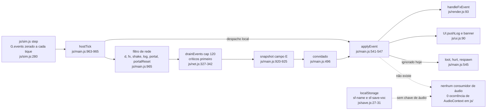

# SPEC: camada-audio

## Metadata
- Source: developer description via /plan
- Service: shadowfall (repositório único, front-end sem build, deploy estático na Vercel)
- Tier: complete
- Version: 1.2
- Implementation order: **`chefes-hardcore` primeiro, `camada-audio` depois.** A marcação HARDCORE do chefe (campo `hardcore` no monstro, RF-03/RF-04 daquela SPEC, e campo `hc` do snapshot, CT-01 dela) é o que dá valor ao campo `hardcore` de CT-06 desta SPEC; sem ela, o campo nasce `0` e a faixa do chefe nunca toca (RF-07). Esta SPEC **não** reabre o PLAN de `chefes-hardcore`, já fechado e confirmado em 20 tarefas: os eventos de **início** e de **fim** de luta são contrato **desta** feature (CT-06 e CT-07), não daquela.
- Architecture references: `AGENTS.md`, `docs/agents/architecture.md`, `docs/agents/coding_guidelines.md`, `docs/agents/api_contracts.md` (apoio: `.spec/init/project-description.md`, `.spec/init/user-stories.md`, `.spec/init/project-phases.md`, `.spec/features/chefes-hardcore/SPEC.md`, `.spec/features/chefes-hardcore/PLAN.md`)

### Regras de camada que esta SPEC obedece

| Regra | Fonte | Efeito nesta feature |
|---|---|---|
| `js/sim.js` é estado puro, zero DOM; `node tests/sim.test.mjs` roda em Node puro | `AGENTS.md:37`, `AGENTS.md:56`, `docs/agents/architecture.md` (tabela de camadas) | RNF-03: nenhuma chamada de áudio entra na simulação; áudio é apresentação, ao lado de `js/render.js` e `js/ui.js` |
| Emitir evento de simulação **não é** chamada de apresentação: `pushEvent` já é o canal por onde a simulação conta o que aconteceu, e quem escuta decide o que fazer | `AGENTS.md:37`, `docs/agents/architecture.md` (tabela de camadas), `js/sim.js:677`, `js/sim.js:736` | CT-06, CT-07 e RNF-03: esta feature acrescenta **duas emissões** em `js/sim.js` (início e fim de luta — ampliação consciente de um ponto para dois, decidida em M-04) e **zero** referência a DOM, `Audio` ou `AudioContext`; a camada de som continua assinando em `applyEvent` (`js/main.js:541-547`), do lado de fora da simulação |
| Apresentação não muta estado de simulação; composição (`main.js`) não contém regra de jogo, só cola | `docs/agents/architecture.md` (tabela de camadas) | RF-05 a RF-11: a camada de áudio **lê** evento e snapshot e nunca escreve em `G`; `main.js` apenas encaminha (CT-02) |
| Todo número de tuning vive em `js/balance.js`; nada de literal solto na lógica | `AGENTS.md:38`, `AGENTS.md:57`, `docs/agents/coding_guidelines.md` (§1) | Volume padrão, duração de transição entre faixas, teto de vozes, intervalo mínimo por categoria e o **prazo de desengajamento** (N segundos sem troca de dano, CT-07/RF-17) nascem exportados de `js/balance.js` (RF-15, RF-17, FLEXIBLE) |
| Módulo de política é puro, sem DOM e sem global, com colaborador injetável (`setStorage()` / `memoryStorage()`) | `docs/agents/coding_guidelines.md` (§2), `js/save.js:39-45`, `js/save.js:308-319` | RF-12/RF-13/CT-01: a leitura e a gravação da preferência de áudio são testáveis em Node com armazenamento injetado, separadas do objeto que toca som |
| Teto de eventos: `drainEvents(queue, 120)` corta o não crítico sob pressão; crítico é `log`, `portal`, `floor`, `levelup`, `fx` com `playerDeath`/`revive` e qualquer evento com `boss` | `docs/agents/api_contracts.md` (controle de fluxo e descarte), `js/net.js:327-342`, `js/balance.js:99` | RF-09: nenhuma decisão de **música** depende de evento não crítico; SFX pode ser perdido, música não |
| Nunca adicionar dependência de runtime no npm; nunca introduzir passo de build | `AGENTS.md:60`, `AGENTS.md:61`, `vercel.json` (`framework: null`, `buildCommand` `echo 'sem build'`) | RNF-07: Web Audio nativo, sem biblioteca de áudio; versionamento de asset por nome de arquivo, não por hash de build |
| Falha de `localStorage` (cota cheia, modo privado) avisa uma vez e a partida segue | `docs/agents/architecture.md` (pontos de integração), `js/save.js:294-301` | RF-13 AC: preferência de áudio indisponível cai no padrão e não quebra o jogo |
| Idioma: pt-BR em comentário, log e UI; identificadores em inglês | `AGENTS.md:45`, `AGENTS.md:51` | Rótulos de UI (UI-01), rótulos de teste e comentários desta feature em pt-BR |

## Context

O jogo não tem som. Verificado: zero ocorrência de `AudioContext`, `Audio`, `sound`, `sfx`, `volume`, `mute` ou `música` em `js/`, `index.html`, `styles.css` e `tests/`; e a cadeia de init (`project-description.md`, `user-stories.md`, `project-phases.md`, `database-schema.md`, `design/*.md`) não menciona áudio em nenhuma história, fase ou spec de tela. Não há conflito a resolver com a cadeia de init: esta feature é território novo, e os critérios confirmados são a única fonte.

O que já existe e sustenta a feature é o barramento de eventos da simulação. `step()` zera `G.events` a cada tique (`js/sim.js:280`), devolve os eventos do tique e o host os despacha em `hostTick` (`js/main.js:963-965`). O mesmo `applyEvent` (`js/main.js:541-547`) é chamado nos dois lados: pelo host direto do retorno de `step()`, e pelo convidado a partir do campo `E` do snapshot (`js/main.js:496`). Esse é o ponto de assinatura natural para efeitos sonoros, e ele já cobre host e convidado com o mesmo código.

A entrega de evento é lossy por projeto: `drainEvents` (`js/net.js:333-342`) corta em `NET_EVENT_CAP = 120` por snapshot (`js/balance.js:99`) e, sob pressão, mantém só os críticos (`js/net.js:327-331`). Som cujo disparo não pode ser perdido tem de viajar em evento crítico — é exatamente o caso da faixa do chefe.

Os cinco gatilhos de efeito pedidos já são emitidos hoje: magia em `{ t:'fx', k:'cast' }` (`js/sim.js:542`), acerto em `{ t:'fx', k:'slash' }` (`js/sim.js:413`, `js/sim.js:867`) e `{ t:'fx', k:'impact' }` (`js/sim.js:960`, `js/sim.js:974`, `js/sim.js:983`), morte em `{ t:'fx', k:'death' }` (`js/sim.js:677`) e `{ t:'fx', k:'playerDeath' }` (`js/sim.js:736`), portal em `{ t:'portal' }` (`js/sim.js:305`) e loot em `{ t:'loot', id, rarity, name }` (`js/sim.js:1105`). Há uma lacuna verificada: `loot` **não é encaminhado para a rede** — o filtro de `js/main.js:965` só empurra `d`, `fx`, `shake`, `log`, `portal` e `portalReset` para `S.netEvents`, e `applyEvent` descarta `loot` explicitamente (`js/main.js:545`). Sem mudança na composição, o convidado nunca ouviria o som de loot. Fechar isso é CT-02.

O projeto não tem nenhum asset binário: são 51 arquivos versionados, todos texto, e os sprites são vetoriais desenhados em tempo de execução. O áudio introduz o primeiro binário do repositório, num deploy sem passo de build (`vercel.json`: `framework: null`, `buildCommand` `echo 'sem build'`, `outputDirectory: "."`), com `.vercelignore` excluindo apenas `node_modules`, `package-lock.json`, `tests`, `.spec`, `README.md` e `package.json`. O `vercel.json` só define `Cache-Control` para `/js/(.*)` (`public, max-age=0, must-revalidate`); qualquer outro caminho recebe o padrão da Vercel. A política de cache do áudio é decisão desta SPEC (CT-04).

**Escopo da faixa do chefe: luta, não andar (M-01 resolvido).** O critério 3 vale ao pé da letra — a faixa do chefe HARDCORE cobre a **luta**, começando no engajamento e terminando quando a luta termina. A consequência foi verificada e é registrada aqui em vez de omitida: **o evento de início de luta não existe** — zero ocorrência de `bossEngage` ou de qualquer marcação de engajamento em `js/`, `tests/` e `index.html`, e `.spec/features/chefes-hardcore/SPEC.md` não o especifica (o CT-03 de lá é **nascimento**: RF-08, "Quando um chefe HARDCORE **nasce** no andar", empilhado por `populate()` em T06 do PLAN dela). Por decisão do desenvolvedor, esse evento passa a ser contrato **desta** SPEC (**CT-06**), e não de `chefes-hardcore`, justamente para não reabrir um PLAN já fechado e confirmado em 20 tarefas.

**Fim da luta por abandono: evento, não relógio local (M-04 resolvido).** O par de CT-06 é **CT-07**, o evento `bossDisengage`, emitido pela simulação quando não há troca de dano entre nenhum jogador e o chefe por N segundos seguidos. Ele é crítico e host-authoritative pelos mesmos motivos de CT-06, e com ele o **fim** da luta ganha a mesma sincronia que o **início** já tinha: nenhuma máquina decide silenciar por conta própria. Duas consequências foram assumidas junto com a decisão. Primeira: o escopo novo desta feature em `js/sim.js` passa de **um** ponto de emissão para **dois** — ampliação consciente, com a mesma justificativa de camada de sempre (emitir evento não é chamada de áudio; `pushEvent` já é o canal por onde a simulação conta o que aconteceu, e quem escuta decide o que fazer), portanto RNF-03 continua valendo sem exceção. Segunda: a cardinalidade de CT-06 é **relaxada de "uma vez por chefe" para "uma vez por engajamento"** — fugir, reagrupar e voltar a atacar emite `bossEngage` de novo e a faixa da luta volta. O que mantém isso estável é uma **invariante de alternância**: para uma mesma instância de chefe, `bossEngage` e `bossDisengage` se alternam, nunca dois iguais em sequência. É ela que impede a faixa de reiniciar sozinha e de ficar presa.

**Dependência externa declarada.** `camada-audio` depende de `chefes-hardcore` estar implementada, e a ordem é a do bloco `## Metadata`. A dependência mudou de natureza com M-01: não é mais o **evento** `bossSpawn` que dispara a música, e sim a **marcação** HARDCORE do chefe (campo `hardcore` no monstro, RF-03/RF-04 de `.spec/features/chefes-hardcore/SPEC.md`; campo opcional `hc` no snapshot, CT-01 dela), que é a origem do campo `hardcore` de CT-06 e de CT-07. Estado verificado hoje: **não implementada** — zero ocorrência de `bossSpawn` e de `hc` em `js/`, `tests/` e `index.html`; `js/sim.js:102` marca `b.isBoss = true` e nada mais distingue o chefe HARDCORE. Enquanto isso valer, o campo `hardcore` de CT-06 e de CT-07 nasce `0` e a faixa do chefe não toca (RF-07). CT-03 permanece declarado como contrato de **entrada** desta SPEC apenas nesse papel de dependência de ordem — a camada de áudio não usa mais `bossSpawn` como gatilho de música.

**Sincronia (critério 4).** Continua garantida pelo mesmo mecanismo, e agora nos dois extremos da luta: CT-06 e CT-07 carregam `boss: 1`, portanto `isCriticalEvent()` devolve `true` (`js/net.js:329-331`, verificado: `return CRITICAL.has(ev.t) || (ev.t === 'fx' && ...) || !!ev.boss`) e os dois eventos sobrevivem ao teto de 120 de `drainEvents`. Ambos são **host-authoritative** — nascem em `js/sim.js`, que só roda no host (`hostTick`, `js/main.js:961-963`) — e chegam ao convidado pelo campo `E` do snapshot, o que dá a todos o mesmo gatilho e nenhum relógio local. A contagem dos N segundos de CT-07 acontece **dentro da simulação do host**, não na camada de áudio de cada máquina: é tempo de simulação, não relógio de apresentação.

## AS IS — Estado atual

Hoje todo evento da simulação chega a `applyEvent` pelos dois caminhos — host direto de `step()`, convidado pelo campo `E` do snapshot — e termina em desenho (`js/render.js:93`) ou em texto (`js/ui.js:90`). `loot`, `hurt` e `respawn` são descartados na entrada (`js/main.js:545`), e `loot` sequer é encaminhado pela rede (`js/main.js:965`). Não existe nenhum consumidor de som nem nenhuma chave de preferência de áudio no `localStorage`.

## TO BE — Estado proposto

```mermaid
flowchart LR
  SIM["js/sim.js step (alterado)<br/>duas emissões novas, sem DOM e sem áudio<br/>CT-06, CT-07, RNF-03"] --> HOST["hostTick<br/>js/main.js:963-965"]
  SIM_ENG["bossEngage (novo, nesta SPEC)<br/>1ª troca de dano jogador↔chefe<br/>uma vez por engajamento, boss:1<br/>CT-06, RF-05, RF-16"] --> SIM
  SIM_DIS["bossDisengage (novo, nesta SPEC)<br/>N segundos sem troca de dano<br/>N em js/balance.js, boss:1<br/>CT-07, RF-06 caminho 4, RF-17"] --> SIM
  SIM_ENG <-.->|"alternam, nunca dois iguais seguidos"| SIM_DIS
  DEP["marcação HARDCORE de chefes-hardcore<br/>campo hardcore no monstro, hc no snapshot<br/>dependência de ordem, não implementada<br/>RF-07, CT-03"] -.-> SIM_ENG
  HOST -->|"despacho local"| APPLY["applyEvent (alterado)<br/>js/main.js:541-547"]
  HOST --> FILTER["filtro de rede (alterado)<br/>acrescenta loot, bossEngage e bossDisengage<br/>CT-02, CT-06, CT-07"]
  FILTER --> DRAIN["drainEvents cap 120<br/>js/net.js:327-342"]
  DRAIN --> SNAP["snapshot campo E<br/>js/main.js:920-925"]
  SNAP --> GUEST["convidado<br/>js/main.js:496"]
  GUEST --> APPLY
  APPLY --> FX["handleFxEvent<br/>js/render.js:93"]
  APPLY --> LOG["UI.pushLog e banner<br/>js/ui.js:90"]
  APPLY --> NEW_AUD["camada de áudio (novo)<br/>assina applyEvent, só lê<br/>RF-05, RF-06, RF-09, RF-10, RF-11"]
  NEW_GEST["destravamento por gesto (novo)<br/>RF-01, RF-02, RF-03"] --> NEW_AUD
  NEW_PREFS["preferência sf-audio (novo)<br/>módulo puro, storage injetável<br/>RF-12, RF-13, CT-01"] --> NEW_AUD
  NEW_UI["controle de mudo e volume (novo)<br/>UI-01, UI-02, UI-03"] --> NEW_PREFS
  NEW_AUD --> NEW_MUS["barramento de música (novo)<br/>ambiente e faixa de luta HARDCORE<br/>RF-04, RF-05, RF-06"]
  NEW_AUD --> NEW_SFX["barramento de efeitos (novo)<br/>5 categorias, teto de vozes<br/>RF-10, RF-11, RF-15"]
  NEW_MUS --> NEW_ASSETS["diretório /audio (novo)<br/>versão no nome do arquivo<br/>CT-04, CT-05, RNF-01, RNF-02"]
  NEW_SFX --> NEW_ASSETS
  NEW_ASSETS --> NEW_VER["vercel.json (alterado)<br/>header de cache para /audio<br/>CT-04"]
```

A camada de áudio (novo) entra como consumidor de `applyEvent`, no mesmo lugar onde `handleFxEvent` e `UI.pushLog` já consomem: ela lê evento e nunca escreve em `G` (RF-05, RF-06, RF-09, RF-10, RF-11). `js/sim.js` deixa de ficar intocado em **dois** pontos e apenas neles: a emissão do evento de início de luta (CT-06), no caminho de dano já existente, e a do evento de fim de luta por abandono (CT-07), no tique, quando o prazo de N segundos sem troca de dano vence — nenhuma referência a DOM, `Audio` ou `AudioContext` entra na simulação, e RNF-03 continua valendo na forma verificável de sempre (`grep` + `node tests/sim.test.mjs`). O destravamento por gesto e a preferência persistida são módulos novos (RF-01 a RF-03, RF-12, RF-13, CT-01), com o controle de mudo e volume num painel próprio (UI-01, UI-02, UI-03). Na composição, o filtro de rede passa a encaminhar `loot` (CT-02), `bossEngage` (CT-06) e `bossDisengage` (CT-07); de fora desta feature vem só a marcação HARDCORE do chefe, que dá valor ao campo `hardcore` dos dois eventos de luta (CT-03, RF-07). No deploy, o diretório `/audio` novo e o header de cache no `vercel.json` alterado fecham o contrato de asset (CT-04, CT-05, RNF-01, RNF-02).

## Scope

- **In**: destravamento de áudio no primeiro gesto do jogador, incluindo o caminho do iOS; música ambiente da masmorra; faixa própria da **luta** do chefe HARDCORE, substituindo a ambiente no engajamento e voltando ao fim da luta, inclusive em ciclos repetidos de fuga e reengajamento; **a emissão dos dois eventos de luta em `js/sim.js` (CT-06 e CT-07)** — escopo novo de simulação assumido por esta feature de áudio, ampliado de um para dois pontos de emissão em M-04, com a justificativa de camada registrada em `## Metadata`, na tabela de regras e em RNF-03; sincronia do início **e do fim** da faixa entre os jogadores da sala pelos eventos críticos CT-06 e CT-07; efeitos sonoros para as cinco categorias confirmadas (magia, acerto, morte, loot, portal) assinando os eventos que a simulação já emite; mudo global e volumes separados de música e efeitos, persistidos em chave própria de `localStorage`; controle desses valores na interface, em desktop e em toque; encaminhamento do evento `loot` na composição (CT-02); diretório de assets, política de cache e critério de licença e formato dos arquivos de áudio (CT-04, CT-05); orçamento de peso e de tempo até o primeiro quadro jogável.
- **Out**: os arquivos de áudio em si — são entrada externa, fornecidos depois (critério 9); esta SPEC define o critério que eles precisam satisfazer e o lugar onde entram, não o conteúdo. Também fora: qualquer alteração em `js/sim.js` **além das duas emissões de CT-06 e CT-07** — nenhuma regra de jogo, nenhum número de balanceamento novo além do prazo de desengajamento (constante de `js/balance.js`, RF-17) e nenhuma referência a áudio entram na simulação (RNF-03); voz, chat de voz ou áudio posicional 3D; trilha para as telas de menu, lobby e fila (RF-04 restringe a música ao jogo em curso); faixa própria para chefe **não** HARDCORE — o critério 3 fala do HARDCORE, e CT-06/CT-07, embora sejam emitidos no engajamento e no desengajamento de **qualquer** chefe, só trocam a faixa quando chegam com `hardcore: 1`, marcação que `chefes-hardcore` só aplica em andar múltiplo de 3 (`.spec/features/chefes-hardcore/SPEC.md`, RF-03/RF-04); a luta contra chefe comum segue na ambiente; a implementação do evento `bossSpawn`, que pertence a `chefes-hardcore` (T06/T14 do PLAN dela); contorno do interruptor físico de silêncio do iOS além do que a API de sessão de áudio oferecer (RF-03); mixagem dinâmica, ducking por proximidade ou reverberação por sala; tela de créditos (por isso CT-05 exige licença sem atribuição embutida); Git LFS ou qualquer mudança no modelo de versionamento do repositório (RNF-02).

## RIGID (Non-Negotiable)

### Functional Requirements

- **RF-01 [Event-Driven]**: Quando o primeiro gesto do jogador ocorrer na página (`pointerdown`, `keydown` ou `touchend`, em qualquer elemento), o sistema deve destravar o áudio dentro do próprio manipulador desse gesto, uma única vez por carregamento da página.
  - AC: antes do gesto, o contexto de áudio não está em estado `running`; no primeiro gesto, o destravamento é solicitado **de forma síncrona dentro do manipulador** (sem `await` anterior, sem `setTimeout`, sem esperar rede) e o contexto passa a `running`; do segundo gesto em diante nenhuma tentativa nova de destravamento é feita; verificável em `tests/browser.mjs` lendo o estado exposto antes e depois de um clique sintético. Os gestos que já existem e servem de gatilho estão verificados: `#btnSolo`, `#btnHost`, `#btnJoin` (`index.html:40-46`), cartões de vocação (`js/ui.js:47`), `pointerdown` no canvas (`js/main.js:589`) e botões de magia e poção (`js/ui.js:120`, `js/main.js:638`).

- **RF-02 [Unwanted]**: Se nenhum gesto do jogador tiver ocorrido, o sistema não deve emitir som algum nem deixar escapar erro por causa disso.
  - AC: entre o carregamento e o primeiro gesto, zero fonte de áudio iniciada, zero `AudioContext` em `running`, zero exceção não tratada e zero rejeição de promessa não tratada; o jogo alcança o primeiro quadro jogável (primeira execução de `frame()` com `S.started === true`, `js/main.js:887-892`, logo após `enterGame()`, `js/main.js:254-255`) exatamente como hoje; `npm run test:browser` verde com um coletor de `window.onerror` e `unhandledrejection` assertando contagem zero.

- **RF-03 [Optional]**: Onde o navegador expuser uma API de sessão de áudio (`navigator.audioSession`), o sistema deve declarar a categoria de reprodução no momento do destravamento; onde não expuser, o destravamento de RF-01 deve funcionar sem ela.
  - AC: a declaração é feita sob detecção de recurso (`if` sobre a existência da API), nunca assumida; em navegador sem a API, RF-01 continua passando e nenhum erro é lançado; o comportamento do interruptor físico de silêncio do iOS além do que essa API oferecer está fora de escopo e registrado como limite conhecido, não como defeito.

- **RF-04 [State-Driven]**: Enquanto a partida estiver em curso (tela `#game` visível e `S.started === true`), o sistema deve tocar a música ambiente da masmorra em laço contínuo.
  - AC: com o áudio destravado, mudo desligado e volume de música maior que 0, existe exatamente uma fonte de música ativa durante a exploração; a ambiente **não reinicia na virada de andar** (nem no caminho do host, `js/main.js:966-976`, nem no do convidado, `case 'floor'`, `js/main.js:506-514`): a posição de reprodução no tique seguinte à virada é maior que a do tique anterior; nas telas `#menu`, `#lobby` e `#queue` nenhuma música toca.

- **RF-05 [Event-Driven]**: Quando o evento de início de luta de chefe HARDCORE (CT-06, `hardcore: 1`) chegar a `applyEvent`, o sistema deve substituir a música ambiente pela faixa da luta, iniciando-a no mesmo turno de processamento do evento, sem nenhum atraso próprio.
  - AC: a faixa é de **luta, não de andar** — nascer o chefe não toca nada; entrar no andar HARDCORE não toca nada; só o evento de engajamento toca. No turno em que o evento é processado, a fonte de ambiente é interrompida e a fonte da faixa do chefe é iniciada; a camada de áudio **não implementa temporizador, agendamento, negociação de relógio nem contagem regressiva própria** — o único sincronizador é a chegada do evento, que é crítico (`boss: 1` → `isCriticalEvent()` verdadeiro, `js/net.js:329-331`) e por isso sobrevive ao teto de 120 de `drainEvents`; um evento CT-06 com `hardcore: 0` **não** troca a faixa (chefe comum segue na ambiente, conforme o Scope); em `tests/multipeer.mjs` com N abas, todas registram o início da faixa dentro do mesmo lote de eventos de snapshot, e nenhuma aba inicia por caminho diferente do evento.
  - AC (reengajamento, M-04): como CT-06 passou a valer **uma vez por engajamento** e não uma vez por chefe, um segundo `bossEngage` do mesmo chefe — depois de um `bossDisengage` (CT-07) — reinicia a faixa da luta exatamente pela mesma regra desta RF, sem nenhum caminho especial: o grupo que foge, reagrupa e volta a atacar ouve a faixa de novo. Dois `bossEngage` seguidos sem `bossDisengage` entre eles violam a invariante de alternância de CT-06/CT-07 e são defeito de emissão (RF-16, RF-17), não caso a tratar aqui.

- **RF-06 [Event-Driven]**: Quando a luta do chefe HARDCORE terminar — por morte do chefe, por virada de andar, por fim de sessão ou por abandono —, o sistema deve voltar à música ambiente. Nenhum caminho pode deixar a faixa da luta tocando para sempre.
  - AC: o fim é reconhecido por um destes quatro caminhos, e a faixa da luta encerra no mesmo turno em que o caminho é reconhecido:
    1. **Morte do chefe** — `{ t:'fx', k:'death', boss: true }`, emitido por `killMonster()` (`js/sim.js:677`) no mesmo bloco que já registra a derrota do chefe (`js/sim.js:687-691`, `log(G, '<nome> foi derrotado!', 'boss')`); é crítico por `!!ev.boss` (`js/net.js:331`) e já é encaminhado pelo filtro de `js/main.js:965`, sem mudança nenhuma. É o caminho normal e o único que precisa ser à prova de perda.
    2. **Virada de andar sem a morte do chefe** — evento `floor` (`js/main.js:966-976` no host; `case 'floor'`, `js/main.js:506-514`, no convidado), crítico por estar em `CRITICAL` (`js/net.js:327`). O grupo desceu pelo portal com o chefe vivo: a faixa encerra na virada.
    3. **Fim de sessão ou retorno ao menu** — decisão local da composição, sem evento de rede; a faixa encerra junto com a saída de `S.started`.
    4. **Abandono na mesma sala** — o grupo foge e ninguém troca dano com o chefe por N segundos seguidos. O fim é reconhecido pelo evento `bossDisengage` (**CT-07**, RF-17), par de `bossEngage`, crítico por `boss: 1` e host-authoritative como ele (decisão de M-04). A camada de áudio **não** arma temporizador próprio para este caminho: a contagem vive na simulação do host e chega pronta como evento, do mesmo jeito que o início. O prazo N é constante exportada de `js/balance.js` (`AGENTS.md:38`), nunca literal solto, e o valor é calibrado na fase de plano.
  - AC (independência entre os caminhos): os caminhos 1, 2 e 3 encerram a faixa **sem** depender de `bossDisengage` — chefe morto encerra na morte, virada de andar encerra na virada e fim de sessão encerra na saída, nenhum deles espera os N segundos. `bossDisengage` cobre **apenas** o caminho 4, e não é emitido para chefe já morto nem para chefe que ficou no andar anterior (a instância deixou de existir, e a invariante de alternância de CT-06/CT-07 termina com ela).
  - AC (comum a todos): depois de qualquer caminho, a faixa da luta não está mais ativa e a ambiente está; nenhum caminho deixa as duas faixas soando ao mesmo tempo além da janela de transição definida em `js/balance.js`; encerrar duas vezes (morte logo após virada de andar, por exemplo) é idempotente e não deixa duas ambientes ativas — RF-04 continua valendo com **exatamente uma** fonte de música ativa depois do retorno; um `bossDisengage` que chegue quando a faixa da luta já foi encerrada por outro caminho é ignorado sem erro e sem reiniciar a ambiente.

- **RF-07 [Unwanted]**: Se a marcação HARDCORE do chefe não existir no código (estado verificado hoje: zero ocorrência de `hardcore`, `hc` ou `bossSpawn` em `js/`, `tests/` e `index.html`; `js/sim.js:102` só marca `b.isBoss = true`), o sistema não deve tocar a faixa da luta, não deve inferir a luta por heurística local e não deve falhar.
  - AC: com `chefes-hardcore` não implementada, CT-06 e CT-07 continuam sendo emitidos no engajamento e no desengajamento com `hardcore: 0` e a ambiente segue tocando em todo andar, inclusive nos múltiplos de 3 e durante a luta contra chefe comum; nenhuma exceção é lançada; nenhuma leitura de snapshot (presença de monstro com `b`/`hc`, visibilidade de `#bossBar`, distância ao chefe, barra de vida caindo) é usada como gatilho substituto — uma heurística local é **proibida** porque ela é avaliada em relógios diferentes em cada máquina e não pode satisfazer o critério 4; a faixa da luta é código presente e dormente, e passa a valer sem nenhuma outra mudança assim que o campo `hardcore` de CT-06 e CT-07 começar a chegar com `1` (ordem declarada em `## Metadata`).

- **RF-08 [Unwanted]**: Se um jogador entrar na sala ou reconectar depois de o evento CT-06 já ter sido entregue, o sistema não deve iniciar a faixa da luta retroativamente para ele.
  - AC: um convidado que abre a conexão após o lote que continha o evento permanece na ambiente até o próximo evento de música; não há reenvio, replay nem consulta de estado de música no snapshot; o comportamento é o mesmo no caminho de reconexão de `SessionGuard` (`js/session.js`); nenhum byte novo é acrescentado ao snapshot por causa desta regra.

- **RF-09 [State-Driven]**: Enquanto a camada de áudio estiver ativa, nenhuma decisão de **música** pode depender de evento não crítico.
  - AC: todo gatilho de troca de faixa é um evento para o qual `isCriticalEvent()` (`js/net.js:329-331`) devolve `true` — hoje: `bossEngage` por `boss: 1` (CT-06), `bossDisengage` por `boss: 1` (CT-07), `fx k='death'` de chefe por `boss: true`, `portal`, `floor` e `log`; nenhum gatilho de música é `fx` comum, `d`, `shake` ou `loot`; um teste satura a fila com mais de 120 eventos e assere que todo gatilho de música desta SPEC continua presente na saída de `drainEvents`.
  - AC (regra sem ressalva, M-04): a decisão de M-04 foi por **evento crítico de simulação** e não por temporizador local, portanto esta regra vale **sem nenhuma exceção** — a ressalva que estava prevista para o caso do relógio local deixou de ser necessária. A camada de áudio não arma temporizador, agendamento nem contagem regressiva própria em **nenhum** dos dois extremos da luta: o início vem de CT-06 e o fim por abandono vem de CT-07; verificável por `grep` de `setTimeout`/`setInterval` no módulo de áudio, com zero ocorrência ligada a decisão de faixa.

- **RF-10 [Event-Driven]**: Quando um evento de uma das cinco categorias confirmadas chegar a `applyEvent`, o sistema deve disparar o efeito sonoro correspondente, no host e no convidado, pelo mesmo código.
  - AC: o mapeamento cobre exatamente estas cinco categorias, todas verificadas como já emitidas pela simulação: **magia** → `{ t:'fx', k:'cast' }` (`js/sim.js:542`); **acerto** → `{ t:'fx', k:'slash' }` (`js/sim.js:413`, `js/sim.js:867`) e `{ t:'fx', k:'impact' }` (`js/sim.js:960`, `js/sim.js:974`, `js/sim.js:983`); **morte** → `{ t:'fx', k:'death' }` (`js/sim.js:677`) e `{ t:'fx', k:'playerDeath' }` (`js/sim.js:736`); **loot** → `{ t:'loot' }` (`js/sim.js:1105`, dependente de CT-02); **portal** → `{ t:'portal' }` (`js/sim.js:305`). Nenhuma categoria nova é criada em `js/sim.js`; para cada categoria, um teste alimenta o mapeamento com o evento e assere exatamente um pedido de reprodução; evento de tipo não mapeado produz zero pedido.

- **RF-11 [Event-Driven]**: Quando o evento disparado for de escopo pessoal, o sistema deve tocar o efeito somente para o jogador dono do evento.
  - AC: os eventos entregues no campo `E` são **os mesmos para todos os destinatários** — o host monta um único lote com `drainEvents(S.netEvents)` e o anexa a cada snapshot (`js/main.js:920-925`) —, portanto o filtro é obrigatório: para `{ t:'loot', id }` (`js/sim.js:1105`) e `{ t:'fx', k:'level', id }` (`js/sim.js:708`), o efeito só toca quando `ev.id === S.localId`; com `ev.id` de outro jogador, zero pedido de reprodução; efeitos de escopo ambiental (acerto, morte, portal) não são filtrados por id.

- **RF-12 [State-Driven]**: Enquanto o jogo estiver carregado, o sistema deve manter três valores de preferência independentes — mudo global, volume de música e volume de efeitos — e aplicá-los de forma separada aos dois barramentos.
  - AC: com mudo ligado, zero saída audível nos dois barramentos e nenhuma fonte nova iniciada; com volume de música em 0 e volume de efeitos maior que 0, os efeitos continuam audíveis e a música não, e vice-versa; os dois volumes são contínuos no intervalo fechado `[0, 1]`; desligar o mudo restaura exatamente os dois volumes anteriores, sem zerá-los nem normalizá-los; o padrão de fábrica de cada valor é constante exportada de `js/balance.js` (`AGENTS.md:38`).

- **RF-13 [Event-Driven]**: Quando qualquer um dos três valores de RF-12 mudar, o sistema deve gravá-los na chave `sf-audio` (CT-01) e, no carregamento seguinte, restaurá-los antes do primeiro som.
  - AC: alterado o valor, recarregada a página e destravado o áudio, os três valores lidos são idênticos aos gravados; a leitura acontece antes de qualquer pedido de reprodução; conteúdo ausente, ilegível, com versão desconhecida ou com valor fora de `[0, 1]` cai no padrão de `js/balance.js` **sem lançar erro** e sem apagar a chave; `localStorage` indisponível ou com cota cheia (modo privado) mantém o jogo funcionando com o padrão em memória, seguindo o precedente de `js/save.js:294-301`; a chave `sf-audio` é independente de `SAVE_VERSION` e **não** entra no schema de `js/save.js`, portanto não exige migração v3→v4; verificado que `sf-audio` está livre — zero ocorrência em `js/`, `tests/` e `index.html`.

- **RF-14 [Unwanted]**: Se um arquivo de áudio faltar, falhar no download ou falhar na decodificação, o sistema não deve interromper a partida nem repetir a tentativa em laço.
  - AC: com o arquivo removido do servidor, o jogo entra, roda e desce de andar normalmente; o silêncio daquele som é o único efeito observável; no máximo uma tentativa nova por carregamento de página por arquivo; nenhuma exceção escapa para `window.onerror`; a falha é registrada uma única vez em `console.warn` com mensagem em pt-BR (`AGENTS.md:45`), nunca no chat nem no log da sala (mesma regra de `js/main.js:390`).

- **RF-15 [State-Driven]**: Enquanto houver rajada de eventos, o sistema deve respeitar um teto de vozes simultâneas e um intervalo mínimo por categoria, ambos exportados de `js/balance.js`.
  - AC: alimentado com um lote de 120 eventos de efeito no mesmo quadro (o teto real de `NET_EVENT_CAP`, `js/balance.js:99`), o número de fontes iniciadas é menor ou igual ao teto e o excedente é descartado, nunca enfileirado para tocar depois; dois eventos da mesma categoria separados por menos que o intervalo mínimo produzem uma única reprodução; nenhum literal numérico de teto ou de intervalo aparece fora de `js/balance.js` (`AGENTS.md:38`, `AGENTS.md:57`).

- **RF-16 [Event-Driven]**: Quando ocorrer a **primeira troca de dano entre um jogador e um chefe, em qualquer direção**, a simulação deve emitir o evento de início de luta (CT-06) exatamente uma vez **por engajamento** — não uma vez por chefe (cardinalidade relaxada em M-04): depois de um `bossDisengage` (CT-07), a próxima troca de dano com o mesmo chefe emite `bossEngage` de novo.
  - AC (definição precisa de "início da luta", para não virar marcador novo): vale o que vier primeiro entre **(a)** o chefe receber dano de um jogador e **(b)** o chefe causar dano a um jogador. Os pontos de emissão estão verificados e são estes, todos já existentes no caminho de dano:
    - (a) jogador → chefe: `hitMonster()` (`js/sim.js:650-671`), o funil de todo dano **direto** de jogador em monstro — corpo a corpo (`js/sim.js:412`), magia (`js/sim.js:638`), projétil de jogador (`js/sim.js:972`) e zona (`js/sim.js:1002`) passam por lá; a emissão vem **depois** de `m.hp -= dmg` (`js/sim.js:654`) e **antes** de `killMonster()` (`js/sim.js:670`), para que um chefe morto de um golpe só produza a ordem engajamento→morte, nunca a inversa. Ressalva verificada, registrada para não ser redescoberta na implementação: dano contínuo de status em monstro **não** passa por `hitMonster` — `tickStatus()` subtrai HP direto (`js/sim.js:910` para queimadura, `js/sim.js:916` para veneno) —, mas ele nunca pode ser a primeira troca, porque o status só chega ao monstro pelos mesmos caminhos que já passaram por `hitMonster` (`js/sim.js:638` seguido de `applySkillStatus`, e `js/sim.js:973` no projétil), e `hitMonster` sempre aplica pelo menos 1 de dano (`Math.max(1, ...)`, `js/sim.js:653`);
    - (b) chefe → jogador: `damagePlayer()` (`js/sim.js:713`) recebe o dano já resolvido e **não** recebe o agressor, portanto a emissão fica nos três chamadores que conhecem o monstro — investida (`js/sim.js:828`), corpo a corpo (`js/sim.js:866`) e projétil de monstro (`js/sim.js:982`, com `pr.ownerId` para achar o dono, campo verificado como já gravado em `js/sim.js:932`). Dano ambiental (lava, `js/sim.js:389`) e dano de monstro comum **não** contam.
  - AC (forma e garantias): a emissão é única **por engajamento** de cada instância de chefe, inclusive com N jogadores batendo no mesmo tique e inclusive quando o mesmo andar tiver mais de um chefe (a unicidade é por chefe, não por andar); enquanto o engajamento estiver em curso, nenhuma troca de dano nova emite `bossEngage` outra vez; é **host-authoritative** por construção, porque `step()` só roda no host (`hostTick`, `js/main.js:961-963`); dano em monstro não-chefe (`m.isBoss` falso, `js/sim.js:102`, `js/sim.js:147`) não emite nada; o evento respeita o formato de CT-06 e carrega `boss: 1` para ser crítico. Testável em Node puro em `tests/sim.test.mjs`: aplica-se dano num chefe e assere-se 1 evento; aplicam-se mais 10 e assere-se que continua 1; repete-se o par pelo caminho (b) e assere-se a mesma unicidade; assere-se 0 evento para monstro comum.
  - AC (rearme e alternância, M-04): depois que CT-07 for emitido para aquele chefe, o engajamento está encerrado e a próxima troca de dano — em qualquer direção, pelos mesmos pontos de (a) e (b) — emite `bossEngage` outra vez. Vale a **invariante de alternância**: numa sequência de eventos de luta de uma mesma instância de chefe, `bossEngage` e `bossDisengage` se alternam, **nunca dois `bossEngage` seguidos sem um `bossDisengage` entre eles, nem dois `bossDisengage` seguidos sem um `bossEngage` entre eles**; a sequência sempre começa por `bossEngage`. Testável em Node puro: dano → 1 `bossEngage`; avança-se o tempo além do prazo → 1 `bossDisengage`; dano de novo → 2º `bossEngage`; a lista completa de eventos de luta daquele chefe é assertada como alternada, do primeiro ao último.
  - AC (limite de camada): junto com RF-17, esta é uma das **duas únicas** alterações desta feature em `js/sim.js`; ela não lê DOM, não chama áudio e não muda dano, aggro, XP nem loot — `node tests/sim.test.mjs` continua rodando em Node puro e as suítes de balanceamento existentes continuam verdes (RNF-03, RNF-05).

- **RF-17 [Event-Driven]**: Quando um chefe estiver engajado e se passarem N segundos seguidos **sem nenhuma troca de dano entre qualquer jogador e esse chefe**, a simulação deve emitir o evento de fim de luta por abandono (CT-07, `bossDisengage`) exatamente uma vez.
  - AC (gatilho): "troca de dano" é a **mesma** definição de RF-16, pelos mesmos pontos verificados — (a) jogador → chefe por `hitMonster()` (`js/sim.js:650-671`) e (b) chefe → jogador pelos três chamadores que conhecem o monstro (investida `js/sim.js:828`, corpo a corpo `js/sim.js:866`, projétil `js/sim.js:982`). Qualquer troca de dano em qualquer direção, com **qualquer** jogador da sala, reinicia a contagem; dano ambiental (lava, `js/sim.js:389`), dano de status em monstro (`js/sim.js:910`, `js/sim.js:916`) e dano de monstro comum não a reiniciam, pela mesma razão de RF-16.
  - AC (binário, sem depender do número): passados N segundos seguidos sem troca de dano com o chefe engajado, o evento sai **exatamente uma vez**; antes disso, **zero** evento; enquanto o chefe seguir desengajado, nenhum evento novo sai (o próximo evento daquele chefe só pode ser `bossEngage`, RF-16). O AC não afirma nada sobre o valor de N: ele é **constante exportada de `js/balance.js`** (`AGENTS.md:38`, `AGENTS.md:57` — nenhum número de tuning fora de lá), com comentário em pt-BR explicando o PORQUÊ, e o **valor é calibrado na fase de plano**. O teste lê a constante em vez de repetir o número: avança-se o tempo de simulação até pouco antes dela e assere-se 0 evento; ultrapassa-se e assere-se exatamente 1.
  - AC (chefe não engajado e chefe que sumiu): chefe que nunca foi engajado nunca emite `bossDisengage`; chefe morto (`killMonster()`, `js/sim.js:677`) e chefe deixado para trás na virada de andar também não — a instância deixou de existir e o caminho de fim já foi reconhecido por RF-06 (caminhos 1 e 2), sem esperar os N segundos. Não existe `bossDisengage` órfão, sem `bossEngage` anterior.
  - AC (forma e garantias): o evento respeita o formato de CT-07, carrega `boss: 1` para ser crítico e é **host-authoritative** por construção (`step()` só roda no host, `hostTick`, `js/main.js:961-963`); a emissão é uma por chefe por desengajamento, mesmo com vários chefes engajados ao mesmo tempo no mesmo andar. Testável em Node puro em `tests/sim.test.mjs`, sem navegador e sem rede.
  - AC (limite de camada): esta é a **segunda e última** alteração desta feature em `js/sim.js` — ampliação consciente de um ponto de emissão para dois, decidida em M-04, com a mesma justificativa de RF-16: emitir evento não é chamada de áudio, `pushEvent` já é o canal de saída da simulação (`js/sim.js:677`, `js/sim.js:736`) e a decisão de tocar som continua em `applyEvent` (`js/main.js:541-547`). Nenhuma referência a DOM ou a áudio entra na simulação, o nome do evento não contém palavra de áudio, e nem dano, aggro, XP, loot ou geração de andar mudam de comportamento (RNF-03, RNF-05).

### UI Requirements

- **UI-01 [State-Driven]**: Enquanto a partida estiver em curso, a interface deve oferecer o controle de mudo e de volume num **painel próprio**, no mesmo padrão de `#bag` (`index.html:179`) e `#roster` (`index.html:195`), alcançável sem recarregar a página e operável por mouse e por toque.
  - AC (forma): o painel é um elemento novo com `class="panel hidden"` seguindo a estrutura já existente — `.panel` centralizado com `z-index: 20` (`styles.css:300-306`), cabeçalho `.panel-head` com título em pt-BR e botão `.x` de fechar (`styles.css:307-313`) —, e comporta com folga os **três** controles separados: volume de música, volume de efeitos e estado mudo (RF-12). Nenhum dos três divide widget com outro.
  - AC (acesso): dois caminhos, no padrão dos painéis existentes — um gatilho tocável na tela de jogo (como `#btnBag` faz por `js/main.js:640` e `crewChip` por `js/main.js:142`) e um **atalho de teclado a definir na fase de plano**. O atalho novo não pode colidir com os já ocupados, verificados em `js/main.js:552-572`: `w`, `a`, `s`, `d`, setas, `1`–`4`, `q`, `e`, `p` (roster), `tab` e `i` (mochila), mais `Enter`/`Escape` no chat (`js/main.js:661-670`). O controle é alcançável com no máximo dois toques a partir da tela de jogo (abrir o painel, ajustar), e o painel fecha por `Escape` no mesmo lugar onde `#bag` e o roster já fecham (`js/main.js:561`), além do botão `.x` do cabeçalho.
  - AC (estado e leitura): o estado mudo é distinguível por **texto ou ícone**, nunca só por cor (mesma regra de UI-02 de `.spec/features/chefes-hardcore/SPEC.md`), e continua legível em escala de cinza; os dois volumes são ajustáveis de forma independente; todo rótulo em pt-BR (`AGENTS.md:45`); o alvo de toque respeita o mínimo já usado pelos controles de toque de `styles.css` (`@media (pointer: coarse)`, `styles.css:369`, `styles.css:491`).
  - AC (escopo de tela): o painel vive **dentro do jogo**, não antes dele — RF-04 permanece como está, com silêncio nas telas de menu, lobby e fila, e nenhum controle de áudio é oferecido nessas três telas.

- **UI-02 [Event-Driven]**: Quando o jogador alterar mudo ou volume, a interface deve refletir a mudança de forma audível no mesmo gesto.
  - AC: entre a interação e a mudança de ganho não há recarregamento, reentrada em partida nem reinício de faixa; a música em curso continua da mesma posição de reprodução após a alteração de volume; alterar o volume durante o mudo não produz som e o valor fica guardado para quando o mudo sair.

- **UI-03 [Unwanted]**: Se o layout for o de toque, o **gatilho** do painel de áudio não deve sobrepor o joystick, a barra de magias, a barra de poções nem a barra do chefe.
  - AC: em viewport de celular (retrato e paisagem), com o painel **fechado**, a caixa do gatilho e as de `#stick` (`index.html:176`), `#actionBar` (`index.html:159`), `#bossBar` (`index.html:147`) e `#portalHold` (`index.html:169`) não se interceptam; a regra de corte por altura pequena segue a ordem já definida em `.spec/init/design/hud-grupo-mobile.md`; verificável em `tests/browser.mjs` comparando retângulos com `getBoundingClientRect`.
  - AC (painel aberto): com o painel **aberto**, a sobreposição do HUD é esperada e legítima — é exatamente o que `#bag` e `#roster` já fazem como `.panel` centralizado em `z-index: 20` (`styles.css:300-306`) — e a asserção de não-interseção não se aplica; o que se assere é o padrão herdado: o painel fecha pelo botão `.x` do cabeçalho, cabe na viewport (`width: min(680px, 94vw)`, `max-height: 86vh`) e não deixa `#stick`, `#actionBar` ou `#portalHold` receberem toque por baixo dele enquanto está aberto.

### Contracts

- **CT-01**: Preferência de áudio — chave `sf-audio` no `localStorage`, ao lado de `sf-name` (`js/save.js:27`) e `sf-save-{voc}` (`js/save.js:31`), com valor JSON `{ "v": 1, "muted": 0 | 1, "music": <0..1>, "sfx": <0..1> }`. `v` é a versão **desta chave**, independente de `SAVE_VERSION` 3 de `js/save.js`. Versão desconhecida, JSON inválido ou valor fora de faixa é tratado como ausente (RF-13). Chave verificada como livre — zero ocorrência de `sf-audio` no repositório.
- **CT-02**: Encaminhamento do evento `loot` — a lista de tipos que entram em `S.netEvents` (`js/main.js:965`) passa a incluir `'loot'`, e `applyEvent` (`js/main.js:545`) deixa de descartá-lo antes do consumidor de áudio. O evento viaja **na forma exata em que a simulação já o emite** — `{ t:'loot', id, rarity, name }` (`js/sim.js:1105`) —, sem reformatação em `main.js`, porque a composição só transporta (`docs/agents/architecture.md`, tabela de camadas). O evento **não** é crítico: fora de `CRITICAL` (`js/net.js:327`) e sem campo `boss`, ele é cortado sob pressão, o que é aceitável porque loot é efeito, não música (RF-09).
- **CT-03**: Marcação HARDCORE do chefe — contrato de **entrada**, produzido por `.spec/features/chefes-hardcore/SPEC.md` (RF-03/RF-04, campo `hardcore` no monstro; CT-01, campo opcional `hc` no snapshot). Com M-01 resolvido para escopo de luta, o evento `bossSpawn` (`{ t: 'bossSpawn', id, typeId, floor, hardcore: 1, boss: 1 }`, CT-03 daquela SPEC) **deixa de ser gatilho de música** aqui: nascer o chefe não toca faixa nenhuma. O que esta feature consome é a marcação em si, porque é dela que sai o campo `hardcore` de CT-06. Estado verificado hoje: **não implementada** — zero ocorrência de `bossSpawn`, `hardcore` ou `hc` em `js/`, `tests/` e `index.html`; enquanto durar, CT-06 sai com `hardcore: 0` e RF-07 vale. Coordenação registrada, e agora só como cuidado de convivência: T14 daquela feature acrescenta `bossSpawn` à lista de rede (`js/main.js:965`) e à lista de tipos ignorados pela camada de FX em `applyEvent` — a camada de áudio não depende desse evento, mas também não pode quebrar quando ele começar a chegar (tipo não mapeado → zero pedido de reprodução, RF-10).
- **CT-06**: Evento de início de luta de chefe — contrato de **saída, produzido por esta SPEC** (decisão de M-01: criar aqui em vez de reabrir o PLAN de `chefes-hardcore`, fechado e confirmado em 20 tarefas). Formato: `{ t: 'bossEngage', id, typeId, floor, hardcore: 0 | 1, boss: 1 }`, no mesmo desenho de campos do `bossSpawn` de `chefes-hardcore` para que os dois sejam lidos pelo mesmo tipo de código.
  - **Emissor**: `js/sim.js`, na primeira troca de dano entre um jogador e o chefe, em qualquer direção (RF-16 define os pontos exatos). Nome `bossEngage` verificado como novo — zero ocorrência de `bossEngage` ou `engage` em `js/`, `tests/` e `index.html`.
  - **Cardinalidade** (relaxada em M-04): exatamente uma vez **por engajamento**, não uma vez por chefe. Não reemite por jogador, por tique nem por reconexão, mas **reemite por reengajamento**: depois de um `bossDisengage` (CT-07) daquele chefe, a próxima troca de dano emite `bossEngage` de novo e a faixa da luta volta (RF-05, RF-16).
  - **Invariante de alternância** (com CT-07): para uma mesma instância de chefe, `bossEngage` e `bossDisengage` se alternam — nunca dois `bossEngage` seguidos sem um `bossDisengage` entre eles, nem o contrário —, e a sequência começa sempre por `bossEngage`. É essa invariante que impede a faixa de reiniciar sozinha e de ficar presa; violá-la é defeito de emissão (RF-16, RF-17).
  - **Autoridade**: host-authoritative — `step()` só roda no host (`hostTick`, `js/main.js:961-963`); o convidado nunca emite, só recebe.
  - **Criticidade**: `boss: 1` faz `isCriticalEvent()` devolver `true` (`js/net.js:329-331`), portanto o evento escapa do teto de 120 de `drainEvents` (`js/net.js:333-342`, `js/balance.js:99`). É o que sustenta o critério 4 (início simultâneo) sem nenhum relógio local.
  - **Transporte**: a lista de tipos que entram em `S.netEvents` (`js/main.js:965`) passa a incluir `'bossEngage'`, junto com o `'loot'` de CT-02; sem isso o evento nasce no host e morre nele. Em `applyEvent` (`js/main.js:541-547`) o evento é lido pela camada de áudio **antes** de chegar a `handleFxEvent`, e não produz FX, log nem banner.
  - **Consumo**: a camada de áudio lê `t` e `hardcore` e ignora o resto; `hardcore: 1` troca a faixa (RF-05), `hardcore: 0` não troca nada (RF-07).
  - **Camada**: emitir evento não é chamada de áudio nem de apresentação — `pushEvent` é o canal que a simulação já usa para contar o que aconteceu (`js/sim.js:677`, `js/sim.js:736`), e quem escuta decide o que fazer. Por isso este contrato **não viola** a regra de `js/sim.js` sem DOM (`AGENTS.md:37`, `AGENTS.md:56`): a simulação continua sem `document`, `window`, `Audio` e `AudioContext`, e a camada de som continua do lado de fora, assinando `applyEvent` em `js/main.js` (RNF-03).
- **CT-07**: Evento de fim de luta por abandono — contrato de **saída, produzido por esta SPEC**, par de CT-06 (decisão de M-04: evento de simulação em vez de temporizador local na camada de áudio). Formato: `{ t: 'bossDisengage', id, typeId, floor, hardcore: 0 | 1, boss: 1 }`, o mesmo desenho de campos de CT-06 para que os dois sejam lidos pelo mesmo tipo de código.
  - **Emissor**: `js/sim.js`, quando um chefe engajado passa N segundos seguidos sem nenhuma troca de dano com nenhum jogador (RF-17 define o gatilho com precisão, pelos mesmos pontos de dano de RF-16). Nome `bossDisengage` verificado como novo — zero ocorrência de `bossDisengage` ou `disengage` em `js/`, `tests/` e `index.html`.
  - **Prazo N**: constante exportada de `js/balance.js` (`AGENTS.md:38`, `AGENTS.md:57`), nunca literal solto na lógica; o **valor** é calibrado na fase de plano e nenhum critério desta SPEC depende dele — o que se assere é o comportamento (passado o prazo, um evento; antes dele, nenhum).
  - **Cardinalidade**: exatamente uma vez por desengajamento, sujeita à **invariante de alternância** declarada em CT-06.
  - **Autoridade e relógio**: host-authoritative — `step()` só roda no host (`hostTick`, `js/main.js:961-963`); a contagem dos N segundos é **tempo de simulação do host**, não relógio de apresentação, e o convidado nunca conta nada: só recebe o evento pronto. É isso que dá ao **fim** da luta a mesma sincronia que o **início** já tinha, e o que dispensa qualquer heurística de relógio local (RF-09).
  - **Criticidade**: `boss: 1` faz `isCriticalEvent()` devolver `true` (`js/net.js:329-331`), portanto o evento escapa do teto de 120 de `drainEvents` (`js/net.js:333-342`, `js/balance.js:99`). Perder este evento deixaria a faixa presa, e é por isso que ele não pode ser não crítico.
  - **Transporte**: a lista de tipos que entram em `S.netEvents` (`js/main.js:965`) passa a incluir `'bossDisengage'`, junto com `'bossEngage'` (CT-06) e `'loot'` (CT-02). Em `applyEvent` (`js/main.js:541-547`) o evento é lido pela camada de áudio e não produz FX, log nem banner.
  - **Consumo**: a camada de áudio lê `t` e `hardcore` e ignora o resto; com a faixa da luta tocando, encerra e volta à ambiente (RF-06, caminho 4); com `hardcore: 0`, ou com a faixa já encerrada por outro caminho, é operação nula, sem erro.
  - **Escopo dos outros fins**: os caminhos 1, 2 e 3 de RF-06 (morte do chefe, virada de andar, fim de sessão) **não** dependem deste contrato e não esperam os N segundos; CT-07 existe só para o caminho 4.
  - **Camada**: vale palavra por palavra a justificativa de CT-06 — emitir evento não é chamada de áudio, e a ampliação de um para dois pontos de emissão em `js/sim.js` é consciente e registrada (Scope, RNF-03). O nome descreve o que aconteceu no jogo (`bossDisengage`), não o que a apresentação deve fazer.
- **CT-04**: Assets e cache — os arquivos de áudio vivem em `/audio/` na raiz do repositório (caminho verificado como livre: não existe hoje), servidos pelo deploy estático (`outputDirectory: "."`) e **não** listados em `.vercelignore`. `vercel.json` ganha uma entrada `headers` para `source: "/audio/(.*)"` com `Cache-Control: public, max-age=31536000, immutable`, distinta da regra de `/js/(.*)` (`public, max-age=0, must-revalidate`, `vercel.json:8-12`), que permanece inalterada. Como o projeto **não tem passo de build** (`AGENTS.md:61`) e portanto não tem hash de conteúdo, a invalidação é por **versão no nome do arquivo** (`nome.vN.ext`): trocar o áudio significa publicar um nome novo e apontar o código para ele; nunca sobrescrever um nome já publicado sob cache imutável.
- **CT-05**: Critério de licença e formato dos assets (critério 9 — os arquivos são entrada externa, fornecidos depois):
  - **Licença**: cada arquivo deve ser CC0, domínio público ou licença equivalente que permita uso comercial, redistribuição e obra derivada **sem exigir atribuição embutida no produto**. Licença que exige crédito visível é **recusada**, porque o jogo não tem tela de créditos e criar uma está fora de escopo.
  - **Procedência**: cada arquivo tem uma linha em um manifesto versionado em texto no próprio repositório, com nome do arquivo, título da obra, autor, licença e URL de origem. Arquivo sem linha no manifesto não entra no deploy.
  - **Formato**: MP3 é o formato de linha de base obrigatório para **todo** asset, por ser o único decodificável em todos os navegadores-alvo, incluindo o Safari do iOS; formatos adicionais são opcionais e só podem ser oferecidos sob negociação por capacidade, nunca como único formato de um som.
  - **Canais e taxa**: efeitos em mono; música em estéreo; taxa de amostragem 44,1 kHz em todos os arquivos.
  - **Nível**: pico normalizado, sem clipe (`0 dBFS` como teto absoluto), para que o ajuste de volume de RF-12 seja a única variável de mixagem.
  - **Nome**: minúsculas, sem acento, sem espaço, com o sufixo de versão de CT-04.

### Non-Functional Requirements

- **RNF-01**: Nenhum byte de áudio pode ser requisitado antes do primeiro quadro jogável — definido como a primeira execução de `frame()` com `S.started === true` (`js/main.js:887-892`), logo após `enterGame()` (`js/main.js:254-255`).
  - AC: no registro de rede do navegador, zero requisição para `/audio/` antes desse marco; nenhuma tag de áudio com `preload` diferente de `none` em `index.html`; o tempo até o primeiro quadro jogável não regride em relação à medição feita sem esta feature, na mesma máquina e no mesmo navegador (medição comparativa antes/depois em `tests/browser.mjs`).
- **RNF-02**: O peso do áudio no deploy e no repositório deve caber em três tetos, confirmados pelo desenvolvedor (M-02): **total de `/audio/` ≤ 4 MB**, **≤ 1,2 MB por faixa de música** e **≤ 40 KB por efeito**.
  - **Os três são limite rígido, não meta.** O motivo é o modelo de versionamento, não o gosto: os binários entram em **Git comum** — Git LFS está fora de escopo (o deploy estático da Vercel não busca objetos LFS e transformaria os arquivos em ponteiros de texto) —, e **o histórico do Git é permanente**: um arquivo pesado publicado uma vez fica no histórico do repositório para sempre, mesmo que seja removido ou substituído depois, e cada troca de asset sob a regra de versão no nome (CT-04) soma peso novo sem tirar o antigo. Estourar o teto não é dívida que se paga depois; é dívida que só sai reescrevendo histórico.
  - **Dimensionamento sob o escopo de luta (M-01).** Com a faixa do chefe cobrindo a **luta** e não o andar inteiro, ela é material mais curto do que seria na leitura de andar: um laço de luta, não uma trilha de exploração de andar completo. O teto de 1,2 MB por faixa continua valendo, mas é folga e não aperto para ela — a faixa da luta tende a ser a menor das duas músicas, e a ambiente, que toca a exploração inteira em laço, é a que consome o orçamento. Nenhuma duração é fixada aqui: duração e taxa de bits são escolha do fornecimento dos assets (CT-05, entrada externa), limitada pelos três tetos acima.
  - AC: a soma dos bytes de `/audio/` é medida por script e comparada contra 4 MB; nenhum arquivo isolado de música passa de 1,2 MB e nenhum efeito passa de 40 KB, cada teto lido de uma constante única e não de literal repetido; `/audio/` não está em `.vercelignore`; nenhum arquivo de áudio é ponteiro de Git LFS (verificação por assinatura de ponteiro no início do arquivo); estouro de qualquer um dos três tetos falha a verificação, sem tolerância nem arredondamento.
- **RNF-03**: `js/sim.js` deve permanecer livre de DOM e de qualquer referência a áudio, mesmo com as emissões de CT-06 e CT-07 acrescentadas por esta feature.
  - AC: zero ocorrência de `document`, `window`, `canvas`, `Audio`, `AudioContext` ou `audio` em `js/sim.js`, verificada por `grep`; `node tests/sim.test.mjs` roda em Node puro e verde; `npm test` (10 suítes encadeadas) verde (`AGENTS.md:37`, `AGENTS.md:50`, `AGENTS.md:56`).
  - AC (delimitação do escopo novo): o diff desta feature em `js/sim.js` contém **apenas** as emissões de CT-06 (RF-16) e de CT-07 (RF-17), mais o estado mínimo de engajamento que as duas exigem, e nada mais — nenhuma linha de dano, aggro, XP, loot, status ou geração de andar muda de comportamento; a ampliação de **um** para **dois** pontos de emissão é decisão registrada de M-04, não crescimento não declarado, e o teto continua sendo exatamente dois; a regra de `AGENTS.md` que essas emissões precisam respeitar é "sem DOM", e elas respeitam, porque `pushEvent` é o canal de saída que a simulação já usa (`js/sim.js:677`, `js/sim.js:736`) e a decisão de tocar som acontece fora, em `applyEvent` (`js/main.js:541-547`); nenhum dos dois nomes contém palavra de áudio (`bossEngage`/`bossDisengage`, não `bossMusic`), para que a simulação continue descrevendo **o que aconteceu no jogo** e não o que a apresentação deve fazer; o prazo N de CT-07 é constante de `js/balance.js`, portanto nenhum número de tuning novo aparece solto em `js/sim.js` (`AGENTS.md:38`).
- **RNF-04**: O acréscimo ao pacote de rede causado por CT-02 deve ser ≤ 128 bytes por item coletado e exatamente 0 byte em snapshot sem coleta; o acréscimo causado por CT-06 e por CT-07 deve caber no mesmo teto de 128 bytes cada e ocorrer **uma única vez por engajamento e por desengajamento**, com 0 byte em todo snapshot sem transição de luta.
  - AC: medição pela contagem de bytes já existente em `tests/net.test.mjs:186-192` (`JSON.stringify(buildSnapshot(...)).length`), comparando um lote com e sem evento `loot`, um lote com e sem `bossEngage` e um lote com e sem `bossDisengage`; o teto de 60000 bytes por snapshot já assertado em `tests/net.test.mjs:190-191` continua verde; o custo dos dois eventos de luta é irrelevante em regime porque eles só aparecem na transição, nunca por tique — dois eventos de luta no mesmo snapshot sem a alternância de CT-06/CT-07 entre eles é defeito de RF-16 ou RF-17, não de orçamento.
- **RNF-05**: A camada de áudio não pode rodar dentro do tique da simulação nem regredir o orçamento de quadro; a verificação de engajamento de CT-06 não pode custar caro no caminho de dano, e a de desengajamento de CT-07 não pode custar caro no tique.
  - AC: nenhuma chamada de áudio no caminho de `step()` (`js/sim.js:278-280`) nem em `hostTick` antes do despacho de eventos; a verificação de RF-16 é O(1) por aplicação de dano, sem varredura de `G.monsters` e sem alocação por tique, e o caminho de dano de monstro comum (o caso de longe mais frequente) sai da verificação com um teste de campo apenas; a verificação de RF-17 é proporcional ao número de chefes **engajados** (zero na esmagadora maioria dos tiques, um no caso normal), sem varredura da população de monstros e sem alocação por tique; o custo médio de tique continua < 4 ms com 10 jogadores e população máxima, o mesmo teto já assertado em `tests/party10.test.mjs:143` e `tests/net.test.mjs:183-184`; com um lote de 120 eventos de efeito no mesmo quadro, o jogo não perde quadro (RF-15).
- **RNF-06**: Cada RF e cada UI desta SPEC deve ter no mínimo 1 asserção automatizada, no padrão verbatim das suítes existentes.
  - AC: `check(label, cond, extra = '')` local duplicado no topo do arquivo, `process.exit(failures ? 1 : 0)` na última linha e rótulo em pt-BR no formato `área: comportamento` (`AGENTS.md:43`, `docs/agents/coding_guidelines.md` §5); a lógica de preferência (RF-12, RF-13, CT-01) é testável **em Node**, com armazenamento injetado no padrão de `setStorage()` / `memoryStorage()` (`js/save.js:39-45`, `js/save.js:308-319`); as emissões de CT-06 (RF-16) e de CT-07 (RF-17), incluindo a invariante de alternância entre as duas, são testáveis **em Node puro** em `tests/sim.test.mjs`, sem navegador e sem rede, por serem mudança de simulação — e o teste do prazo de CT-07 lê a constante de `js/balance.js` em vez de repetir o número; o que exige navegador (RF-01, RF-02, UI-01, UI-03, RNF-01) vai para `tests/browser.mjs`, e a sincronia de RF-05 para `tests/multipeer.mjs`.
- **RNF-07**: A feature não pode acrescentar dependência de runtime no npm nem passo de build.
  - AC: `package.json` continua sem chave `"dependencies"`; nenhuma tag `<script>` nova de CDN em `index.html` além do PeerJS já existente (`index.html:228`); `vercel.json` mantém `"framework": null` e `buildCommand` `echo 'sem build'`; o áudio usa API nativa do navegador (`AGENTS.md:60`, `AGENTS.md:61`).

## FLEXIBLE (Implementation Suggestions)

- Separar em dois módulos, seguindo a distinção de camadas de `docs/agents/architecture.md`: um módulo de política puro para a preferência (leitura, validação, clamp e gravação, com armazenamento injetável no padrão de `js/save.js:39-45`), testável em Node; e um módulo de apresentação que fala com a API de áudio do navegador, importado só por `js/main.js` — do mesmo jeito que `js/render.js` e `js/ui.js` são hoje.
- Nomes sugeridos, em inglês como manda `AGENTS.md:45`: `js/audio.js` para o tocador, `js/audioprefs.js` para a política, `AudioMixer`, `unlockAudio()`, `playSfx(kind)`, `setMusicTrack(id)`, `loadAudioPrefs()` / `saveAudioPrefs()`.
- Web Audio (`AudioContext` + `GainNode`) tende a caber melhor que `<audio>`: dois `GainNode` dão os barramentos separados de RF-12 praticamente de graça, e `decodeAudioData` evita o custo de múltiplos elementos de mídia na rajada de RF-15.
- Para o destravamento de RF-01, o par consagrado é `ctx.resume()` mais a reprodução de um buffer de duração mínima dentro do próprio manipulador do gesto; registrar o ouvinte com `{ once: true, capture: true }` em `window` cobre todos os gatilhos já existentes sem tocar em nenhum manipulador atual.
- Constantes candidatas a `js/balance.js`, na seção que vier a ser criada para áudio: volume padrão de música e de efeitos, duração da transição entre faixas, teto de vozes simultâneas, intervalo mínimo por categoria, tempo de tolerância de repetição e o prazo de desengajamento de CT-07 (este último lido por `js/sim.js`, não pela camada de áudio, e calibrado no plano). Todas com comentário em pt-BR explicando o PORQUÊ do número, no padrão de `docs/agents/coding_guidelines.md` §3.
- Alternativa a CT-02 que foi considerada e **não** escolhida: emitir um `fx` novo em `js/sim.js` no lugar de encaminhar `loot`. Foi descartada porque mexe na simulação para resolver um problema de transporte, quando o filtro de `js/main.js:965` já é o lugar previsto para essa decisão. Se o encaminhamento de `loot` provar custo de banda relevante, o plano B é encaminhá-lo só para o dono (`net.sendTo`), no padrão que `{ t:'inv' }` já usa (`js/main.js:930-934`).
- Com M-03 resolvido em painel próprio, o que sobra de sugestão é o **gatilho** e o **atalho**: um `chip` novo na fileira de `#hudRight` (`index.html:137-142`) abre o painel do mesmo jeito que `crewChip` abre o roster (`js/main.js:142`), e no toque um botão no padrão de `#btnBag` (`index.html:164`) cumpre o mesmo papel; os tokens visuais dos dois estão documentados em `.spec/init/design/tokens-componentes.md`. Para o atalho de teclado (a definir no plano), as teclas livres mais próximas do padrão atual são `o`, `m` e `k` — `m` tem a mnemônica de mudo em pt-BR e em inglês, e nenhuma das três aparece em `js/main.js:552-572`.
- Para as cinco categorias de RF-10, variação por elemento (`ELEM_COLOR`/`E` de `js/data.js:17-19`), por vocação ou por raridade de loot é enfeite legítimo, desde que cada variação continue caindo numa das cinco categorias e não invente evento novo na simulação.
- A faixa da luta pode ser um laço curto com intro, do mesmo jeito que a ambiente; a transição de RF-05 e RF-06 fica mais limpa com rampa de ganho (`setTargetAtTime`) do que com corte seco, e a duração da rampa é constante de `js/balance.js`. Como a faixa agora cobre a luta e não o andar (M-01), o laço curto ficou a escolha mais natural, e ela ajuda no orçamento de RNF-02.
- Para a unicidade de RF-16, um campo booleano no próprio monstro (no padrão de `m.isBoss`, `js/sim.js:102`) é mais barato e mais fácil de testar do que um conjunto de ids em `G`, e morre junto com o andar sem precisar de limpeza. Nome sugerido em inglês, como manda `AGENTS.md:45`: `m.engaged`. Com a cardinalidade por engajamento (M-04), esse campo deixa de ser de mão única: `bossEngage` liga, `bossDisengage` desliga, e o par vira a própria invariante de alternância — o que também dá a RF-17 o marcador de "tique da última troca de dano" no mesmo lugar (sugestão: `m.lastHitTick`), evitando qualquer estrutura nova em `G`.

## Acceptance Criteria Summary

| ID | Criterion | Testable? |
|----|-----------|-----------|
| RF-01 | Contexto sai de suspenso no primeiro gesto, de forma síncrona no manipulador, uma vez por carga | Sim — `tests/browser.mjs` com clique sintético |
| RF-02 | Antes do gesto: zero fonte, zero contexto em `running`, zero erro, primeiro quadro jogável intacto | Sim — coletor de `onerror`/`unhandledrejection` |
| RF-03 | Categoria de sessão declarada sob detecção de recurso; sem a API, RF-01 continua válido | Sim — caminho com e sem a API |
| RF-04 | Uma fonte de música durante a partida; não reinicia na virada de andar; silêncio em menu, lobby e fila | Sim — posição de reprodução antes/depois |
| RF-05 | Faixa da luta inicia no mesmo turno do evento CT-06 com `hardcore: 1`, sem atraso próprio; nascimento e entrada de andar não tocam nada; reengajamento reinicia a faixa; N abas no mesmo lote | Sim — `tests/multipeer.mjs` |
| RF-06 | Volta à ambiente por morte do chefe, virada de andar, fim de sessão (sem esperar prazo) ou por `bossDisengage` no abandono; nunca duas faixas fora da transição; nunca toca para sempre | Sim — caminhos 1 a 3 por evento já existente; caminho 4 por CT-07 |
| RF-07 | Sem a marcação HARDCORE no código: CT-06 e CT-07 saem com `hardcore: 0`, ambiente segue, zero erro, zero heurística local de luta | Sim — estado atual do repositório |
| RF-08 | Quem chega depois do evento não recebe a faixa retroativamente; zero byte novo no snapshot | Sim — cenário de late join e de reconexão |
| RF-09 | Todo gatilho de música é crítico e sobrevive a `drainEvents` com fila saturada; regra sem ressalva, zero temporizador local de faixa | Sim — fila com mais de 120 eventos + `grep` no módulo de áudio |
| RF-10 | Cinco categorias mapeadas para eventos existentes; 1 pedido por evento; 0 para tipo não mapeado | Sim — alimentação direta do mapeamento |
| RF-11 | `loot` e `level` só tocam quando `ev.id === S.localId`; ambientais não filtram | Sim — dois ids no mesmo lote |
| RF-12 | Mudo zera os dois barramentos; volumes independentes em `[0, 1]`; desmutar restaura os valores | Sim — comparação binária |
| RF-13 | Três valores sobrevivem ao recarregamento; entrada inválida cai no padrão sem erro; sem migração de `SAVE_VERSION` | Sim — Node com `memoryStorage()` |
| RF-14 | Arquivo ausente ou corrompido: partida segue, uma tentativa por carga, um `console.warn` | Sim — remoção do arquivo no harness |
| RF-15 | Lote de 120 eventos respeita o teto de vozes; repetição abaixo do intervalo mínimo toca uma vez | Sim — lote sintético |
| RF-16 | 1ª troca de dano jogador↔chefe emite CT-06 uma vez **por engajamento**, nas duas direções; rearme após CT-07; 0 para monstro comum; host-authoritative | Sim — `tests/sim.test.mjs` em Node puro |
| RF-17 | N segundos sem troca de dano com chefe engajado emitem CT-07 exatamente uma vez; 0 antes do prazo; 0 para chefe nunca engajado, morto ou deixado no andar anterior; N lido de `js/balance.js` | Sim — `tests/sim.test.mjs` em Node puro, lendo a constante |
| UI-01 | Painel próprio no padrão `#bag`/`#roster`, com os três controles separados; alcançável em ≤ 2 toques; mudo distinguível sem depender de cor; alvo de toque mínimo | Sim — `tests/browser.mjs` |
| UI-02 | Mudança aplicada no mesmo gesto; música não reinicia; valor guardado durante o mudo | Sim |
| UI-03 | Painel fechado: zero interseção do gatilho com `#stick`, `#actionBar`, `#bossBar` e `#portalHold`; painel aberto: sobreposição legítima no padrão `#bag` | Sim — `getBoundingClientRect` |
| CT-01 | `sf-audio` grava e lê `{v, muted, music, sfx}`; independente de `SAVE_VERSION` | Sim |
| CT-02 | `loot` chega ao convidado e continua fora de `CRITICAL` | Sim — `tests/net.test.mjs` |
| CT-03 | Marcação HARDCORE é a origem do campo `hardcore` de CT-06 e CT-07; ausência coberta por RF-07; `bossSpawn` não é mais gatilho de música | Parcial — depende de `chefes-hardcore` |
| CT-06 | `bossEngage` com `boss: 1` sobrevive a `drainEvents`, entra na lista de `js/main.js:965` e chega ao convidado; 1 por engajamento | Sim — `tests/sim.test.mjs` + `tests/net.test.mjs` |
| CT-07 | `bossDisengage` com `boss: 1` sobrevive a `drainEvents`, entra na lista de `js/main.js:965` e chega ao convidado; 1 por desengajamento; alterna com CT-06, nunca dois iguais seguidos | Sim — `tests/sim.test.mjs` + `tests/net.test.mjs` |
| CT-04 | `/audio/` fora do `.vercelignore`; header `immutable` presente; regra de `/js/*` intacta | Sim — leitura de `vercel.json` |
| CT-05 | Licença sem atribuição, linha no manifesto, MP3 de linha de base, mono/estéreo, 44,1 kHz, sem clipe | Sim — verificação por arquivo |
| RNF-01 | Zero requisição a `/audio/` antes do primeiro quadro jogável; sem regressão no tempo até ele | Sim — registro de rede |
| RNF-02 | `/audio/` ≤ 4 MB no total, ≤ 1,2 MB por música, ≤ 40 KB por efeito; limite rígido por causa do Git comum e do histórico permanente; nenhum ponteiro de LFS | Sim — script de medição |
| RNF-03 | Zero DOM e zero áudio em `js/sim.js`, com as emissões de CT-06 e CT-07 dentro; diff da simulação limitado a elas (dois pontos, teto declarado); `npm test` verde | Sim — `grep` + suíte |
| RNF-04 | ≤ 128 bytes por item coletado, por CT-06 e por CT-07; 0 byte sem coleta e sem transição de luta; teto de 60000 B por snapshot mantido | Sim — `tests/net.test.mjs:186-192` |
| RNF-05 | Tique médio < 4 ms com 10 jogadores; engajamento O(1) no caminho de dano; desengajamento proporcional aos chefes engajados, sem varredura; nenhum quadro perdido com 120 eventos | Sim — `tests/party10.test.mjs:143` |
| RNF-06 | ≥ 1 asserção por RF e por UI, no padrão verbatim, rótulo em pt-BR | Sim — contagem nas suítes |
| RNF-07 | Sem `"dependencies"`, sem CDN nova, sem passo de build | Sim — leitura de manifesto e config |

## Distribution by Repo

| Repo | RFs | Contracts |
|------|-----|-----------|
| `shadowfall` (repositório único) | RF-01 a RF-17, UI-01 a UI-03, RNF-01 a RNF-07 | CT-01, CT-02, CT-04, CT-05, **CT-06 e CT-07 (novos, produzidos aqui)** |
| `shadowfall` — feature `chefes-hardcore` (dependência de ordem, não implementada) | RF-03/RF-04 daquela SPEC (marcação HARDCORE do chefe) | CT-01 dela (campo `hc` no snapshot); CT-03 dela permanece como contexto, não como gatilho |

Repositório único, sem multi-repo: a tabela existe para separar o que esta feature entrega do que ela **consome** de outra feature ainda não implementada. Ordem de implementação declarada em `## Metadata`: `chefes-hardcore` primeiro. O PLAN de `chefes-hardcore` **não é reaberto** — os eventos de início e de fim de luta nascem aqui, como CT-06 e CT-07, e são os **dois** únicos pontos de emissão que esta feature acrescenta a `js/sim.js`.

## Open Questions

### Resolvidas na versão 1.1

| ID | Resolução | Onde entrou |
|----|-----------|-------------|
| M-01 | **Escopo de luta, não de andar.** A faixa do chefe HARDCORE começa no engajamento e termina quando a luta termina. O evento de início de luta não existia e passa a ser contrato **desta** SPEC (CT-06), não de `chefes-hardcore` — decisão do desenvolvedor, para não reabrir um PLAN fechado e confirmado em 20 tarefas. "Início da luta" = **primeira troca de dano entre um jogador e o chefe, em qualquer direção**, o que vier primeiro; uma vez por chefe (cardinalidade depois **relaxada para uma vez por engajamento** em M-04, versão 1.2); crítico por `boss: 1` (`js/net.js:329-331`); host-authoritative. Fim da luta a partir da morte do chefe, que já existe no fluxo (`js/sim.js:677`, bloco de derrota em `js/sim.js:687-691`), mais virada de andar, fim de sessão e abandono. | Context (escopo e dependência), Scope, RF-05, RF-06, RF-07, RF-08, RF-09, **RF-16 (novo)**, **CT-06 (novo)**, CT-03, RNF-03, RNF-04, RNF-05, RNF-06, `## Metadata` (ordem de implementação) |
| M-02 | **Teto de 4 MB.** Total de `/audio/` ≤ 4 MB; ≤ 1,2 MB por faixa de música; ≤ 40 KB por efeito. Os binários entram em Git comum e o histórico é permanente, portanto os três são **limite rígido, não meta**. | RNF-02, tabela de critérios |
| M-03 | **Painel próprio**, no padrão de `#bag` (`index.html:179`) e `#roster` (`index.html:195`), com atalho de teclado a definir na fase de plano, espaço para os dois volumes separados e para o estado mudo. RF-04 fica como está: silêncio em menu, lobby e fila — o controle vive no jogo, não antes dele. | UI-01, UI-03, FLEXIBLE (gatilho e teclas livres) |

### Resolvidas na versão 1.2

| ID | Resolução | Onde entrou |
|----|-----------|-------------|
| M-04 | **Evento `bossDisengage`, par do `bossEngage`, com a faixa voltando ao reengajar.** Saída (a): segundo evento de simulação, contrato próprio desta SPEC (**CT-07**), crítico (`boss: 1`) e host-authoritative como CT-06. Gatilho: N segundos seguidos sem troca de dano entre qualquer jogador e o chefe, com N **constante exportada de `js/balance.js`** (`AGENTS.md:38`) e **valor calibrado na fase de plano** — o AC é binário sobre o comportamento, não sobre o número. Cardinalidade de CT-06 **relaxada de "uma vez por chefe" para "uma vez por engajamento"**: fugir, reagrupar e voltar emite `bossEngage` de novo e a faixa volta. **Invariante de alternância**: os dois eventos se alternam por instância de chefe, nunca dois iguais seguidos — é o que impede a faixa de reiniciar sozinha ou de ficar presa. Morte do chefe, virada de andar e fim de sessão continuam encerrando a faixa **sem** depender de `bossDisengage`, sem esperar os N segundos. Escopo em `js/sim.js` passa de **um** para **dois** pontos de emissão — ampliação consciente, com a mesma justificativa de camada (emitir evento não é chamada de áudio; a regra de `sim.js` sem DOM segue intacta). RF-09 fica **sem ressalva**: a decisão dispensa heurística de relógio local, e a sincronia do fim passa a vir do evento, como a do início. | Context (novo bloco de fim por abandono e Sincronia), Scope, RF-05 (AC de reengajamento), RF-06 (caminho 4 fechado, AC de independência dos caminhos), RF-07, RF-09 (AC sem ressalva), RF-16 (cardinalidade, rearme, alternância), **RF-17 (novo)**, **CT-07 (novo)**, CT-06 (cardinalidade e invariante), RNF-03, RNF-04, RNF-05, RNF-06, tabela de critérios, Distribution, `## Metadata` e tabela de regras de camada |

### Em aberto

Nenhum. Todos os marcadores desta SPEC estão resolvidos: zero marcador de clarificação restante no arquivo.

### Histórico (perguntas das versões 1.0 e 1.1, mantidas para rastreio)

| ID | Bloqueava | Pergunta original |
|----|-----------|-------------------|
| M-04 (v1.1) | RF-06 (caminho 4), RF-09 | **Como a faixa da luta termina quando a luta é abandonada?** Aberta **pela** resolução de M-01, não herdada dela. Os outros três fins estão fechados por evento que já existe: morte do chefe (`js/sim.js:677`), virada de andar (`floor`) e fim de sessão. Sobra o caso que o desenvolvedor pediu para cobrir — o grupo foge e fica no mesmo andar sem trocar dano com o chefe —, e ele não tem evento nenhum hoje. Duas saídas: **(a) evento novo de simulação** (`bossDisengage`, crítico, após N segundos sem troca de dano, com N em `js/balance.js`) — encerra ao mesmo tempo em todas as máquinas e mantém RF-09 intacta, mas dobra o escopo novo em `js/sim.js`; **(b) temporizador local na camada de áudio** — zero escopo novo de simulação e zero byte de rede, mas decisão de música por relógio local, exigindo ressalva em RF-09. Pergunta acoplada: **se o grupo voltar a atacar o chefe depois do abandono, a faixa volta?** Fazê-la voltar exige relaxar a cardinalidade de CT-06 para "uma vez por engajamento" e definir o rearme. **Respondida na versão 1.2: (a), com a cardinalidade relaxada.** |
| M-01 | RF-05, RF-06, RNF-02 | **O evento CT-03 marca o nascimento do chefe, não o início da luta.** Verificado em `.spec/features/chefes-hardcore/SPEC.md` (RF-08: "Quando um chefe HARDCORE **nasce** no andar") e no PLAN dela (T06: `populate()` empilha o evento na geração do andar; UI-01 exibe o aviso "antes de qualquer contato com o chefe"). O critério confirmado 3 diz que a faixa "substitui a ambiente **durante a luta** e volta ao fim dela"; o critério 4 exige início simultâneo, e CT-03 é o único evento crítico e simultâneo disponível. As duas leituras são incompatíveis e ambas são defensáveis: **(a) escopo de andar** — a faixa começa na entrada do andar HARDCORE e toca a exploração inteira até a morte do chefe, satisfazendo o critério 4 sem nenhum evento novo, ao custo de "luta" virar "andar"; **(b) escopo de luta** — a faixa começa no engajamento, o que exige um evento crítico novo de início de luta que **não existe e não está especificado em `chefes-hardcore`**, obrigando a ampliar o escopo daquela feature ou a criar um contrato novo aqui. A escolha muda RF-05, RF-06 e o tamanho da faixa (uma trilha de andar inteiro pesa mais que uma trilha de luta, o que realimenta RNF-02). Qual das duas vale? |
| M-02 | RNF-02, CT-05 | **Qual é o teto de bytes do áudio?** Não há baseline no repositório: 51 arquivos versionados, todos texto, nenhum binário. Candidatos propostos: total de `/audio/` ≤ 4 MB, ≤ 1,2 MB por faixa de música, ≤ 40 KB por efeito. O teto precisa ser confirmado porque é ele que decide duração e taxa de bits das faixas — e porque os binários entram em Git comum (LFS fora de escopo, e o deploy estático da Vercel não resolve ponteiros LFS). |
| M-03 | UI-01, UI-03 | **Onde mora o controle de mudo e volume?** Não existe tela de opções: os ids de `index.html` cobrem menu, lobby, fila, HUD, mochila, roster e overlays, e nenhum é de configuração. Nenhum spec de `.spec/init/design/` prevê áudio. Três leituras compatíveis com o critério 6: **(a)** chip novo na fileira de `#hudRight` (`index.html:137-142`), barato e coerente com os tokens existentes, mas sem espaço confortável para dois volumes; **(b)** painel novo no padrão de `#bag` e `#roster` (`index.html:179`, `index.html:195`), com espaço sobrando e um atalho de teclado novo a definir; **(c)** controle também no menu, antes de entrar na sala, o que muda RF-04 (hoje a SPEC define silêncio nas telas de menu, lobby e fila). Qual? |

**Estado na versão 1.2**: M-01, M-02, M-03 e M-04 resolvidos e aplicados; **zero marcador em aberto**. O SPEC fecha com 17 RFs, 3 UIs, 7 contratos (CT-01 a CT-07) e 7 RNFs. A resolução de M-04 não abriu ambiguidade nova: o prazo N é a única incógnita restante e ela é **calibração**, não ambiguidade — nasce como constante de `js/balance.js` e o valor é escolhido na fase de plano, sem que nenhum critério de aceite dependa dele. Recomendação: **seguir para o planejamento**. O que o PLAN precisa absorver em relação à versão 1.1: dois pontos de emissão em `js/sim.js` em vez de um (RF-16 e RF-17), a constante de prazo em `js/balance.js` com o valor a calibrar, o terceiro tipo na lista de rede de `js/main.js:965` (`bossDisengage`, junto de `bossEngage` e `loot`) e o teste de alternância em `tests/sim.test.mjs`.
