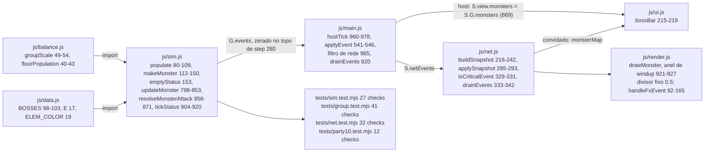
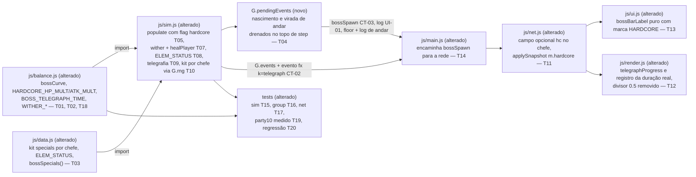

# Implementation Plan

## Request Summary
- **Objective**: dar identidade mecânica a cada um dos 4 chefes (kit próprio, status por elemento, telegrafia legível) e criar a variante HARDCORE em todo andar múltiplo de 3, com degrau calibrado por medição de duração de luta.
- **Scope**:
  - **In**: kits de especiais por chefe (`js/data.js`); status por elemento, incluindo o status novo `wither`; flag HARDCORE em `floor % 3 === 0`; curva única de dificuldade de chefe em `js/balance.js`; composição com `groupScale`; telegrafia com janela > 0,5 s; campo opcional `hc` no snapshot; log de andar HARDCORE; evento de simulação `bossSpawn`; calibração dos multiplicadores por medição (RF-11) e o ajuste medido das janelas de tempo de `tests/party10.test.mjs`.
  - **Out**: status de jogador no snapshot; áudio/música do chefe; novos chefes; regra do portal; schema de save; rebalanceamento de monstros comuns; loot/XP do chefe.
- **Tier**: standard
- **Architecture references**: `AGENTS.md`, `docs/agents/architecture.md`, `docs/agents/domain_rules.md`, `docs/agents/coding_guidelines.md` (apoio verificado: `docs/agents/api_surface.md`, `.spec/init/project-phases.md`, `.spec/init/user-stories.md`, `.spec/init/database-schema.md`)

### Regras de camada que governam esta decomposição

| Regra | Fonte | Efeito nas tasks |
|---|---|---|
| `js/sim.js` é estado puro, zero DOM; `node tests/sim.test.mjs` roda em Node puro | `AGENTS.md:37`, `AGENTS.md:56`, `docs/agents/architecture.md` (tabela de camadas) | T04–T10 só mexem em estado e eventos; nenhuma referência a `document`/`window`/`canvas` entra em `sim.js` (RNF-02, checado em T20) |
| Todo número de tuning mora em `js/balance.js`; nada de literal solto na lógica | `AGENTS.md:38`, `docs/agents/coding_guidelines.md` (§1) | T01 e T02 nascem antes de qualquer código de regra; T05, T09, T10 e T12 importam de lá em vez de escrever número |
| Tabela de conteúdo mora em `js/data.js` (precedente: `VOCATIONS[].skills` com `mult`/`radius`/`burn`, `js/data.js:26-90`; `MONSTERS[].poison`, `js/data.js:82`) | `docs/agents/architecture.md` (camada Conteúdo/config), `docs/agents/data_model.md` | T03 declara o kit e o mapa elemento→status como dado, não como `switch` dentro de `sim.js` |
| Apresentação não muta estado de simulação; composição (`main.js`) não contém regra de jogo | `docs/agents/architecture.md` (tabela de camadas) | T12/T13 só leem snapshot e evento; T14 só encaminha evento — nenhum dos três decide se o chefe é HARDCORE |
| `groupScale` é aplicada em três pontos e a fórmula não se repete em outro arquivo | `docs/agents/domain_rules.md` (Escala por tamanho de grupo), `js/balance.js:49-54` | T05 compõe `bossCurve × groupScale × fator HARDCORE` sem reescrever `Math.sqrt`/teto 2.6 |
| Chefe = `BOSSES[(floor - 1) % 4]` no `bossRoom` | `docs/agents/domain_rules.md` (Chefe por andar), `js/sim.js:100-104` | T05 preserva `typeId`, nome e posição; HARDCORE é acréscimo, não substituição |
| Evento com `boss` é crítico e escapa do teto de 120 | `docs/agents/api_surface.md`, `js/net.js:329-331` | T06 marca `boss: 1`; T14 coloca `bossSpawn` na lista que alimenta `drainEvents` (`js/main.js:920`, `js/main.js:965`) |
| Teste sem framework: `check()` local duplicado por arquivo, `process.exit(failures ? 1 : 0)`, rótulo em pt-BR | `AGENTS.md:43`, `docs/agents/coding_guidelines.md` (§5) | T15–T19 estendem as suítes existentes no padrão verbatim; nenhuma suíte nova, nenhuma alteração em `package.json` |
| pt-BR em comentário, log e UI; identificadores em inglês | `AGENTS.md:45`, `AGENTS.md:51` | Todos os rótulos, logs e comentários novos em pt-BR |

## AS IS — Componentes impactados

Hoje o chefe nasce em `populate()` com nível e escala de HP escritos como literal dentro de `js/sim.js` (`floor + 3` em 101, `1 + (level - 1) * 0.22` em 113), cai num ramo único de IA com `windup` fixo de 0,5 s e um pool de 3 especiais sorteado por `Math.random()` a cada 7 s, e chega à tela como nome + barra. O anel de carga de `js/render.js:925` divide por `0.5` fixo, e `js/net.js` não tem nenhum campo que distinga variante de chefe.

## TO BE — Componentes propostos

`js/balance.js` passa a ser a fonte única da dificuldade do chefe, da janela de telegrafia e dos números de `wither` (T01, T02, recalibrado em T18); `js/data.js` ganha o kit por chefe e o mapa elemento→status (T03). Em `js/sim.js`, o nascimento do chefe consome a curva e marca a variante (T05) e os eventos empilhados fora do tique passam por um buffer novo `G.pendingEvents` (T04) porque `step()` zera `G.events` no primeiro comando (`js/sim.js:280`) — sem esse buffer o evento CT-03 e o log de UI-01 nunca chegariam a lugar nenhum. Por decisão do desenvolvedor (Q1), o buffer cobre também o que `nextFloor()` empilha (`js/sim.js:75-76`), consertando o descarte preexistente de `{ t: 'floor' }` e do log de virada de andar. O combate ganha `wither` com funil de cura (T07), status por elemento no acerto (T08), fase de telegrafia com cancelamento (T09) e seleção determinística do kit (T10). Na borda, `js/net.js` carrega o campo opcional `hc` (T11), `js/render.js` desenha o anel pela duração real (T12), `js/ui.js` marca a barra por texto (T13) e `js/main.js` encaminha o evento crítico novo (T14).

## Tasks

### T01 — Curva de chefe, fatores HARDCORE e janelas de carga em `js/balance.js`
- **Files**: `js/balance.js`
- **Change**: acrescentar uma seção `// ---------- Chefe ----------` com: `BOSS_LEVEL_OFFSET` (substitui o `floor + 3` de `js/sim.js:101`); `LEVEL_HP_SCALE`, `LEVEL_ATK_SCALE`, `LEVEL_DEF_SCALE`, `LEVEL_XP_SCALE` (os fatores hoje literais em `js/sim.js:113-118`, com os mesmos valores 0.22 / 0.16 / 0.1 / 0.3 — mover, não mudar); `bossCurve(floor)` retornando `{ level, hpMult, atkMult }` derivado dessas constantes, monotônico não decrescente; `HARDCORE_EVERY = 3`; `HARDCORE_HP_MULT` e `HARDCORE_ATK_MULT` (ambos > 1, valor **provisório**, com comentário pt-BR dizendo que T18 os substitui pela medição de RF-11); `MONSTER_WINDUP` e `BOSS_WINDUP` (0.35 / 0.5 de `js/sim.js:816`); `BOSS_TELEGRAPH_TIME` estritamente > `BOSS_WINDUP`; `BOSS_SPECIAL_CD` (7, de `js/sim.js:823`). Comentário explica o PORQUÊ de cada faixa, no padrão de `docs/agents/coding_guidelines.md` §3. A curva **reproduz exatamente** os números de hoje para a variante comum: o degrau novo vive só nos fatores HARDCORE.
- **Covers**: RF-05, RF-04, RF-03, RF-07, UI-03
- **Tests**: `tests/group.test.mjs` (T16) importa `bossCurve` direto e assere monotonicidade em `floor` 1..30 e o valor em ≥ 3 andares
- **Risk**: Low — arquivo de constantes, sem lógica; o risco real é escolher valores que mudem a variante comum, evitado pela regra "reproduzir os números de hoje"
- **Dependencies**: none

### T02 — Constantes do status `wither` em `js/balance.js`
- **Files**: `js/balance.js`
- **Change**: exportar `WITHER_TIME` (duração em segundos), `WITHER_DPS` (dano por segundo do tique, no mesmo padrão absoluto de `burn`/`poison` — `js/data.js:82`, `js/data.js:33`) e `WITHER_HEAL_MULT` (fator de cura recebida, estritamente entre 0 e 1). Comentário pt-BR registra a decisão: a metade de identidade do elemento Morte é a redução de cura, e por isso o fator é constante de balanceamento e não literal em `sim.js` (`AGENTS.md:38`, RF-10 AC).
- **Covers**: RF-10
- **Tests**: `tests/sim.test.mjs` (T15) importa `WITHER_HEAL_MULT` e `WITHER_DPS` e compara contra o comportamento, nunca contra literal
- **Risk**: Low — apenas exportações novas
- **Dependencies**: T01 (mesmo arquivo, edição sequencial para evitar conflito de escrita)

### T03 — Kit de especiais por chefe e mapa `ELEM_STATUS` em `js/data.js`
- **Files**: `js/data.js`
- **Change**: cada entrada de `BOSSES` (`js/data.js:98-103`) ganha `specials: [{ id, kind, ... }]` com **no mínimo 3 identificadores próprios** e prefixados pelo id do chefe (ex.: `ferumbras_*`), garantindo interseção vazia entre pares; ao menos **1 entrada por chefe marcada `hc: true`** (mecânica exclusiva da variante HARDCORE, RF-04). `kind` reutiliza primitivas já existentes em `sim.js` — `nova` (`js/sim.js:825-832`), `burst` (`js/sim.js:833-841`), `summon` (`js/sim.js:842-852`) e `zone` (zona persistente, `js/sim.js:1004-1005`) — sem sistema novo. Acrescentar `ELEM_STATUS` mapeando elemento → nome do campo de status (`E.FIRE → 'burn'`, `E.ICE → 'freeze'`, `E.DEATH → 'wither'`, `E.EARTH → 'poison'`; demais elementos sem status) e o helper puro `bossSpecials(boss, hardcore)` que devolve a lista filtrada, para que `sim.js` e os testes não dupliquem o filtro.
- **Covers**: RF-01, RF-02, RF-04
- **Tests**: `tests/sim.test.mjs` (T15) percorre `BOSSES`, assere ≥ 3 especiais por chefe, interseção vazia entre todo par e ≥ 1 id exclusivo do HARDCORE por chefe
- **Risk**: Medium — tabela de conteúdo nova consumida por `sim.js`; kit mal dimensionado desloca a razão de RF-11 e força reciclo de T18
- **Dependencies**: none

### T04 — Buffer `G.pendingEvents` para eventos empilhados fora do tique em `js/sim.js`
- **Files**: `js/sim.js`
- **Change**: `createGame()` passa a criar `pendingEvents: []`; `populate()` **e** `nextFloor()` empilham ali (não em `G.events`), por um par de helpers `pushPending(G, ev)` / `logPending(G, m, c)` ao lado dos atuais `pushEvent`/`log` (`js/sim.js:1226-1227`); `step()`, logo depois de `G.events.length = 0` (`js/sim.js:280`), drena `pendingEvents` para `G.events` e esvazia o buffer no mesmo comando. **Motivo verificado, não hipótese**: `step()` zera `G.events` no primeiro comando, então tudo que é empilhado fora do tique é apagado antes de qualquer consumidor ler — tanto o que `populate()` empilha (chamada de `createGame`, `js/sim.js:45`, e de `nextFloor`, `js/sim.js:63`) quanto o `{ t: 'floor' }` e o log `Andar N — o ar fica mais pesado` de `nextFloor()` (`js/sim.js:75-76`). **Decisão do desenvolvedor (Q1 resolvida)**: o buffer cobre os dois casos; a entrega dos eventos de `nextFloor()` conserta um bug preexistente e é comportamento pretendido, não efeito colateral. Para a ordem de leitura, mover o `pushEvent`/`log` de `js/sim.js:75-76` para logo depois de `G.floor++` (`js/sim.js:49`), antes da chamada de `populate()`, de modo que a linha do andar saia antes da linha HARDCORE de T06. A semântica de descarte por tique de todo o resto — eventos empilhados **durante** `step()` — fica intacta.
- **Covers**: RF-08, UI-01 (habilitador); correção do descarte preexistente de `{ t: 'floor' }` e do log de virada de andar
- **Tests**: `tests/sim.test.mjs` (T15) — `createGame(seed, 3)` seguido de um `step()` devolve os eventos de nascimento e um segundo `step()` não os repete; `nextFloor(G)` seguido de um `step()` devolve exatamente um `{ t: 'floor' }` e exatamente uma linha de log de andar, e o `step()` seguinte não devolve nenhum dos dois
- **Risk**: Medium — mexe no coração do laço; se o buffer não for esvaziado, os eventos se repetem todo tique; a entrega nova de `{ t: 'floor' }` passa a alcançar `applyEvent` em `js/main.js` e exige o ajuste de T14
- **Dependencies**: none

### T05 — `populate()` e `makeMonster()` consumindo `bossCurve` e marcando a variante HARDCORE
- **Files**: `js/sim.js`
- **Change**: importar `bossCurve`, `HARDCORE_EVERY`, `HARDCORE_HP_MULT`, `HARDCORE_ATK_MULT`, `LEVEL_*` de `js/balance.js`. `makeMonster()` troca os literais `0.22`, `0.16`, `0.1`, `0.3` (`js/sim.js:113-118`) pelas constantes importadas, sem mudar valor. No bloco do chefe (`js/sim.js:100-109`): `const hardcore = floor % HARDCORE_EVERY === 0;`, nível vindo de `bossCurve(floor).level`, `b.hardcore = hardcore`, e `b.maxHp = Math.round(base × bossCurve(floor).hpMult × groupScale(G.groupSize || 1) × (hardcore ? HARDCORE_HP_MULT : 1))`, `b.atk` análogo com `atkMult`/`HARDCORE_ATK_MULT`. `typeId`, nome (`${boss.name} · Andar ${floor}`) e posição no `bossRoom` permanecem idênticos. `groupScale` continua sendo chamada, nunca reescrita.
- **Covers**: RF-03, RF-04, RF-05, RF-06
- **Tests**: `tests/sim.test.mjs` (T15) — flag verdadeira em 3/6/9/12 e falsa em 1/2/4/5/7/8/10/11 com `typeId` `glacier`/`morgaroth`/`ferumbras`/`bonelord` preservado, antes do primeiro `step()`; `tests/group.test.mjs` (T16) — produto de fatores e independência de ordem
- **Risk**: Medium — toca o nascimento de todo monstro; erro aqui vaza para as 4 suítes que medem população e HP
- **Dependencies**: T01

### T06 — Evento `bossSpawn` (CT-03) e log de andar HARDCORE (UI-01)
- **Files**: `js/sim.js`
- **Change**: ainda em `populate()`, quando `hardcore` é verdadeiro, empilhar em `G.pendingEvents` exatamente uma vez `{ t: 'bossSpawn', id: b.id, typeId: boss.id, floor, hardcore: 1, boss: 1 }` (CT-03, formato verbatim da SPEC) e uma linha de log em pt-BR contendo o termo `HARDCORE` (`{ t: 'log', m: '…HARDCORE…', c: 'boss' }`), nessa ordem. Em andar não múltiplo de 3, nenhum dos dois é empilhado. `boss: 1` é o que faz `isCriticalEvent()` devolver `true` (`js/net.js:329-331`). Ordem dentro do lote drenado: os eventos de virada de andar de `nextFloor()` (T04) saem antes destes, então a tela mostra `Andar N — o ar fica mais pesado.` e só depois a linha HARDCORE.
- **Covers**: RF-08, UI-01, CT-03
- **Tests**: `tests/sim.test.mjs` (T15) — 1 evento por andar HARDCORE e 0 nos demais; log com `HARDCORE` presente no primeiro lote e ausente fora do ciclo; fila saturada com 400 eventos ainda entrega o `bossSpawn` por `drainEvents`
- **Risk**: Low — acréscimo de eventos, sem alterar estado
- **Dependencies**: T04, T05

### T07 — Status `wither`: tique de dano e funil de cura em `js/sim.js`
- **Files**: `js/sim.js`
- **Change**: `emptyStatus()` (`js/sim.js:153-154`) ganha `wither: 0` (campo novo, `poison` intocado); `tickStatus()` (`js/sim.js:904-920`) ganha o ramo de `wither` no mesmo padrão de `burn`/`poison`, com `WITHER_DPS` e dano `silent` via `damagePlayer`, decrementando o tempo até zerar. Criar `healPlayer(G, p, amount)` — função única por onde passa toda cura recebida — que aplica `amount × WITHER_HEAL_MULT` quando `p.status.wither > 0` e `amount` cheio quando `wither === 0`, respeitando o teto `maxHp` e emitindo o mesmo evento `{ t: 'd', v: '+…' }` de hoje. Redirecionar para ela os dois pontos de cura de jogador existentes: poção de vida (`js/sim.js:508-510`) e `case 'heal'` de `castSkill` (`js/sim.js:586-606`). Sem `wither` ativo o comportamento é bit a bit o de hoje.
- **Covers**: RF-10
- **Tests**: `tests/sim.test.mjs` (T15) — HP decresce por tique só com `wither > 0`; a mesma cura `H` com e sem `wither` no mesmo teste, com `wither` restaurando estritamente menos; ao expirar, a cura volta a `H`
- **Risk**: High — o funil toca cura de poção e cura de magia, cobertas por asserções em `tests/group.test.mjs` (escolha de alvo de cura); regressão aqui é silenciosa
- **Dependencies**: T02

### T08 — Status do elemento aplicado no acerto do chefe
- **Files**: `js/sim.js`
- **Change**: em `resolveMonsterAttack()` (`js/sim.js:856-871`) e no ponto de impacto do projétil do chefe, quando `m.isBoss` e o dano atinge um jogador, ler `ELEM_STATUS[m.elem]` (T03) e aplicar o campo correspondente em `p.status` com `Math.max` sobre o valor atual, usando as durações/DPS de `js/balance.js` (`WITHER_*` para `wither`; constantes equivalentes para `burn` e `freeze` do chefe, declaradas em T01 se ainda não existirem). O mapeamento é a **única** fonte: nada de `if` encadeado por elemento. Monstro comum segue no caminho atual (`m.poison`, `js/sim.js:869`) — o mapa só vale para `isBoss`, porque rebalancear monstro comum está fora de escopo.
- **Covers**: RF-02
- **Tests**: `tests/sim.test.mjs` (T15) — um caso por chefe: após o acerto, o campo do elemento do chefe é > 0 e nenhum outro campo de elemento diferente foi tocado; nenhum chefe `E.DEATH` aplica `poison`
- **Risk**: Medium — o chefe passa a aplicar controle (freeze) em jogador; muda a sensação de luta e entra na conta da calibração T18
- **Dependencies**: T03, T07

### T09 — Fase de telegrafia do ataque perigoso, com cancelamento
- **Files**: `js/sim.js`
- **Change**: reaproveitar o padrão de `windup` (`js/sim.js:802-806`, `js/sim.js:815-820`) em vez de criar máquina paralela: o monstro ganha `windupTotal` e `windupKind` (`null` para o golpe básico). Ao iniciar um especial do chefe, em vez de resolver na hora, marcar `m.windup = BOSS_TELEGRAPH_TIME`, `m.windupTotal = BOSS_TELEGRAPH_TIME`, `m.windupKind = special.id`, e emitir **uma única vez, no primeiro tique da fase**, `{ t: 'fx', k: 'telegraph', id: m.id, x, y, r, d: BOSS_TELEGRAPH_TIME, c: ELEM_COLOR[m.elem], boss: 1 }` (CT-02 verbatim), onde `r` é a área ameaçada em tiles. Nenhum dano e nenhum projétil daquele ataque durante a janela. O golpe básico continua usando `BOSS_WINDUP`/`MONSTER_WINDUP` e `windupKind = null`. Cancelamento (RF-09): no portão de `stun`/`freeze` já existente (`js/sim.js:759`) e na morte, zerar `windup`, `windupTotal` e `windupKind` sem resolver.
- **Covers**: RF-07, RF-09, CT-02
- **Tests**: `tests/sim.test.mjs` (T15) — HP de todos intocado e `G.projectiles` sem projétil do chefe durante a janela; dano depois dela; exatamente 1 evento `k: 'telegraph'` por ataque; três casos de cancelamento (morte, `stun`, `freeze`) sem dano e sem projétil
- **Risk**: High — muda o ritmo de dano do chefe em todo andar, inclusive nos não HARDCORE; é a mudança que mais desloca a medição de T18/T19
- **Dependencies**: T01, T05

### T10 — Seleção do kit por chefe com `G.rng` e mecânica exclusiva do HARDCORE
- **Files**: `js/sim.js`
- **Change**: substituir o pool único do ramo `ai === 'boss'` (`js/sim.js:822-853`) pela seleção sobre `bossSpecials(type, m.hardcore)` (T03) usando `G.rng.pick` — trocando os três `Math.random()` de `js/sim.js:824` e `js/sim.js:843` por `G.rng`, requisito de determinismo da medição de RF-11. `m.special = BOSS_SPECIAL_CD`. Resolver por `switch (special.kind)` sobre as primitivas existentes (`nova`, `burst`, `summon`, `zone`), disparado **ao fim da telegrafia** (T09), nunca no tique da escolha. Com `m.hardcore`, o kit inclui as entradas `hc: true` — garantindo ≥ 1 mecânica ausente da variante comum do mesmo chefe (RF-04).
- **Covers**: RF-01, RF-04
- **Tests**: `tests/sim.test.mjs` (T15) — com seed fixa, o chefe HARDCORE dispara pelo menos uma vez um id `hc` e o chefe comum nunca dispara nenhum; nenhum id de outro chefe aparece
- **Risk**: High — troca o motor de ataque do chefe e altera a sequência de consumo de `G.rng`, o que muda resultados de qualquer teste que dependa da ordem do RNG
- **Dependencies**: T03, T09

### T11 — Campo opcional `hc` no snapshot (CT-01)
- **Files**: `js/net.js`
- **Change**: em `buildSnapshot`, dentro do bloco `if (m.isBoss) { e.b = 1; e.n = m.name; }` (`js/net.js:227-233`), acrescentar `if (m.hardcore) e.hc = 1;` — campo opcional, ausente quando falso, exatamente como `b`, `n`, `f`, `w`, `df` e `s`. Em `applySnapshot` (`js/net.js:285-293`), `m.hardcore = !!sm.hc`. Nada mais do pacote muda; o array de 4 posições de status **de monstro** (`js/net.js:238-239`) fica intocado.
- **Covers**: CT-01, RNF-03
- **Tests**: `tests/net.test.mjs` (T17) — `hc` presente no chefe em andar HARDCORE, ausente fora dele, e o delta de bytes por pacote ≤ 8 no andar HARDCORE e exatamente 0 fora
- **Risk**: Low — campo opcional aditivo, sem quebra de compatibilidade (cliente antigo ignora chave desconhecida)
- **Dependencies**: T05

### T12 — Anel de telegrafia com duração real em `js/render.js` (UI-03)
- **Files**: `js/render.js`
- **Change**: remover o divisor fixo `0.5` de `js/render.js:925`; exportar a função pura `telegraphProgress(remaining, total)` = `clamp(1 - remaining / total, 0, 1)` e usá-la no arco do anel. A duração total vem do evento CT-02: `handleFxEvent` ganha `case 'telegraph'` que desenha o aviso de área (`spawnRing` no raio `ev.r`, cor `ev.c`) e registra `ev.d` num mapa local por id de monstro; o desenho usa esse total e, na falta dele, cai em `BOSS_WINDUP`/`MONSTER_WINDUP` importados de `js/balance.js` (o módulo já importa `EMBER_LINK_MIN` de lá, `js/render.js:62`) — nunca em literal. O restante (`m.windup`) continua chegando pelo campo `w` do snapshot, então **nenhum byte novo** é acrescentado ao pacote por causa do anel.
- **Covers**: UI-03, CT-02
- **Tests**: `tests/sim.test.mjs` (T15) importa `telegraphProgress` de `js/render.js` (import em Node verificado como seguro) e assere 0 no primeiro tique, 1 no último e erro ≤ 0,02 para uma janela de duração D arbitrária
- **Risk**: Low — apresentação isolada; o pior caso é anel visualmente errado, sem efeito em estado
- **Dependencies**: T01, T09

### T13 — Marca textual HARDCORE na barra do chefe (UI-02)
- **Files**: `js/ui.js`
- **Change**: exportar a função pura `bossBarLabel(boss)` que devolve `` `${boss.name} · Nv ${boss.level}` `` acrescida do termo `HARDCORE` quando `boss.hardcore` — texto, não cor, para continuar legível em escala de cinza. `updateHud` (`js/ui.js:215-219`) passa a escrever `el('bossName').textContent = bossBarLabel(boss)`. Os dois lados já têm o dado: o host lê `S.G.monsters` direto (`js/main.js:869`) e o convidado recebe `m.hardcore` de `applySnapshot` (T11). Nenhuma mudança em `index.html` nem em `styles.css`.
- **Covers**: UI-02, CT-01 (consumo)
- **Tests**: `tests/sim.test.mjs` (T15) importa `bossBarLabel` de `js/ui.js` (import em Node verificado como seguro; `el()` só toca `document` quando chamada) e assere o termo presente com `hardcore` e ausente sem ele; `tests/browser.mjs` (T20) confere o texto real de `#bossName` (`index.html:148`)
- **Risk**: Low
- **Dependencies**: T11

### T14 — Encaminhamento do evento `bossSpawn` na composição
- **Files**: `js/main.js`
- **Change**: acrescentar `'bossSpawn'` à lista de tipos que entram em `S.netEvents` (`js/main.js:965`) — sem isso o evento nunca chega a `drainEvents` (`js/main.js:920`) e o critério de sobrevivência ao teto de 120 de RF-08 não vale na produção. Em `applyEvent` (`js/main.js:541-546`), acrescentar `bossSpawn` **e `floor`** à linha de tipos ignorados pela camada de FX (junto de `loot`/`hurt`/`respawn`): `bossSpawn` porque é evento de rede sem FX próprio, e `floor` porque T04 passa a entregá-lo de fato — hoje ele nunca chegava, e sem o ignore explícito ele desce até o `default` de `handleFxEvent` (`js/render.js:74`, um `break` inofensivo, mas o contrato correto é o ignore declarado). O `{ t: 'floor' }` do simulador **não** entra em `S.netEvents`: o host já anuncia a virada por mensagem própria (`net.send({ t: 'floor', … })`, `js/main.js:975`), que é o que dispara `case 'floor'` no convidado (`js/main.js:506-514`) — encaminhar o evento de simulação junto duplicaria o anúncio e regeraria o mapa duas vezes. A linha de log da virada, essa sim, viaja sem mudança nenhuma: `'log'` já está na lista de `js/main.js:965`, então o convidado passa a ver a mesma linha que o host. Nenhuma regra de jogo entra em `main.js`: ele só transporta.
- **Covers**: RF-08, CT-03
- **Tests**: `tests/net.test.mjs` (T17) — `isCriticalEvent({ t: 'bossSpawn', boss: 1 })` é `true` e o evento sobrevive a `drainEvents` com fila saturada
- **Risk**: Low — listas aditivas; o único ponto de atenção é **não** empurrar `floor` para `S.netEvents`
- **Dependencies**: T04, T06

### T15 — Asserções de comportamento em `tests/sim.test.mjs`
- **Files**: `tests/sim.test.mjs`
- **Change**: acrescentar blocos no padrão verbatim da suíte (`check()` local já existente no topo, rótulos em pt-BR no formato `área: comportamento`, `process.exit` no fim inalterado) cobrindo: kit por chefe e interseção vazia (RF-01); status por elemento nos 4 chefes (RF-02); `wither` — dano por tique e comparação direta de cura com e sem o status no mesmo teste (RF-10); flag HARDCORE em 3/6/9/12 e falsa em 1/2/4/5/7/8/10/11 com `typeId` preservado (RF-03); `maxHp`/`atk` estritamente maiores e mecânica exclusiva (RF-04); telegrafia — HP intocado e sem projétil na janela, 1 evento CT-02, dano depois (RF-07); cancelamento por morte/`stun`/`freeze` (RF-09); `bossSpawn` 1×/0× e sobrevivência com fila saturada (RF-08); log com `HARDCORE` no primeiro lote (UI-01); entrega única de `{ t: 'floor' }` e do log de virada de andar depois de `nextFloor()`, sem repetição no tique seguinte (T04, correção do bug preexistente); `bossBarLabel` (UI-02); `telegraphProgress` (UI-03). Nenhum número vem de literal: importar de `js/balance.js`.
- **Covers**: RF-01, RF-02, RF-03, RF-04, RF-07, RF-08, RF-09, RF-10, UI-01, UI-02, UI-03, CT-02, CT-03, RNF-04
- **Tests**: a própria suíte — `node tests/sim.test.mjs` verde, sem DOM (RNF-02)
- **Risk**: Medium — suíte grande; medições longas aqui elevam o tempo de `npm test`
- **Dependencies**: T03, T06, T07, T08, T09, T10, T12, T13

### T16 — Curva, composição de escala e harness de duração em `tests/group.test.mjs`
- **Files**: `tests/group.test.mjs`
- **Change**: acrescentar, no padrão da suíte: (a) `bossCurve` importada direto de `js/balance.js`, monotônica não decrescente em `floor` 1..30 e valor conferido em ≥ 3 andares (RF-05); (b) `maxHp` do chefe = curva × `groupScale` × fator HARDCORE, com o resultado independente da ordem dos fatores até o arredondamento final, e `maxHp` com 10 jogadores > com 1 nas duas variantes (RF-06); (c) o **harness de medição de RF-11**: para cada um dos 4 chefes (andares 3, 6, 9, 12 — o par chefe×HARDCORE só se repete a cada 12 andares), mesma seed, mesmo `groupSize`, mesmo nível de jogador, mede `t_hc` e `t_comum` até `hp <= 0` do chefe e assere `1.8 ≤ t_hc / t_comum ≤ 2.4`. O harness precisa manter o dano recebido ligado — o `atk` do chefe só entra na razão pelo tempo parado dos jogadores. Determinismo: substituir `Math.random` por um gerador semeado de `js/rng.js` durante a medição e restaurar depois, porque crítico de jogador ainda usa `Math.random()` (`js/sim.js:411`, `js/sim.js:637`, `js/sim.js:971`). As linhas 250-254 existentes seguem sem alteração e verdes.
- **Covers**: RF-05, RF-06, RF-11, RNF-04
- **Tests**: a própria suíte — `node tests/group.test.mjs` verde
- **Risk**: Medium — a medição é o portão de T18; harness caro demais estoura o tempo de `npm test`
- **Dependencies**: T05, T09, T10

### T17 — Contrato de snapshot e evento crítico em `tests/net.test.mjs`
- **Files**: `tests/net.test.mjs`
- **Change**: no bloco `== custo do host com a sala cheia ==` (que já roda em `createGame(4242, 6)`, `tests/net.test.mjs:172` — andar 6 **é** HARDCORE, então serve sem cenário novo): asserir que a entrada do chefe traz `hc: 1`, que o mesmo cenário num andar não múltiplo de 3 não traz a chave, e que o delta de bytes por pacote é ≤ 8 no HARDCORE e exatamente 0 fora, reusando a contagem de `tests/net.test.mjs:187-190` (RNF-03). Acrescentar ao bloco de eventos que `isCriticalEvent({ t: 'bossSpawn', … boss: 1 })` é `true` e que o evento sobrevive a `drainEvents` com a fila saturada (RF-08). O teto de tique de 4 ms em `tests/net.test.mjs:183-184` já mede um andar HARDCORE e passa a valer como asserção de RNF-01 nessa condição.
- **Covers**: CT-01, RNF-03, RNF-01, RF-08
- **Tests**: a própria suíte — `node tests/net.test.mjs` verde
- **Risk**: Low
- **Dependencies**: T11, T14

### T18 — Calibração medida de `HARDCORE_HP_MULT` e `HARDCORE_ATK_MULT`
- **Files**: `js/balance.js`
- **Change**: com o harness de T16 rodando, iterar os dois multiplicadores até `t_hc / t_comum` cair dentro de 1,8–2,4 **para os 4 chefes** (andares 3, 6, 9 e 12), não para um caso favorito. Registrar em comentário pt-BR, ao lado das constantes, a razão medida por chefe e a data da medição — é o padrão de "comentário cita o número medido" de `docs/agents/coding_guidelines.md` §3. Os valores provisórios de T01 são substituídos aqui; nenhum número é escolhido a priori. Se nenhum par de multiplicadores fechar a banda nos 4 chefes, o desvio é do kit (T03) ou da janela de telegrafia (T01/T09) — ajustar lá e remedir, nunca afrouxar a banda.
- **Covers**: RF-11, RF-04
- **Tests**: `tests/group.test.mjs` (T16) verde com a banda 1,8–2,4 nos 4 chefes, em 3 execuções consecutivas
- **Risk**: High — é o item que pode exigir volta a T03/T09; a razão depende de HP, do `atk` (por tempo parado) e do custo em DPS da janela de telegrafia
- **Dependencies**: T16

### T19 — Janelas de tempo medidas em `tests/party10.test.mjs`
- **Files**: `tests/party10.test.mjs`
- **Change**: **medir antes de escolher**. (a) Instrumentar a fase 1 do cenário de 10 jogadores (`tests/party10.test.mjs:66-74`, hoje `const limite = 300 / TICK`) com teto folgado e registrar o tempo real até `G.portalOpen` em ≥ 5 seeds; a corrida atual nasce em `createGame(20250820, 1, MAX_PLAYERS)` — andar 1, que **não** é HARDCORE —, então o resultado legítimo pode ser "300 s continua bastando": registrar a medição em comentário pt-BR e só mexer no número se a medição exigir. (b) Acrescentar um cenário novo em andar HARDCORE (`createGame(seed, 9, MAX_PLAYERS)`), com a janela derivada da **mesma medição** (pior caso medido com margem declarada no comentário), cobrindo o caso em que RF-11 dobra o tempo de queda. (c) Estender `medir(n)` (`tests/party10.test.mjs:126-140`) com parâmetro de andar e acrescentar a asserção de tique médio < 4 ms em andar HARDCORE (RNF-01) — o teto de RNF-01 não muda. Nenhuma janela é chutada; cada número novo vem acompanhado do valor medido que o justifica.
- **Covers**: RF-11 (consequência operacional), RNF-01
- **Tests**: a própria suíte — `node tests/party10.test.mjs` verde em 3 execuções consecutivas
- **Risk**: Medium — janela apertada demais gera falha intermitente; janela larga demais esconde regressão de desempenho
- **Dependencies**: T18

### T20 — Regressão completa e inventário de cobertura
- **Files**: `tests/browser.mjs` (asserção de `#bossName`), verificação de `npm test`
- **Change**: rodar `npm test` (10 suítes encadeadas) e confirmar verde; conferir que a contagem de `check()` executados não regrediu (baseline: 238 chamadas em 10 suítes, 260 asserções executadas) e que todo RF e UI da SPEC tem ≥ 1 asserção em `tests/sim.test.mjs` ou `tests/group.test.mjs` (RNF-04); confirmar ausência de `document`/`window`/`canvas` em `js/sim.js` por `grep` (RNF-02); rodar `npm run test:browser` (mexeu em render, UI e rede — `AGENTS.md:50`) acrescentando a leitura de `#bossName` num andar HARDCORE, e `npm run test:multipeer:quick`.
- **Covers**: RNF-01, RNF-02, RNF-04
- **Tests**: `npm test`, `npm run test:browser`, `npm run test:multipeer:quick`
- **Risk**: Low — portão de verificação
- **Dependencies**: T15, T16, T17, T19

## Execution Phases

| Phase | Tasks | Parallel-safe? |
|-------|-------|----------------|
| 1 — Fundação de números e conteúdo | T01, T02, T03 | Parcial — T03 é independente; T01 → T02 escrevem o mesmo `js/balance.js` e vão em sequência |
| 2 — Nascimento do chefe em `sim.js` | T04, T05, T06 | Não — as três escrevem `js/sim.js`; T06 depende de T04 e T05 |
| 3 — Combate do chefe em `sim.js` | T07, T08, T09, T10 | Não — mesmo arquivo; T08 depende de T07, T10 depende de T09 |
| 4 — Transporte e apresentação | T11, T12, T13, T14 | Sim — quatro arquivos distintos (`net.js`, `render.js`, `ui.js`, `main.js`); T13 lê o que T11 produz e vem depois dele na ordem da fase |
| 5 — Suítes de comportamento | T15, T16, T17 | Sim — três suítes distintas, sem arquivo compartilhado |
| 6 — Calibração medida e regressão | T18, T19, T20 | Não — T19 depende da medição de T18 e T20 fecha o portão |

## Contracts emitted

Nenhum artefato de contrato foi emitido, e isso é decisão registrada, não omissão.

| Verificação | Resultado |
|---|---|
| Subseção `### Contracts` na SPEC com entradas preenchidas | Sim — CT-01, CT-02, CT-03 |
| Tier ∈ {standard, complete} | Sim — standard |
| Natureza das interfaces | **Internas ao processo**: CT-01 é campo de um objeto JS serializado em `JSON.stringify` sobre `RTCDataChannel` (`js/net.js:216-242`); CT-02 e CT-03 são eventos de simulação em memória (`G.events`) |
| Superfície HTTP / gRPC / mensageria | Inexistente — `docs/agents/api_surface.md` declara "não há HTTP API"; `vercel.json` serve estático sem backend; a única integração remota é o broker PeerJS para o aperto de mão (`js/net.js:48`) |

Emitir `openapi.yaml`, `service.proto` ou `asyncapi.yaml` aqui descreveria um servidor que não existe. Os três contratos ficam onde são verificáveis: no formato verbatim das tasks T06, T09 e T11 e nas asserções de T15 e T17.

## Risks

| Risk | Blast radius | Mitigation | Rollback |
|------|-------------|------------|----------|
| A curva de RF-05 mudar a variante comum e deslocar todos os andares | 4 suítes que medem HP/população; janela de 300 s de `tests/party10.test.mjs:66-74` | T01 exige que `bossCurve` reproduza exatamente os valores de hoje (`floor + 3`, `0.22`, `0.16`); o degrau vive só nos fatores HARDCORE | Reverter `js/balance.js` para os valores movidos, sem tocar em `sim.js` |
| Telegrafia > 0,5 s reduzir o DPS do chefe em **todo** andar, inclusive comum | Sensação de luta em todos os andares; razão de RF-11 | `BOSS_TELEGRAPH_TIME` só vale para o especial; o golpe básico segue em `BOSS_WINDUP`; a razão é remedida em T18 depois da janela existir | Reduzir `BOSS_TELEGRAPH_TIME` ao mínimo > 0,5 s; a constante é o único ponto de ajuste |
| Funil `healPlayer` alterar cura de poção ou de magia sem `wither` ativo | `tests/group.test.mjs` (escolha de alvo de cura), poção em todas as suítes de partida | Sem `wither` o funil é identidade; T15 compara a mesma cura `H` nos dois estados no mesmo teste | Reverter os dois pontos de chamada (`js/sim.js:508-510`, `js/sim.js:586-606`) para a soma direta |
| Trocar `Math.random()` por `G.rng` mudar a sequência de consumo do RNG | Qualquer teste sensível à ordem do RNG; loot e wander pós-especial | As asserções existentes são relativas ou de determinismo entre dois jogos frescos (`tests/group.test.mjs:256-259`), não contra valores absolutos; T20 roda a suíte 3× | Manter `Math.random()` na invocação e aceitar que a medição de RF-11 use `Math.random` semeado no teste |
| `G.pendingEvents` entregar em duplicidade (a cada tique) ou vazar de um andar para o seguinte | Log e fila de rede em toda partida — agora inclui `{ t: 'floor' }` e a linha de virada de andar, entregues de verdade pela primeira vez | T04 esvazia o buffer no mesmo comando em que drena; T15 assere entrega única depois de `createGame` **e** depois de `nextFloor`, com o tique seguinte limpo; T14 mantém `floor` fora de `S.netEvents` para não duplicar o anúncio que o host já envia (`js/main.js:975`) | Remover a drenagem e voltar a empilhar em `G.events` (perdendo RF-08/UI-01 e voltando ao descarte de hoje) |
| Kit + HARDCORE estourarem o orçamento de 4 ms/tique | RNF-01, `tests/net.test.mjs:183-184`, `tests/party10.test.mjs:143` | Kits reusam primitivas existentes (sem sistema novo); T17 já mede em andar 6 (HARDCORE) e T19 acrescenta a medição em andar 9 | Reduzir contagem de projéteis/invocações nas entradas de `specials` em `js/data.js` |
| A banda 1,8–2,4 não fechar para os 4 chefes com nenhum par de multiplicadores | T18 volta a T03/T09 | T18 declara explicitamente: ajustar kit ou janela e remedir, nunca afrouxar a banda | Reverter kit HARDCORE ao especial exclusivo mais simples (`nova`) e recalibrar só por HP/ATK |
| Campo `hc` estourar o orçamento de pacote | RNF-03 | Campo opcional, `,"hc":1` = 8 bytes, só no chefe e só em andar HARDCORE; medido em T17 | Remover a chave e derivar a variante no cliente por `floor % 3` (pior: duplica regra na apresentação) |

## Open Questions

- **Q1 — RESOLVIDA (decisão do desenvolvedor, não é mais pergunta aberta): o buffer entrega também os eventos que `nextFloor()` empilha e hoje perde.** Fato verificado: `step()` zera `G.events` no primeiro comando (`js/sim.js:280`), então `{ t: 'floor' }` e o log `Andar N — o ar fica mais pesado` empilhados em `js/sim.js:75-76` nunca chegam a nenhum consumidor. **Decisão**: T04 cobre `populate()` **e** `nextFloor()` — o escopo mínimo antes adotado foi revertido, e a correção **não** fica para um `/plan` próprio. Isso conserta um bug preexistente dentro do arquivo que esta feature já reescreve. **Consequência visível**: uma linha de log a mais por andar na tela do host (`Andar N — o ar fica mais pesado.`), replicada também ao convidado porque `'log'` já está na lista de encaminhamento de `js/main.js:965`; o `{ t: 'floor' }` do simulador passa a chegar a `applyEvent` e é tratado como tipo ignorado por T14, sem virar mensagem de rede.
- **Q2 — O crítico de jogador deve passar a sair de `G.rng` na produção?** RF-11 exige medição determinística, e hoje `Math.random()` decide crítico em `js/sim.js:411`, `js/sim.js:637` e `js/sim.js:971`. **Impacto**: o plano resolve isso **no teste** (T16 substitui `Math.random` por gerador semeado durante a medição e restaura depois), sem tocar na produção; mover o crítico para `G.rng` daria determinismo host-side real, mas é mudança de comportamento de combate fora do escopo declarado desta SPEC. **Default adotado**: semear só no teste.

## Assumptions

- `js/render.js` e `js/ui.js` são importáveis em Node puro — verificado por sonda: `node -e "import('./js/render.js')"` e `import('./js/ui.js')` retornam módulo carregado; `render.js` protege o único acesso global com `typeof window !== 'undefined'` (`js/render.js:117`) e `el()` só toca `document` quando chamada (`js/ui.js:6`). É isso que permite cumprir RNF-04 para UI-02 e UI-03 dentro de `tests/sim.test.mjs`, sem navegador.
- `tests/net.test.mjs:172` já cria a partida em `createGame(4242, 6)` — andar 6 é múltiplo de 3, logo o bloco de custo e de bytes daquela suíte passa a medir um andar HARDCORE sem cenário novo (RNF-01, RNF-03). Verificado no arquivo.
- A corrida completa de `tests/party10.test.mjs` nasce em andar 1 e o bloco de orçamento de tique usa andar 8 — **nenhum dos dois é HARDCORE**. Verificado (`tests/party10.test.mjs:57`, `tests/party10.test.mjs:128`). Por isso a janela de 300 s pode legitimamente não precisar mudar; T19 mede em vez de presumir, e acrescenta o cenário HARDCORE que faltava.
- A razão de duração de RF-11 é dominada por `HARDCORE_HP_MULT`; `HARDCORE_ATK_MULT` entra na razão **indiretamente**, pelo tempo em que jogadores ficam mortos ou recuando. Por isso T16 mede com dano recebido ligado — um harness que só bata no chefe mediria a razão de HP, não a de luta. [UNVERIFIED até T16 rodar: a magnitude dessa contribuição]
- Números de forma do kit (raio, número de projéteis, multiplicador) ficam em `js/data.js` junto do kit, seguindo o precedente das magias e dos monstros (`js/data.js:26-90`, `js/data.js:82`); os números de tuning global (multiplicadores HARDCORE, janelas, ciclo, `wither`) ficam em `js/balance.js`, como manda `AGENTS.md:38`. A regra proibida é literal solto **na lógica** de `js/sim.js`, e nenhuma task introduz um.
- Nenhuma suíte nova é criada: RNF-04 exige as asserções em `tests/sim.test.mjs` ou `tests/group.test.mjs`, então `package.json` não muda e o encadeamento de 10 suítes de `npm test` fica intacto. Se o custo de T16 empurrar `npm test` para além do aceitável, o recurso é mover só o harness de medição para uma suíte dedicada e acrescentá-la ao script — decisão adiada até haver medição.
- O reforço do marcador de chefe no minimapa (`js/render.js:1146-1147`) é sugestão FLEXIBLE da SPEC e **não** virou task: UI-02 já é satisfeito por texto na barra, e nenhum RIGID depende do minimapa.
- A entrega nova de `{ t: 'floor' }` a `applyEvent` é segura mesmo antes do ignore explícito de T14: `handleFxEvent` termina em `default: break` (`js/render.js:74`), verificado por leitura. `js/net.js:327` lista `'floor'` em `CRITICAL`, mas esse conjunto só decide prioridade do que **já** entrou em `S.netEvents`, e T14 mantém o evento de simulação fora dessa lista — o anúncio de andar continua sendo a mensagem própria do host (`js/main.js:975`).
- `hc`, `telegraph`, `bossSpawn` e `wither` foram reconfirmados como nomes livres — `grep -rn` em `js/`, `tests/` e `index.html` não retorna nenhuma ocorrência.
- Baseline de teste desta feature: 238 chamadas a `check()` em 10 suítes (248 ocorrências de `check(` menos as 10 definições locais). T20 usa esse número como piso.
