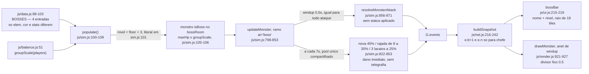
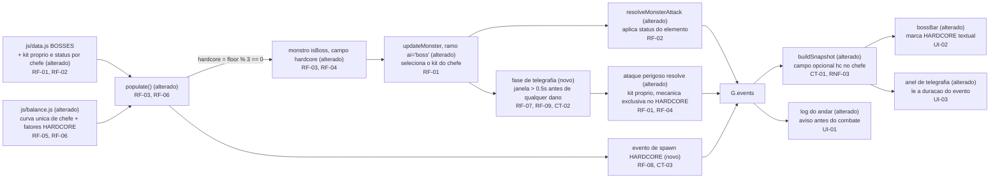

# SPEC: chefes-hardcore

## Metadata
- Source: developer description via /plan
- Service: shadowfall (repositório único, front-end sem build)
- Tier: standard
- Version: 1.1
- Architecture references: `AGENTS.md`, `docs/agents/architecture.md`, `docs/agents/domain_rules.md` (apoio: `docs/agents/api_contracts.md`, `.spec/init/project-description.md`, `.spec/init/user-stories.md`, `.spec/init/database-schema.md`, `.spec/init/project-phases.md`)

### Regras de camada que esta SPEC obedece

| Regra | Fonte | Efeito nesta feature |
|---|---|---|
| Todo número de tuning vive em `js/balance.js`; nenhum literal numérico solto na lógica | `AGENTS.md:38`, `AGENTS.md:57` | RF-05 e RF-06: a curva de dificuldade do chefe e os fatores HARDCORE nascem exportados de `js/balance.js` |
| `js/sim.js` é estado puro, zero DOM | `AGENTS.md:37`, `AGENTS.md:56`, `docs/agents/architecture.md` (tabela de camadas) | RNF-02: telegrafia e HARDCORE são estado + evento em `sim.js`; o desenho fica em `render.js`/`ui.js` |
| Apresentação não muta estado de simulação; composição (`main.js`) não contém regra de jogo | `docs/agents/architecture.md` (tabela de camadas) | UI-01/UI-02/UI-03 consomem snapshot e eventos; não decidem se o chefe é HARDCORE |
| `groupScale` é aplicada em três pontos e a fórmula não é repetida em outro arquivo | `docs/agents/domain_rules.md` (Escala por tamanho de grupo), `js/balance.js:49-54` | RF-06: o fator HARDCORE compõe com `groupScale`, sem duplicar a curva |
| Chefe = `BOSSES[(floor - 1) % 4]` no `bossRoom`, nível `floor + 3` | `docs/agents/domain_rules.md` (Chefe por andar), `js/sim.js:100-104` | RF-03 preserva a identidade do chefe por andar e só acrescenta a variante HARDCORE |
| Campo opcional só entra no pacote quando tem valor; eventos com `boss` são críticos e escapam do teto de 120 | `docs/agents/api_contracts.md` (formato do snapshot e controle de descarte), `js/net.js:227-233`, `js/net.js:327-331` | CT-01, CT-02 e CT-03 |
| Idioma: pt-BR em comentário, log e UI; identificadores em inglês | `AGENTS.md:45`, `AGENTS.md:51` | Rótulos e mensagens desta feature em pt-BR |

## Context

Hoje os 4 chefes de `js/data.js:98-103` são diferentes apenas em elemento, cor e stats base. Mecanicamente são o mesmo inimigo: `updateMonster` trata `ai === 'boss'` num ramo único (`js/sim.js:798-853`), com alcance 7.5, cooldown 1.5 s, `windup` 0.5 s idêntico a qualquer outro ataque (`js/sim.js:816`) e um pool especial compartilhado disparado a cada 7 s — nova em raio 4,5 a 45%, rajada de 8 projéteis a 30% e invocação de 3 lacaios a 25% (`js/sim.js:822-853`). Nenhum chefe aplica status, embora `burn`, `poison`, `slow`, `stun` e `freeze` existam em `emptyStatus()` (`js/sim.js:153-154`) e monstros comuns os usem (`js/sim.js:869`, `js/data.js:82`).

A dificuldade do chefe por andar está espalhada em literais dentro de `js/sim.js`: nível `floor + 3` (`js/sim.js:101`) e escala de HP `1 + (level - 1) * 0.22` dentro de `makeMonster` (`js/sim.js:113`) — os dois violam a regra de `AGENTS.md:38`. A escala por grupo, essa sim, já vem de `js/balance.js:51` e é aplicada ao chefe em `js/sim.js:105-106`, coberta por `tests/group.test.mjs:250-254`.

O objetivo é duplo: dar identidade mecânica a cada chefe (kit próprio + status coerente com o elemento + telegrafia legível) e criar a variante HARDCORE em todo andar múltiplo de 3, com degrau claro sobre o chefe comum.

**Tensão de projeto (fato verificado, não ambiguidade):** os chefes giram em ciclo de 4 andares (`BOSSES[(floor - 1) % 4]`, `js/sim.js:100`) e o HARDCORE cai em ciclo de 3 (`floor % 3 === 0`). O par chefe×HARDCORE só se repete a cada `lcm(3, 4) = 12` andares, ou seja: andar 3 Rainha Glacial, 6 Senhor do Fosso, 9 Arauto de Cinzas, 12 Ossuário Ancião — cada chefe recebe exatamente uma aparição HARDCORE dentro de cada bloco de 12 andares, e nenhum chefe monopoliza a variante. O balanceamento do degrau precisa valer para os 4 chefes, não para um caso favorito.

Contexto herdado da cadeia de init que esta SPEC preserva: cada andar tem exatamente um chefe e a morte dele abre o portal (`.spec/init/user-stories.md:375-383`, US-5.1); HP do chefe escala com o grupo (`.spec/init/user-stories.md:413`, US-5.3); chefe e monstros não são persistidos — são conteúdo estático em `js/data.js` e instâncias em memória (`.spec/init/database-schema.md:388`). Nenhum artefato da cadeia de init conflita com os critérios confirmados.

## AS IS — Estado atual

Hoje o chefe do andar nasce de uma tabela de 4 entradas e cai num único ramo de IA: o mesmo `windup` de 0,5 s para qualquer golpe e o mesmo sorteio de especial a cada 7 s para os quatro. O HUD só distingue o chefe pelo nome e pela barra, e o anel de carga do `render.js` assume que toda telegrafia dura exatamente 0,5 s.

## TO BE — Estado proposto

`js/balance.js` passa a ser a única fonte da dificuldade do chefe por andar e dos fatores HARDCORE (RF-05, RF-06), e `populate()` marca a variante por `floor % 3 === 0` (RF-03, RF-04) emitindo o evento de spawn que uma futura camada de áudio vai assinar (RF-08, CT-03). O ramo `ai === 'boss'` deixa de sortear um pool único: cada chefe usa o kit declarado em `js/data.js` (RF-01) e aplica o status do próprio elemento no acerto (RF-02), com uma fase de telegrafia nova que precede qualquer dano (RF-07, RF-09, CT-02). Na apresentação, o campo opcional `hc` do snapshot (CT-01, RNF-03) alimenta a marca textual na barra do chefe (UI-02), o aviso de andar no log (UI-01) e o anel de carga que passa a ler a duração real da janela (UI-03).

## Scope
- **In**: kit de ataques por chefe; status por elemento do chefe, incluindo o status novo `wither` para `E.DEATH` (RF-10); variante HARDCORE em `floor % 3 === 0`; curva única de dificuldade de chefe por andar exportada de `js/balance.js`; composição com `groupScale`; calibração dos fatores HARDCORE pela razão de duração de luta (RF-11) e o ajuste da janela de tempo de `tests/party10.test.mjs:66-74` que essa calibração exigir; telegrafia do ataque perigoso; sinalização do HARDCORE no snapshot, no log e no HUD; evento de simulação de spawn HARDCORE.
- **Out**: transmissão de status de jogador no snapshot — hoje a entrada do jogador só carrega `b: p.buffs.length ? 1 : 0` (`js/net.js:202`) e nenhum status de jogador trafega na rede; tornar `wither` visível ao convidado como ícone no próprio HUD seria trabalho novo de rede sobre uma **lacuna preexistente, não criada por esta feature**, e fica explicitamente fora do escopo desta SPEC. O feedback de `wither` permanece como hoje é para os demais status: número de dano e FX; áudio e música do chefe HARDCORE (decisão do desenvolvedor; o projeto não tem subsistema de áudio — verificado: nenhuma ocorrência de `Audio`, `sound` ou `música` em `js/`; será um `/plan` separado. Esta SPEC só entrega o evento de simulação CT-03 ao qual essa camada futura vai se inscrever); novos chefes além dos 4 existentes; mudança na regra do portal (`docs/agents/domain_rules.md`, Portal coletivo); mudança no schema de save (chefe não é persistido, `.spec/init/database-schema.md:388`); rebalanceamento de monstros comuns; mudança no cálculo de loot ou XP do chefe (`js/sim.js:687-693`).

## RIGID (Non-Negotiable)

### Functional Requirements

- **RF-01 [Ubiquitous]**: O sistema deve manter, para cada um dos 4 chefes de `js/data.js:98-103`, um conjunto próprio de ataques especiais declarado na tabela de conteúdo, sem nenhum ataque especial compartilhado entre dois chefes.
  - AC: para todo par de chefes (A, B) com A ≠ B, a interseção dos identificadores de ataque especial é vazia; cada chefe declara no mínimo 3 ataques especiais próprios (o pool único de hoje tem exatamente 3 opções — `js/sim.js:822-853` —, logo um kit próprio menor que 3 regrediria a variedade atual); um teste em `tests/sim.test.mjs` percorre `BOSSES` e falha se qualquer identificador aparecer em dois chefes.

- **RF-02 [Event-Driven]**: Quando um ataque de chefe causa dano a um jogador, o sistema deve aplicar ao jogador o efeito de status mapeado ao elemento (`elem`) daquele chefe, a partir de um mapa único exportado.
  - AC: após o acerto, o campo de status correspondente ao elemento do chefe fica estritamente maior que 0 em `p.status`; mapeamento verificável elemento a elemento: `E.FIRE` → `burn`, `E.ICE` → `freeze`, `E.DEATH` → `wither` (status novo, RF-10); nenhum chefe aplica status de elemento diferente do próprio; teste assere status > 0 para cada um dos 4 chefes.

- **RF-10 [State-Driven]**: Enquanto `wither` estiver ativo em um jogador, o sistema deve aplicar dano ao longo do tempo **e** reduzir a cura recebida por esse jogador; `wither` é um campo novo de `emptyStatus()` (`js/sim.js:153-154`) e não reusa `poison`.
  - AC: com `wither > 0`, o HP do jogador decresce a cada tick sem nova fonte de dano, no mesmo padrão de tick já usado por `burn`/`poison`; uma cura de valor `H` aplicada com `wither > 0` restaura estritamente menos que `H`, e a mesma cura com `wither === 0` restaura `H` (comparação direta entre os dois casos no mesmo teste); `wither` zera ao expirar e a cura volta a `H`; o fator de redução de cura e o DPS do status são exportados de `js/balance.js` (`AGENTS.md:38`); `poison` permanece exclusivo de `E.EARTH` (aranha, `js/data.js:82`) e nenhum chefe `E.DEATH` aplica `poison`.
  - Justificativa da escolha (decisão do desenvolvedor): a redução de cura recebida é a metade da mecânica que nenhum status atual possui e é o que dá identidade ao elemento Morte; reusar `poison` tornaria Morte e Terra indistinguíveis em jogo.
  - **Correção técnica registrada:** acrescentar `wither` **não quebra o contrato de rede**. O array fixo de 4 posições em `js/net.js:238-239` e `js/net.js:291-293` é o status **do monstro** (`m.status`), usado para desenhar ícone sobre o bicho. RF-02 e RF-10 tratam de status aplicado **ao jogador**, e status de jogador não trafega no snapshot hoje: a entrada do jogador carrega apenas `b: p.buffs.length ? 1 : 0` (`js/net.js:202`). Verificado no código.

- **RF-03 [Event-Driven]**: Quando um andar cujo número é múltiplo de 3 é gerado (`floor % 3 === 0`), o sistema deve marcar o chefe daquele andar como HARDCORE no estado da simulação, mantendo inalterada a identidade do chefe (`BOSSES[(floor - 1) % BOSSES.length]`, `js/sim.js:100`).
  - AC: nos andares 3, 6, 9, 12 a flag de HARDCORE é verdadeira e o `typeId` do chefe permanece, respectivamente, `glacier`, `morgaroth`, `ferumbras`, `bonelord`; nos andares 1, 2, 4, 5, 7, 8, 10, 11 a flag é falsa; a marcação existe no estado antes do primeiro `step()` do andar.

- **RF-04 [State-Driven]**: Enquanto o chefe do andar for HARDCORE, o sistema deve garantir HP máximo estritamente maior, dano estritamente maior e no mínimo uma mecânica que o mesmo chefe não possui na variante comum.
  - AC: para o mesmo `floor` e o mesmo `groupSize`, `maxHp(HARDCORE) > maxHp(comum)` e `atk(HARDCORE) > atk(comum)`; a lista de mecânicas do chefe HARDCORE contém no mínimo 1 identificador ausente da lista da variante comum do mesmo chefe; os multiplicadores são exportados de `js/balance.js` e ambos são estritamente maiores que 1.

- **RF-11 [Ubiquitous]**: O requisito vinculante do degrau HARDCORE é a **razão de duração de luta**, não um multiplicador fixo: com o mesmo tamanho de grupo e o mesmo nível, derrubar o chefe HARDCORE deve levar aproximadamente o dobro do tempo do chefe comum do mesmo andar.
  - AC: em simulação headless determinística (mesma seed de `G.rng`, mesmo `groupSize`, mesmo nível de jogador, mesmo `floor`), mede-se `t_hc` = tempo até `hp <= 0` do chefe HARDCORE e `t_comum` = o mesmo para a variante comum do mesmo chefe; a razão `t_hc / t_comum` fica dentro da banda **1,8 ≤ razão ≤ 2,4**; a medição vale para os 4 chefes (a par chefe×HARDCORE só se repete a cada 12 andares — ver Tensão de projeto); a asserção é por medição em teste, nunca por impressão de jogo.
  - `HARDCORE_HP_MULT` e `HARDCORE_ATK_MULT` continuam existindo e continuam exportados de `js/balance.js` (RF-04), mas passam a ser **valores derivados dessa medição**, não números escolhidos a priori. Esta SPEC deliberadamente não crava os números: quem implementa calibra até a razão cair na banda.
  - Consequência operacional dentro do escopo desta feature: `tests/party10.test.mjs:66-74` hoje concede uma janela de 300 s para o cenário de 10 jogadores chegar ao portal. Dobrar o tempo de queda do chefe pode estourar essa janela nos andares múltiplos de 3, então a janela do teste provavelmente precisa aumentar; o ajuste dessa janela é parte desta feature, e o teto de tick de RNF-01 permanece inalterado.

- **RF-05 [Ubiquitous]**: O sistema deve derivar a dificuldade do chefe por andar (nível e stats base escalados) de uma única função exportada de `js/balance.js`, consumida por `js/sim.js` e pelos testes.
  - AC: `js/sim.js` não contém nenhum literal numérico no cálculo de nível, HP ou dano do chefe — os literais atuais `floor + 3` (`js/sim.js:101`) e `1 + (level - 1) * 0.22` (`js/sim.js:113`, no caminho do chefe) deixam de existir ali; a função importada é monotônica não decrescente para `floor` de 1 a 30; um teste importa a função direto de `js/balance.js` e assere a monotonicidade e o valor em ao menos 3 andares.

- **RF-06 [State-Driven]**: Enquanto houver mais de um jogador vivo, o sistema deve manter o escalonamento por tamanho de grupo do chefe (`groupScale`, `js/balance.js:51`) compondo multiplicativamente com a curva de andar (RF-05) e com o fator HARDCORE (RF-04), sem duplicar a fórmula de `groupScale` em outro arquivo.
  - AC: `maxHp` do chefe é o produto de curva de andar × `groupScale(groupSize)` × fator HARDCORE, e o resultado independe da ordem dos fatores até o arredondamento final; `tests/group.test.mjs:250-254` continua verde sem alteração; para o mesmo andar, `maxHp` com 10 jogadores é maior que com 1, tanto na variante comum quanto na HARDCORE; nenhuma ocorrência nova de `Math.sqrt` ou do teto 2.6 fora de `js/balance.js`.

- **RF-07 [Event-Driven]**: Quando um chefe inicia um ataque perigoso, o sistema deve executar uma fase de telegrafia com duração estritamente maior que 0,5 s (o `windup` genérico atual, `js/sim.js:816`) e emitir o evento de telegrafia (CT-02) no início dessa fase, antes de qualquer aplicação de dano.
  - AC: entre o início da telegrafia e o fim da janela, o HP de todo jogador permanece inalterado por aquele ataque e nenhum projétil daquele ataque existe em `G.projectiles`; a duração é lida de constante exportada de `js/balance.js` e é > 0,5 s; o evento CT-02 é emitido exatamente uma vez por ataque perigoso, no primeiro tick da fase; um teste avança ticks e assere HP intocado durante a janela e dano após ela.

- **RF-08 [Event-Driven]**: Quando um chefe HARDCORE nasce no andar, o sistema deve emitir uma única vez o evento de spawn HARDCORE (CT-03), marcado como crítico.
  - AC: exatamente 1 evento de spawn HARDCORE por andar múltiplo de 3 e 0 nos demais andares; o evento carrega `boss` verdadeiro, portanto `isCriticalEvent()` retorna `true` para ele (`js/net.js:329-331`) e ele sobrevive ao teto de 120 de `drainEvents` mesmo com a fila cheia; teste com fila saturada assere a presença do evento na saída.

- **RF-09 [Unwanted]**: Se o chefe morrer, for atordoado (`status.stun > 0`) ou congelado (`status.freeze > 0`) durante a fase de telegrafia, o sistema não deve resolver o ataque telegrafado.
  - AC: com o chefe levado a `hp <= 0` no meio da janela, nenhum jogador perde HP por aquele ataque e nenhum projétil dele é criado; a fase de telegrafia é cancelada no mesmo tick, coerente com o portão já existente de `stun`/`freeze` em `js/sim.js:759`.

### UI Requirements

- **UI-01 [Event-Driven]**: Quando o grupo entra em um andar HARDCORE, a interface deve exibir aviso no log para todos os jogadores — host e convidados — antes de qualquer contato com o chefe.
  - AC: ao gerar andar múltiplo de 3, existe no log uma linha em pt-BR contendo o termo `HARDCORE`, emitida como evento crítico (`t: 'log'`, `js/net.js:327`) no mesmo lote da virada de andar e antes do primeiro evento de dano do chefe; em andares não múltiplos de 3 essa linha não aparece.

- **UI-02 [State-Driven]**: Enquanto a barra do chefe estiver visível (`js/ui.js:215-219`) e o chefe for HARDCORE, a interface deve marcar a variante por texto, não apenas por cor.
  - AC: `#bossName` (`index.html:148`) contém o termo `HARDCORE` além do nome e do nível; a distinção permanece legível em escala de cinza (nenhum requisito é atendido só por mudança de cor); com chefe comum o termo está ausente.

- **UI-03 [Event-Driven]**: Quando uma telegrafia estiver ativa, o anel de carga desenhado sobre o chefe deve completar exatamente ao fim da janela, para qualquer duração.
  - AC: o progresso do anel é calculado como `1 - restante / duracaoTotal`, com a duração vinda do evento ou do snapshot; o divisor fixo `0.5` de `js/render.js:925` deixa de existir; com janela de duração D, o anel está em 0 no primeiro tick e em 1 no último, com erro ≤ 0,02.

### Contracts

- **CT-01**: Snapshot — entrada de monstro em `M[]` ganha o campo opcional `hc` (`1` quando o chefe é HARDCORE, ausente caso contrário), seguindo a regra de campo opcional já usada por `b`, `n`, `f`, `w`, `df` e `s` (`js/net.js:227-240`; chave `hc` verificada como livre — nenhuma ocorrência em `js/`). `applySnapshot` mapeia para `m.hardcore = !!sm.hc` (`js/net.js:285-293`).
- **CT-02**: Evento de telegrafia — `{ t: 'fx', k: 'telegraph', id, x, y, r, d, c, boss: 1 }`, onde `d` é a duração total da janela em segundos e `r` a área ameaçada em tiles; `boss: 1` o torna crítico em `isCriticalEvent()` (`js/net.js:329-331`). Chave `k: 'telegraph'` verificada como nova — nenhuma ocorrência em `js/` ou `tests/`.
- **CT-03**: Evento de spawn de chefe HARDCORE — `{ t: 'bossSpawn', id, typeId, floor, hardcore: 1, boss: 1 }`, emitido por `populate()` no nascimento do chefe. É o ponto de assinatura para a futura camada de áudio (fora de escopo aqui). Nome `bossSpawn` verificado como novo — nenhuma ocorrência em `js/`, `tests/` ou `index.html`.

### Non-Functional Requirements

- **RNF-01**: Com 10 jogadores e população máxima do andar, o custo médio do tick deve permanecer < 4 ms, inclusive em andar HARDCORE — mesmo teto já assertado em `tests/party10.test.mjs:143` e `tests/net.test.mjs:183-184`.
- **RNF-02**: `js/sim.js` deve permanecer livre de DOM: nenhuma referência a `document`, `window` ou `canvas` no código novo; `node tests/sim.test.mjs` roda em Node puro e verde (`AGENTS.md:37`, `AGENTS.md:56`).
- **RNF-03**: O acréscimo desta feature ao snapshot deve ser ≤ 8 bytes por chefe HARDCORE por pacote (`,"hc":1`) e exatamente 0 byte em andar não HARDCORE, preservando a regra de campo opcional (`js/net.js:227-233`); medição pela contagem já existente em `tests/net.test.mjs:187-190`.
- **RNF-04**: Cada RF e UI desta SPEC deve ter no mínimo 1 asserção `check(label, cond, extra)` em `tests/sim.test.mjs` ou `tests/group.test.mjs`, no padrão verbatim das suítes existentes (`AGENTS.md:43`), com label em pt-BR.

## FLEXIBLE (Implementation Suggestions)

- Declarar o kit em `js/data.js` como campo por chefe (por exemplo `specials: [{ id, kind, telegraph, ... }]`) e deixar `updateMonster` apenas selecionar do kit, mantendo `sim.js` sem tabela de conteúdo embutida.
- Nomear a curva de RF-05 algo como `bossCurve(floor)` e os fatores de RF-04 como `HARDCORE_HP_MULT` / `HARDCORE_ATK_MULT`, todos em `js/balance.js`, na seção de progressão.
- Modelar a telegrafia como uma fase explícita no estado do monstro (campos como `telegraph` e `telegraphKind`), reaproveitando o padrão do `windup` já existente em `js/sim.js:802-806` em vez de criar uma máquina paralela.
- Trocar `Math.random()` por `G.rng` na escolha do especial e na invocação (`js/sim.js:824`, `js/sim.js:843`): o host é autoritativo, então não é bug de correção, mas hoje impede um teste determinístico do kit por chefe.
- Mapear elemento → status numa tabela exportada (por exemplo `ELEM_STATUS`) em vez de `if` encadeado dentro de `resolveMonsterAttack`.
- Reforçar o marcador de chefe no minimapa (`js/render.js:1146-1147`) para a variante HARDCORE, com forma ou tamanho distinto além da cor.
- A mecânica exclusiva do HARDCORE (RF-04) pode reaproveitar primitivas já existentes — zona persistente (`js/sim.js:1004-1005`), invocação (`js/sim.js:840-851`) ou nova em raio — sem exigir sistema novo.

## Acceptance Criteria Summary

| ID | Criterion | Testable? |
|----|-----------|-----------|
| RF-01 | Interseção de identificadores de ataque especial vazia entre todo par de chefes; ≥ 3 especiais próprios por chefe | Sim — `tests/sim.test.mjs`, varredura de `BOSSES` |
| RF-02 | Status do elemento do chefe > 0 no jogador após o acerto, para os 4 chefes (`E.DEATH` → `wither`) | Sim — `tests/sim.test.mjs`, um caso por chefe |
| RF-10 | `wither` causa dano por tick e reduz a cura recebida; cura com `wither` < cura sem `wither` | Sim — comparação direta no mesmo teste |
| RF-03 | Flag HARDCORE verdadeira em 3/6/9/12 e falsa em 1/2/4/5/7/8/10/11, com `typeId` preservado | Sim — determinístico por `floor` |
| RF-04 | `maxHp` e `atk` estritamente maiores no HARDCORE, mesma `floor` e `groupSize`; ≥ 1 mecânica exclusiva | Sim — comparação binária determinística |
| RF-11 | Razão `t_hc / t_comum` entre 1,8 e 2,4 em simulação headless, para os 4 chefes; multiplicadores derivados dessa medição | Sim — medição headless com seed fixa |
| RF-05 | Zero literal numérico de dificuldade de chefe em `js/sim.js`; curva monotônica em `floor` 1..30 | Sim — importa a função de `js/balance.js` |
| RF-06 | `maxHp` = curva × `groupScale` × fator HARDCORE; `tests/group.test.mjs:250-254` segue verde | Sim |
| RF-07 | HP intocado e sem projétil durante a janela; janela > 0,5 s; 1 evento CT-02 por ataque | Sim — avanço de ticks |
| RF-08 | 1 evento de spawn por andar HARDCORE, 0 nos demais; sobrevive a `drainEvents` com fila saturada | Sim |
| RF-09 | Chefe morto, atordoado ou congelado na janela não resolve o ataque | Sim |
| UI-01 | Linha de log com `HARDCORE` antes do primeiro dano do chefe, em andar múltiplo de 3 | Sim — inspeção da fila de eventos |
| UI-02 | `#bossName` contém `HARDCORE`; distinção não depende só de cor | Sim — `tests/browser.mjs` |
| UI-03 | Progresso do anel = `1 - restante / duracaoTotal`, erro ≤ 0,02; divisor fixo 0.5 removido | Sim |
| RNF-01 | Tick médio < 4 ms com 10 jogadores e população máxima em andar HARDCORE | Sim — `tests/party10.test.mjs`, `tests/net.test.mjs` |
| RNF-02 | Nenhum DOM em `js/sim.js`; `node tests/sim.test.mjs` verde | Sim |
| RNF-03 | ≤ 8 bytes por chefe HARDCORE no pacote; 0 byte fora de andar HARDCORE | Sim — `tests/net.test.mjs:187-190` |
| RNF-04 | ≥ 1 asserção `check()` por RF e por UI, em pt-BR | Sim — contagem nas suítes |

## Open Questions

Nenhuma pendente. As duas ambiguidades foram resolvidas pelo desenvolvedor na versão 1.1.

| ID | Bloqueava | Resolução |
|----|-----------|-----------|
| M-01 | RF-02 | **Resolvido:** status novo `wither` para `E.DEATH` (dano por tempo + redução da cura recebida), formalizado em RF-10. `poison` não é reusado — permanece assinatura de `E.EARTH`. A premissa de quebra de contrato de rede registrada no marcador original estava **errada** e foi corrigida: o array de 4 posições de `js/net.js:238-239`/`js/net.js:291-293` é status de monstro; status de jogador não trafega no snapshot. Visibilidade de `wither` no HUD do convidado ficou fora de escopo (ver Scope/Out). |
| M-02 | RF-04 | **Resolvido:** o degrau deixa de ser multiplicador arbitrário e passa a ser razão de duração de luta ≈ 2x (banda 1,8–2,4), formalizada em RF-11. `HARDCORE_HP_MULT` e `HARDCORE_ATK_MULT` seguem exportados de `js/balance.js`, agora derivados da medição. Ajustar a janela de 300 s de `tests/party10.test.mjs:66-74` entra no escopo. |
