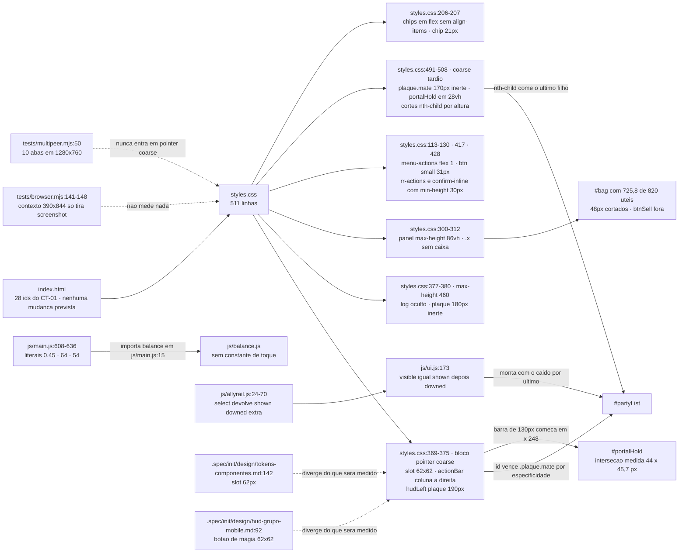
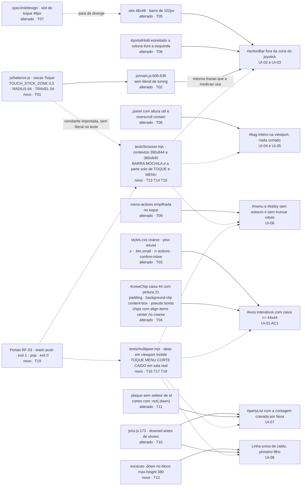

# Implementation Plan

## Request Summary

- **Objective**: fechar os três defeitos geométricos medidos no HUD de toque (alvos abaixo de
  44x44, `#actionBar` invadindo `#portalHold` e a zona do joystick, `#bag` cortado), as duas
  divergências do trilho de aliados (especificidade de id e caído sumindo abaixo de 380px), o
  estouro do `#lobby` em 360x640, e instalar a medição automática disso em dois harnesses de
  navegador — casos de solo em `tests/browser.mjs`, casos de sala em `tests/multipeer.mjs`.
- **Scope**:
  - **in**: `styles.css` (blocos `pointer: coarse` e cortes por altura), `js/balance.js`
    (constantes da zona de toque), `js/main.js:608-636` (passa a ler as constantes), **exatamente
    uma linha** de `js/ui.js` (`:173`), `tests/browser.mjs`, `tests/multipeer.mjs`, e a atualização
    do slot de toque de 62px para 48px em `.spec/init/design/tokens-componentes.md:142` e
    `.spec/init/design/hud-grupo-mobile.md:92`.
  - **out**: `js/sim.js`, `js/net.js`, `js/save.js`, `js/render.js`, `index.html`, protocolo P2P,
    qualquer outra linha de `js/ui.js`, remontagem do trilho compacto de §2, regras de
    landscape/portrait de §5, bloqueio de orientação, rótulo do `#btnSell`.
- **Tier**: standard
- **Architecture references**: `AGENTS.md`, `docs/agents/architecture.md`,
  `docs/agents/domain_rules.md`

### Regras de arquitetura que governam cada task

| Regra | Fonte | Como aparece nas tasks |
|---|---|---|
| `js/sim.js` é estado puro, zero DOM | `AGENTS.md:37`, `AGENTS.md:56`, `docs/agents/architecture.md` "Layer responsibilities" | Nenhuma task toca `js/sim.js`; T19 reconfere `grep -cE "document\|window\|navigator" js/sim.js` = 0 |
| Todo número de tuning vive em `js/balance.js` | `AGENTS.md:38`, `AGENTS.md:57` | T01 cria as constantes, T02 remove os literais de `js/main.js`; T14 importa a mesma constante em vez de repetir `0.5` |
| Apresentação não muta estado do simulador nem envia pacote | `docs/agents/architecture.md`, tabela de camadas | T10 é a única mudança em `js/ui.js` e é reordenação de leitura; nenhuma task cria mensagem de rede |
| Composição delega regra de jogo a `sim.js` e política de sala a `room.js` | `docs/agents/architecture.md` | T02 mexe só em input de toque em `js/main.js`; RF-02c proíbe costura de teste nesse arquivo |
| Testes sem framework, `process.exit(failures ? 1 : 0)` | `AGENTS.md:32`, `AGENTS.md:43` | T13-T18 mantêm `errors[]` (`tests/browser.mjs:160-161`) e `check()`/`failures` (`tests/multipeer.mjs:26-30`, `:332`) |
| pt-BR em comentário, log, texto de UI e label de teste; identificador em inglês | `AGENTS.md:45`, `AGENTS.md:51` | Todas as tasks; os seis prefixos de CT-02 são pt-BR |
| Sem dependência de runtime, sem passo de build | `AGENTS.md:60-61` | Nenhuma task adiciona pacote; T19 confere `package.json` e `vercel.json` |
| Trilho limitado por `HUD_ALLY_LIMIT` | `docs/agents/domain_rules.md`, `js/balance.js:204` | T11 corta por CSS; `js/allyrail.js` fica intocado (ver A-05) |

## AS IS — Componentes impactados

Todos os nós acima foram lidos no repositório: `styles.css` (511 linhas, blocos `pointer: coarse`
em `:369` e `:491`), `js/main.js:608-636`, `js/balance.js` (sem seção de toque), `js/ui.js:173`,
`js/allyrail.js:13,24-70`, `tests/browser.mjs:141-148`, `tests/multipeer.mjs:50`. As três arestas
que carregam defeito são a especificidade de `styles.css:374` sobre `#partyList`, a barra de 130px
cruzando o `#portalHold`, e o teto de 86vh do `.panel` cortando o `#bag`.

## TO BE — Componentes propostos

Rastreio de cada nó novo ou alterado até a task que o produz: `NEW_BAL` é T01 e `MAIN` é T02
(RF-01, RNF-03); `CSS_T` é T03 e `CSS_CHIP` é T04 (UI-01 AC1 e AC3); `CSS_SLOT` é T05 (UI-01 AC2,
UI-02) e `CSS_PH` é T06 (UI-03 AC1); `DOCS` é T07 (consequência aceita de UI-01, escopo In);
`CSS_PANEL` é T08 (UI-04, UI-05); `CSS_MENU` é T09 (UI-06); `UIJ` é T10, `CSS_RAIL` é T11 e
`CSS_DOWN` é T12 (UI-07 e UI-08); `BR` é T13-T15 e `MP` é T16-T18 (RF-02, CT-01, CT-02, RNF-04);
`GATE` é T19 (RF-03, RNF-01, RNF-02, RNF-05). `js/render.js`, `index.html`, `js/sim.js` e
`js/allyrail.js` aparecem no AS IS e não no TO BE porque nenhuma task os altera (A-01, A-02, A-05).

## Tasks

### T01 — Constantes da zona de toque em `js/balance.js`
- **Files**: `js/balance.js`
- **Change**: acrescentar uma seção `// ---------- Toque ----------` no mesmo padrão de
  `js/balance.js:198-204` (constante em inglês, comentário pt-BR na mesma linha), com três
  exportações: `TOUCH_STICK_ZONE = 0.5` (fração da largura que pertence ao joystick — "metade
  esquerda inteira", `.spec/init/design/hud-grupo-mobile.md:35`), `TOUCH_STICK_RADIUS = 64`
  (metade do `#stick` de 128px) e `TOUCH_STICK_TRAVEL = 54` (curso máximo do polegar). Só a
  fração muda de valor (`0.45` → `0.5`); `64` e `54` são migrados com o mesmo valor.
- **Covers**: RF-01 (AC 3, AC 4), RNF-03, RNF-06
- **Tests**: `node -e "import('./js/balance.js').then(b => process.exit(b.TOUCH_STICK_ZONE === 0.5 ? 0 : 1))"`
  sai 0; `npm test` continua verde (10 suítes)
- **Risk**: Low — arquivo só de constantes; nenhum importador é afetado antes de T02
- **Dependencies**: none

### T02 — `js/main.js` lê as constantes e perde os literais
- **Files**: `js/main.js`
- **Change**: acrescentar `TOUCH_STICK_ZONE`, `TOUCH_STICK_RADIUS` e `TOUCH_STICK_TRAVEL` à lista
  de import de `./balance.js` (`js/main.js:15`); em `js/main.js:608` escrever exatamente
  `e.clientX < innerWidth * TOUCH_STICK_ZONE` (a AC 2 de RF-01 casa esse formato por grep); trocar
  os dois `- 64` de `:614-615` por `- TOUCH_STICK_RADIUS` e `const max = 54` de `:636` por
  `const max = TOUCH_STICK_TRAVEL`. Nenhuma outra linha do arquivo muda — RF-02c exige que
  `git diff --stat js/main.js` não mostre instrumentação de teste.
- **Covers**: RF-01 (AC 1, AC 2), RF-02c, RNF-03
- **Tests**: `grep -nE "innerWidth \* 0\.45|- 64\)|max = 54" js/main.js` retorna zero linhas;
  `grep -cE "e\.clientX < innerWidth \* [A-Z][A-Z0-9_]*" js/main.js` retorna 1;
  `grep -cE "0\.45|innerWidth \* 0\.[0-9]" js/main.js js/ui.js` retorna zero linhas; `npm test`
  verde; `npm run test:browser` sem `PAGEERROR`
- **Risk**: Medium — a zona do joystick cresce de 45% para 50% da largura, então um toque entre
  45% e 50% que antes virava ordem de movimento agora abre o joystick. É a mudança de
  comportamento decidida em Q-03 e a única desta feature
- **Dependencies**: T01

### T03 — Piso de 44x44 nos alvos de `pointer: coarse`
- **Files**: `styles.css`
- **Change**: dentro do bloco `@media (pointer: coarse)` de `styles.css:491`, dar caixa mínima de
  44px a `.x` (hoje sem caixa própria, `styles.css:312`, medida 15,1 x 23) — `min-inline-size` e
  `min-block-size` de 44px mais `display: inline-flex; align-items: center; justify-content: center`
  para o `✕` continuar centrado — e altura mínima de 44px a `.btn.small` (`styles.css:130`, medida
  31px). **Atenção de cascata**: `.roster-row .rr-actions .btn` (`styles.css:417`) e
  `.confirm-inline .btn` (`styles.css:428`) fixam `min-height: 30px` com especificidade 0,3,0; um
  `.btn.small { min-height: 44px }` sozinho (0,2,0) perde e os dez `Expulsar` continuam em 31px.
  A regra nova precisa repetir esses dois seletores. `padding` e `font-size` de desktop ficam como
  estão (a regra vive só no bloco de toque).
- **Covers**: UI-01 AC 1
- **Tests**: `npm run test:browser` (prefixo `TOQUE` sobre `#bag` e `#menu`, via T14/T15);
  `npm run test:multipeer` (prefixo `TOQUE` sobre `#roster`, os botões `Expulsar` e a confirmação
  inline, via T17)
- **Risk**: Medium — a `.x` maior engorda `.panel-head` (`styles.css:305-308`) e portanto a altura
  do conteúdo do `#bag` medida por UI-04; T08 depende disso
- **Dependencies**: none

### T04 — `#crewChip` com caixa de 44px e pintura de 21px
- **Files**: `styles.css`
- **Change**: no bloco `@media (pointer: coarse)`, dar ao `#crewChip` `padding-block` suficiente
  para a caixa chegar a 44px, `background-clip: content-box` (exigido literalmente pela AC 3) e
  `border-color: transparent`; devolver a borda visível de 1px por `#crewChip::before` — um
  pseudo-elemento sobrevive ao `textContent` que `UI.setCapacity` (`js/ui.js:411`) reescreve, ao
  contrário de um `span` — posicionado sobre a caixa de conteúdo (`position: relative` no chip,
  `inset` igual ao padding vertical), com `#crewChip.near::before { border-color: #6b3a18 }` para
  o estado `near` de `styles.css:410` não sumir. **Achado de cascata que a AC 3 depende**:
  `.chips` (`styles.css:206`) é flex sem `align-items`, e o padrão `stretch` faria `#floorChip`,
  `#goldChip`, `#roomChip`, `#crewLock` e `#pingChip` da mesma linha subirem para 44px junto,
  reprovando a própria AC (`rect.height <= 24`); por isso o bloco de toque também recebe
  `.chips { align-items: center }` — desktop intocado. Ver OQ-02.
- **Covers**: UI-01 AC 3
- **Tests**: `npm run test:multipeer` (prefixo `TOQUE`; o `#crewChip` só perde a classe `hidden`
  dentro de sala, então não é alcançável em solo)
- **Risk**: Medium — combinação de três propriedades para não inchar o `#hudRight`; se o
  pseudo-elemento não for aceito, a alternativa é aceitar a borda de 44px, que descaracteriza o chip
- **Dependencies**: none

### T05 — `.slot` de 48x48 e `#actionBar` de 102px
- **Files**: `styles.css`
- **Change**: trocar `.slot { width: 62px; height: 62px }` (`styles.css:371`) por 48x48 dentro do
  bloco `pointer: coarse`. A barra é derivada: `.slots` é grid de duas colunas
  (`styles.css:373`) com `gap: 6px` (`styles.css:257`), logo `2 × 48 + 6 = 102px`; com
  `right: 12px` (`styles.css:372`) ela começa em `x = 276` em 390 e `x = 246` em 360, contra a
  zona do joystick em 259 e 244 (T01/T02) — 17px e 2px de folga. **Não** fixar largura no
  `#actionBar`: o arranjo é FLEXIBLE, quem prende é UI-03. Conferir que `.slot .key`
  (`styles.css:265`) e `.slot .cost` (`styles.css:268`) continuam dentro do slot menor.
- **Covers**: UI-01 (slot de ação, AC 2), UI-02, UI-03 (parte da largura)
- **Tests**: `npm run test:browser` (prefixo `BARRA`: `.slot` 48±0,5 e interseção zero entre pares)
- **Risk**: Low — o grid já garante a não sobreposição de UI-02; a guarda é de regressão
- **Dependencies**: none

### T06 — `#portalHold` sem interseção com o `#actionBar` em nenhuma altura
- **Files**: `styles.css`
- **Change**: `#portalHold` no bloco coarse (`styles.css:497`) tem hoje
  `left: 12px; width: min(280px, 80vw)`, ou seja borda direita em 292px tanto em 390 quanto em
  360, contra a barra começando em 276 e 246 — sobreposição horizontal em **qualquer** altura, e é
  por isso que só encolher o slot não resolve. Estreitar a largura à coluna livre à esquerda da
  barra, `width: min(280px, calc(100vw - 126px))` (12 de gutter esquerdo + 102 da barra + 12 de
  gutter direito), zerando a interseção sem depender da altura. Manter `bottom: 28vh`, que nas sete
  alturas medidas não encosta no `#log` (50vw x 18vh, `styles.css:370`).
- **Covers**: UI-03 AC 1
- **Tests**: `npm run test:browser` (prefixo `BARRA`, nas alturas 700, 620, 600, 460, 440, 380 e
  360 com largura 390, mais 390x844 e 360x640)
- **Risk**: Medium — o contador fica mais estreito; conferir `.ph-count` e `.ph-missing`
  (`styles.css:443-451`) em 360 de largura, e que a AC continua valendo se o slot mudar
- **Dependencies**: T05 (o `126px` deriva da barra de 102px)

### T07 — Atualizar as specs de design para o slot de toque de 48px
- **Files**: `.spec/init/design/tokens-componentes.md`, `.spec/init/design/hud-grupo-mobile.md`
- **Change**: em `tokens-componentes.md:142`, trocar `slot 62px` por `slot 48px` na linha de
  `pointer: coarse`; em `hud-grupo-mobile.md:92`, trocar `62×62px` por `48×48px` na linha "Botão
  de magia", citando a derivação de UI-01 (104px úteis em 360 de largura com `F = 0,50`, piso 44,
  teto 49). Nenhuma outra seção dos dois arquivos é tocada — em especial §3 de
  `hud-grupo-mobile.md` fica como está (A-05, OQ-04).
- **Covers**: escopo In ("specs de design que esta feature atualiza"); consequência aceita de UI-01
- **Tests**: `grep -n '62' .spec/init/design/tokens-componentes.md .spec/init/design/hud-grupo-mobile.md`
  não retorna mais nenhuma linha sobre slot ou botão de magia (as ocorrências de `620px` continuam);
  `grep -n '48' nos dois arquivos mostra as duas linhas novas
- **Risk**: Low — documentação; sem efeito em runtime
- **Dependencies**: T05 (mesma decisão; entregar junto evita a terceira deriva)

### T08 — `.panel` com altura útil e rolagem contida
- **Files**: `styles.css`
- **Change**: trocar `max-height: 86vh` de `.panel` (`styles.css:300-303`) por
  `max-height: calc(100vh - 24px)` seguido de `max-height: calc(100dvh - 24px)` (o segundo é o
  que cobre a barra de URL retrátil; navegador sem `dvh` fica no primeiro), e acrescentar
  `overscroll-behavior: contain`. Como o painel é centrado por `translate(-50%, -50%)` a partir de
  `top: 50%`, a altura máxima de `innerHeight - 24` já entrega `top >= 12` e
  `bottom <= innerHeight - 12`; com `height` automática abaixo desse teto, o painel passa a ocupar
  `min(conteúdo, alturaÚtil)` e `scrollHeight <= clientHeight` quando o conteúdo cabe. A regra vale
  também para o `#roster`, que é `.panel` (`index.html:195`) — efeito desejado.
- **Covers**: UI-04 (AC 1, AC 2), UI-05
- **Tests**: `npm run test:browser` (prefixo `MOCHILA` em 390x844 e 360x640, com a mochila cheia)
- **Risk**: Medium — muda o painel também no desktop (de 86vh para `100vh - 24px`) e no `#roster`;
  o `npm run test:browser` de desktop e o caso `kick` de `npm run test:multipeer` passam pelo
  `#roster` e precisam continuar verdes
- **Dependencies**: T03 (a `.x` de 44px muda a altura do `.panel-head` e portanto do conteúdo)

### T09 — `.menu-actions` sem estouro e sem truncar rótulo
- **Files**: `styles.css`
- **Change**: no bloco `@media (pointer: coarse)`, empilhar as ações:
  `.menu-actions { flex-wrap: wrap }` e `.menu-actions .btn { flex: 1 1 100% }`. Em 360x640 o
  `#lobby` tem três botões (`index.html:76-78`) sob `.menu-actions .btn { flex: 1 }`
  (`styles.css:114`) e o `#btnStart` chega a `x = 363,4` contra 360 de viewport. **Não** usar
  `min-width: 0` isolado: com três colunas cada botão fica com ~69px de área de conteúdo e a
  palavra `MASMORRA` (14px, `letter-spacing: .08em`, `text-transform: uppercase`) não cabe, o que
  reprova a AC 2 de UI-06 por `scrollWidth > clientWidth`. Quebra de linha é permitida, corte não —
  nada de `text-overflow: ellipsis`.
- **Covers**: UI-06 (AC 1, AC 2)
- **Tests**: `npm run test:multipeer` (prefixo `MENU`, `#lobby` com 10 jogadores, `#lobbyLock` e
  `#btnLock` visíveis); `npm run test:browser` (prefixo `MENU`, `#menu`)
- **Risk**: Low — layout empilhado no toque; o rótulo declarado em `index.html:78`
  (`Descer para a masmorra`) precisa continuar idêntico
- **Dependencies**: none

### T10 — `js/ui.js:173` renderiza o caído primeiro
- **Files**: `js/ui.js`
- **Change**: **uma única linha**. `const visible = [...shown, ...downed];` (`js/ui.js:173`) vira
  `const visible = [...downed, ...shown];`, pondo o caído como primeiro filho de `#partyList` e
  portanto fora do alcance dos cortes `nth-child` que escondem os últimos filhos
  (`styles.css:500` e `:503`). Nenhuma outra linha de `js/ui.js` entra — o markup da placa
  (`js/ui.js:181-183`) continua fora do escopo (emenda Q-01/Q-08).
- **Covers**: UI-07 (derivação da contagem por faixa), UI-08 mecanismo (a)
- **Tests**: `npm run test:multipeer` (prefixos `CORTE` e `CAIDO`); `npm test` continua verde
  (`tests/hud.test.mjs` testa `AllyRail.select`, não a ordem no DOM)
- **Risk**: Low — `view.railIds` é consumido por `includes` em `js/render.js:1266,1283`, então a
  ordem não afeta o minimapa (A-01)
- **Dependencies**: none

### T11 — Especificidade e cortes do trilho de aliados
- **Files**: `styles.css`
- **Change**: trocar `#hudLeft .plaque { width: 190px }` (`styles.css:374`) por
  `.plaque { width: 190px }` dentro do bloco `pointer: coarse` — a especificidade cai de 1,0,1 para
  0,1,0 e devolve a vitória a `.plaque.mate { width: 170px }` (`styles.css:494`, 0,2,0, AC 6) e a
  `@media (max-height: 460px) { .plaque { width: 180px } }` (`styles.css:379`, mesma
  especificidade e mais abaixo no arquivo, AC 3). Estreitar os dois cortes para
  `#partyList .plaque.mate:not(.down):nth-child(n+3)` (`styles.css:500`) e
  `#partyList .plaque.mate:not(.down):nth-child(n+2)` (`styles.css:503`). `.ally-more`
  (`js/ui.js:191`) não é `.plaque.mate`, então nenhum corte a alcança nas sete alturas (AC 5).
  Com a ordem de T10 o DOM é `[caído, vivo1, vivo2, vivo3]`: `n+3` esconde os filhos 3 e 4 (sobra
  caído + 1 vivo) e `n+2` esconde do 2 em diante (sobra só o caído) — exatamente 3/1/1/0/0/0/0.
- **Covers**: UI-07 (AC 1, AC 3, AC 5, AC 6)
- **Tests**: `npm run test:multipeer` (prefixo `CORTE` nas sete alturas com largura 390)
- **Risk**: Medium — mexer em `.plaque` sem id é o que faz as três larguras conviverem; conferir que
  a `.plaque.self` não herda 170px e que o desktop (fora do bloco coarse) não muda
- **Dependencies**: T10

### T12 — Exceção do aliado caído no bloco `max-height: 380px`
- **Files**: `styles.css`
- **Change**: em `@media (max-height: 380px)` (`styles.css:506-508`), depois da regra geral
  `#partyList .plaque.mate { display: none }`, acrescentar
  `#partyList .plaque.mate.down { display: block }`. **Divergência deliberada**: UI-08 escreve
  `display: flex`; `flex` reflui `.plaque-head`, `.bar.hp`, `.bar.mp` e `.away` em linha e não é o
  valor que a placa computa em nenhuma outra faixa, enquanto `block` devolve exatamente a placa de
  sempre — nenhuma AC de UI-08 distingue os dois (elas medem `display !== 'none'`, `borderColor` e
  texto). Ver OQ-01 antes de codar. As duas marcas exigidas (`--blood` por `.plaque.mate.down` em
  `styles.css:197` e a palavra `caído` escrita por `js/ui.js:203`) já existem.
- **Covers**: UI-08 (AC 1, AC 2, AC 3), mecanismo (b)
- **Tests**: `npm run test:multipeer` (prefixo `CAIDO` em 390x360)
- **Risk**: Low — regra isolada dentro de um bloco de mídia estreito
- **Dependencies**: T10, T11

### T13 — `tests/browser.mjs`: contextos mobile e helpers de medição
- **Files**: `tests/browser.mjs`
- **Change**: importar `TOUCH_STICK_ZONE` e `TOUCH_STICK_RADIUS` de `../js/balance.js` (a AC 2 de
  UI-03 proíbe repetir `0.5` no arquivo de teste; `tests/multipeer.mjs:11` já tem o precedente de
  importar módulo do jogo); extrair o trecho mobile de `tests/browser.mjs:141-148` para uma função
  que recebe `{ width, height }` e abrir **dois** contextos — o 390x844 de hoje e um 360x640 novo,
  ambos com `deviceScaleFactor: 2, isMobile: true, hasTouch: true`; conferir
  `matchMedia('(pointer: coarse)').matches === true` nos dois; injetar por `page.evaluate` os
  helpers `rect(sel)`, `intersects(a, b)` e `interactiveTargets()` — visível, e
  `tagName === 'BUTTON' || tagName === 'INPUT' || el.onclick || el.onpointerdown`, excluindo
  `#floorChip`, `#goldChip`, `#lobbyCount`, `#rosterCount` e a linha do trilho. Manter
  `errors.push('<PREFIXO>: <detalhe em pt-BR com o valor medido>')` e
  `process.exit(errors.length ? 1 : 0)` (`tests/browser.mjs:160-161`), sem inventar um terceiro
  padrão de saída.
- **Covers**: RF-02a (infraestrutura), CT-01, CT-02, RNF-04
- **Tests**: com `npm run dev` no ar, `URL=http://localhost:5173 npm run test:browser` sai 0;
  `grep -c "setViewport" tests/browser.mjs` retorna 3 ou mais e existe chamada com
  `width: 360, height: 640`
- **Risk**: Medium — o segundo contexto repete a partida solo e alonga o harness; o
  `protocolTimeout` de 240000 (`tests/browser.mjs:9`) é por operação, mas o tempo total cresce
  (RNF-05)
- **Dependencies**: T01

### T14 — `tests/browser.mjs`: casos `BARRA` e a parte solo de `TOQUE` e `MENU`
- **Files**: `tests/browser.mjs`
- **Change**: nos dois contextos, medir e reportar em pt-BR com o valor medido:
  (a) `BARRA:` `intersects(#actionBar, #portalHold) === false`,
  `intersects(#actionBar, #log) === false`, `intersects(#actionBar, zonaJoystick) === false` e,
  para todo slot, `rect.left >= innerWidth / 2 && rect.right <= innerWidth && rect.top >= 0 &&
  rect.bottom <= innerHeight`, nas alturas 700, 620, 600, 460, 440, 380 e 360 com largura 390 além
  das duas viewports base; `zonaJoystick = TOUCH_STICK_ZONE * innerWidth + TOUCH_STICK_RADIUS`,
  conferindo `259` em 390 e `244` em 360; `.slot` com `Math.abs(w - 48) <= 0.5` e
  `Math.abs(h - 48) <= 0.5` e interseção zero entre todo par de slots;
  (b) `TOQUE:` varredura de `interactiveTargets()` com `rect.width < 44 || rect.height < 44` no
  `#menu` e no `#actionBar`, devolvendo a lista já formatada;
  (c) `MENU:` `screen.scrollWidth === screen.clientWidth`, todo descendente com
  `rect.left >= -0.5 && rect.right <= innerWidth + 0.5`, e para todo `.menu-actions .btn` visível
  `el.scrollWidth <= el.clientWidth + 0.5`, `getComputedStyle(el).textOverflow !== 'ellipsis'`.
- **Covers**: UI-01 (parcial), UI-02, UI-03 (AC 1, AC 2, AC 3), UI-06 (parcial), CT-02, RNF-04
- **Tests**: `URL=http://localhost:5173 npm run test:browser`; conferir
  `grep -cE "0\.5[0]?\s*\*\s*innerWidth|innerWidth\s*\*\s*0\.5" tests/browser.mjs` retorna 0
- **Risk**: Medium — sete `setViewport` por contexto exigem um respiro antes de medir, senão o
  layout medido é o anterior; usar o mesmo padrão de espera já praticado no arquivo
- **Dependencies**: T13

### T15 — `tests/browser.mjs`: casos `MOCHILA`
- **Files**: `tests/browser.mjs`
- **Change**: encher o inventário até os 20 itens (`INV_SIZE`, `js/balance.js:12`) pelo estado já
  exposto em `window.__SF` (`js/main.js:1077`) — o mesmo recurso que `tests/browser.mjs:82-94` usa
  para matar o chefe —, abrir o `#bag` e medir `MOCHILA:`
  `rect.top >= 12 && rect.bottom <= innerHeight - 12 && rect.left >= 0 && rect.right <= innerWidth`;
  se `bag.scrollHeight <= innerHeight - 24`, então `bag.scrollHeight <= bag.clientHeight` e todo
  descendente visível com `rect.bottom <= bag.rect.bottom + 0.5`; em 360x640, depois de
  `bag.scrollTop = bag.scrollHeight`, conferir
  `document.documentElement.scrollTop === 0 && document.body.scrollTop === 0 &&
  document.documentElement.scrollHeight === document.documentElement.clientHeight` e
  `getComputedStyle(bag).overscrollBehaviorY !== 'auto'`. Varrer também `interactiveTargets()`
  dentro do `#bag` com o prefixo `TOQUE` (`#btnCloseBag`, `#btnSell`, `.inv-slot` com item,
  `.equip-slot` equipado).
- **Covers**: UI-04, UI-05, UI-01 (parcial, alvos do `#bag`), CT-02
- **Tests**: `URL=http://localhost:5173 npm run test:browser`
- **Risk**: Medium — encher `p.inv` exige item no formato de `js/sim.js:1295-1303`; preferir
  gerar o item pelo caminho real do jogo a fabricar objeto solto, senão `renderBag`
  (`js/ui.js:245`) quebra e o console suja (RNF-04)
- **Dependencies**: T13

### T16 — `tests/multipeer.mjs`: abas em viewport mobile e helpers
- **Files**: `tests/multipeer.mjs`
- **Change**: `openTab` (`tests/multipeer.mjs:48-67`) passa a receber a viewport em vez do
  `1280x760` fixo de `:50`; padrão **mobile** 390x844 com
  `deviceScaleFactor: 2, isMobile: true, hasTouch: true`, e uma variável `VIEW` no ambiente
  selecionando `mobile` (padrão), `small` (360x640) e `desktop` (1280x760, escape hatch para
  depurar); documentar a variável no cabeçalho do arquivo, junto de `PEERS`/`CASE`. Injetar os
  mesmos helpers `rect`/`intersects`/`interactiveTargets` de T13 (duplicar as ~15 linhas é
  aceitável; um módulo compartilhado também). Conferir com `check()` que
  `matchMedia('(pointer: coarse)').matches` é `true` em toda aba mobile. Somar `mobile` à lista de
  `CASE` (`tests/multipeer.mjs:19` e o cabeçalho) e incluí-lo em `all`. Manter
  `check('<PREFIXO>: <rótulo em pt-BR>', <condição>, '<valor medido>')` e
  `process.exit(failures ? 1 : 0)` (`:26-30`, `:332`).
- **Covers**: RF-02b (infraestrutura), CT-01, CT-02, RNF-04, RNF-05
- **Tests**: `npm run test:multipeer:quick` (2 abas) primeiro, depois
  `npm run test:multipeer` (PEERS=10 CASE=all) — os dois saem 0;
  `grep -c "setViewport" tests/multipeer.mjs` >= 1 com `width: 360, height: 640` alcançável por
  variável de ambiente
- **Risk**: High — a viewport nova vale para as dez abas e para **todos** os casos existentes
  (`full`, `lock`, `kick`, `shot`, `late`, `measure`, `drop`); qualquer asserção que dependa do
  layout desktop quebra, e `isMobile: true` muda emulação de entrada. Mitigação: `VIEW=desktop`
  restaura o comportamento de hoje em uma linha
- **Dependencies**: none

### T17 — `tests/multipeer.mjs`: casos `TOQUE` e `MENU` de sala
- **Files**: `tests/multipeer.mjs`
- **Change**: duas janelas do roteiro, porque só nelas o estado exigido pelas ACs existe:
  (a) dentro do caso de tranca (`tests/multipeer.mjs:155-169`), com `#lobbyLock` e `#btnLock`
  visíveis e 10 jogadores no lobby, medir `MENU:` `screen.scrollWidth === screen.clientWidth`,
  todo descendente dentro da viewport e todo `.menu-actions .btn` sem truncagem
  (`scrollWidth <= clientWidth + 0.5`, `textOverflow !== 'ellipsis'`, `textContent` igual ao
  rótulo de `index.html:76-78`), e `TOQUE:` a varredura de alvos abaixo de 44px no `#lobby`;
  (b) dentro do caso `late` (`:229-248`), **antes** do `btnQueueLeave`, quando a sala tem 9
  jogadores e 1 na fila — exatamente o estado da AC 1 de UI-01 —, abrir o `#roster` por
  `crewChip.click()` (`js/main.js:143`) e varrer `TOQUE:` no `#roster` (incluindo `#btnCloseRoster`,
  `#btnRosterLock`, cada `Expulsar` e, após um clique, os botões `Sim`/`Não` de `confirmInline`),
  no `#crewChip` (`rect.height >= 44`, `backgroundClip === 'content-box'`) e nos chips irmãos
  (`#floorChip`, `#goldChip`, `#roomChip`, `#crewLock`, `#pingChip` com `rect.height <= 24`), mais
  a tela `#queue` da aba em espera. Se o caso rodar com `PEERS` diferente de 10, registrar o pulo
  no console como `:141-143` já faz, sem falhar.
- **Covers**: UI-01 (AC 1, AC 3), UI-06, CT-01, CT-02
- **Tests**: `npm run test:multipeer` (PEERS=10 CASE=all)
- **Risk**: Medium — a medição está amarrada à ordem dos casos; fora dessas janelas o harness mede
  outro estado (depois do `kick` a sala tem 9 e ninguém na fila)
- **Dependencies**: T16

### T18 — `tests/multipeer.mjs`: casos `CORTE` e `CAIDO`
- **Files**: `tests/multipeer.mjs`
- **Change**: com a partida em curso, derrubar um aliado pelo estado autoritativo do host
  (`window.__SF`, mesmo recurso de `tests/browser.mjs:82-94`), esperar o trilho se redesenhar
  (`js/ui.js:176-178` só reconstrói quando o conjunto de ids muda) e, na aba do host, percorrer as
  alturas 700, 620, 600, 460, 440, 380 e 360 com largura 390 medindo:
  `CORTE:` contagem de `#partyList .plaque.mate:not(.down)` visíveis = 3/1/1/0/0/0/0,
  `#partyList .plaque.mate.down` visíveis = 1 nas sete, `getComputedStyle(log).display` `block`
  em 700/620/600 e `none` em 460/440/380/360, `.plaque.self` 190px nas três primeiras e 180px nas
  quatro últimas, `.plaque.mate` 170px, e `.plaque.self`/`#minimap`/`#actionBar` com
  `display !== 'none'` nas sete;
  `CAIDO:` em 390x360, exatamente um elemento visível em `#partyList`, igual a
  `#partyList.firstElementChild`, com `borderColor` resolvendo `--blood` e `textContent` contendo
  `caído`, e `#partyList .plaque.mate:not(.down)` visíveis = 0.
  **Os dois ramos da AC 5 de UI-07**: o caso lê `document.querySelector('#partyList .ally-more')` e
  escolhe o ramo — ausente (cenário cravado, `PEERS=5`, `extra === 0`) exige `=== null` nas sete
  alturas; presente (o `PEERS=10` de `npm run test:multipeer`, `extra = 9 - 3 - caídos`) exige
  `display !== 'none'` nas sete. As contagens acima são idênticas nos dois ramos porque dependem só
  da posição no DOM. Registrar no console qual ramo rodou.
- **Covers**: UI-07 (AC 1 a AC 6), UI-08 (AC 1, AC 2, AC 3), CT-02
- **Tests**: `npm run test:multipeer` (ramo `extra > 0`) e
  `PEERS=5 CASE=mobile node tests/multipeer.mjs` (ramo do cenário cravado, `.ally-more === null`)
- **Risk**: Medium — derrubar o aliado depende do host processar a morte no tick e propagar o
  snapshot; sem espera suficiente a contagem mede o trilho anterior
- **Dependencies**: T16, T10, T11, T12

### T19 — Portão de regressão RF-03 e suíte completa
- **Files**: nenhum arquivo do produto — execução, com registro do resultado na entrega
- **Change**: executar o protocolo de RF-03 com os casos novos preservados na árvore:
  `git stash push -- js/ styles.css index.html`; então `npm run test:browser; echo $?` imprime `1`
  com ao menos duas mensagens de erro distintas e `npm run test:multipeer; echo $?` imprime `1` com
  ao menos quatro distintas; a união das duas saídas contém ao menos um erro de cada prefixo
  `TOQUE`, `BARRA`, `MOCHILA`, `MENU`, `CORTE` e `CAIDO`, todos com número medido e não adjetivo
  (CT-02); depois `git stash pop` e os dois comandos imprimem `0`. Fechar com `npm test` (as dez
  suítes) saindo 0, `grep -cE "document|window|navigator" js/sim.js` = 0 (RNF-02),
  `package.json` sem chave `dependencies` e `vercel.json` com `"framework": null` e `buildCommand`
  `echo 'sem build'` (RNF-01), `git diff --stat js/main.js` sem linha de instrumentação (RF-02c) e
  os 28 ids de CT-01 presentes em `index.html`.
- **Covers**: RF-03, RF-02c, CT-01, CT-02, RNF-01, RNF-02, RNF-05
- **Tests**: os próprios comandos acima; `npm run test:browser` exige `npm run dev` no ar com
  `URL=http://localhost:5173` (A-06)
- **Risk**: High — `git stash push` sobre árvore suja; a memória do projeto registra trabalho não
  commitado, e o `push -- js/ styles.css index.html` levaria junto qualquer alteração pendente
  nesses caminhos. Commitar a feature antes de rodar o portão, e conferir `git stash list` depois
  do `pop`
- **Dependencies**: T01 a T18

## Execution Phases

| Phase | Tasks | Parallel-safe? |
|-------|-------|----------------|
| 1 — Fonte única dos números de toque | T01, T02 | Não — T02 depende do export de T01 |
| 2 — Alvos de toque, barra de ação e specs de design | T03, T04, T05, T06, T07 | Não — T03 a T06 são o mesmo `styles.css`; T07 é doc e só sai junto por coerência com T05 |
| 3 — Painéis e menus | T08, T09 | Não — mesmo `styles.css`; T08 depende da `.x` de T03 |
| 4 — Trilho de aliados e aliado caído | T10, T11, T12 | Não — T11 e T12 são o mesmo `styles.css` e as contagens só fecham com T10 |
| 5 — Harness de solo (`tests/browser.mjs`) | T13, T14, T15 | Não — mesmo arquivo; T14 e T15 dependem dos helpers de T13 |
| 6 — Harness de sala (`tests/multipeer.mjs`) | T16, T17, T18 | Não — mesmo arquivo; T17 e T18 dependem da viewport de T16 |
| 7 — Portão de regressão | T19 | Não — task única, exige tudo pronto |

As fases 5 e 6 não dependem uma da outra (arquivos distintos) e poderiam rodar em paralelo por dois
executores; `ralph.sh` executa fase a fase, então a ordem acima é a que vale. As fases 2, 3 e 4
tocam o mesmo `styles.css` e por isso nunca são paralelas entre si.

## Risks

| Risk | Blast radius | Mitigation | Rollback |
|------|-------------|------------|----------|
| A viewport mobile de T16 vale para as 10 abas e para todos os casos já existentes do multi-peer | `npm run test:multipeer` inteiro: `full`, `lock`, `kick`, `shot`, `late`, `measure`, `drop` | Rodar `npm run test:multipeer:quick` logo após T16 e antes de T17; manter `VIEW=desktop` como escape | `VIEW=desktop npm run test:multipeer` reproduz o comportamento de hoje; reverter o default de `openTab` é uma linha |
| A zona do joystick sobe de 45% para 50% da largura (T02) | Todo toque de jogo em `pointer: coarse`: a faixa entre 45% e 50% deixa de virar ordem de movimento | É a decisão Q-03, medida em UI-03 nas duas larguras; T14 confere as bordas 244 e 259 | `TOUCH_STICK_ZONE = 0.45` em `js/balance.js`, um valor, um arquivo |
| `.panel` alterado em T08 atinge também o `#roster` e o desktop | `#bag` e `#roster` em toda largura, inclusive o `npm run test:browser` de desktop e o caso `kick` | Medir o `#roster` em T17 junto do `#bag` em T15; manter o `overflow-y: auto` que já existe | Voltar `max-height: 86vh` em `styles.css:300` |
| A varredura de UI-01 é mais ampla que as seis violações medidas | Qualquer alvo interativo visível de `#menu`, `#lobby`, `#queue`, `#game`, `#bag`, `#roster` | `.inv-slot` (~62px em 390, ~56px em 360) e `.equip-slot` (~46px) já passam (A-03); `#chatInput` (~37px) é criado sob demanda e não está visível nos estados das ACs (A-04) | Se um alvo novo aparecer, ele é violação legítima de UI-01 e entra no mesmo bloco de T03 |
| Implementação antes dos testes pode enviesar os casos para o que foi implementado | Toda a verificação de RF-02 e CT-02 | O portão de T19 é exatamente o antídoto: os casos precisam sair 1 contra o código anterior, com os seis prefixos | Se um prefixo não falhar contra o código velho, o caso correspondente está fraco e volta para T14/T15/T17/T18 |
| `git stash push` em T19 sobre árvore com trabalho não commitado | `js/`, `styles.css` e `index.html` inteiros | Commitar a feature antes do portão; conferir `git stash list` vazio depois do `pop` | `git stash pop` / `git stash apply` recupera; nunca usar `git stash` puro, que levaria `tests/` junto e anularia a AC |
| Tempo dos dois harnesses cresce (segundo contexto solo em T13, sete alturas em T14 e T18) | RNF-05: `tests/browser.mjs` no `protocolTimeout` de 240000 (`tests/browser.mjs:9`) e `tests/multipeer.mjs` no padrão do Puppeteer | Reaproveitar a mesma partida entre as alturas em vez de reiniciar; não abrir aba nova no multi-peer | Reduzir o conjunto de alturas ao mínimo das ACs (as sete são exigidas, não há margem) |

## Open Questions

- **OQ-01 — `display` da exceção do caído (afeta T12)**: UI-08 prescreve literalmente
  `#partyList .plaque.mate.down { display: flex }`. Aplicado à placa atual, `flex` reflui
  `.plaque-head`, `.bar.hp`, `.bar.mp` e `.away` (`js/ui.js:184-186`) em linha, produzindo na faixa
  `≤380px` um visual que não existe em nenhuma outra faixa; `display: block` devolve exatamente a
  placa de sempre. Nenhuma AC de UI-08 distingue os dois (medem `display !== 'none'`, `borderColor`
  e texto). O plano segue com `block`. Impacto se a resposta for `flex`: uma palavra em T12, zero
  em qualquer outra task. Impacto se o design quiser de fato a linha única de 26px de §2 de
  `hud-grupo-mobile.md`: é a remontagem de `js/ui.js:181-183` que o Scope marcou como **Out**.
- **OQ-02 — `align-items` em `.chips` (afeta T04)**: UI-01 AC 3 exige `rect.height <= 24` para
  `#floorChip`, `#goldChip`, `#roomChip`, `#crewLock` e `#pingChip` e, na mesma frase, proíbe
  `align-items` novo em `.chips` (`styles.css:206`) "que esticaria" os irmãos. O comportamento real
  é o inverso: `.chips` é flex **sem** `align-items`, logo o padrão `stretch` já estica todo item
  da mesma linha até a altura do maior — com `#crewChip` em 44px os cinco irmãos vão junto e a AC se
  autoreprova. O plano adiciona `.chips { align-items: center }` **dentro do bloco
  `pointer: coarse`**, que é o que impede o esticamento, e deixa o desktop intocado. Se a proibição
  for literal, a alternativa equivalente é `align-self: center` chip a chip — mesmo efeito, cinco
  linhas em vez de uma.
- **OQ-03 — de qual comando sai o ramo `extra === 0` da AC 5 de UI-07 (afeta T18)**:
  `npm run test:multipeer` é `PEERS=10 CASE=all`, mas o cenário cravado (4 aliados, 1 caído,
  `.ally-more` ausente) só existe com `PEERS=5`. O plano cobre os dois ramos no mesmo caso — o
  harness escolhe pela presença do nó — e nomeia `PEERS=5 CASE=mobile node tests/multipeer.mjs`
  como corrida complementar, o que mantém `CORTE` e `CAIDO` na saída do comando nomeado por CT-02 e
  RF-03. Se o ramo `extra === 0` tiver de sair de um script npm, é preciso uma entrada nova em
  `package.json` — que nenhum requisito pediu.
- **OQ-04 — não bloqueante, para o dono do design**: a faixa `> 620px` exibe **4 linhas** de trilho
  no cenário cravado (3 vivos + 1 caído) contra as "3 linhas" de `.spec/init/design/hud-grupo-mobile.md`
  §3. Está confirmado como comportamento de hoje, vindo de `maxDowned: 2` (`js/allyrail.js:13`), e
  nas faixas cortadas o caído ocupa uma das linhas do orçamento, não uma a mais (A-05). Nenhuma task
  o altera e T07 não toca §3. Um teto duro de 3 linhas com caído seria mudança na regra de seleção
  de `js/allyrail.js`, fora do escopo desta feature.

## Assumptions

- **A-01**: `js/render.js` não precisa mudar. `view.railIds` é consumido por `includes`
  (`js/render.js:1266` e `:1283`), então a reordenação de `js/ui.js:173` muda a ordem no DOM e não
  o conjunto que o minimapa usa. [verified]
- **A-02**: `index.html` não muda. Os 28 ids de CT-01 já existem (`index.html:70-204`) e nenhum
  requisito pede markup novo; ele entra no `git stash push` de RF-03 apenas como rede de segurança.
  [verified]
- **A-03**: `.inv-slot` (`aspect-ratio: 1` em grid de 5 colunas, `styles.css:328-332` → ~62px em
  390 e ~56px em 360) e `.equip-slot` (`padding: 7px` sobre canvas de 30px → ~46px,
  `styles.css:319-321`) já passam o piso de 44px, e é por isso que não constam da lista de
  violações medidas. A varredura de UI-01 os alcança e deve continuar passando — T14/T15 confirmam
  em runtime. [verified por leitura do CSS; medição pendente no harness]
- **A-04**: `#chatInput` (`padding: 9px`, `font-size: 14px` → ~37px de altura,
  `styles.css:384-388`) é criado sob demanda em `js/main.js:670` e não está visível em nenhum dos
  estados exigidos pelas ACs, então não entra na varredura. [UNVERIFIED em runtime]
- **A-05**: a faixa `> 620px` exibe 4 linhas de trilho no cenário cravado — 3 vivos pelo teto de
  `HUD_ALLY_LIMIT` (`js/balance.js:204`) mais 1 caído que entra como extra por `maxDowned: 2`
  (`js/allyrail.js:13`). É o comportamento de hoje, a SPEC pediu confirmação no planejamento, e
  fica confirmado: nenhuma task o altera. [verified]
- **A-06**: `npm run test:browser` não sobe servidor (`tests/browser.mjs:3`, `URL` padrão
  `http://localhost:8099/index.html`), então T13, T14, T15 e T19 exigem `npm run dev` no ar com
  `URL=http://localhost:5173`, conforme `AGENTS.md` §4. [verified]
- **A-07**: a ordem implementação → testes é deliberada. O portão de T19 é o que prova que os
  casos falham contra o código anterior (`git stash push -- js/ styles.css index.html`), então
  escrever os casos depois não os invalida — mas se algum prefixo não falhar contra o código velho,
  o caso volta para revisão. [decisão de planejamento]
- **A-08**: `dvh` está disponível no Chromium do Puppeteer 25.8.0 e, sem barra de URL retrátil,
  resolve igual a `vh` — por isso T08 declara `vh` antes de `dvh` como fallback. [UNVERIFIED em
  runtime]
- **A-09**: nenhum requisito desta feature cria mensagem de rede nem muta estado do simulador a
  partir de `ui.js`/`render.js`, o que mantém a tabela de camadas de `docs/agents/architecture.md`
  intacta. [verified por leitura dos requisitos e do escopo]
