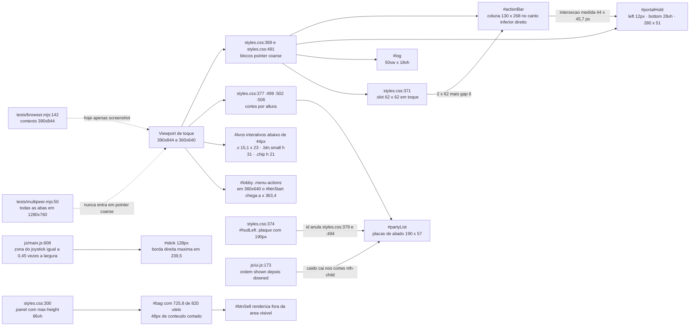
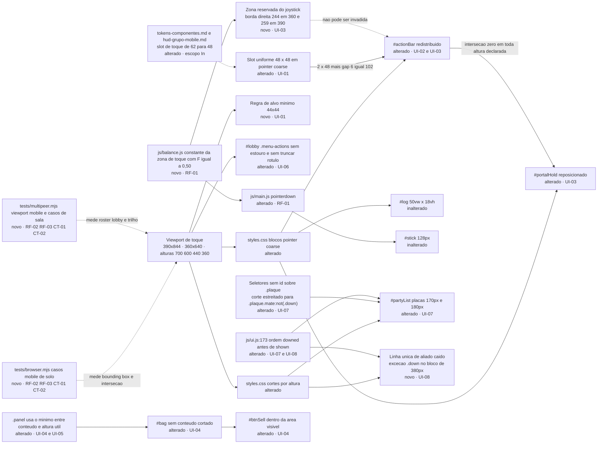

# SPEC: mobile-hud-menus-inventario

## Metadata

- Source: developer description via /plan (`.spec/features/mobile-hud-menus-inventario/.handoff/input.md`)
- Clarificações vinculantes: `.spec/features/mobile-hud-menus-inventario/.handoff/clarifier-answers.md` (20/08/2026)
- Service: shadowfall (repositório único, front-end sem bundler)
- Tier: standard
- Version: 1.1
- Architecture references: `AGENTS.md`, `docs/agents/architecture.md`, `docs/agents/domain_rules.md`
- Init chain: `.spec/init/project-description.md`, `.spec/init/user-stories.md`, `.spec/init/database-schema.md`, `.spec/init/project-phases.md`, `.spec/init/design/hud-grupo-mobile.md`, `.spec/init/design/tokens-componentes.md`

### Regras de arquitetura que amarram esta SPEC

| Regra                                                                                | Fonte                                                                                    | Efeito aqui                                                                                                                                                                            |
| ------------------------------------------------------------------------------------ | ---------------------------------------------------------------------------------------- | -------------------------------------------------------------------------------------------------------------------------------------------------------------------------------------- |
| `js/sim.js` é estado puro, zero DOM                                                  | `AGENTS.md:37`, `AGENTS.md:56`, `docs/agents/architecture.md` (tabela de camadas)        | Nenhuma mudança desta feature entra em `js/sim.js`; a superfície é `index.html`, `styles.css`, `js/ui.js`, `js/main.js`, `js/render.js`                                                |
| Todo número de tuning vive em `js/balance.js`                                        | `AGENTS.md:38`, `AGENTS.md:57`                                                           | A fração da zona do joystick, hoje literal `0.45` em `js/main.js:608`, migra para `js/balance.js` já com o valor decidido `F = 0.50` (RF-01, UI-03, RNF-03)                            |
| Apresentação não muta estado do simulador nem envia pacote                           | `docs/agents/architecture.md`, tabela "Layer responsibilities"                           | `ui.js` e `render.js` só leem `view`/`local`; nenhum requisito abaixo cria mensagem de rede                                                                                            |
| Testes sem framework; `process.exit(failures ? 1 : 0)`                               | `AGENTS.md:32`, `AGENTS.md:43`                                                           | Os casos mobile seguem o padrão já existente em cada harness: `errors[]` em `tests/browser.mjs:160-161` e `check()`/`failures` em `tests/multipeer.mjs:26-30` e `:332` (CT-02)         |
| Só o harness multi-peer exercita sala real (handshake, teto, tranca, expulsão, fila) | `tests/multipeer.mjs:1-8`                                                                | Os casos que exigem sala — `#roster`, os dez `Expulsar`, `#lobby`, trilho de aliados, aliado caído — não cabem em `tests/browser.mjs`; a verificação é dividida (RF-02, RF-03, RNF-05) |
| pt-BR em comentário, log, texto de UI e label de teste; identificador em inglês      | `AGENTS.md:45`, `AGENTS.md:51`                                                           | RNF-06                                                                                                                                                                                 |
| Sem dependência de runtime, sem passo de build                                       | `AGENTS.md:60-61`                                                                        | RNF-01                                                                                                                                                                                 |
| Trilho de aliados limitado por `HUD_ALLY_LIMIT`                                      | `docs/agents/domain_rules.md`, seção "HUD de aliados com histerese"; `js/balance.js:204` | O corte de 3 linhas em altura `> 620px` é do JS; os cortes abaixo disso são de CSS (UI-07)                                                                                             |

## Context

O jogo é jogável no celular hoje, mas o HUD de toque foi construído por acréscimo e três defeitos
geométricos foram medidos com Puppeteer nos alvos confirmados (390x844 `deviceScaleFactor` 2
`isMobile` `hasTouch`, e 360x640), com console limpo em todas as execuções:

1. **Alvos interativos abaixo de 44x44px.** `#btnCloseBag` e `#btnCloseRoster` medem 15,1 x 23px
   (`.x` em `styles.css:312` não define caixa); `#btnSell`, `#btnRosterLock` e cada botão
   `Expulsar` do painel de moderação medem 31px de altura (`.btn.small` em `styles.css:130`);
   `#crewChip` — que abre a moderação por `js/main.js:143` — herda `.chip` (`styles.css:207`) e
   mede 21px de altura. O mínimo de 44x44 já está declarado em
   `.spec/init/design/tokens-componentes.md:151` e em `.spec/init/design/hud-grupo-mobile.md:91`.
2. **`#actionBar` invade `#portalHold`.** Em `pointer: coarse` o `#actionBar` vira coluna de
   130 x 268px ancorada no canto inferior direito (`styles.css:372`) enquanto o `#portalHold`
   é reposicionado para `left: 12px; bottom: 28vh; width: min(280px, 80vw)`
   (`styles.css:497`). Em 390x844 os dois retângulos se cruzam em **44 x 45,7px** (medido). A
   colisão persiste em todas as alturas testadas — 844, 700, 600, 440 e 360 — porque as duas
   âncoras crescem em direções opostas. O `#stick` desenhado escapa por pouco: sua borda direita
   máxima é 239,5px contra 248px da borda esquerda do `#actionBar`, folga de 8,5px. Mas com
   `F = 0.50` decidido (UI-03), a zona reservada vai a `0,50 × 390 + 64 = 259px` e o `#actionBar`
   atual fica 11px dentro dela em 390 de largura; em 360 a zona vai a 244px e sobram 104px úteis
   à direita, contra os 130px que o `#actionBar` ocupa hoje. Por isso a barra precisa encolher.
3. **`#bag` corta conteúdo.** `.panel` (`styles.css:300`) fixa `max-height: 86vh`. Em 390x844 o
   painel fica com 725,8px enquanto há 820px úteis e o conteúdo pede 772px: **48px ficam
   cortados** e o `#btnSell` renderiza em `y = 785`, abaixo da borda visível do painel
   (`bottom = 784,9`). Em 360x640 são **201px** cortados. A página não rola — `html, body` têm
   `overflow: hidden` e `overscroll-behavior: none` (`styles.css:29-36`) —, então a queixa é o
   teto de 14vh desperdiçado, não vazamento de rolagem.

Somam-se duas divergências entre `.spec/init/design/hud-grupo-mobile.md` e o CSS, ambas com a
mesma causa raiz — `#hudLeft .plaque { width: 190px }` (`styles.css:374`) tem especificidade de
id e anula `.plaque { width: 180px }` (`styles.css:379`) e `.plaque.mate { width: 170px }`
(`styles.css:494`):

- §3 exige placa própria de 180px abaixo de 460px de altura; medido 190px nas alturas 440 e 360.
- §3 exige que o destaque de aliado caído nunca suma; abaixo de 380px `styles.css:506-508`
  esconde todas as placas de aliado e o caído desaparece (medido `caidoVisivel: false` em 360px).

O restante de §3 já funciona: em 600px sobram 2 linhas, em 440px sobra 1, em 360px sobra só a
linha `+n no minimapa`, e `#log` some abaixo de 460px.

Fora do jogo, o `#menu` não estoura em nenhum dos dois alvos, mas o `#lobby` com 10 jogadores
estoura em 360x640: `#btnStart` chega a `x = 363,4` contra 360 de viewport e `#lobby.scrollWidth`
vai a 363. A causa é `.menu-actions .btn { flex: 1 }` (`styles.css:114`) com `min-width: auto`
implícito, que impede o encolhimento abaixo do conteúdo mínimo de dois rótulos em caixa alta.

Os 130px do `#actionBar` são derivados: `.slot { width: 62px }` (`styles.css:371`) em grid de duas
colunas com `gap: 6px` (`styles.css:373` e `styles.css:257`) dá `2 × 62 + 6 = 130`.

O contexto mobile de `tests/browser.mjs:142` hoje só navega e tira screenshot; nenhuma medição. O
harness multi-peer, único que sobe sala real, abre todas as abas em 1280x760
(`tests/multipeer.mjs:50`) e portanto nunca entrou em `pointer: coarse`.

## AS IS — Estado atual

Recorte atual do HUD de toque medido com Puppeteer nos dois alvos confirmados. As três arestas
grossas são os defeitos: a interseção `#actionBar` x `#portalHold`, a especificidade de
`styles.css:374` que anula os cortes de largura, e o teto de 86vh que corta o fim do `#bag`.

## TO BE — Estado proposto

Cada nó novo ou alterado realiza um id do RIGID: `NEW_T` e `NEW_SLOT` realizam UI-01; `NEW_L`
realiza UI-06; `AB` e `PH` realizam UI-02 e UI-03; `NEW_BAL`, `MN` e `NEW_ZONE` realizam RF-01 e
sustentam a medição de UI-03; `RL`, `NEW_SPEC` e `NEW_ORD` realizam UI-07; `NEW_DOWN` realiza
UI-08; `PN`, `BG` e `SL` realizam UI-04 e UI-05; `NEW_BR` e `NEW_MP` realizam RF-02, RF-03, CT-01
e CT-02; `NEW_TOK` não realiza requisito — é a atualização de spec de design que a decisão do
slot de 48px arrasta.

## Scope

- **In**: geometria de toque de `#game`, `#menu`, `#lobby`, `#queue`, `#bag` e `#roster` em
  `pointer: coarse`; tamanho do `.slot` em toque; ordem de corte por altura de
  `.spec/init/design/hud-grupo-mobile.md` §3; largura declarada das placas do trilho; ordem de
  render do trilho em `js/ui.js:173` (uma linha, ver "Out"); migração da fração da zona do
  joystick para `js/balance.js`; casos mobile de medição em `tests/browser.mjs` (casos de solo) e
  em `tests/multipeer.mjs` (casos que exigem sala).
- **In — specs de design que esta feature atualiza**: a decisão de slot uniforme de 48px (UI-01)
  invalida o `62 × 62` declarado em `.spec/init/design/tokens-componentes.md:142` e em
  `.spec/init/design/hud-grupo-mobile.md:92`. Atualizar esses dois arquivos para 48px faz parte da
  entrega; sem isso a próxima SPEC volta a medir a mesma divergência. Nenhuma outra seção desses
  arquivos é tocada.
- **Out**:
  - Reestruturação do trilho compacto de §2 em linha única de 26px, truncagem de nome em 8 ou 6
    caracteres e distância abreviada `4t` — nenhuma AC confirmada cobre; exige remontar o markup
    de placa de aliado em `js/ui.js:181-183`.
  - **Emenda (Q-01/Q-08)**: de todo o `js/ui.js`, exatamente **uma** linha está autorizada —
    `js/ui.js:173`, que passa de `const visible = [...shown, ...downed]` para
    `const visible = [...downed, ...shown]`, pondo o caído como primeiro filho de `#partyList` e
    portanto fora do alcance dos cortes `nth-child` que escondem os últimos filhos
    (`styles.css:500` e `:503`). Nenhuma outra linha de `js/ui.js` entra, e o markup da placa
    (`js/ui.js:181-183`) continua fora.
  - Regras de landscape/portrait de §5 (trilho 150px, `#log` 60vw).
  - `.spec/init/design/hud-grupo-mobile.md` §8, "Medição pendente": coletar distribuição real de
    altura de viewport e proporção landscape/portrait continua em aberto em `project-phases.md`.
  - Qualquer alteração em `js/sim.js`, `js/net.js`, `js/save.js` ou no protocolo P2P.
  - Divergência rótulo/comportamento de `sellJunk()` já registrada em
    `docs/agents/domain_rules.md`, seção "Venda de itens": o texto de `#btnSell` continua como
    está; esta feature só mexe na caixa do botão.
  - Bloqueio ou aviso de orientação de tela (§5 já decide que não existe).

## RIGID (Non-Negotiable)

### Functional Requirements

- **RF-01** [Ubiquitous]: A fração `F` da zona reservada ao joystick DEVE valer exatamente `0.5`,
  DEVE ser uma constante nomeada exportada por `js/balance.js`, e DEVE ser a única fonte tanto do
  teste de origem do toque em `js/main.js` quanto da geometria verificada por UI-03. O literal
  `0.45` em `js/main.js:608` (verified at `js/main.js:608`) e os literais `64` de deslocamento do
  `#stick` (`js/main.js:614-615`) e `54` de curso máximo (`js/main.js:636`) DEVEM sair da lógica,
  virando constantes exportadas com os mesmos valores `64` e `54` — só `0.45` muda de valor, para
  `0.5`.
  - AC 1: `grep -nE "innerWidth \* 0\.45|- 64\)|max = 54" js/main.js` retorna zero linhas.
  - AC 2: `grep -cE "e\.clientX < innerWidth \* [A-Z][A-Z0-9_]*" js/main.js` retorna `1`, e esse
    mesmo identificador aparece na lista de import de `./balance.js` em `js/main.js`
    (`grep -n "from './balance.js'" js/main.js`).
  - AC 3: o identificador da AC 2 é exportado por `js/balance.js` e vale exatamente `0.5`:
    `node -e "import('./js/balance.js').then(b => process.exit(b.<CONSTANTE> === 0.5 ? 0 : 1))"`
    sai 0. Os deslocamentos do `#stick` viram exportações de valor `64` e `54`.
  - AC 4: nome das constantes em inglês, comentário em pt-BR na mesma linha, no padrão de
    `js/balance.js:204` (RNF-03, RNF-06).

- **RF-02** [Event-Driven]: A verificação mobile DEVE ser dividida entre os dois harnesses, pela
  linha do que exige sala real:
  - **RF-02a**: QUANDO `npm run test:browser` executa, o harness DEVE abrir, além do contexto de
    390x844 já existente (verified at `tests/browser.mjs:141-148`), um contexto de 360x640 com
    `deviceScaleFactor` 2, `isMobile: true` e `hasTouch: true`, e DEVE medir nos dois contextos os
    casos alcançáveis em solo: `#bag` (UI-04, UI-05), `#actionBar` e seus slots (UI-01 parcial,
    UI-02, UI-03), zona reservada do joystick (UI-03) e `#menu` (UI-01 parcial, UI-06).
    - AC: `grep -c "setViewport" tests/browser.mjs` retorna 3 ou mais e existe uma chamada com
      `width: 360, height: 640`; nos dois contextos `matchMedia('(pointer: coarse)').matches` é
      `true`.
  - **RF-02b**: QUANDO `npm run test:multipeer` executa, as abas DEVEM abrir em viewport mobile
    (390x844 e 360x640, `deviceScaleFactor` 2, `isMobile: true`, `hasTouch: true`) em lugar do
    1280x760 de hoje (verified at `tests/multipeer.mjs:50`), e o harness DEVE medir os casos que
    exigem sala: `#roster` (UI-01), os dez botões `Expulsar` (UI-01), `#lobby` com 10 jogadores
    (UI-01, UI-06), trilho de aliados (UI-07) e aliado caído (UI-08).
    - AC: `grep -c "setViewport" tests/multipeer.mjs` retorna 1 ou mais com `width: 360,
height: 640` alcançável por variável de ambiente ou parâmetro, e em toda aba mobile
      `matchMedia('(pointer: coarse)').matches` é `true`.
  - **RF-02c**: Nenhuma costura de teste entra em `js/main.js` — os dois harnesses medem pelo DOM
    e pelos ids de CT-01.
    - AC: `git diff --stat js/main.js` na entrega não mostra linha nova de instrumentação; as
      únicas mudanças em `js/main.js` são as de RF-01.

- **RF-03** [Event-Driven]: QUANDO os casos mobile rodam contra o código anterior à
  implementação, cada harness DEVE sair com código 1 apontando pelo menos as violações medidas
  que lhe cabem — `tests/browser.mjs` para UI-03 e UI-04; `tests/multipeer.mjs` para UI-01, UI-06,
  UI-07 e UI-08; QUANDO rodam contra o código implementado, ambos DEVEM sair com código 0.
  - AC: com os casos novos preservados na árvore,
    `git stash push -- js/ styles.css index.html` e então
    `npm run test:browser; echo $?` imprime `1` com ao menos duas mensagens de erro distintas e
    `npm run test:multipeer; echo $?` imprime `1` com ao menos quatro mensagens de erro distintas;
    após `git stash pop`, os dois comandos imprimem `0`. O `push -- js/ styles.css index.html` é
    obrigatório: `git stash` puro levaria `tests/` junto e a corrida sairia 0, anulando a própria
    AC.

### UI Requirements

- **UI-01** [State-Driven]: ENQUANTO `matchMedia('(pointer: coarse)').matches` for verdadeiro,
  todo alvo interativo visível de `#menu`, `#lobby`, `#queue`, `#game`, `#bag` e `#roster` DEVE
  ter bounding box com largura ≥ 44px **e** altura ≥ 44px. Alvo interativo é o elemento visível
  que satisfaz `tagName === 'BUTTON' || tagName === 'INPUT' || el.onclick || el.onpointerdown`.
  Elementos puramente informativos — `#floorChip`, `#goldChip`, `#lobbyCount`, `#rosterCount`, e
  a linha do trilho de aliados, que por `.spec/init/design/hud-grupo-mobile.md:90` não é alvo de
  toque — ficam de fora da regra.
  - AC 1: em 390x844 e em 360x640, o conjunto de alvos interativos com
    `rect.width < 44 || rect.height < 44` é vazio, com `#bag` aberto, `#roster` aberto com 9
    jogadores mais 1 na fila, e `#lobby` com 10 jogadores. Violações medidas hoje que precisam
    zerar: `#btnCloseBag` 15,1x23 · `#btnCloseRoster` 15,1x23 · `#btnSell` 332,6x31 ·
    `#btnRosterLock` 332,6x31 · 10 botões `.btn.small` "Expulsar" 81,9x31 · `#crewChip` altura 21.

  - **Slot de ação — tamanho único (RIGID, o implementador não escolhe)**: ENQUANTO
    `pointer: coarse` estiver ativo, todo `.slot` de `#skillSlots` e de `.slots.potions` DEVE medir
    exatamente **48 x 48px**, na mesma medida em qualquer largura de viewport de toque — não há
    escala por largura nem por breakpoint. Derivação, na largura mais apertada (360, com
    `F = 0.50`): a zona reservada do joystick termina em `0,50 × 360 + 64 = 244px`, o gutter
    direito é 12px (`styles.css:372`), logo sobram `360 - 244 - 12 = 104px` úteis; duas colunas
    mais o `gap: 6px` de `.slots` (`styles.css:257`, grid em `styles.css:373`) dão
    `2 × 48 + 6 = 102px`, com 2px de folga contra a zona. O piso absoluto é 44px (AC 1) e o teto é
    49px; 48px é o valor escolhido. Em 390 os mesmos 102px deixam 17px de folga
    (`390 - 259 - 12 = 119px` úteis).
    - AC 2: em 390x844 e em 360x640, para todo `.slot` visível,
      `Math.abs(rect.width - 48) <= 0.5 && Math.abs(rect.height - 48) <= 0.5`. A largura do
      `#actionBar` não é fixada aqui — o arranjo dos slots é FLEXIBLE; o que a prende é UI-03
      (`rect.left >= zonaJoystick.right`), o que em 360 dá `width <= 104` e em 390, `<= 119`.
      Medido hoje: `.slot` 62x62 (`styles.css:371`), `#actionBar` 130px de largura, que não cabe
      em nenhuma das duas faixas.
    - Consequência aceita: o `62 × 62` de `.spec/init/design/tokens-componentes.md:142` e de
      `.spec/init/design/hud-grupo-mobile.md:92` deixa de valer em toque; a atualização desses dois
      arquivos está no escopo In.

  - **`#crewChip` — caixa de 44px sem inchar o `#hudRight` (RIGID)**: o chip DEVE ter bounding box
    de altura ≥ 44px com a área **pintada** preservada em 21px, pela combinação de `padding` com
    `background-clip: content-box` no próprio elemento. Sem nó interno — `UI.setCapacity`
    (`js/ui.js:411`) escreve `textContent` e apagaria qualquer `span`. Sem `align-items` novo em
    `.chips` (`styles.css:206`), que esticaria `#floorChip`, `#goldChip`, `#roomChip`, `#crewLock`
    e `#pingChip` junto.
    - AC 3: em 390x844 e 360x640, `crewChip.rect.height >= 44`,
      `getComputedStyle(crewChip).backgroundClip === 'content-box'`, e cada um de `#floorChip`,
      `#goldChip`, `#roomChip`, `#crewLock` e `#pingChip` visível mantém `rect.height <= 24`
      (medido hoje: 21).

- **UI-02** [State-Driven]: ENQUANTO `pointer: coarse` estiver ativo, quaisquer dois slots de
  `#actionBar` — `#skillSlots .slot` e `.slots.potions .slot` — DEVEM ter interseção de área zero.
  - AC: em 390x844 e 360x640, para todo par de slots, `overlapX <= 0 || overlapY <= 0`. Guarda de
    regressão: a condição já é satisfeita hoje pelo grid de `styles.css:373` e precisa continuar
    valendo depois do slot cair de 62px para 48px (UI-01).

- **UI-03** [State-Driven]: ENQUANTO `pointer: coarse` estiver ativo, o retângulo de `#actionBar`
  NÃO DEVE interceptar `#portalHold`, `#log`, nem a zona reservada do joystick, e todos os seus
  slots DEVEM permanecer dentro da viewport e à direita da metade da tela
  (`.spec/init/design/hud-grupo-mobile.md` §1: "metade direita: botões").
  Zona reservada do joystick = retângulo `x ∈ [0, F × innerWidth + 64]`, `y ∈ [0, innerHeight]`,
  com **`F = 0.50`** — "metade esquerda inteira" de `.spec/init/design/hud-grupo-mobile.md:35`,
  §1. O `+64` é a metade do `#stick` de 128px, hoje literal em `js/main.js:614-615`. `F` vem da
  constante única de `js/balance.js` (RF-01): o mesmo valor governa o teste de origem do toque em
  `js/main.js:608` e a medição desta AC — o caso mobile importa a constante em vez de repetir o
  número.
  Bordas direitas resultantes: **244px em 360 de largura** (`0,50 × 360 + 64`) e **259px em 390**
  (`0,50 × 390 + 64`). O `#actionBar` de hoje, ancorado com `right: 12px` e 130px de largura,
  começa em `x = 248` em 390 e portanto fica **11px dentro** da zona; em 360 começaria em 218,
  26px dentro. É o que obriga o slot de 48px de UI-01 (`102px` de barra, início em `x = 246` em
  360 e `x = 276` em 390).
  - AC 1: em 390x844 e 360x640, e nas alturas 700, 620, 600, 460, 440, 380 e 360 com largura 390,
    `intersects(#actionBar, #portalHold) === false`, `intersects(#actionBar, #log) === false`,
    `intersects(#actionBar, zonaJoystick) === false`, e para todo slot
    `rect.left >= innerWidth / 2 && rect.right <= innerWidth && rect.top >= 0 && rect.bottom <= innerHeight`.
    Violação medida hoje: `#actionBar` x `#portalHold` = 44 x 45,7px em 390x844, e interseção não
    nula também em 700, 600, 440 e 360.
  - AC 2: a zona usada pelo teste é calculada como `F * innerWidth + 64` com `F` **importado de
    `js/balance.js`**, não literal no arquivo de teste:
    `grep -cE "0\.5[0]?\s*\*\s*innerWidth|innerWidth\s*\*\s*0\.5" tests/browser.mjs` retorna 0.
  - AC 3: em 390 de largura, `zonaJoystick.right === 259`; em 360, `zonaJoystick.right === 244`.

- **UI-04** [State-Driven]: ENQUANTO `#bag` estiver visível em `pointer: coarse`, o painel DEVE
  caber inteiro na viewport e DEVE ocupar `min(altura do conteúdo, alturaÚtil)`, onde
  `alturaÚtil = innerHeight - 2 × 12px` — 12px é o gutter já praticado em `styles.css:161` e
  `styles.css:372` (verified). Nenhum descendente do painel pode ter `rect.bottom` maior que
  `rect.bottom` do painel quando o conteúdo cabe na altura útil.
  - AC 1 — painel dentro da viewport, com o gutter respeitado: em 390x844 e 360x640, com a mochila
    cheia em 20 itens, `rect.top >= 12 && rect.bottom <= innerHeight - 12 && rect.left >= 0 &&
rect.right <= innerWidth`.
  - AC 2 — nada cortado quando o conteúdo cabe: se `bag.scrollHeight <= innerHeight - 24`, então
    `bag.scrollHeight <= bag.clientHeight` (sem conteúdo transbordando) e todo descendente visível
    tem `rect.bottom <= bag.rect.bottom + 0.5`.
  - Nota de medição (por que não há igualdade de altura): `box-sizing: border-box`
    (`styles.css:27`) mais a borda de 1px de `.panel` (`styles.css:300`) fazem `rect.height` contar
    a borda e `scrollHeight` não — em 390x844 isso dá 772 contra 770 e reprovaria uma implementação
    correta num teste de `±1px`. Por isso a AC é o par de invariantes acima, não
    `Math.abs(rect.height - Math.min(scrollHeight, innerHeight - 24)) <= 1`.
  - Medido hoje: 390x844 → painel com 725,8 contra `min(772, 820) = 772`, 48px cortados, `#btnSell`
    em `y = 785` com `bag.rect.bottom = 784,9`; 360x640 → 550,4 contra `min(749, 616) = 616`,
    201px cortados.

- **UI-05** [Unwanted]: SE o conteúdo de `#bag` for mais alto que a altura útil, ENTÃO a rolagem
  DEVE acontecer dentro de `#bag` e NUNCA na página, e o encadeamento de rolagem para o documento
  DEVE ser bloqueado no próprio painel.
  - AC: após `bag.scrollTop = bag.scrollHeight` em 360x640,
    `document.documentElement.scrollTop === 0 && document.body.scrollTop === 0 &&
document.documentElement.scrollHeight === document.documentElement.clientHeight`, e
    `getComputedStyle(bag).overscrollBehaviorY !== 'auto'`. Guarda de regressão: a parte de página
    já é satisfeita por `styles.css:29-36`; `overscrollBehaviorY` hoje é `auto`.

- **UI-06** [State-Driven]: ENQUANTO `#menu` ou `#lobby` estiverem visíveis em 360x640 e em
  390x844, a tela NÃO DEVE produzir rolagem horizontal e nenhum descendente pode ultrapassar a
  largura da viewport, **e nenhum rótulo de botão pode ser truncado** — encolher o flex item não
  pode virar corte de texto.
  - AC 1: para `#menu` e para `#lobby` renderizado com 10 jogadores, host, `#lobbyLock` visível e
    `#btnLock` visível, vale `screen.scrollWidth === screen.clientWidth` e, para todo descendente
    com largura maior que zero, `rect.left >= -0.5 && rect.right <= innerWidth + 0.5`.
    Violação medida hoje: em 360x640, `#lobby.scrollWidth = 363` contra `clientWidth = 360` e
    `#btnStart` com `right = 363,4`.
  - AC 2 — rótulo inteiro: para todo `.menu-actions .btn` visível,
    `el.scrollWidth <= el.clientWidth + 0.5`, `getComputedStyle(el).textOverflow !== 'ellipsis'` e
    `el.textContent.trim()` continua igual ao rótulo declarado em `index.html` — para `#btnStart`,
    exatamente `Descer para a masmorra` (verified at `index.html:78`). Sem esta AC, um
    `min-width: 0` em `.menu-actions .btn` passaria no AC 1 cortando o rótulo. Quebra em duas
    linhas é permitida; corte de texto não.

- **UI-07** [State-Driven]: ENQUANTO `pointer: coarse` estiver ativo, a ordem de corte por altura
  de `.spec/init/design/hud-grupo-mobile.md` §3 (verified at
  `.spec/init/design/hud-grupo-mobile.md:58-70`) DEVE valer exatamente nas faixas declaradas, e
  nada pode sair fora dessa ordem. As faixas são escritas como `≤620`, `≤460` e `≤380` para casar
  exatamente com os `max-height` que já existem no CSS (`styles.css:377`, `:499`, `:502`, `:506`)
  — a redação anterior (`< 460`, `460–620`) divergia do CSS justamente nas alturas de fronteira
  que UI-03 mede. Nenhuma mudança de código decorre desta reescrita.

  **Cenário cravado das ACs de UI-07 e UI-08**: sala com o jogador local mais **4 aliados, dos
  quais 1 caído** (`PEERS=5` no harness multi-peer). Nesse cenário `AllyRail.select`
  (`js/allyrail.js:24-70`) devolve `downed = 1`, `shown = 3` e `extra = 0` — logo `.ally-more`
  **não existe no DOM**.

  **Contagem por faixa** (largura 390; `visível` = `getComputedStyle(el).display !== 'none'`):

  | Faixa de altura       | `.plaque.mate:not(.down)` visíveis                | `.plaque.mate.down` visíveis | Linhas do trilho | `#log`  | `.plaque.self` | `#minimap` e `#actionBar` | Medido hoje (mesmo cenário)                                                              |
  | --------------------- | ------------------------------------------------- | ---------------------------- | ---------------- | ------- | -------------- | ------------------------- | ---------------------------------------------------------------------------------------- |
  | `> 620px`             | 3 (teto de `HUD_ALLY_LIMIT`, `js/balance.js:204`) | 1                            | 4                | visível | 190px          | presentes                 | conforme: 3 + 1                                                                          |
  | `≤ 620px` e `> 460px` | 1                                                 | 1                            | 2                | visível | 190px          | presentes                 | **2 vivos e 0 caído** — o corte `styles.css:500` come o caído, que hoje é o último filho |
  | `≤ 460px` e `> 380px` | 0                                                 | 1                            | 1                | oculto  | **180px**      | presentes                 | **1 vivo e 0 caído**; `.plaque.self` em **190px**                                        |
  | `≤ 380px`             | 0                                                 | 1                            | 1                | oculto  | **180px**      | presentes                 | **0 e 0** — `styles.css:507` esconde tudo; `.plaque.self` em **190px**                   |

  Derivação das contagens, para que o número não seja opinião: com `js/ui.js:173` reordenado para
  `[...downed, ...shown]`, o DOM de `#partyList` fica `[caído, vivo1, vivo2, vivo3]`. O corte
  `#partyList .plaque.mate:nth-child(n+3)` (`styles.css:500`) esconde os filhos 3 e 4 → sobram
  caído + 1 vivo. O corte `:nth-child(n+2)` (`styles.css:503`) esconde os filhos 2 em diante →
  sobra só o caído. Em `≤380px`, `styles.css:507` esconde todas as placas de aliado e a exceção de
  UI-08 devolve só a do caído. O orçamento vertical de §3 (3 / 2 / 1 linhas) é respeitado em todas
  as faixas cortadas — o caído ocupa uma das linhas do orçamento, não uma linha extra. A única
  faixa com 4 linhas é `> 620px`, onde não há corte e o caído já é extra por projeto
  (`maxDowned: 2` em `js/allyrail.js:13`); é o comportamento de hoje, não uma regressão.

  - AC 1 — contagem: nas alturas 700, 620, 600, 460, 440, 380 e 360 com largura 390, no cenário
    cravado, `#partyList .plaque.mate:not(.down)` visíveis tem contagem 3, 1, 1, 0, 0, 0, 0, e
    `#partyList .plaque.mate.down` visíveis tem contagem 1 nas sete alturas.
  - AC 2 — `#log`: `getComputedStyle(log).display` é `block` em 700, 620 e 600 e `none` em 460,
    440, 380 e 360 (`styles.css:377-378`).
  - AC 3 — placa própria: `.plaque.self` mede 190px em 700, 620 e 600 e 180px em 460, 440, 380 e 360. Medido hoje: 190px nas sete alturas.
  - AC 4 — nada some fora da ordem: `.plaque.self`, `#minimap` e `#actionBar` têm
    `display !== 'none'` nas sete alturas.
  - AC 5 — `.ally-more`: no cenário cravado `extra === 0` e
    `document.querySelector('#partyList .ally-more') === null` nas sete alturas. Quando
    `extra > 0` — por exemplo o contexto de 10 jogadores usado por UI-01 e UI-06, em que
    `extra = 9 - 3 - caídos` — `.ally-more` DEVE estar visível e o corte por altura NÃO pode
    escondê-la: `getComputedStyle(allyMore).display !== 'none'` nas sete alturas.
  - AC 6 (mesma causa raiz de especificidade): em `pointer: coarse`, `.plaque.mate` mede 170px de
    largura — regra já declarada em `styles.css:494` e hoje inerte, medida em 190px, porque
    `#hudLeft .plaque` (`styles.css:374`) vence por especificidade de id.

- **UI-08** [Unwanted]: SE existir pelo menos um aliado caído e o trilho já tiver sido cortado a
  zero linhas de aliado vivo pela altura da viewport, ENTÃO o HUD DEVE exibir uma única linha de
  caído, marcada por borda `--blood` **e** pelo texto `caído` — nunca só por cor
  (`.spec/init/design/tokens-componentes.md:154`). O mecanismo é duplo e ambas as partes são
  RIGID: (a) o caído é o **primeiro** filho de `#partyList`, por `js/ui.js:173` renderizando
  `[...downed, ...shown]`, ficando fora do alcance dos cortes `nth-child` que escondem os últimos
  filhos; (b) o bloco `@media (max-height: 380px)` (`styles.css:506-508`) ganha a exceção
  `#partyList .plaque.mate.down { display: flex }`, que devolve o caído onde a regra geral
  esconde todas as placas.
  - AC 1: em 390x360, no cenário cravado de UI-07 (4 aliados, 1 caído), existe **exatamente um**
    elemento visível em `#partyList` — o caído — com `getComputedStyle(el).borderColor` resolvendo
    `--blood` (`styles.css:197`, aplicado pela classe `.down` de `js/ui.js:205`) e
    `el.textContent` contendo a palavra `caído` (escrita por `js/ui.js:203`) — as duas marcas já
    existem no markup atual, o defeito é só de `display`. Medido hoje: nenhum elemento visível
    (`styles.css:506-508`
    esconde todas as placas, `caidoVisivel: false`).
  - AC 2 — o caído nunca é vítima do corte, em nenhuma faixa: nas alturas 700, 620, 600, 460, 440,
    380 e 360, `#partyList .plaque.mate.down` visíveis tem contagem 1 e o elemento é
    `#partyList.firstElementChild`.
  - AC 3 — a exceção não vaza para vivos: em 390x360, `#partyList .plaque.mate:not(.down)`
    visíveis tem contagem 0.

### Contracts

- **CT-01**: Contrato de medição entre a UI e `tests/browser.mjs`. Os ids abaixo DEVEM continuar
  existindo com o mesmo nome; renomear qualquer um quebra os casos mobile:
  `#hudLeft` (verified at `index.html:119`), `#partyList` (`index.html:130`),
  `#minimap` (`index.html:135`), `#crewChip` (`index.html:140`), `#log` (`index.html:156`),
  `#actionBar` (`index.html:159`), `#skillSlots` (`index.html:160`),
  `#portalHold` (`index.html:169`), `#stick` (`index.html:176`), `#bag` (`index.html:179`),
  `#btnCloseBag` (`index.html:182`), `#invGrid` (`index.html:187`), `#btnSell` (`index.html:189`),
  `#roster` (`index.html:195`), `#btnCloseRoster` (`index.html:199`),
  `#btnRosterLock` (`index.html:201`), `#btnStart` (`index.html:78`),
  `#lobbyCount` (`index.html:70`), `#lobbyLock` (`index.html:71`), `#lobbyList` (`index.html:74`),
  `#btnLock` (`index.html:77`), `#rosterCount` (`index.html:198`),
  `#rosterList` (`index.html:204`), `#floorChip` (`index.html:137`),
  `#goldChip` (`index.html:138`), `#roomChip` (`index.html:139`),
  `#crewLock` (`index.html:141`), `#pingChip` (`index.html:142`).
  Além dos ids, as ACs dependem destes **ganchos de classe**, que também não podem ser renomeados:
  `.plaque.self`, `.plaque.mate`, `.plaque.mate.down` (`js/ui.js:205`), `.ally-more`
  (`js/ui.js:191`), `.slots.potions`, `.slot`, `.inv-slot`, `.btn.small` e `.menu-actions .btn`.
  - AC: `node -e` sobre `index.html` confirma a presença dos **28 ids**; os ganchos de classe são
    conferidos em runtime por `document.querySelector` retornando não-nulo no estado em que cada AC
    os exige; nenhum caso mobile usa seletor posicional frágil do tipo `nth-child` fora de
    `#partyList`, onde a posição é o próprio objeto medido (UI-07, UI-08).

- **CT-02**: Convenção de saída dos casos mobile. Cada harness mantém o padrão que já tem, sem
  inventar um terceiro:
  - Em `tests/browser.mjs`, cada falha DEVE virar
    `errors.push('<PREFIXO>: <detalhe em pt-BR com o valor medido>')`, com encerramento em
    `process.exit(errors.length ? 1 : 0)` (verified at `tests/browser.mjs:160-161`).
  - Em `tests/multipeer.mjs`, cada falha DEVE virar
    `check('<PREFIXO>: <rótulo em pt-BR>', <condição>, '<valor medido>')`, com encerramento em
    `process.exit(failures ? 1 : 0)` (verified at `tests/multipeer.mjs:26-30` e `:332`).
  - Os prefixos DEVEM identificar o requisito, na forma `TOQUE` (UI-01), `BARRA` (UI-02, UI-03),
    `MOCHILA` (UI-04, UI-05), `MENU` (UI-06), `CORTE` (UI-07) e `CAIDO` (UI-08). Divisão por
    harness: `BARRA` e `MOCHILA` saem de `tests/browser.mjs`; `TOQUE`, `MENU`, `CORTE` e `CAIDO`
    saem de `tests/multipeer.mjs`; `TOQUE` e `MENU` também aparecem em `tests/browser.mjs` na
    parte alcançável em solo (`#bag`, `#actionBar`, `#menu`).
  - AC: rodando contra o código de hoje, a união das duas saídas contém pelo menos um erro de cada
    um dos seis prefixos, e todo detalhe traz número medido, não adjetivo.

### Non-Functional Requirements

- **RNF-01**: Nenhuma dependência de runtime e nenhum passo de build são adicionados
  (`AGENTS.md:60-61`).
  - AC: `package.json` continua sem a chave `dependencies` e `vercel.json` mantém
    `"framework": null` e `buildCommand` `echo 'sem build'`.
- **RNF-02**: `js/sim.js` continua sem qualquer referência a DOM (`AGENTS.md:56`).
  - AC: `grep -cE "document|window|navigator" js/sim.js` retorna 0 e `node tests/sim.test.mjs`
    sai 0.
- **RNF-03**: Todo número de tuning introduzido ou tocado em JS por esta feature vive em
  `js/balance.js` (`AGENTS.md:38`). A regra vale para JS; pontos de quebra de mídia e dimensões
  puramente declarativas continuam em `styles.css`, que não importa módulos.
  - AC: `grep -cE "0\.45|innerWidth \* 0\.[0-9]" js/main.js js/ui.js` retorna **zero linhas** (sem
    depender de baseline), e cada constante nova exportada por `js/balance.js` tem comentário em
    pt-BR na mesma linha, seguindo o padrão de `js/balance.js:204`.
- **RNF-04**: Console limpo nos dois contextos mobile, nos dois harnesses.
  - AC: em 390x844 e 360x640, `logs.filter(l => l.startsWith('[error]') || l.startsWith('[warning]')).length === 0`
    e `errors` sem entrada `PAGEERROR` em `tests/browser.mjs`; em `tests/multipeer.mjs` com
    viewport mobile, a checagem de abas com erro já existente (`tests/multipeer.mjs:320-322`)
    continua passando. Medido hoje: 0 nos dois contextos — é guarda de regressão.
- **RNF-05**: As dez suítes de `npm test` continuam verdes e os **dois** harnesses de navegador
  terminam dentro do seu teto de tempo: `tests/browser.mjs` no `protocolTimeout` já configurado de
  240000 ms (verified at `tests/browser.mjs:9`) e `tests/multipeer.mjs` no padrão do Puppeteer,
  já que seu `launch` não declara `protocolTimeout` (verified at `tests/multipeer.mjs:111-121`).
  - AC: `npm test` sai 0; `npm run test:browser` sai 0; `npm run test:multipeer` sai 0 — nenhum
    deles estourando o `protocolTimeout`. A viewport mobile de RF-02b não pode aumentar o número
    de abas nem o tempo de sala do harness multi-peer além do que ele já gasta hoje com
    `PEERS=10`.
- **RNF-06**: Comentários, textos de UI e mensagens de erro dos casos novos em pt-BR;
  identificadores em inglês (`AGENTS.md:45`).
  - AC: revisão dirigida — nenhuma string nova emitida ao console fora do pt-BR e nenhum
    identificador novo em português nos arquivos tocados.

## FLEXIBLE (Implementation Suggestions)

- **Alvos de 44px sem inchar o visual**: `.x` e `.btn.small` podem ganhar
  `min-height: 44px; min-inline-size: 44px` dentro do bloco `pointer: coarse` (`styles.css:491`),
  mantendo `padding` e `font-size` atuais no desktop. (O tratamento do `#crewChip` deixou de ser
  sugestão: virou RIGID em UI-01 — caixa de 44px com pintura de 21px por `padding` mais
  `background-clip: content-box`, sem nó interno e sem mexer em `.chips`.)
- **Especificidade do trilho**: em vez de subir a especificidade dos cortes, baixar a de
  `styles.css:374` — trocar `#hudLeft .plaque` por `.plaque` dentro do bloco `pointer: coarse`
  resolve UI-07 e a AC 6 de 170px de uma vez, sem `!important`.
- **Slot de 48px**: o valor é RIGID (UI-01), mas onde escrevê-lo é livre — trocar
  `.slot { width: 62px; height: 62px }` em `styles.css:371` é o caminho de menor diferença; usar
  uma custom property no bloco `pointer: coarse` também serve, desde que a medida final seja 48.
- **Altura do `#bag`**: `max-height: min(calc(100dvh - 24px), <conteúdo>)` cobre tanto UI-04
  quanto o caso real de barra de URL retrátil, em que `vh` resolve para a viewport grande e
  `dvh` para a visível. `overscroll-behavior: contain` em `.panel` cobre UI-05.
- **`#actionBar` x `#portalHold`**: com o slot em 48px a coluna já encolhe de 130x268 para 102px
  de largura, o que sozinho resolve a invasão da zona do joystick (UI-03) mas não a interseção com
  o `#portalHold`, que é vertical. Para essa, ancorar o `#portalHold` acima do `#actionBar` em vez
  de em `28vh`, ou mover o contador para o topo central junto do `#bossBar`. Uma terceira via é
  distribuir os slots em duas colunas horizontais rentes à base, encurtando a altura.
- **`#lobby` sem estouro**: `.menu-actions .btn { min-width: 0 }` libera o encolhimento do flex
  item; `flex-wrap: wrap` no `.menu-actions` dentro de `pointer: coarse` é a alternativa que
  preserva o rótulo inteiro.
- **Constante da zona de toque**: nome sugerido em inglês, `TOUCH_STICK_ZONE = 0.5`, com
  comentário pt-BR citando a decisão de §1 do design (`hud-grupo-mobile.md:35`); `js/main.js:608`
  passa a lê-la, e os casos mobile importam a mesma constante de `js/balance.js` em vez de repetir
  o número (exigido pela AC 2 de UI-03). Companheiras sugeridas para os literais do `#stick`:
  `TOUCH_STICK_RADIUS = 64` e `TOUCH_STICK_TRAVEL = 54`.
- **Casos mobile**: um helper `rect(sel)` e um `intersects(a, b)` injetados por
  `page.evaluate` cobrem UI-02, UI-03 e UI-04 sem novo arquivo; a varredura de UI-01 cabe num
  único `page.evaluate` que devolve a lista de violações já formatada em pt-BR. Como os dois
  harnesses precisam dos mesmos helpers, um módulo pequeno importado por ambos evita a cópia — mas
  duplicar as ~15 linhas também é aceitável, é decisão do implementador.
- **Viewport mobile no multi-peer**: `tests/multipeer.mjs:50` pode ler a viewport de variável de
  ambiente (`VIEW=mobile`) ou abrir só um subconjunto das abas em 360x640 — o que importa é que as
  medições de RF-02b rodem com `pointer: coarse` numa sala de verdade, e que `PEERS=5` cubra o
  cenário cravado do trilho (4 aliados, 1 caído) enquanto `PEERS=10` cobre `#roster` e `#lobby`.

## Acceptance Criteria Summary

| ID     | Criterion                                                                                                                                               | Testable?                                          |
| ------ | ------------------------------------------------------------------------------------------------------------------------------------------------------- | -------------------------------------------------- |
| RF-01  | `F = 0.5` como constante exportada por `js/balance.js`; literais `0.45`, `64` e `54` fora de `js/main.js`                                               | Sim — grep + import em Node                        |
| RF-02  | `tests/browser.mjs` abre 360x640 além do 390x844; `tests/multipeer.mjs` abre as abas em viewport mobile; sem costura em `js/main.js`                    | Sim — grep + `matchMedia` + `git diff`             |
| RF-03  | Os dois harnesses saem 1 após `git stash push -- js/ styles.css index.html` e 0 depois do `pop`                                                         | Sim — exit code                                    |
| UI-01  | Zero alvos interativos com box < 44x44; `.slot` exatamente 48x48 e `#actionBar` com 102px; `#crewChip` ≥ 44px com pintura de 21px e demais chips ≤ 24px | Sim — bounding box + estilo computado              |
| UI-02  | Interseção zero entre quaisquer dois slots de `#actionBar`                                                                                              | Sim — interseção de retângulos                     |
| UI-03  | `#actionBar` não intercepta `#portalHold`, `#log` nem a zona do joystick (`F = 0.50` → 244px em 360, 259px em 390) em 7 alturas                         | Sim — interseção de retângulos                     |
| UI-04  | `#bag` com `top >= 12` e `bottom <= innerHeight - 12`; sem transbordo quando o conteúdo cabe                                                            | Sim — bounding box + `scrollHeight`/`clientHeight` |
| UI-05  | Rolagem contida no painel; documento não rola; `overscrollBehaviorY !== 'auto'`                                                                         | Sim — `scrollTop` + estilo computado               |
| UI-06  | `#menu` e `#lobby` sem rolagem horizontal, sem descendente fora da viewport e sem rótulo truncado                                                       | Sim — `scrollWidth` + bounding box + `textContent` |
| UI-07  | Nas 7 alturas: `:not(.down)` 3/1/1/0/0/0/0, `.down` sempre 1, placa própria 190/190/190/180/180/180/180, `.plaque.mate` 170px                           | Sim — `display` computado + largura                |
| UI-08  | Caído visível como linha única, primeiro filho, com borda `--blood` e texto `caído` em 390x360                                                          | Sim — `display` + `borderColor` + texto            |
| CT-01  | Os 28 ids e os ganchos de classe do contrato de medição continuam existindo                                                                             | Sim — parse do `index.html` + `querySelector`      |
| CT-02  | `errors.push('<PREFIXO>: …')` em `browser.mjs` e `check('<PREFIXO>: …')` em `multipeer.mjs`, com os seis prefixos cobertos                              | Sim — saída + exit code                            |
| RNF-01 | Sem `dependencies` no `package.json`; `vercel.json` sem build                                                                                           | Sim — leitura de arquivo                           |
| RNF-02 | `js/sim.js` sem DOM; `node tests/sim.test.mjs` sai 0                                                                                                    | Sim — grep + exit code                             |
| RNF-03 | Números de tuning novos só em `js/balance.js`, com comentário pt-BR; grep de literais retorna zero linhas                                               | Sim — grep                                         |
| RNF-04 | Zero `[error]`/`[warning]` de console nos dois contextos mobile, nos dois harnesses                                                                     | Sim — coleta de console                            |
| RNF-05 | `npm test`, `npm run test:browser` e `npm run test:multipeer` saem 0 dentro do teto de tempo de cada um                                                 | Sim — exit code + tempo                            |
| RNF-06 | Strings novas em pt-BR, identificadores novos em inglês                                                                                                 | Parcial — revisão dirigida                         |

## Open Questions

Nenhuma em aberto. As duas questões desta seção e as sete levantadas na análise foram respondidas
em 20/08/2026 e já estão aplicadas acima
(`.spec/features/mobile-hud-menus-inventario/.handoff/clarifier-answers.md`).

### Registro de resolução

| Q          | Assunto                                                                                           | Decisão aplicada                                                                                                                                                                                              | Onde                                                  |
| ---------- | ------------------------------------------------------------------------------------------------- | ------------------------------------------------------------------------------------------------------------------------------------------------------------------------------------------------------------- | ----------------------------------------------------- |
| Q-01, Q-08 | Aliado caído sobrevivendo aos cortes                                                              | Corte estreitado para `.plaque.mate:not(.down)`, exceção `.down` em `@media (max-height: 380px)` e `js/ui.js:173` renderizando `[...downed, ...shown]`; escopo "Out" emendado para autorizar essa única linha | Scope, UI-07, UI-08                                   |
| Q-02       | Onde medir                                                                                        | Verificação dividida: casos de solo em `tests/browser.mjs`, casos de sala em `tests/multipeer.mjs`; RF-03 e RNF-05 nomeiam os dois comandos                                                                   | RF-02, RF-03, CT-02, RNF-04, RNF-05                   |
| Q-03       | Fração `F` da zona do joystick                                                                    | `F = 0.50` ("metade esquerda inteira", `hud-grupo-mobile.md:35`), fonte única em `js/balance.js`                                                                                                              | RF-01, UI-03, Context                                 |
| Q-04       | Tamanho do botão de magia                                                                         | Slot uniforme de **48 x 48px** em todo `pointer: coarse` (piso 44, teto 49 vindo dos 104px úteis de 360 com `F = 0.50`); atualizar `tokens-componentes.md:142` e `hud-grupo-mobile.md:92` entra no escopo     | UI-01, Scope                                          |
| Q-05       | AC de altura do `#bag` reprovava implementação correta                                            | Igualdade de ±1px trocada por dois invariantes (`bottom <= innerHeight - 12`; sem transbordo quando o conteúdo cabe), por causa de `box-sizing: border-box` + borda de 1px                                    | UI-04                                                 |
| Q-06       | `git stash` anulava a própria AC                                                                  | `git stash push -- js/ styles.css index.html`, preservando `tests/` na árvore                                                                                                                                 | RF-03                                                 |
| Q-07       | Faixas de altura divergiam do CSS                                                                 | Faixas reescritas como `≤620`, `≤460`, `≤380`, casando com `styles.css:377`, `:499`, `:502`, `:506`                                                                                                           | UI-07                                                 |
| Q-09       | Como o `#crewChip` chega a 44px                                                                   | Caixa de 44px transparente com pintura de 21px por `padding` + `background-clip: content-box`, sem nó interno (`UI.setCapacity` sobrescreve `textContent`) e sem `align-items` em `.chips`                    | UI-01                                                 |
| Menores    | CT-01 incompleto; `styles.css:373` → `:374`; RNF-03 sem baseline; UI-06 sem cláusula de truncagem | Todas aplicadas                                                                                                                                                                                               | CT-01, Context, AS IS, FLEXIBLE, UI-07, RNF-03, UI-06 |

### Ponto que o planejamento deve confirmar antes de codar

A faixa `> 620px` fica com **4 linhas** de trilho no cenário cravado (3 vivos + 1 caído), contra as
"3 linhas" de `.spec/init/design/hud-grupo-mobile.md` §3. Não é regressão — é o comportamento de
hoje, com o caído entrando como extra por `maxDowned: 2` (`js/allyrail.js:13`) — e nas faixas
cortadas o caído ocupa uma das linhas do orçamento, não uma a mais. A SPEC registra o número
medido; se o design quiser teto duro de 3 linhas mesmo com caído, isso é mudança de regra de
seleção em `js/allyrail.js`, que está fora do escopo desta feature.
