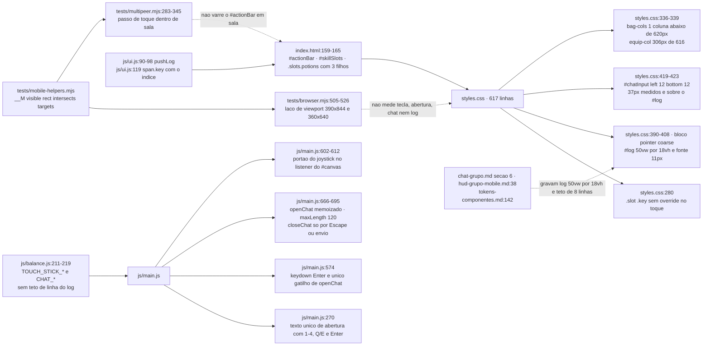
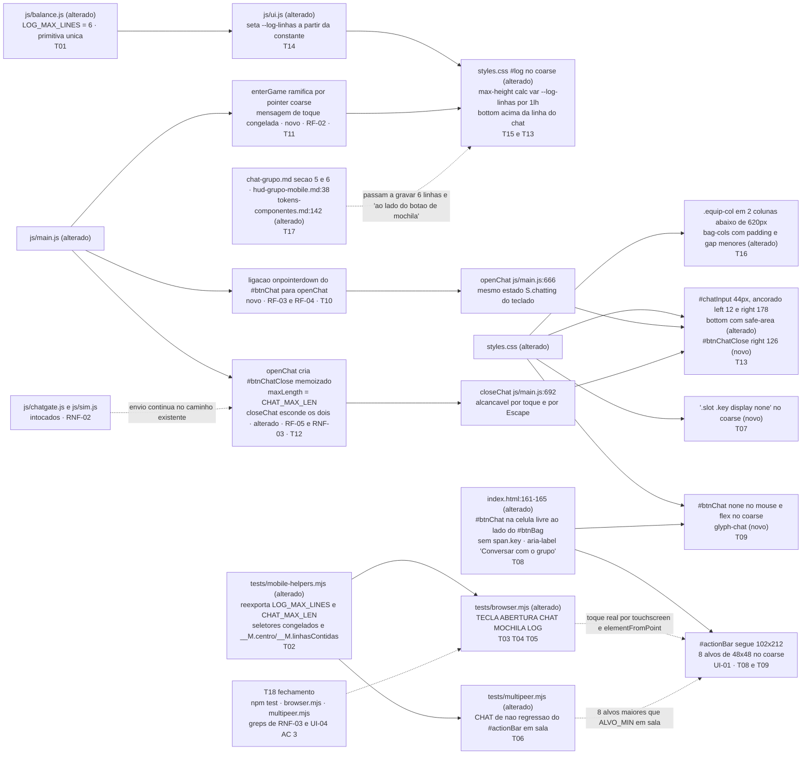

# Implementation Plan

## Request Summary

- **Objective**: fechar a metade de toque que sobrou depois de `mobile-hud-menus-inventario` —
  apagar as 7 dicas de tecla que o HUD ainda anuncia ao dedo, trocar a mensagem de abertura por
  uma que só cite o que existe na tela, dar ao chat um alvo de **abrir** e um de **fechar** por
  toque real com campo operável de 44px sem cobrir o `#log`, devolver 60px da `.equip-col` à grade
  da mochila em 360x640 com o `#btnSell` dentro da dobra, e encolher o `#log` de 9 para
  `LOG_MAX_LINES = 6` linhas — tudo medido por casos novos nos dois harness de navegador.
- **Scope**:
  - **in**: `js/balance.js` (uma primitiva nova), `index.html` (um `<button>` novo em
    `.slots.potions`), `styles.css` (bloco `pointer: coarse`, `#chatInput`, `#log`, mochila
    estreita), `js/main.js` (mensagem por modo de entrada, ligação do alvo de chat, alvo de fechar,
    `maxLength`), `js/ui.js` (custom property do teto de linhas), `tests/mobile-helpers.mjs`,
    `tests/browser.mjs`, `tests/multipeer.mjs`, e a reescrita de
    `.spec/init/design/chat-grupo.md` §5/§6, `.spec/init/design/hud-grupo-mobile.md:38` e
    `.spec/init/design/tokens-componentes.md:142`.
  - **out**: `js/sim.js`, `js/net.js`, `js/render.js`, `js/save.js`, `js/chatgate.js`, protocolo
    P2P, formato de save, entrega/antiflood/truncagem de mensagem, contador de caracteres a partir
    de 120, redesenho de HUD para grupo de 10, orientação landscape, rótulo do `#btnSell`.
- **Tier**: standard
- **Architecture references**: `AGENTS.md`, `docs/agents/architecture.md`,
  `docs/agents/domain_rules.md`

### Regras de arquitetura que governam cada task

| Regra | Fonte | Como aparece nas tasks |
|---|---|---|
| `js/sim.js` é estado puro, zero DOM | `AGENTS.md:37`, `AGENTS.md:56`, `docs/agents/architecture.md` "Layer responsibilities" | Nenhuma task toca `js/sim.js`; T18 reconfere `grep -c "document\|window" js/sim.js` = 0 e `node tests/sim.test.mjs` |
| Todo número de tuning vive em `js/balance.js` | `AGENTS.md:38`, `AGENTS.md:57` | T01 cria `LOG_MAX_LINES`; T14 alimenta a custom property a partir dele; T12 troca o literal `120` por `CHAT_MAX_LEN`; T02 lê tudo por `import * as balance` |
| Apresentação (`ui.js`, `render.js`) dona de HUD, telas e log; não muta estado do simulador nem envia pacote | `docs/agents/architecture.md`, tabela "Layer responsibilities" | O teto de linhas do `#log` é escrito por `js/ui.js` (T14), não por `js/main.js`; o alvo de chat só chama `openChat()` (T10) e o de fechar só chama `closeChat()` (T12) — nenhum caminho novo de envio |
| Composição (`main.js`) é cola de input, delega regra a `sim.js` e política de sala a `room.js` | `docs/agents/architecture.md` | T10, T11 e T12 mexem só em entrada de UI e texto; nenhuma regra nova |
| Antiflood do chat é do host, 3 por 5 s | `docs/agents/domain_rules.md` seção "Chat", `js/balance.js:218-219` | Uma mensagem originada no celular continua entrando por `chatGate.clean()` em `js/main.js:673-685`; T12 não duplica esse caminho |
| Testes sem framework, `process.exit(failures ? 1 : 0)` | `AGENTS.md:32`, `AGENTS.md:43` | T03-T05 mantêm `errors[]` (`tests/browser.mjs:28`) e T06 mantém `check()`/`failures` (`tests/multipeer.mjs:58-62`) |
| pt-BR em comentário, log, texto de UI e label de teste; identificador em inglês | `AGENTS.md:45`, `AGENTS.md:51` | Todas as tasks; ver OQ-01 sobre o nome `LOG_MAX_LINES` |
| Sem dependência de runtime, sem passo de build | `AGENTS.md:60-61` | Nenhuma task adiciona pacote; T18 confere `package.json` e `vercel.json` |
| Alvo de toque mínimo 44x44 | `.spec/init/design/tokens-componentes.md:151`, `ALVO_MIN` em `tests/mobile-helpers.mjs` | T08/T09 (abrir), T12/T13 (campo e fechar), T16 (linhas da `.equip-col` continuam ≥ 44px) |

## AS IS — Componentes impactados

Recorte verificado no HEAD `2285154`: o CSS de toque pinta as 7 dicas de tecla, mantém o `#log` em
`18vh` e deixa o `#chatInput` em 37px sobre ele; `js/main.js` tem um único texto de abertura, um
único gatilho de chat e nenhum alvo de fechar; os dois harness já entram em `pointer: coarse` mas
não olham para nada disso; e as três specs de design gravam a decisão que esta feature derruba.

## TO BE — Componentes propostos

`LOG_MAX_LINES` (T01) é a única primitiva nova e chega ao CSS por uma custom property escrita em
`js/ui.js` (T14), consumida pelo `#log` de toque (T15). O alvo de abrir nasce em `index.html` (T08),
ganha caixa em `styles.css` (T09) e handler em `js/main.js` (T10). O alvo de fechar nasce dentro do
bloco memoizado de `openChat()` (T12) e é posicionado em `styles.css` (T13), que também sobe o
`#log` para liberar a faixa do campo. A mensagem de abertura por modo de entrada é T11, a mochila é
T16, as três specs de design são T17, e a medição de tudo isso — escrita **antes** da
implementação, vermelha de propósito — é T02 a T06.

## Strings e seletores congelados

Congelados aqui porque CT-01 AC 2 exige seletor idêntico nos dois harness e RF-02 AC 5 exige que a
mensagem de toque e o `aria-label` não divirjam. Qualquer mudança nestes cinco valores é mudança de
PLAN, não de implementação.

| Item | Valor congelado | Consumidores |
|---|---|---|
| Seletor do alvo de abrir | `#btnChat` | T02 (`SEL_CHAT_ABRIR`), T03, T04, T06, T08, T09, T10 |
| `aria-label` do alvo de abrir | `Conversar com o grupo` | T08 (DOM), T11 (mensagem), T03 (lido do DOM em runtime) |
| Seletor do alvo de fechar | `#btnChatClose` | T02 (`SEL_CHAT_FECHAR`), T04, T12, T13 |
| `aria-label` do alvo de fechar | `Fechar conversa` | T12, T04 |
| Mensagem de abertura em `pointer: coarse` | `Arraste o polegar na metade esquerda para o joystick; use os botões à direita para magias, poções e mochila; toque em <b>Conversar com o grupo</b> para falar.` | T11 (string), T03 (regex positiva e negativa) |
| Mensagem de abertura em mouse | `Use <b>1–4</b> para magias, <b>Q/E</b> para poções, <b>Enter</b> para conversar.` — byte a byte igual a `js/main.js:270`, travessão U+2013 | T11 (ramo preservado), T03 (RF-02 AC 3) |

A mensagem de toque passa nas quatro regex negativas de RF-02 AC 1 (`/1\s*[–-]\s*4/`, `/Q\s*\/\s*E/`,
`/\bTab\b/`, `/\bEnter\b/`), casa `/joystick/i` e contém o `aria-label` verbatim. Ela **não** é
montada lendo o `aria-label` do DOM: a AC 5 existe para reprovar quando o rótulo muda sozinho, e
montar a string a partir do botão tornaria a AC incapaz de falhar — exatamente o defeito que o
desenvolvedor apontou em UI-01 AC 4.

## Geometria congelada da linha de chat no toque

Derivada da convenção que `#portalHold` já usa em `styles.css:538` (12 de gutter + 102 de
`#actionBar` + 12 de respiro = 126). Nenhuma medida nova de tuning entra em `js/balance.js`: são
offsets de layout, no mesmo padrão dos 126/138 já escritos no CSS.

| Caixa | Regra CSS no `pointer: coarse` | 390x844 | 360x640 |
|---|---|---|---|
| `#chatInput` | `left: 12px; right: calc(126px + 52px); width: auto; min-block-size: 44px; bottom: max(12px, env(safe-area-inset-bottom))` | x 12–212, h ≥ 44 | x 12–182, h ≥ 44 |
| `#btnChatClose` | `right: 126px; min-inline-size/min-block-size: 44px; bottom: max(12px, env(safe-area-inset-bottom))` | x 220–264 | x 190–234 |
| `#actionBar` (inalterado) | `right: 12px`, 102px de largura | x 276–378 | x 246–348 |
| `#log` | `bottom: calc(max(12px, env(safe-area-inset-bottom)) + 52px)` | topo em 684,3 com 6 linhas | oculto abaixo de 460px de altura |

Folga de 8px entre campo e alvo de fechar (UI-05 AC 4), 12px entre o alvo de fechar e o
`#actionBar`, e nenhuma das duas caixas cruza a barra em nenhuma das 7 alturas de `ALTURAS_UI03`
(UI-02 AC 5 mede a de 440).

## Tasks

### T01 — `LOG_MAX_LINES` em `js/balance.js`
- **Files**: `js/balance.js`
- **Change**: acrescentar, logo depois do bloco `// ---------- Chat ----------` (`js/balance.js:215-219`),
  a seção `// ---------- Registro ----------` com `export const LOG_MAX_LINES = 6;` e comentário
  pt-BR de uma linha registrando o porquê: 6 linhas = 95,7px com o `line-height` medido de 15,95px
  = ~37% menos área pintada em 390x844 que as 9 de hoje, sem cair abaixo das 5–6 linhas que uma
  conversa de grupo de 10 precisa. **Única primitiva nova da feature**: a altura do `#log` é
  consequência medida dela (UI-04), nunca uma segunda constante, e nenhum valor em `vh` é
  introduzido. Ver OQ-01 sobre o idioma do identificador.
- **Covers**: UI-04, RNF-03
- **Tests**: `npm test` — as 10 suítes continuam verdes com `js/balance.js` alterado
- **Risk**: Low — export novo, nenhum consumidor existente muda
- **Dependencies**: none

### T02 — Helpers compartilhados: constante, seletores e medidores
- **Files**: `tests/mobile-helpers.mjs`
- **Change**: (a) reexportar `LOG_MAX_LINES` e `CHAT_MAX_LEN` a partir do `import * as balance` já
  existente (`tests/mobile-helpers.mjs:20`) — namespace, não import nomeado, pelo motivo já
  comentado no topo do arquivo; (b) estender `errosDeConstante(prefixo)` com a checagem
  `LOG_MAX_LINES === 6` e `CHAT_MAX_LEN === 140`, para que a ausência do export vire erro medido em
  vez de `NaN` calado; (c) exportar os seletores congelados `SEL_CHAT_ABRIR = '#btnChat'` e
  `SEL_CHAT_FECHAR = '#btnChatClose'` (CT-01 AC 2 — nada de `nth-child` nem busca por texto);
  (d) acrescentar dentro de `installHelpers` dois medidores a `window.__M`:
  `centro(alvo)` devolvendo `{ x, y }` do centro do retângulo (ou `null`) para os toques reais, e
  `linhasContidas(sel, filhoSel)` contando os filhos cujo retângulo cai **inteiramente** dentro do
  retângulo do pai (`top >= pai.top && bottom <= pai.bottom`), que é a régua de UI-04 AC 1. Ambos
  null-safe. Comentários em pt-BR explicando por que a contagem é por contenção de retângulo
  inteiro e por que o `mask-image` de `styles.css:253` não participa.
- **Covers**: CT-01, CT-02, UI-04, RNF-03
- **Tests**: `URL=http://localhost:5173 npm run test:browser` e `npm run test:multipeer:quick` —
  os dois harness continuam ligando o módulo e saem com o mesmo código de hoje (0), porque ainda
  não há caso novo
- **Risk**: Low — arquivo compartilhado pelos dois harness; só acrescenta exports e métodos
- **Dependencies**: T01

### T03 — Casos `TECLA` e `ABERTURA` em `tests/browser.mjs`, mais a passagem de mouse
- **Files**: `tests/browser.mjs`
- **Change**: (a) `medirTeclas(page, ctx)` — conta `document.querySelectorAll('.slot .key').length`
  (esperado 7 em qualquer modo, RF-01 AC 2) e quantos passam em `__M.visible` (esperado 0 no toque,
  7 no mouse); erros `TECLA: <ctx> ...` com as duas contagens medidas.
  (b) `medirAbertura(page, ctx, modo)` — lê `#log` `innerText` e o `
` que carrega a linha de
  abertura; assere as quatro regex negativas de RF-02 AC 1, a classe `system` no `
` (AC 4), e no
  modo toque a lista positiva de AC 5: `/joystick/i` mais o `aria-label` lido em runtime de
  `document.querySelector(SEL_CHAT_ABRIR)` — **sem literal do rótulo no teste**; guarda a string
  medida num `Map` por modo para a comparação estrita de AC 2 no fim do arquivo.
  (c) `abrirMouse()` — abre uma aba em `VIEWPORT_DESKTOP` (1280x760, sem `hasTouch`), com
  `installHelpers`, escolhe vocação, entra em solo e devolve a página, para RF-01 AC 3, RF-02 AC 3,
  UI-01 AC 6 e UI-04 AC 4 serem medidos na mesma execução dos casos de toque.
  (d) chamar `medirAbertura` **imediatamente** depois de `abrirToque(viewport)`, antes de qualquer
  caso que empurre linha no `#log`, e `medirTeclas` na sequência; no fim, comparar as strings dos
  dois modos (`ABERTURA: as duas mensagens são iguais — ...`).
  (e) UI-01 AC 6 na aba de mouse: `__M.visible(SEL_CHAT_ABRIR) === false`,
  `getComputedStyle(...).display === 'none'` e a `.slots.potions` com exatamente 3 `.slot` visíveis
  — prova que o botão novo não entra no layout de mouse, sem cravar a largura da barra.
  **Todo acesso é null-safe**: contra o código de hoje `#btnChat` não existe, e o caso precisa
  emitir `ABERTURA: <ctx> não encontrou #btnChat para ler o aria-label` em vez de estourar
  `TypeError` — uma exceção abortaria o arquivo e mataria os outros quatro prefixos de CT-02 AC 6.
- **Covers**: RF-01, RF-02, UI-01 (AC 6), UI-04 (AC 4), CT-01, CT-02, RNF-06
- **Tests**: `URL=http://localhost:5173 npm run test:browser` — a corrida passa a sair 1 com pelo
  menos um erro `TECLA` (7 visíveis nos dois alvos) e um `ABERTURA` (mensagem de teclado no toque);
  `npm test` continua 0
- **Risk**: Medium — vermelho de propósito (CT-02 AC 6); se qualquer acesso não for null-safe o
  harness aborta e esconde os demais prefixos
- **Dependencies**: T02

### T04 — Casos `CHAT` em `tests/browser.mjs` com toque real
- **Files**: `tests/browser.mjs`
- **Change**: `medirChat(page, ctx)`, chamado depois de `medirMochila` (que já fecha o `#bag`) e
  antes de `medirLog`, com comentário em pt-BR no topo registrando a **proibição de CT-02 AC 1**:
  `element.click()`, `page.click()` e `new MouseEvent('click')` são proibidos aqui porque um clique
  programático já escondeu esta exata classe de defeito nesta casa (`styles.css:222-226`).
  Roteiro:
  1. **Abrir** — `__M.centro(SEL_CHAT_ABRIR)`; conferir o hit test com
     `document.elementFromPoint(cx, cy)` devolvendo o próprio botão ou descendente (RF-03 AC 2);
     `page.touchscreen.tap(cx, cy)`; medir `rect(SEL_CHAT_ABRIR)` ≥ `ALVO_MIN` nos dois eixos
     (UI-01 AC 1), `pointerEvents === 'auto'` (RF-03 AC 3) e `left >= TOUCH_STICK_ZONE * innerWidth + TOUCH_STICK_RADIUS`
     (RF-04 AC 3, lido dos exports, nunca 259/244 literais).
  2. **Estado depois do toque** — `#chatInput` existe, sem `hidden`, `__M.visible` true,
     `document.activeElement.id === 'chatInput'`, `window.__SF.chatting === true` (RF-03 AC 1 e AC 4);
     `__SF.stick.active === false`, `__SF.moveGoal === null` e `#stick` com `hidden` (RF-04 AC 1 e
     AC 2 — **guardas verdes por construção**, ver A-07: nenhum implementador deve "consertar" as
     duas por passarem de primeira).
  3. **Campo** — `rect('#chatInput').height >= 44` (UI-02 AC 1); `intersects(rect('#chatInput'), rect('#log')) === false`
     **com pré-condição** `rect('#log') !== null`, senão registrar `CHAT: <ctx> #log oculto por
     max-height: 460px — UI-02 AC 2 pulada` no console e não asserir (UI-02 AC 2); caixa inteira
     dentro da viewport (AC 3); `document.querySelector('#chatInput').maxLength === CHAT_MAX_LEN`
     (RNF-03 AC 2).
  4. **Alvo de fechar** — `rect(SEL_CHAT_FECHAR)` ≥ 44x44, `pointerEvents === 'auto'`, dentro da
     viewport, `intersects` com `#chatInput` false e com `#log` false quando o log existe
     (UI-05 AC 1, AC 3, AC 4); hit test por `elementFromPoint` no centro (RF-05 AC 4).
  5. **Fechar por toque** — digitar a sentinela pt-BR `sentinela de conversa` com
     `page.keyboard.type`, `page.touchscreen.tap()` no centro do alvo de fechar, e asserir
     `__SF.chatting === false`, `#chatInput` com `hidden` e `__M.visible` false, `activeElement`
     diferente do campo, `#log` `innerText` **sem** a sentinela (RF-05 AC 1, AC 2, AC 5) e
     `__M.visible(SEL_CHAT_FECHAR) === false` com o chat fechado (UI-05 AC 2).
  6. **Reabrir** — segundo `tap` no alvo de abrir: repete o passo 2,
     `document.querySelectorAll('#chatInput').length === 1` e `#chatInput.value === ''`
     (RF-03 AC 5, RF-05 AC 3); fechar de novo ao final para não vazar estado para os casos
     seguintes.
  7. **UI-02 AC 6 — bloqueio temporário** — com o chat aberto, `page.touchscreen.touchStart(cx, cy)`
     no **centro do campo** e leitura de `__SF.stick.active === false`, seguido de `touchEnd()`;
     depois de fechar, `touchStart()` na **mesma coordenada** e leitura de
     `__SF.stick.active === true`, seguido de `touchEnd()`. **Obrigatoriamente `touchStart`/`touchEnd`
     separados**: `endStick` está pendurado em `pointerup` no `window` (`js/main.js:644-649`), então
     um `tap()` completo devolveria `stick.active === false` sempre e a AC viraria falso vermelho
     (ver A-04). Registrar isso em comentário pt-BR no caso.
  8. **UI-02 AC 5 em 390x440** — dentro do laço de `ALTURAS_UI03` já existente, na altura 440:
     abrir por toque real e asserir `rect('#chatInput')` não-nulo, `height >= 44`, as quatro
     comparações de viewport e `intersects(rect('#chatInput'), rect('#actionBar')) === false`;
     fechar por toque ao sair.
  Toda falha vira `errors.push('CHAT: <ctx> <detalhe em pt-BR com o valor medido>')`; todo acesso é
  null-safe pelo mesmo motivo de T03.
- **Covers**: RF-03, RF-04, RF-05, UI-01, UI-02, UI-05, CT-01, CT-02, RNF-03 (AC 2)
- **Tests**: `URL=http://localhost:5173 npm run test:browser` — passa a sair 1 com erros `CHAT`
  medidos (hoje: `elementFromPoint` na célula livre devolve `.slots potions`, `#btnChat` ausente,
  `#chatInput` 37px, interseção com o `#log` verdadeira, `maxLength` 120, alvo de fechar ausente)
- **Risk**: High — é o caso mais longo, mexe em estado de página (chat aberto, foco, toques) e
  precisa devolver a página limpa para `medirBarra`/`medirGeometria`; ordem de chamada e
  null-safety são parte da entrega
- **Dependencies**: T02, T03

### T05 — Casos `MOCHILA` e `LOG` em `tests/browser.mjs`
- **Files**: `tests/browser.mjs`
- **Change**: (a) dentro de `medirMochila` (`tests/browser.mjs:321`), com o painel aberto e
  `bag.scrollTop = 0`, medir `rect('#equipCol')` e `rect('#bag')` e asserir, **apenas em 360x640**
  (UI-03 é escrita para esse alvo; em 390x844 a medida é impressa no relatório, não asserida):
  `equipCol.height <= 0.40 * bag.height` (AC 3) e `#btnSell` não-nulo com
  `top >= bag.top && bottom <= bag.bottom` (AC 4); acrescentar também a guarda de AC 1 sobre os 5
  primeiros filhos de `#invGrid` (mesma coordenada `top`, retângulo inteiro dentro do painel) e a
  de AC 2 (`grid-template-columns` com 5 valores e `INV_SIZE` slots), reaproveitando o `INV_SIZE` já
  importado em `tests/browser.mjs:7`. A razão é calculada no harness a partir de dois
  `getBoundingClientRect()` — nunca lida do CSS (RNF-07).
  (b) `medirLog(page, ctx)` — empurra `LOG_MAX_LINES + 3` = 9 linhas curtas em pt-BR no `#log`
  (uma `
` por linha, prepend como `UI.pushLog` faz), conta por
  `__M.linhasContidas('#log', 'p')` e assere `<= LOG_MAX_LINES` (AC 1); assere
  `rect('#log').height <= LOG_MAX_LINES * parseFloat(getComputedStyle(log).lineHeight) + 1` com o
  `line-height` medido na página (AC 2); quando `rect('#log') === null` (alturas 440, 380 e 360),
  **pular com registro explícito** no console — `LOG: 390x440 #log oculto por max-height: 460px,
  ACs 1 e 2 puladas` — nunca dar por aprovado em silêncio (AC 5). Chamar nos dois alvos cheios,
  dentro do laço de `ALTURAS_UI03` e uma vez na aba de mouse de T03 para UI-04 AC 4 (`#log` em
  `min(340px, 42vw)` por `26vh`, medido). `medirLog` é o **último** caso do alvo, porque suja o
  `#log` com as sentinelas.
- **Covers**: UI-03, UI-04, CT-02, RNF-07
- **Tests**: `URL=http://localhost:5173 npm run test:browser` — passa a sair 1 com erros `MOCHILA`
  (49,7% contra o teto de 40%; `#btnSell` em y=724,3 contra a borda em y=628) e `LOG` (9 e 7 linhas
  contra o teto de 6; 151,9px e 115,2px contra o teto derivado de 95,7px)
- **Risk**: Medium — as sentinelas do `#log` alteram o estado da página; a ordem de chamada é parte
  da entrega
- **Dependencies**: T02, T03

### T06 — Não regressão `CHAT` do `#actionBar` em sala real
- **Files**: `tests/multipeer.mjs`
- **Change**: no passo de toque em sala (`tests/multipeer.mjs:283-345`, laço de
  `VIEWPORT_MOBILE`/`VIEWPORT_SMALL` na aba do host), acrescentar um bloco com prefixo `CHAT`:
  `__M.targets('#actionBar')` devolve **8** alvos, todos `>= ALVO_MIN` nos dois eixos (UI-01 AC 2 —
  hoje devolve 7); `Math.abs(rect('#actionBar').width - BARRA_LARGURA) < 0.5` e
  `Math.abs(rect('#actionBar').height - 212) < 0.5` (UI-01 AC 3 e AC 5);
  `intersects(rect('#actionBar'), rect('#hudRight')) === false`; e o alvo de abrir visível com
  `rect(SEL_CHAT_ABRIR)` ≥ 44x44 dentro de sala. Padrão da casa:
  `check('CHAT: <rótulo pt-BR>', <condição>, '<valor medido>')` (CT-02 AC 4), sem `.click()`.
  Nada de abrir chat aqui: o roteiro de toque real de RF-03/RF-05 vive inteiro em
  `tests/browser.mjs` (CT-02 AC 5).
- **Covers**: UI-01, CT-01, CT-02, RNF-05
- **Tests**: `npm run test:multipeer` (`PEERS=10 CASE=all node tests/multipeer.mjs`) e
  `npm run test:multipeer:quick` — passam a sair 1 com `CHAT: ... 7 alvos, esperado 8`
- **Risk**: Medium — o harness P2P é caro e sensível a estado de painel aberto; medir só geometria
  mantém o custo baixo
- **Dependencies**: T02

### T07 — Dicas de tecla invisíveis no toque
- **Files**: `styles.css`
- **Change**: dentro do bloco `@media (pointer: coarse)` já existente (`styles.css:390-408`),
  acrescentar `.slot .key { display: none; }` com comentário pt-BR citando a medição: 7 spans
  visíveis no dedo — `1`,`2`,`3`,`4` de `js/ui.js:119` e `Q`,`E`,`Tab` de `index.html:162-164` —
  anunciando teclas que o celular não tem. **Esconder, nunca remover**: os nós continuam no DOM
  (RF-01 AC 2) porque são a fonte do rótulo de teclado no mouse (RF-01 AC 3, RNF-06). Não tocar em
  `js/ui.js:119` nem em `index.html:162-164`.
- **Covers**: RF-01
- **Tests**: `URL=http://localhost:5173 npm run test:browser` — nenhum erro com prefixo `TECLA` na
  saída (os demais prefixos seguem vermelhos até a fase 5)
- **Risk**: Low — uma regra dentro de um bloco que só o toque enxerga
- **Dependencies**: T03 (o caso `TECLA` precisa existir antes para a fase ter gate)

### T08 — `#btnChat` na célula livre ao lado do `#btnBag`
- **Files**: `index.html`
- **Change**: acrescentar, como **quarto e último filho** de `.slots.potions` (`index.html:161-165`,
  logo depois do `#btnBag`), `<button class="slot chat" id="btnChat" aria-label="Conversar com o grupo"><i class="glyph-chat"></i></button>`.
  A grade de toque é `repeat(2, 1fr)` com 3 filhos, então o quarto cai na célula livre de 48x48
  medida em (330, 672) no alvo 390x844 e (300, 468) no 360x640 — **ao lado** do `#btnBag`, sem
  quarta linha, mantendo o `#actionBar` em 102x212 (UI-01; a leitura literal de `chat-grupo.md` §6
  foi rejeitada pelo desenvolvedor).
  **Sem `` dentro do botão**: um oitavo nó `.slot .key` reprovaria RF-01 AC 2, que
  exige exatamente 7. O `aria-label` é o valor congelado — RF-02 AC 5 o lê do DOM em runtime.
  Nenhuma outra linha de `index.html` muda.
- **Covers**: UI-01, RF-03, CT-01
- **Tests**: `URL=http://localhost:5173 npm run test:browser` — o erro `CHAT: ... não encontrou
  #btnChat` desaparece; `npm run test:multipeer:quick` — `CHAT` passa a contar 8 alvos
- **Risk**: Medium — é o único arquivo de marcação tocado; um filho a mais em `.slots.potions`
  mudaria a largura da barra no mouse se T09 não gatilhar o `display`
- **Dependencies**: none

### T09 — Caixa e glifo do `#btnChat`, sem mexer no mouse
- **Files**: `styles.css`
- **Change**: (a) fora de qualquer media query, junto das demais regras de `.slot`,
  `#btnChat { display: none; }` com comentário pt-BR: no desktop a `.slots` é flex e um quarto slot
  alargaria o `#actionBar` de 436px, reprovando UI-01 AC 6 e RNF-06 — o alvo é de toque, e no mouse
  o `Enter` de `js/main.js:574` continua sendo o caminho.
  (b) dentro do bloco `@media (pointer: coarse)` (`styles.css:390-408`), `#btnChat { display: flex; }`
  — id contra id, para vencer a regra de (a) — herdando os 48x48 de `.slot` daquele bloco.
  (c) `.glyph-chat` no mesmo padrão de `.glyph-bag` (`styles.css:299`): bloco com gradiente em
  `var(--chat)` e cantos `3px 3px 3px 0` sugerindo balão, `width: 24px; height: 20px`.
  Nada de largura/altura fixa no `#actionBar`: os 102x212 continuam derivados do grid.
- **Covers**: UI-01, RNF-06
- **Tests**: `URL=http://localhost:5173 npm run test:browser` — sem erro `BARRA` novo; `CHAT` deixa
  de acusar alvo abaixo de 44x44 e o caso de mouse confirma `#btnChat` invisível com 3 `.slot`
  visíveis em `.slots.potions`
- **Risk**: Medium — o gate de `display` é o que protege a geometria de mouse
- **Dependencies**: T08

### T10 — Ligação do alvo de chat com `openChat()`
- **Files**: `js/main.js`
- **Change**: ao lado das ligações de HUD já existentes (`js/main.js:654-657`), acrescentar
  `UI.el('btnChat').onpointerdown = (e) => { e.preventDefault(); openChat(); };` com comentário
  pt-BR: `onpointerdown` é o padrão da casa para slot de ação (`js/ui.js:120`) e evita o clique
  sintético; `preventDefault()` impede o foco do botão de brigar com o `chatEl.focus()` de
  `js/main.js:687`. **O handler só chama `openChat()`** — não muta estado do simulador, não envia
  pacote e não duplica o caminho de envio, que continua em `js/main.js:673-685` passando por
  `chatGate` (`docs/agents/architecture.md`, tabela de camadas; `docs/agents/domain_rules.md`,
  seção "Chat").
  Não tocar no listener de `pointerdown` do `#canvas` (`js/main.js:602`): o `#actionBar` é **irmão**
  do `#canvas`, então o toque no botão nunca chega ao portão do joystick — é isso que mantém
  RF-04 AC 1 e AC 2 verdes (A-07).
- **Covers**: RF-03, RF-04
- **Tests**: `URL=http://localhost:5173 npm run test:browser` — o roteiro `CHAT` de abrir passa:
  `elementFromPoint` devolve o botão, `#chatInput` nasce visível e focado, `__SF.chatting === true`,
  `stick.active === false`
- **Risk**: Medium — se o handler for `onclick`, o toque real ainda funciona, mas perde o padrão da
  casa e o `preventDefault` do foco
- **Dependencies**: T08

### T11 — Mensagem de abertura por modo de entrada
- **Files**: `js/main.js`
- **Change**: em `enterGame()` (`js/main.js:255-272`), trocar a linha fixa de `js/main.js:270` por
  uma ramificação em `matchMedia('(pointer: coarse)').matches`, com **as duas strings lado a lado**
  (a de mouse byte a byte idêntica à de hoje, travessão U+2013 incluso) para a diferença de
  RF-02 AC 2 ficar óbvia na revisão. As duas saem pelo mesmo `UI.pushLog(<texto>, 'system')`
  (RF-02 AC 4), respeitando o teto de `CHAT_LOG_LINES` de `js/ui.js:97`. Usar exatamente as strings
  congeladas na tabela deste PLAN: a de toque cita joystick, botões da direita, mochila e o rótulo
  `Conversar com o grupo` — o mesmo texto do `aria-label` de T08 — e não contém `1–4`, `Q/E`, `Tab`
  nem `Enter`. **Não** montar a string lendo o `aria-label` do DOM: RF-02 AC 5 existe para reprovar
  a divergência, e montar a partir do botão tornaria a AC incapaz de falhar.
- **Covers**: RF-02, RNF-04, RNF-06
- **Tests**: `URL=http://localhost:5173 npm run test:browser` — nenhum erro `ABERTURA`: regex
  negativas limpas no toque, `/joystick/i` e o `aria-label` presentes, string de mouse intacta e as
  duas diferentes entre si
- **Risk**: Low — texto de UI; o risco real é divergir do `aria-label`, que o caso pega
- **Dependencies**: T08 (o `aria-label` precisa estar no DOM para o caso `ABERTURA` ler)

### T12 — Alvo de fechar, `maxLength` e o par abrir/fechar no mesmo estado
- **Files**: `js/main.js`
- **Change**: no bloco de conversa (`js/main.js:664-695`):
  (a) `chatEl.maxLength = CHAT_MAX_LEN` no lugar do literal `120` de `js/main.js:671` —
  `CHAT_MAX_LEN` já está importado em `js/main.js:15` e vale 140, como `chat-grupo.md` §3 pede
  (RNF-03 AC 2, `AGENTS.md:57`).
  (b) declarar `let chatCloseEl = null;` ao lado de `let chatEl = null;` (`js/main.js:665`) e, dentro
  do **mesmo** bloco memoizado `if (!chatEl) { ... }`, criar
  `<button id="btnChatClose" class="x" type="button" aria-label="Fechar conversa">✕</button>`
  anexado a `UI.el('game')`, com
  `chatCloseEl.onpointerdown = (e) => { e.preventDefault(); closeChat(); };` — o handler chama
  `closeChat()` direto, sem duplicar lógica e sem estado paralelo (RF-05 AC 3).
  (c) em `openChat()`, depois do `chatEl.classList.remove('hidden')`, remover `hidden` do alvo de
  fechar; em `closeChat()` (`js/main.js:692-695`), acrescentar `hidden` ao alvo de fechar junto do
  campo — a visibilidade do alvo passa a ser exatamente `S.chatting` (UI-05 AC 2), governada pelo
  `.hidden { display: none !important }` de `styles.css:39`.
  (d) comentário pt-BR registrando o porquê: `closeChat()` só era alcançado por `Escape`
  (`js/main.js:571`) ou por envio não vazio, e celular não tem `Escape` — enviar vazio é descartado
  em silêncio por `chatGate.clean('')`, prendendo o jogador no campo.
  Nada muda no caminho de teclado: `Enter` abre, `Enter` envia, `Escape` fecha (RNF-06).
- **Covers**: RF-05, UI-05, RNF-03 (AC 2), RNF-06
- **Tests**: `URL=http://localhost:5173 npm run test:browser` — o roteiro `CHAT` de fechar passa:
  `chatting === false` depois do toque, campo oculto e desfocado, sentinela ausente do `#log`,
  reabertura com `value === ''` e um único `#chatInput`; `maxLength === 140`
- **Risk**: Medium — mexe no bloco memoizado do chat, que o caminho de teclado compartilha; um
  `hidden` esquecido em `closeChat()` deixa o ✕ flutuando sobre o jogo
- **Dependencies**: none (independe de T08/T10; a fase 3 executa depois delas por ordem de gate)

### T13 — Linha de chat no toque: 44px, área segura e `#log` acima do campo
- **Files**: `styles.css`
- **Change**: dentro do bloco `@media (pointer: coarse)` (`styles.css:390-408`), usando a geometria
  congelada deste PLAN:
  (a) `#chatInput { left: 12px; right: calc(126px + 52px); width: auto; min-block-size: 44px; box-sizing: border-box; bottom: max(12px, env(safe-area-inset-bottom)); }`
  — 44px pelo padrão já usado em `.x` e `#crewChip` (`styles.css:540-543`, `:553-570`); o `126px`
  repete a conta que `#portalHold` já faz em `styles.css:538` (12 de gutter + 102 de `#actionBar` +
  12 de respiro) e o `52px` reserva o alvo de fechar mais 8 de folga. **`max(12px, env(safe-area-inset-bottom))`
  é exigência de `tokens-componentes.md:146` e hoje o campo usa `bottom: 12px` puro; a emulação
  reporta `env()` como 0, então nenhum harness pega — é item de revisão humana no code review desta
  task, deliberadamente sem AC (RNF-07 não admite limiar que a página em execução não mede).**
  (b) `#btnChatClose { position: absolute; right: 126px; bottom: max(12px, env(safe-area-inset-bottom)); z-index: 25; display: inline-flex; }`
  com a mesma moldura do campo (`background: rgba(9, 7, 13, .96)`, `border: 1px solid var(--ember)`)
  — o piso de 44x44 vem da regra `.x` do bloco de toque (`styles.css:540-543`). Fora do toque,
  `#btnChatClose { display: none; }` junto da regra de (a) do T09, para o desktop não ganhar caixa
  nova (UI-05 AC 5, RNF-06).
  (c) `#log { bottom: calc(max(12px, env(safe-area-inset-bottom)) + 52px); }` — o log sobe 52px e
  passa a **nunca** cruzar o campo, cumprindo `chat-grupo.md` §5 sem estado novo em JS. Empilhamento
  estático de propósito: a alternativa dinâmica (classe `chatting` no `#game`, ou
  `#game:has(#chatInput:not(.hidden))`) satisfaz a mesma AC, custa um estado a mais e fica registrada
  em OQ-02. O `#log` continua no canto inferior esquerdo e dentro da zona do joystick (UI-04 AC 6);
  a sobreposição do campo com a zona é permitida por UI-02 AC 6.
  Nenhuma regra fora do bloco de toque muda: o desktop mantém `#chatInput` em
  `left: 12px; bottom: 12px; width: min(340px, 60vw)` (`styles.css:419-423`).
- **Covers**: UI-02, UI-05, RNF-06
- **Tests**: `URL=http://localhost:5173 npm run test:browser` — `CHAT` deixa de acusar altura 37px,
  interseção com o `#log`, alvo de fechar ausente ou sobreposto, e o caso de 390x440 passa
- **Risk**: Medium — três caixas ancoradas na mesma faixa inferior; erro de offset cruza o
  `#actionBar` ou o `#log`
- **Dependencies**: T12

### T14 — `js/ui.js` publica o teto de linhas como custom property
- **Files**: `js/ui.js`
- **Change**: acrescentar `LOG_MAX_LINES` ao import de `./balance.js` (`js/ui.js:4`) e, em escopo
  de módulo junto das demais preparações de HUD, escrever
  `document.documentElement.style.setProperty('--log-linhas', LOG_MAX_LINES);` com comentário
  pt-BR: o teto é primitiva de `js/balance.js` (`AGENTS.md:57`) e o CSS precisa dele sem repetir o
  número; o `#log` é HUD, e HUD é de `js/ui.js` pela tabela de camadas de
  `docs/agents/architecture.md`. **Sem fallback numérico no CSS**: `var(--log-linhas, 6)` reporia o
  literal em `styles.css` e reprovaria RNF-03 AC 1 — se a propriedade faltar, o caso `LOG` acusa
  altura fora do teto, que é o comportamento desejado.
- **Covers**: UI-04, RNF-03
- **Tests**: `npm test` sai 0; `URL=http://localhost:5173 npm run test:browser` — o `LOG` continua
  vermelho até T15, mas nenhum `PAGEERROR` novo aparece
- **Risk**: Low — uma linha de efeito colateral no módulo de apresentação
- **Dependencies**: T01

### T15 — `#log` de toque em `LOG_MAX_LINES` linhas
- **Files**: `styles.css`
- **Change**: no bloco `@media (pointer: coarse)`, trocar `max-height: 18vh` do `#log`
  (`styles.css:391`) por `max-height: calc(var(--log-linhas) * 1lh);`, mantendo `width: 50vw`,
  `font-size: 11px`, a máscara e o `pointer-events: none`. `1lh` resolve o `line-height` medido do
  próprio elemento (15,95px hoje), então o teto vira 95,7px por consequência — nenhum número em
  `vh` e nenhum literal de linha entram no CSS (UI-04 AC 2 e AC 3, RNF-03 AC 1). Comentário pt-BR
  registrando a medição: 9 linhas contidas em 390x844 e 7 em 360x640 antes, teto de 6 depois, e a
  regra `@media (max-height: 460px) { #log { display: none } }` de `styles.css:410` continua
  valendo (UI-04 AC 5). O `#log` de mouse (`styles.css:249-251`, `min(340px, 42vw)` por `26vh`) não
  é tocado (UI-04 AC 4).
- **Covers**: UI-04, RNF-03, RNF-06
- **Tests**: `URL=http://localhost:5173 npm run test:browser` — nenhum erro `LOG`: contagem
  contida ≤ 6 nos dois alvos, altura ≤ 6 × `line-height` + 1, pulos registrados em 440/380/360 e
  `#log` de mouse intacto
- **Risk**: Medium — depende de `1lh` e da custom property de T14; se qualquer um falhar o
  `max-height` é ignorado e o log volta a crescer (o caso `LOG` pega)
- **Dependencies**: T14

### T16 — Mochila em telas estreitas: `.equip-col` em duas colunas
- **Files**: `styles.css`
- **Change**: no bloco `@media (max-width: 620px)` já existente (`styles.css:337`, onde `.bag-cols`
  vira coluna única — "reutilizar, não criar novos" por `tokens-componentes.md` §7):
  (a) `.equip-col { display: grid; grid-template-columns: repeat(2, 1fr); gap: 6px; }` — os 6
  campos passam de 6 linhas de 46px para 3, de 306px para ~150px, 24% do painel de 616 contra o
  teto de 40% (246px) e ~156px a menos de `scrollHeight`;
  (b) `.bag-cols { padding: 12px; gap: 12px; }` — mais ~12px de folga, levando o `scrollHeight`
  medido de 771 para ~603 contra `clientHeight` 614, o que traz `#btnSell` inteiro para dentro da
  caixa com `scrollTop === 0` (UI-03 AC 4);
  (c) `.equip-slot .nm { min-width: 0; overflow: hidden; text-overflow: ellipsis; white-space: nowrap; }`
  no mesmo bloco — em duas colunas cada linha cai para ~150px e um nome longo quebraria em duas
  linhas, engordando a linha e comendo a folga (mesmo tratamento de `.roster-row .rr-name`,
  `styles.css:341`).
  **Não reduzir o padding de `.equip-slot`**: a linha tem `row.onclick` quando há item equipado
  (`js/ui.js:261`) e por isso entra em `__M.targets('#bag')` — abaixo de 44px de altura ela reprova
  o caso `TOQUE` que já existe em `medirMochila`. Comentário pt-BR com os números medidos
  (306px = 49,7% antes; `#btnSell` em y=724,3 contra a borda em y=628). Desktop intocado: o bloco só
  vale abaixo de 620px de largura (RNF-06).
- **Covers**: UI-03
- **Tests**: `URL=http://localhost:5173 npm run test:browser` — nenhum erro `MOCHILA`:
  `.equip-col` ≤ 40% do painel, `#btnSell` inteiro na caixa, linha de 5 `.inv-slot` ainda visível,
  20 slots em 5 colunas, e as guardas antigas de transbordo (agora ativas, porque o conteúdo passa a
  caber) limpas
- **Risk**: High — é a task com mais efeito colateral geométrico: a guarda `transbordo` de
  `medirMochila` só liga quando o conteúdo cabe, então esta task **acorda** um teste que hoje dorme;
  nomes longos, canvas de 30px e o `.stat-block` podem comer a folga de ~11px
- **Dependencies**: T05

### T17 — Reescrever as três specs de design que esta feature derruba
- **Files**: `.spec/init/design/chat-grupo.md`, `.spec/init/design/hud-grupo-mobile.md`,
  `.spec/init/design/tokens-componentes.md`
- **Change**: no mesmo commit do CSS, com o desenvolvedor tendo aprovado reverter as decisões
  gravadas (Scope "In" da SPEC):
  (a) `chat-grupo.md` §6 — trocar o teto de "**8**" linhas por **`LOG_MAX_LINES = 6`, exportado de
  `js/balance.js`**, trocar "`#log` 50vw × 18vh — mantém" por "50vw de largura e altura derivada de
  `LOG_MAX_LINES × line-height` medido (95,7px hoje)", trocar "abaixo do botão de mochila" por
  "**ao lado do botão de mochila**, na célula livre de 48x48 do grid `.slots.potions`, mantendo o
  `#actionBar` em 102x212", e registrar que o campo pode cobrir a zona do joystick enquanto
  `S.chatting` é verdadeiro (UI-02 AC 6) e que existe alvo de fechar de 44x44 ao lado do campo
  (UI-05); em §5, registrar que no toque o `#log` fica permanentemente acima da faixa do campo
  (empilhamento estático) em vez de subir só na abertura.
  (b) `hud-grupo-mobile.md:38` — "Canto inferior esquerdo é o `#log` (50vw × 18vh)" vira "…(50vw de
  largura; altura derivada de `LOG_MAX_LINES`, 95,7px medidos), com a faixa imediatamente inferior
  reservada ao `#chatInput` e ao alvo de fechar".
  (c) `tokens-componentes.md:142` — na linha `pointer: coarse` da tabela de pontos de quebra,
  "Log 50vw/18vh" vira "Log 50vw / altura por `LOG_MAX_LINES`".
  Citar em cada edição o número medido que a motivou (9 e 7 linhas contidas hoje; 8 linhas inteiras
  exigiriam 19,9vh contra as 18vh que a mesma seção mandava manter em 360x640). Nenhuma outra seção
  dos três arquivos é tocada.
- **Covers**: escopo "In" da SPEC (consequência aceita de UI-01 e UI-04)
- **Tests**: `git diff --stat .spec/init/design/` mostra exatamente 3 arquivos; nenhuma linha citada
  por outra spec de design fica órfã (`grep -rn "18vh" .spec/init/design/` volta vazio)
- **Risk**: Low — documentação; o risco é esquecer um dos três arquivos
- **Dependencies**: none

### T18 — Fechamento: regressão completa e greps de fonte única
- **Files**: nenhum (verificação); correções pontuais voltam à task de origem
- **Change**: rodar e registrar, nesta ordem:
  (1) `npm test` — 10 suítes, saída 0 (RNF-05) e `node tests/sim.test.mjs` verde com
  `grep -c "document\|window\|navigator" js/sim.js` = 0 (RNF-02);
  (2) `URL=http://localhost:5173 npm run test:browser` com `npm run dev` de pé — saída **0**, sem
  `PAGEERROR` nem `REQFAIL` novos, e a saída contendo as medições dos cinco prefixos;
  (3) `PEERS=10 CASE=all node tests/multipeer.mjs` (`npm run test:multipeer`) — saída 0;
  (4) `git diff --name-only` não lista `js/sim.js`, `js/net.js`, `js/render.js`, `js/save.js`
  (RNF-02);
  (5) `grep -n "18vh" styles.css` vazio para o `#log` de toque e `grep -rn "maxLength = 120" js/`
  vazio (RNF-03 AC 2); `grep -rn "\b6\b" styles.css js/ui.js js/main.js` revisado à mão para
  confirmar que nenhum `6` é teto de linha fora de `js/balance.js` (UI-04 AC 3, RNF-03 AC 1);
  (6) `node -e` sobre `index.html` confirmando os ids/ganchos estáticos de CT-01 AC 1 mais o
  `#btnChat` novo, e `window.__SF`/`window.__VIEW_GET` ainda expostos (`js/main.js:1077-1078`,
  CT-01 AC 3);
  (7) `package.json` sem chave `dependencies` e `vercel.json` com `"framework": null` e
  `buildCommand` `echo 'sem build'` (RNF-01);
  (8) revisão manual pt-BR (RNF-04) das strings novas e do `max(12px, env(safe-area-inset-bottom))`
  do `#chatInput` (A-06 — sem AC, nenhum harness mede).
- **Covers**: RNF-01, RNF-02, RNF-03, RNF-04, RNF-05, RNF-06, RNF-07, CT-01, CT-02
- **Tests**: `npm test`, `URL=http://localhost:5173 npm run test:browser`,
  `npm run test:multipeer` — os três saem 0
- **Risk**: Medium — é o primeiro momento em que os três harness precisam estar verdes juntos
- **Dependencies**: T01–T17

## Execution Phases

| Phase | Tasks | Parallel-safe? |
|-------|-------|----------------|
| 1 — Primitiva e medição vermelha | T01, T02, T03, T04, T05, T06 | Parcial — T01 → T02 primeiro; T03 → T04 → T05 são o mesmo arquivo e vão em ordem; T06 é paralelo a T03-T05 |
| 2 — Dicas de tecla, alvo de chat e mensagem de abertura | T07, T08, T09, T10, T11 | Parcial — T07 é independente; T08 antes de T09, T10 e T11 |
| 3 — Chat operável e fechável no dedo | T12, T13 | Não — T13 estiliza o nó que T12 cria |
| 4 — Log em seis linhas | T14, T15 | Não — T15 consome a custom property de T14 |
| 5 — Mochila estreita e specs de design | T16, T17 | Sim — `styles.css` e `.spec/init/design/*` são disjuntos |
| 6 — Fechamento de regressão | T18 | Não se aplica — task única |

**Regra de gate das fases 1 a 5**: a medição é escrita antes da implementação de propósito
(CT-02 AC 6 exige que a união das duas saídas reprove hoje em `TECLA`, `ABERTURA`, `CHAT`,
`MOCHILA` e `LOG`). Entre a fase 1 e a fase 5, `node tests/browser.mjs` e `node tests/multipeer.mjs`
**saem 1 por construção**; o critério de cada fase é a **ausência do prefixo daquela fase** na
saída, nunca o código de saída. Só a fase 6 exige saída 0 nos três comandos. `npm test` sai 0 em
todas as fases.

Nenhuma fase depende de caso de harness escrito em fase posterior: todos os casos nascem na fase 1.

## Risks

| Risk | Blast radius | Mitigation | Rollback |
|------|-------------|------------|----------|
| R-01 — Um quarto filho em `.slots.potions` muda a caixa do `#actionBar` no mouse (flex) ou cria quarta linha no toque | `#actionBar` em todo viewport; UI-01 AC 3/AC 5/AC 6 e o `#hudRight` nas alturas 380 e 360 | `#btnChat { display: none }` fora do toque (T09); barra medida em 102x212 nos dois alvos cheios e nas 7 alturas de `ALTURAS_UI03` (T04/T06) | Remover o `<button>` de `index.html` e as duas regras de `styles.css` — duas edições, sem estado |
| R-02 — Harness vermelho que **estoura** em vez de reprovar (`#btnChat` ausente hoje) aborta o arquivo e esconde os outros quatro prefixos | `tests/browser.mjs` inteiro; CT-02 AC 6 | Null-safety obrigatória em T03/T04/T05: `__M.rect`/`__M.centro` devolvem `null` e cada caso emite erro medido | `git checkout tests/browser.mjs` e reintroduzir caso a caso |
| R-03 — `--log-linhas` não escrita (ou `1lh` não resolvido) invalida o `max-height` e o `#log` volta a crescer | `#log` em todo viewport de toque; UI-04 AC 1 e AC 2 | Sem fallback numérico no CSS (T14), para a falha ser barulhenta; o caso `LOG` mede altura e contagem nos dois alvos e nas 7 alturas | Reverter T15 para `max-height: 18vh` e reabrir OQ-01/UI-04 |
| R-04 — `.equip-col` em duas colunas quebra nome de item em duas linhas, engorda a linha e come a folga de ~11px do `scrollHeight` | `#bag` abaixo de 620px de largura; UI-03 AC 3/AC 4 e a guarda `transbordo` que passa a ligar | Ellipsis em `.equip-slot .nm` e padding de `.equip-slot` intocado (T16); medição de `scrollHeight` vs `clientHeight` no caso `MOCHILA` | Reverter as três regras do bloco `max-width: 620px`; o painel volta a rolar, como hoje |
| R-05 — `preventDefault()` no `pointerdown` do alvo de abrir impede o foco e o teclado do sistema não sobe no aparelho real | Caminho de chat no celular — o principal depois desta feature | `chatEl.focus()` explícito em `openChat()` (`js/main.js:687`) e AC de `activeElement` no caso `CHAT`; teste manual num aparelho antes do deploy | Trocar `onpointerdown` por `onclick` sem `preventDefault` — uma linha em T10 |
| R-06 — Alvo de fechar sobra visível ou rouba toque do `#actionBar` | HUD de toque com o chat fechado | `hidden` em `closeChat()` (T12), AC "visível se e somente se `chatting`" e geometria congelada com 12px de folga da barra (T13) | Reverter T12 (b)/(c) e T13 (b); volta o estado de hoje, sem fechar por toque — mas RF-05 não fecha |
| R-07 — Empilhamento estático deixa o `#log` 52px acima da base mesmo com o chat fechado | Percepção visual do HUD de toque; nenhuma AC | Registrado em OQ-02 com a variante dinâmica pronta (classe `chatting` no `#game`) | Trocar a regra de `#log` por uma condicionada à classe — uma linha em T13 |
| R-08 — `page.touchscreen.tap()` completo devolve `stick.active === false` sempre e UI-02 AC 6 vira falso vermelho | Um caso do `CHAT`; risco de "consertar" código são para calar teste | `touchStart`/`touchEnd` separados, documentados no caso (T04) com a citação de `js/main.js:644-649` | Remover só o passo 7 de T04 e registrar a lacuna |
| R-09 — Alguém "conserta" RF-04 AC 1/AC 2, que nascem verdes por construção | `js/main.js:602` (portão do joystick) e a hierarquia `#actionBar`/`#canvas` | Nota explícita em T04 e em A-07; o texto da SPEC também marca as duas como guarda | N/A — a mitigação é documental |

## Open Questions

1. ~~**OQ-01 — nome da primitiva do log.**~~ **RESOLVIDA em 21/08/2026, antes de T01.** A SPEC
   nomeava a constante `LOG_MAX_LINHAS`, o que violava `AGENTS.md:45`/`AGENTS.md:51` e a própria
   RNF-04 AC ("nenhum identificador novo em português"), num `js/balance.js` que hoje é 100% inglês
   (`TOUCH_STICK_ZONE`, `CHAT_MAX_LEN`, `HUD_ALLY_LIMIT`). O desenvolvedor optou pelo inglês e a
   renomeação para **`LOG_MAX_LINES`** já foi aplicada em SPEC.md, PLAN.md e PHASES.md — troca
   puramente mecânica, sem efeito em CSS, HTML, valor ou comportamento. O nome congelado como RIGID
   em UI-04, UI-04 AC 3 e RNF-03 é `LOG_MAX_LINES`, e é esse que T01 exporta e T02 lê.
2. **OQ-02 — `#log` sobe sempre ou só com o chat aberto?** T13 empilha estaticamente no toque (log
   52px acima da base em qualquer momento), o que satisfaz UI-02 AC 2 sem estado novo em JS e sem
   `:has()`. A variante dinâmica (classe `chatting` no `#game`, alternada em `openChat`/`closeChat`)
   é mais fiel à letra de `chat-grupo.md` §5 e custa duas linhas em `js/main.js` mais um seletor.
   Nenhuma AC distingue as duas. Impacto: puramente visual com o chat fechado; a escolha muda o
   texto de T17 (a).
3. **OQ-03 — Landscape** (herdada da SPEC, Open Question 3). Os dois alvos confirmados são retrato e
   `hud-grupo-mobile.md` §5 declara paisagem como referência. UI-04 fechou em número de linhas, o
   que reduz a exposição, mas o mapa de ocupação do §1 continua sendo lido como intenção. Não
   bloqueia o PLAN; nenhuma task mede paisagem.
4. **OQ-04 — Contador de caracteres a partir de 120** (herdada da SPEC, Open Question 2).
   `chat-grupo.md` §3 pede; não existe no código e continua fora do escopo. Com `maxLength` subindo
   para 140 em T12, a distância entre o doc e o código diminui, mas o contador segue não
   especificado.

## Assumptions

- **A-01** — O baseline medido registrado na SPEC (7 `.slot .key` visíveis; `#chatInput` 37px;
  `#log` 195x151,9 e 180x115,2 com 9 e 7 linhas contidas; `.equip-col` 306px de 616; `#btnSell` em
  y=724,3; `scrollHeight` 771 contra `clientHeight` 614) é reproduzível em Chromium/Puppeteer 25.8.0
  nos dois alvos. Evidência: SPEC §Context, medido no HEAD `2285154`.
- **A-02** — A unidade `1lh` e `env(safe-area-inset-bottom)` resolvem no Chromium usado pelos
  harness. `1lh` é suportado desde o Chrome 109 e o repositório exige Node ≥ 22.12 com puppeteer
  25.8.0. **[UNVERIFIED]** — nenhum navegador foi executado neste planejamento; T15 tem o caso `LOG`
  como rede de segurança e R-03 registra o plano B.
- **A-03** — O quarto filho de `.slots.potions` cai na célula livre à direita do `#btnBag`: o grid
  de toque é `repeat(2, 1fr)` (`styles.css:390-408`) com 3 filhos, e a célula vaga foi medida em
  (330, 672) e (300, 468). Verificado por leitura de `index.html:161-165` mais a medição da SPEC.
- **A-04** — `endStick` está pendurado em `pointerup`/`pointercancel` no `window`
  (verified at `js/main.js:644-649`), então um `tap()` completo sempre termina com
  `stick.active === false`. Por isso UI-02 AC 6 exige `touchStart`/`touchEnd` separados (T04, passo 7).
- **A-05** — A aritmética de T16 (6 linhas de 46px + 5 gaps de 6 = 306 → 3 linhas + 2 gaps = 150,
  economia de ~156px, mais ~12px de padding/gap, levando `scrollHeight` a ~603 contra
  `clientHeight` 614) fecha com folga de ~11px. **[UNVERIFIED]** — derivada dos números medidos na
  SPEC, não de uma execução; a AC é medida em runtime e, se a folga não aparecer, o próximo lever é
  `.stat-block { margin-top }` (14px hoje), nunca o padding de `.equip-slot` (que sustenta o piso de
  44px dos alvos).
- **A-06** — `env(safe-area-inset-bottom)` é reportado como 0 na emulação, então
  `max(12px, env(safe-area-inset-bottom))` no `#chatInput` (`tokens-componentes.md:146`) **não é
  verificável por harness**: entra como item de revisão humana em T13 e T18 (8), deliberadamente sem
  AC. Evidência: clarificação do desenvolvedor de 21/08/2026, seção "Menores".
- **A-07** — **RF-04 AC 1 e AC 2 nascem verdes de propósito.** O portão do joystick é listener do
  `#canvas` (`js/main.js:602`, teste de zona em `:608`) e o `#actionBar` é **irmão** do `#canvas`
  (`index.html:159`), não descendente: toque em botão da barra nunca chega àquele handler. As duas
  são guarda de não regressão — reprovam se alguém mover o portão para `document`/`#game` ou
  reparentar a barra. **Ninguém deve "consertar" as duas por passarem de primeira**; só RF-04 AC 3
  (borda esquerda do alvo ≥ 259/244) pode falhar com o código de hoje.
- **A-08** — `.hidden { display: none !important }` (verified at `styles.css:39`) governa a
  visibilidade do `#chatInput` e do `#btnChatClose`, e vence qualquer `display` do bloco de toque —
  é o que faz UI-05 AC 2 ("visível se e somente se `chatting`") funcionar sem regra extra.
- **A-09** — A geometria de mouse do `#actionBar` fica inalterada porque `#btnChat` é
  `display: none` fora de `pointer: coarse` (T09). O caso de mouse assere isso pela contagem de
  `.slot` visíveis em `.slots.potions` (3) em vez de cravar a largura da barra, para não introduzir
  literal de layout novo no harness (RNF-07).
- **A-10** — `tests/browser.mjs` alcança tudo em partida solo, inclusive `openChat()` — medido e
  registrado em CT-02 AC 5. Por isso `tests/multipeer.mjs` recebe só a não regressão geométrica do
  `#actionBar` (T06), mantendo baixo o custo do harness P2P.
</content>
</invoke>
