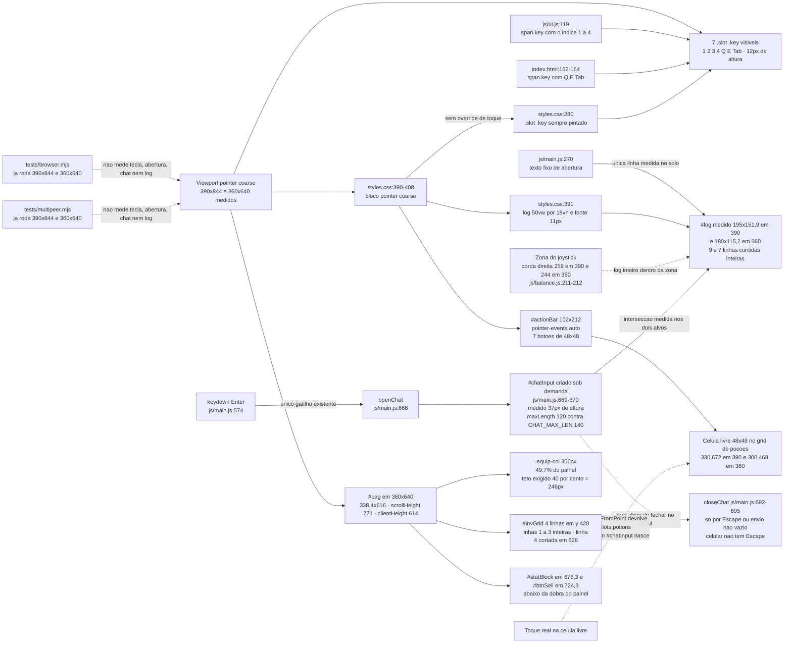
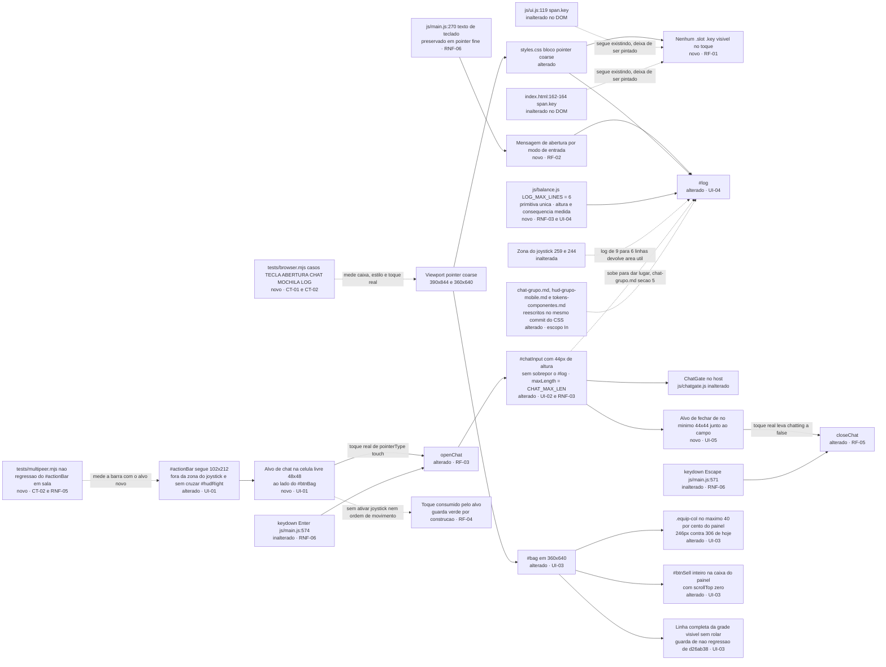

# SPEC: mobile-toque-chat-e-layout

## Metadata
- Source: developer description via /plan (`.spec/features/mobile-toque-chat-e-layout/.handoff/input.md`, confirmado em 21/08/2026)
- Service: shadowfall (repositório único, front-end sem bundler)
- Tier: standard
- Version: 1.1
- Architecture references: `AGENTS.md`, `docs/agents/architecture.md`, `docs/agents/domain_rules.md`
- Init chain: `.spec/init/project-description.md`, `.spec/init/user-stories.md`, `.spec/init/database-schema.md`, `.spec/init/project-phases.md`
- Specs de design vinculantes: `.spec/init/design/chat-grupo.md` (AC 3), `.spec/init/design/hud-grupo-mobile.md` (AC 5), `.spec/init/design/tokens-componentes.md` (piso de alvo de toque). **As três são reescritas por esta feature** — ver Scope "In" e a decisão de UI-04
- Clarificação aplicada: `.spec/features/mobile-toque-chat-e-layout/.handoff/clarifier-answers.md` (21/08/2026) — respostas vinculantes do desenvolvedor; os 3 marcadores de clarificação da versão 1.0 foram fechados por elas
- Prior art que esta SPEC estende: `.spec/features/mobile-hud-menus-inventario/SPEC.md` (em produção desde `2285154`, 21/08/2026)
- Baseline medido: HEAD `2285154`, Chromium/Puppeteer 25.8.0, 390x844 e 360x640 com `deviceScaleFactor: 2`, `isMobile: true`, `hasTouch: true` — `matchMedia('(pointer: coarse)').matches === true` confirmado nos dois

### Regras de arquitetura que amarram esta SPEC

| Regra | Fonte | Efeito aqui |
|---|---|---|
| `js/sim.js` é estado puro, zero DOM | `AGENTS.md:37`, `AGENTS.md:56`, `docs/agents/architecture.md` (tabela "Layer responsibilities") | Nenhum requisito abaixo entra em `js/sim.js`; a superfície é `index.html`, `styles.css`, `js/ui.js`, `js/main.js`, `js/balance.js` (RNF-02) |
| Todo número de tuning vive em `js/balance.js` | `AGENTS.md:38`, `AGENTS.md:57` | `LOG_MAX_LINES = 6` — **a única primitiva nova** — e qualquer medida nova de alvo entram em `js/balance.js` junto de `TOUCH_STICK_*` (`js/balance.js:211-213`) e `CHAT_*` (`js/balance.js:216-219`) — RNF-03. A altura do `#log` é **consequência medida** de `LOG_MAX_LINES`, nunca um segundo número; e o literal `maxLength = 120` de `js/main.js:671` passa a ler `CHAT_MAX_LEN` |
| Apresentação não muta estado do simulador nem envia pacote | `docs/agents/architecture.md`, tabela "Layer responsibilities" | O alvo de chat de RF-03 só chama `openChat()`; o envio continua no caminho já existente (`js/main.js:673-685`), que passa por `chatgate.js` no host |
| Composição delega regra de jogo a `sim.js` e política de sala a `room.js` | `docs/agents/architecture.md` | `js/main.js` ganha um caminho de entrada de UI, não uma regra nova |
| Antiflood de chat é do host, 3 mensagens por 5 s | `docs/agents/domain_rules.md`, seção "Chat"; `js/balance.js:218-219` | O alvo de toque não cria caminho paralelo de envio: uma mensagem originada no celular passa pelo mesmo `ChatGate` |
| Testes sem framework; `process.exit(failures ? 1 : 0)` | `AGENTS.md:32`, `AGENTS.md:43` | Os casos novos seguem `errors[]` em `tests/browser.mjs` e `check()`/`failures` em `tests/multipeer.mjs` (CT-02) |
| pt-BR em comentário, log, texto de UI e label de teste; identificador em inglês | `AGENTS.md:45`, `AGENTS.md:51` | RNF-04 |
| Sem dependência de runtime, sem passo de build | `AGENTS.md:60-61` | RNF-01 |
| Alvo de toque mínimo 44x44 | `.spec/init/design/tokens-componentes.md:151`, `.spec/init/design/hud-grupo-mobile.md:91`; já codificado como `ALVO_MIN` em `tests/mobile-helpers.mjs` | UI-01, UI-02 |
| Botão de abrir chat no celular fica no `#actionBar`, 44x44 | `.spec/init/design/chat-grupo.md` §6 | UI-01 — lido pela **intenção**: a célula livre de 48x48 **ao lado** do `#btnBag`, não uma quarta linha de grid. A letra "abaixo do botão de mochila" foi rejeitada pelo desenvolvedor e §6 é reescrito |
| Com o chat aberto o `#log` sobe, sem sobrepor | `.spec/init/design/chat-grupo.md` §5 | UI-02 |
| O chat aberto pode cobrir a zona do joystick | Decisão do desenvolvedor (Q-04); portão de zona é listener do `#canvas` (`js/main.js:602`, teste em `:608`) | UI-02 AC 6 — a sobreposição é **permitida** enquanto `S.chatting` é verdadeiro, porque o campo bloqueia só os pixels que cobre e só enquanto está aberto |
| Abertura por toque exige fechamento por toque | Decisão do desenvolvedor (Q-06); `closeChat()` só sai de `Escape` (`js/main.js:571`) ou do envio, e celular não tem `Escape` | RF-05, UI-05 |

## Context

O jogo já é jogável no dedo depois de `mobile-hud-menus-inventario`: os alvos do HUD estão em
48x48, o `#actionBar` mede 102x212 e não invade mais a zona do joystick, e o `#bag` não corta mais
conteúdo por teto de `vh`. O que sobrou é a outra metade do problema — **comandos que só existem
no teclado e que o HUD continua anunciando ao dedo** — mais dois pontos de layout no celular.

Tudo abaixo foi **medido na página em execução** (bounding box e `getComputedStyle`), nunca lido do
CSS, nos dois alvos confirmados, com uma partida solo iniciada e o console limpo:

1. **Dicas de tecla no toque.** Em `pointer: coarse` há **7 elementos `.slot .key` visíveis**, não 3:
   `1`, `2`, `3`, `4` gerados em `js/ui.js:119` e `Q`, `E`, `Tab` estáticos em `index.html:162-164`.
   Todos com `display: block`, `visibility: visible`, `opacity: 1` e 12px de altura, nos dois
   alvos. A regra `.slot .key` (`styles.css:280`) não tem override no bloco `pointer: coarse`
   (`styles.css:390-408`). O escopo real de AC 1 é maior do que os três citados na descrição.

2. **Mensagem de abertura de teclado.** `js/main.js:270` empurra, fixa, a linha
   `Use <b>1–4</b> para magias, <b>Q/E</b> para poções, <b>Enter</b> para conversar.` — medida como
   a única linha do `#log` numa partida solo em toque, nos dois alvos. Contém três dos quatro
   tokens proibidos por AC 2 (`1–4` com travessão U+2013, `Q/E`, `Enter`); não contém `Tab`.

3. **Chat inalcançável no dedo.** `#chatInput` **não existe no DOM** até `openChat()` rodar: é
   criado sob demanda em `js/main.js:669-670`. O único gatilho é o `keydown` de `Enter`
   (`js/main.js:574`). Varrendo `#game` por qualquer botão ou `[onclick]` cujo id, texto ou
   `aria-label` mencione chat/conversa/falar: **zero candidatos**. Um `page.touchscreen.tap()` real
   na única célula livre do `#actionBar` não cria `#chatInput`, e `document.elementFromPoint`
   naquele ponto devolve `.slots.potions` — o contêiner, não um alvo.
   Geometria disponível, medida: o `#actionBar` é uma coluna de 102x212 com 7 botões de 48x48; o
   grid `.slots.potions` é `48px 48px` por `48px 48px` com `gap: 6px` e **3 filhos**, então sobra
   **uma célula de 48x48** em (330, 672) no alvo 390x844 e em (300, 468) no 360x640. `#actionBar`
   tem `pointer-events: auto` — ao contrário do `#hudRight`, que é `pointer-events: none`
   (`styles.css:169`) e já produziu, nesta mesma casa, um handler que só disparava por `.click()`
   programático (comentário em `styles.css:222-226`). Daí a exigência de hit test real em CT-02.
   Quando o chat é aberto pelo teclado em `pointer: coarse`, o campo mede **216x37 em 360x640** e
   **234x37 em 390x844**, com `document.activeElement === '#chatInput'`: **37px de altura, abaixo
   do piso de 44** de `tokens-componentes.md:151`, e **sobrepondo o `#log`** (interseção medida nos
   dois alvos), o que contraria `chat-grupo.md` §5.
   E o chat aberto **não fecha no dedo**: `closeChat()` (`js/main.js:692-695`) só é alcançado pelo
   `keydown` de `Escape` (`js/main.js:571`) ou pelo envio de uma mensagem não vazia — e enviar vazio
   é descartado em silêncio por `chatGate.clean('')`, sem fechar. Celular não tem `Escape`. Varrendo
   o DOM com o chat aberto: **zero alvos** de fechar dentro ou ao lado do `#chatInput`. Abrir por
   toque sem fechar por toque prende o jogador no campo — daí RF-05 e UI-05.

4. **Mochila em 360x640.** Medido com o painel aberto e `scrollTop === 0`: `#bag` ocupa 338,4x616
   em (10,8; 12), a `.equip-col` com os seis campos gasta **306px — 49,7% do painel**, e o
   `#invGrid` (4 linhas de 5, 242,3px) começa em y=420. **As linhas 1, 2 e 3 da grade estão
   inteiramente visíveis** (a linha 3 termina em y=600,3, contra a borda inferior do painel em
   y=628); a linha 4 é cortada, e `#statBlock` (y=676,3) e `#btnSell` (y=724,3) ficam abaixo da
   dobra — `scrollHeight` 771 contra `clientHeight` 614, 157px de conteúdo rolável.
   **AC 4 do input, como está escrita, já passa no HEAD**: o teto de painel mudou de `86vh` para
   `calc(100dvh - 24px)` no commit `d26ab38` de 20/08/2026, depois da observação do desenvolvedor
   sobre o build em produção. Por isso ela sobrevive apenas como **guarda de não regressão**
   (UI-03 AC 1), e o defeito real passa a ser medido por dois critérios novos, decididos pelo
   desenvolvedor e válidos **em conjunto**: **`.equip-col` no máximo 40% da altura do painel** —
   teto de 246px contra os 306px de hoje, devolvendo 60px à grade de itens — e **`#btnSell` inteiro
   dentro da caixa do painel** com `scrollTop === 0`, contra os y=724,3 medidos hoje sob uma borda
   inferior em y=628.

5. **`#log` no canto do joystick.** Medido: 195x151,9 em 390x844 e 180x115,2 em 360x640 — exatos
   `50vw` por `18vh` (`styles.css:391`), fonte 11px, `line-height` 15,95px,
   `pointer-events: none`. **Linha visível é definida por contenção de retângulo inteiro**: um
   `#log p` conta se e somente se `top >= rect('#log').top` **e** `bottom <= rect('#log').bottom`.
   Por essa régua, com 13 linhas empurradas ficam **9 linhas visíveis em 390x844 e 7 em 360x640**
   (151,9/15,95 = 9,52 e 115,2/15,95 = 7,22). Os números 10 e 8 da medição anterior contavam a linha
   cortada no topo e foram corrigidos. O `mask-image` de `styles.css:253` **fica fora da contagem**:
   uma linha esmaecida pelo gradiente continua contando desde que seu retângulo esteja inteiro
   dentro do retângulo do `#log`. A borda direita do `#log` (207 e 192) está **inteiramente dentro da zona reservada do
   joystick** (259 e 244, por `TOUCH_STICK_ZONE` 0,5 e `TOUCH_STICK_RADIUS` 64 em
   `js/balance.js:211-212`). A sobreposição é **visual, não de entrada**: o `#log` não rouba toque.
   O incômodo é o anel de 128px do `#stick` nascendo por cima de texto legível.

Uma observação de contexto que não vira requisito: `hud-grupo-mobile.md` §5 declara *landscape*
como orientação de referência, enquanto os dois alvos confirmados são retrato — o mapa de ocupação
do §1 é lido aqui como intenção, não como geometria; segue em Open Questions.

Uma que **virou** requisito: `js/main.js:671` fixa `maxLength = 120` no campo de chat enquanto
`CHAT_MAX_LEN` é 140 (`js/balance.js:216`) e `chat-grupo.md` §3 pede 140. O desenvolvedor decidiu
alinhar agora — `AGENTS.md:57` já proíbe o literal e o caminho de toque está prestes a virar o
principal. Está em RNF-03 AC 2, não mais em Open Questions.

## AS IS — Estado atual

Recorte medido do HUD de toque no HEAD `2285154`. As arestas pontilhadas são os buracos: o `#log`
inteiro dentro da zona reservada do joystick, o toque real que não encontra alvo de chat, o chat
que abre e não fecha no dedo, e os dois harness que já entram em `pointer: coarse` mas não olham
para nada disto.

## TO BE — Estado proposto

Cada nó novo ou alterado realiza um id do RIGID: `NEW_KEY` realiza RF-01; `NEW_MSG` realiza RF-02;
`NEW_BTN`, `BAR` e `NEW_GUARD` realizam UI-01, RF-03 e RF-04; `OPEN` e `CHATIN` realizam RF-03 e
UI-02; `NEW_X` e `CLOSE` realizam UI-05 e RF-05; `BAG`, `EQ40`, `SELL` e `GRID` realizam UI-03;
`LOG` e `NEW_BAL` realizam UI-04 e RNF-03; `NEW_BR` e `NEW_MP` realizam CT-01, CT-02 e RNF-05.

`NEW_DOC` não realiza requisito — é a reescrita das **três** specs de design que a decisão de UI-04
arrasta, aprovada explicitamente pelo desenvolvedor e feita no mesmo commit do CSS:
`hud-grupo-mobile.md:38` declara o canto inferior esquerdo como `#log` de 50vw por 18vh,
`chat-grupo.md` §6 manda **manter** esse tamanho e pedir **8 linhas**, e `tokens-componentes.md:142`
repete o mesmo "Log 50vw/18vh". `chat-grupo.md` §6 ainda precisa trocar "abaixo do botão de mochila"
por "ao lado do botão de mochila" (decisão de UI-01).

## Scope

- **In**: visibilidade das dicas de tecla em `pointer: coarse`; texto da mensagem de abertura por
  modo de entrada; alvo de toque que abre o chat, alvo de toque que o fecha e operabilidade do
  `#chatInput` no dedo; alinhamento de `maxLength` com `CHAT_MAX_LEN`; proporção da `.equip-col` e
  visibilidade do `#btnSell` no `#bag` em 360x640; número de linhas visíveis do `#log` em
  `pointer: coarse` via `LOG_MAX_LINES`; casos novos em `tests/browser.mjs` e
  `tests/multipeer.mjs`; **reescrita dos três docs de design** que gravam decisões que esta feature
  derruba — `.spec/init/design/chat-grupo.md` (§6: tamanho do log, 8 linhas, "abaixo do botão de
  mochila"), `.spec/init/design/hud-grupo-mobile.md` (`:38`, canto inferior esquerdo em 50vw x 18vh)
  e `.spec/init/design/tokens-componentes.md` (`:142`, "Log 50vw/18vh"). O desenvolvedor aprovou
  reverter essas decisões de design, no mesmo commit do CSS. **Esta SPEC não os edita**; a edição é
  trabalho do PLAN.
- **Out**:
  - Entrega da mensagem ponta a ponta, antiflood, truncagem e escape — já cobertos por
    `js/chatgate.js`, `tests/chat.test.mjs` e `docs/agents/domain_rules.md`; esta feature só cria
    um segundo caminho de **abertura**, nunca de envio.
  - Redesenho da HUD para grupo de 10 (`user-stories.md:633`, `project-phases.md:1375`): continua
    fora do plano até haver medição de uso.
  - Contador de caracteres a partir de 120 (`chat-grupo.md` §3): registrado, não especificado; ver
    Open Questions. (A divergência `maxLength = 120` contra `CHAT_MAX_LEN = 140` **saiu do Out** —
    o desenvolvedor mandou alinhar; virou RNF-03 AC 2.)
  - Divergência entre o rótulo do `#btnSell` e o comportamento de `sellJunk()`
    (`docs/agents/domain_rules.md`, seção "Venda de itens") — sem relação com toque.
  - `js/sim.js`, `js/net.js`, `js/render.js`, protocolo P2P e formato de save: intocados.
  - Orientação *landscape*: os alvos confirmados são retrato; nenhum requisito abaixo mede paisagem.

## RIGID (Non-Negotiable)

### Functional Requirements

- **RF-01** [State-Driven]: While `matchMedia('(pointer: coarse)').matches` for tela de jogo,
  o HUD SHALL não exibir nenhum elemento `.slot .key`.
  - AC 1: em 390x844 e em 360x640, para cada um dos elementos retornados por
    `document.querySelectorAll('.slot .key')`, `window.__M.visible(el)`
    (`tests/mobile-helpers.mjs`) retorna `false` — contagem de visíveis igual a **0**. Baseline
    medido: 7 visíveis nos dois alvos.
  - AC 2: a contagem total de nós `.slot .key` no DOM permanece **7** com o `#skillSlots`
    construído — ocultar não pode virar remoção, porque `js/ui.js:119` e `index.html:162-164`
    continuam sendo a fonte do rótulo de teclado (RNF-06).
  - AC 3: em viewport de mouse (1280x760, sem `hasTouch`), os **7** seguem com
    `window.__M.visible(el) === true`.

- **RF-02** [Event-Driven]: When o jogador entra na tela de jogo em `pointer: coarse`, o sistema
  SHALL registrar no `#log` uma linha de abertura que não cite tecla de teclado.
  - AC 1: o `innerText` do `#log` logo após a entrada não casa com nenhuma das expressões
    `/1\s*[–-]\s*4/`, `/Q\s*\/\s*E/`, `/\bTab\b/`, `/\bEnter\b/`, nos dois alvos.
  - AC 2: a string exibida em `pointer: coarse` é **diferente** da exibida em viewport de mouse
    (comparação de igualdade estrita entre os dois `innerText` medidos na mesma execução).
  - AC 3: em viewport de mouse a string permanece exatamente
    `Use 1–4 para magias, Q/E para poções, Enter para conversar.` (verified at `js/main.js:270`,
    travessão U+2013).
  - AC 4: a linha de toque é emitida pelo mesmo caminho `UI.pushLog(..., 'system')` e recebe a
    classe `system`, para não escapar do teto de `CHAT_LOG_LINES` (`js/ui.js:97`).
  - AC 5 (**positiva** — sem ela `"Boa sorte."` passaria em AC 1 a AC 4, que são todas negativas, e
    o alvo novo de chat ficaria sem canal de descoberta): a string de toque casa com **todos** os
    tokens de uma lista obrigatória, congelada no PLAN e usada idêntica pelo harness e pela string:
    (i) `/joystick/i`; (ii) o texto exato do `aria-label` do alvo de chat de UI-01, **lido do DOM em
    runtime** (`document.querySelector(<seletor de CT-01 AC 2>).getAttribute('aria-label')`), nunca
    reescrito como literal no teste — se o rótulo do botão mudar sem a mensagem mudar junto, a AC
    reprova. Tudo em pt-BR (RNF-04). A lista descreve só o que está na tela em `pointer: coarse`.

- **RF-03** [Event-Driven]: When o jogador executa um **toque real** — evento com
  `pointerType === 'touch'` originado do dispositivo de entrada, nunca `element.click()` — sobre o
  alvo de chat de UI-01 em `pointer: coarse`, o sistema SHALL abrir o campo de chat.
  - AC 1: antes do toque, `document.querySelector('#chatInput')` é `null` ou tem a classe `hidden`;
    depois do toque, o elemento existe, **não** tem `hidden`, `window.__M.visible()` retorna `true`
    e `document.activeElement.id === 'chatInput'`. Verificado nos dois alvos.
  - AC 2: `document.elementFromPoint(cx, cy)` no centro do alvo devolve o próprio alvo ou um
    descendente dele — nunca `.slots`, `#actionBar`, `#canvas` ou `null`. Baseline medido no ponto
    equivalente de hoje: `.slots potions`.
  - AC 3: `getComputedStyle(alvo).pointerEvents === 'auto'`.
  - AC 4: `window.__SF.chatting === true` depois do toque e `false` depois de `Escape`
    (`js/main.js:571`, `js/main.js:692-694`) — o caminho de toque converge no mesmo estado do
    caminho de teclado, sem estado paralelo.
  - AC 5: uma segunda abertura pelo mesmo alvo, depois de fechar, repete AC 1 — o campo é
    reutilizável, não criado duas vezes (`chatEl` é memoizado em `js/main.js:668`).

- **RF-04** [Unwanted Behaviour]: If o toque de RF-03 acontece sobre o alvo de chat, then o sistema
  SHALL NOT ativar o joystick nem emitir ordem de movimento.
  - AC 1: imediatamente após o toque, `window.__SF.stick.active === false` e
    `window.__SF.moveGoal === null` (`js/main.js:1077` expõe `S`; campos em `js/main.js:41` e
    `js/main.js:622-628`).
  - AC 2: o `#stick` permanece com a classe `hidden` após o toque.
  - AC 3: a borda esquerda do alvo é `>= 0.5 * innerWidth + 64` — 259 em 390x844 e 244 em 360x640,
    derivadas de `TOUCH_STICK_ZONE` e `TOUCH_STICK_RADIUS` (verified at `js/balance.js:211-212`),
    lidas do módulo pelo harness, nunca reescritas como literal (`tests/mobile-helpers.mjs`).
  - **Nota de projeto — AC 1 e AC 2 nascem verdes de propósito, e isso é intencional.** O portão do
    joystick é um listener do `#canvas` (`js/main.js:602`, teste de zona em `:608`) e o `#actionBar`
    é **irmão** do `#canvas` (`index.html:159` contra o `#game`), não descendente: um toque em botão
    da barra nunca chega àquele handler. As duas são **guarda de não regressão** — reprovam se
    alguém mover o portão para `document`/`#game` ou reparentar a barra. Só a **AC 3** pode falhar
    com o código de hoje. Ninguém deve "consertar" AC 1 e AC 2 por elas passarem de primeira.

- **RF-05** [Event-Driven]: When o jogador executa um **toque real** (`pointerType === 'touch'`,
  nunca `element.click()`) sobre o alvo de fechar de UI-05, com o chat aberto em `pointer: coarse`,
  o sistema SHALL fechar o campo de chat. A feature não entrega abertura por toque sem fechamento
  por toque: hoje `closeChat()` (`js/main.js:692-695`) só é alcançado por `Escape`
  (`js/main.js:571`) ou pelo envio de mensagem não vazia, e celular não tem `Escape` — enviar vazio
  é descartado em silêncio por `chatGate.clean('')` e **não** fecha.
  - AC 1: antes do toque de fechar, `window.__SF.chatting === true`; depois,
    `window.__SF.chatting === false`, nos dois alvos.
  - AC 2: depois do toque, `#chatInput` tem a classe `hidden` e `window.__M.visible('#chatInput')`
    retorna `false`; `document.activeElement.id !== 'chatInput'`.
  - AC 3: o fechamento passa pela **mesma** função `closeChat()` do caminho de teclado — nenhum
    estado paralelo: depois do toque, uma abertura por `Enter` em viewport de mouse e uma abertura
    por toque (RF-03 AC 5) continuam funcionando, e `chatEl` segue memoizado (`js/main.js:668`).
  - AC 4: `document.elementFromPoint(cx, cy)` no centro do alvo de fechar devolve o próprio alvo ou
    um descendente dele — nunca `#chatInput`, `#log`, `#canvas` ou `null`.
  - AC 5: o toque de fechar **não envia** a mensagem. Com uma sentinela em pt-BR digitada no campo,
    depois do toque o `innerText` do `#log` não contém a sentinela (em solo o envio passaria por
    `chatLine(S.name, m)` e a imprimiria, `js/main.js:678-681`), e a abertura seguinte traz
    `#chatInput.value === ''` (`js/main.js:688`). Medido em `tests/browser.mjs`, partida solo.

### UI Requirements

- **UI-01** [Ubiquitous]: O `#actionBar` SHALL conter um alvo de chat visível, de no mínimo 44x44
  CSS px, ocupando a **célula livre de 48x48 ao lado do `#btnBag`** no grid `.slots.potions`, em
  `pointer: coarse`, mantendo a barra **exatamente** em 102x212. Decisão do desenvolvedor: a leitura
  literal de `chat-grupo.md` §6 ("abaixo do botão de mochila") foi **rejeitada** — criaria uma
  quarta linha de grid, levaria a barra a 266px de altura e colidiria com o `#hudRight` nas alturas
  380 e 360 que `ALTURAS_UI03` já visita. O §6 é reescrito para "ao lado do botão de mochila".
  - AC 1: `window.__M.rect(alvo)` devolve `width >= 44` e `height >= 44` nos dois alvos
    (`ALVO_MIN` em `tests/mobile-helpers.mjs`; origem em `.spec/init/design/tokens-componentes.md:151`).
  - AC 2: o alvo é um `<button>` descendente de `#actionBar` (`index.html:159`), de modo que
    `window.__M.targets('#actionBar')` já o varra no piso de 44x44 sem caso novo — hoje a varredura
    devolve 7 botões de 48x48; depois desta feature devolve **8**, todos `>= ALVO_MIN`.
  - AC 3: `Math.abs(window.__M.rect('#actionBar').width - BARRA_LARGURA) < 0.5` nos dois alvos, com
    `BARRA_LARGURA = 2 * SLOT_LADO + 6 = 102` importado de `tests/mobile-helpers.mjs:58` — nunca
    `=== 102` sobre o float de `getBoundingClientRect()`. E a caixa da barra não intercepta a zona
    do joystick: `left >= 259` em 390x844 e `left >= 244` em 360x640. Baseline medido: `left` 276 e
    246, largura 102.
  - AC 4 (**guarda de não regressão — não discrimina hoje**):
    `window.__M.intersects(rect('#actionBar'), rect('#portalHold')) === false` com o `#portalHold`
    visível, nas 7 alturas de `ALTURAS_UI03` — 700, 620, 600, 460, 440, 380, 360, todas na largura
    390 (`tests/mobile-helpers.mjs`) — mais os dois alvos cheios 390x844 e 360x640. Medido: em
    `pointer: coarse` a borda **direita** do `#portalHold` é 264 contra 276 da esquerda da barra,
    então os dois não se cruzam em 390 de largura **com qualquer altura de barra**. Fica como
    guarda; quem detecta crescimento da barra é a AC 5.
  - AC 5 (**a AC que discrimina a altura**): `Math.abs(rect('#actionBar').height - 212) < 0.5` e
    `window.__M.intersects(rect('#actionBar'), rect('#hudRight')) === false`, ambas nas 7 alturas de
    `ALTURAS_UI03` mais os dois alvos cheios. `#hudRight` (`index.html:134`) é **irmão** do
    `#actionBar`, não ancestral, e carrega o `#minimap` de 164px no topo direito — é a caixa que uma
    barra crescida para 266px atinge em 380 e 360. Baseline medido: 212 de altura, sem interseção.
  - AC 6: em viewport de mouse o alvo pode existir ou não, mas se existir não altera a largura nem a
    altura do `#actionBar` medidas em 1280x760 (RNF-06).

- **UI-02** [Ubiquitous]: Com o chat aberto em `pointer: coarse`, o `#chatInput` SHALL ser operável
  no dedo e não SHALL cobrir o `#log`.
  - AC 1: `window.__M.rect('#chatInput').height >= 44` nos dois alvos. Baseline medido: 37px nos
    dois — reprova hoje.
  - AC 2: `window.__M.intersects(rect('#chatInput'), rect('#log')) === false` com o chat aberto e
    pelo menos uma linha no `#log`, nos dois alvos. Baseline medido: interseção verdadeira nos
    dois — reprova hoje. Origem da regra: `.spec/init/design/chat-grupo.md` §5.
    **A AC só tem sentido quando `rect('#log')` é não-nulo**: abaixo de 460px de altura o `#log`
    some por `styles.css:410`, `__M.rect` devolve `null` e `__M.intersects` devolve `false` com
    operando nulo (`tests/mobile-helpers.mjs:88-92`) — ela passaria vazia justamente em 440, 380 e
    360. O caso DEVE asserir `rect('#log') !== null` como pré-condição e **pular** a comparação, com
    registro explícito, quando o log estiver oculto.
  - AC 3: o campo fica inteiramente dentro da viewport: `left >= 0`, `top >= 0`,
    `right <= innerWidth`, `bottom <= innerHeight`.
  - AC 4: `document.activeElement.id === 'chatInput'` também quando a abertura vem do toque
    (mesma asserção de RF-03 AC 1, medida depois do reposicionamento).
  - AC 5: na altura **440** com largura 390 (`ALTURAS_UI03`), com o chat aberto por toque real:
    `rect('#chatInput')` é **não-nulo**, `height >= 44`, cabe inteiro na viewport (as quatro
    comparações da AC 3) e `intersects(rect('#chatInput'), rect('#actionBar')) === false`. É a
    altura onde o `#log` já sumiu e a AC 2 se cala — sem esta AC, a tela mais apertada em que o chat
    ainda existe ficaria sem nenhuma medição.
  - AC 6 (**permissão explícita, não defeito**): a interseção entre `rect('#chatInput')` e
    `window.__M.joystickZone()` é **permitida** enquanto `window.__SF.chatting === true`; nenhum
    caso a trata como falha. O campo fica onde está, no canto inferior esquerdo, como
    `chat-grupo.md` §6 pede. Justificativa medível: o portão de zona vive no listener do `#canvas`
    (`js/main.js:602`, teste em `:608`) e o campo é filho de `#game`, irmão do `#canvas`, então ele
    bloqueia apenas os pixels que cobre e só enquanto o chat está aberto. Verificação binária
    associada: com o chat aberto, um toque real no centro do campo mantém
    `window.__SF.stick.active === false`; depois de fechar (RF-05), um toque real **na mesma
    coordenada** leva `window.__SF.stick.active === true` — provando que o bloqueio é temporário.

- **UI-03** [Ubiquitous]: Em 360x640 com o `#bag` aberto e `scrollTop === 0`, a `.equip-col` SHALL
  ocupar no máximo **40% da altura do painel** e o `#btnSell` SHALL estar inteiro dentro da caixa
  visível do painel; a linha completa de 5 `.inv-slot` já visível hoje SHALL continuar visível.
  As duas ACs novas (3 e 4) valem **em conjunto**: fechar só uma não fecha o requisito.
  - AC 1 (**guarda de não regressão do ganho de `d26ab38`, passa hoje**): para os 5 primeiros filhos
    de `#invGrid`, `top >= rect('#bag').top` e `bottom <= rect('#bag').bottom`, todos com a mesma
    coordenada `top`. Medido no HEAD `2285154`: linha 1 de y=420 a y=476,1 dentro do painel (12 a
    628); as linhas 1, 2 e 3 inteiras, só a linha 4 cortada. Não detecta o defeito relatado — está
    aqui para o teto de painel não voltar de `calc(100dvh - 24px)` para `86vh`.
  - AC 2: `#invGrid` continua em 5 colunas (`grid-template-columns` com 5 valores) e 20 slots
    (`INV_SIZE`, já importado por `tests/browser.mjs:7`).
  - AC 3 (**reprova hoje**): `rect('#equipCol').height <= 0.40 * rect('#bag').height` em 360x640,
    com o painel aberto e `scrollTop === 0`. Baseline medido: 306px de 616 = **49,7%**; o teto de
    40% são **246px**, devolvendo 60px à grade de itens. Ambas as alturas saem de
    `getBoundingClientRect()` na página em execução (RNF-07); a razão é calculada no harness, nunca
    lida do CSS.
  - AC 4 (**reprova hoje**): com `scrollTop === 0`, `rect('#btnSell')` é não-nulo e
    `top >= rect('#bag').top` e `bottom <= rect('#bag').bottom`. Baseline medido: `#btnSell` em
    y=724,3 contra a borda inferior do painel em y=628 — 96px abaixo da dobra, com `scrollHeight`
    771 contra `clientHeight` 614.

- **UI-04** [State-Driven]: While `pointer: coarse`, o `#log` SHALL exibir no máximo
  **`LOG_MAX_LINES = 6`** linhas inteiramente contidas na sua caixa. **`LOG_MAX_LINES` é a única
  primitiva**, exportada de `js/balance.js`; a altura do `#log` é **consequência medida** dela,
  nunca um segundo portão independente. O teto de `12vh` do input **foi descartado** — medido, ele
  nunca chegava a morder (12vh = 101,3px em 390x844, onde cabem 6 linhas, e 76,8px em 360x640).
  Decisão do desenvolvedor: 6 linhas = 95,7px = **11,3vh em 844 e 15,0vh em 640**, encolhendo ~37%
  da área pintada de hoje em 390x844 sem cair abaixo das 5–6 linhas que uma conversa de grupo de 10
  precisa. Nenhum número em `vh` é asserido em AC alguma.
  - AC 1: com pelo menos `LOG_MAX_LINES + 3` = **9** linhas empurradas no log, o número de `#log p`
    cujo retângulo cai **inteiramente** dentro do retângulo do `#log` (`top >= rect('#log').top` e
    `bottom <= rect('#log').bottom`) é `<= LOG_MAX_LINES`, nos dois alvos. Baseline medido pela
    mesma régua: **9 em 390x844 e 7 em 360x640** — reprova hoje em 390x844 e em 360x640. O
    `mask-image` de `styles.css:253` **não participa da contagem**: linha esmaecida pelo gradiente
    conta como visível desde que seu retângulo esteja inteiro dentro do retângulo do `#log`.
  - AC 2 (**derivada, não independente**):
    `rect('#log').height <= LOG_MAX_LINES * parseFloat(getComputedStyle(log).lineHeight) + 1`,
    com o `line-height` **medido na página em execução** (15,95px nos dois alvos hoje) e
    `LOG_MAX_LINES` lido de `js/balance.js`. Teto derivado: **95,7px**. Baseline medido: 151,9px em
    390x844 e 115,2px em 360x640 — reprova hoje nos dois. O `+1` absorve arredondamento de
    subpixel; nenhum literal em `px` nem em `vh` aparece no harness.
  - AC 3: `LOG_MAX_LINES` é exportado de `js/balance.js` e lido de lá pelo harness por
    `import * as balance` (RNF-03), no mesmo padrão de `TOUCH_STICK_*`. `grep` não encontra o
    literal `6` como teto de linha, nem qualquer valor em `vh` para o `#log` de toque, fora de
    `js/balance.js` e do CSS que o consome.
  - AC 4: em viewport de mouse o `#log` continua em `min(340px, 42vw)` por `26vh`
    (verified at `styles.css:249-251`).
  - AC 5: a regra `@media (max-height: 460px) { #log { display: none } }` (verified at
    `styles.css:410`) continua valendo — o corte por altura baixa não é revogado. Nas alturas 440,
    380 e 360 de `ALTURAS_UI03`, `rect('#log')` é `null` e as ACs 1 e 2 são **puladas com registro
    explícito**, nunca dadas por aprovadas em silêncio.
  - AC 6: o `#log` **permanece** no canto inferior esquerdo, dentro da zona do joystick; encolher a
    altura é a saída escolhida, não mover o bloco nem mexer em opacidade/máscara. Nenhuma AC assere
    `rect('#log').left >= 259/244` — a sobreposição com a zona é visual, não de entrada
    (`pointer-events: none`, `styles.css:252`).
  - **Conflito de design resolvido pelo desenvolvedor.** `chat-grupo.md` §6 pede "8 linhas mantendo
    50vw x 18vh" — o que, medido, é incompatível **consigo mesmo** em 360x640, onde 8 linhas
    inteiras exigem 19,9vh contra as 18vh que a mesma seção manda manter. `hud-grupo-mobile.md:38` e
    `tokens-componentes.md:142` repetem o mesmo "50vw/18vh". `LOG_MAX_LINES = 6` derruba as três
    decisões, e o desenvolvedor **aprovou reverter** as três, no mesmo commit do CSS (Scope "In").

- **UI-05** [Ubiquitous]: Com o chat aberto em `pointer: coarse`, SHALL existir um alvo de fechar
  visível, de no mínimo **44x44** CSS px, junto ao `#chatInput`. Sem ele a feature entrega abertura
  por toque sem fechamento por toque, e não sobe (decisão do desenvolvedor, Q-06).
  - AC 1: `window.__M.rect(<alvo de fechar>)` devolve `width >= 44` e `height >= 44` nos dois alvos
    (`ALVO_MIN` em `tests/mobile-helpers.mjs`). Baseline: o alvo não existe hoje — reprova.
  - AC 2: o alvo é visível (`window.__M.visible() === true`) **se e somente se**
    `window.__SF.chatting === true`; com o chat fechado ele não existe no DOM ou tem `hidden`.
  - AC 3: `getComputedStyle(alvo).pointerEvents === 'auto'` e o alvo fica inteiramente dentro da
    viewport (`left >= 0`, `top >= 0`, `right <= innerWidth`, `bottom <= innerHeight`).
  - AC 4: `window.__M.intersects(rect(<alvo de fechar>), rect('#chatInput')) === false` — o alvo não
    cobre o campo de digitação; e nas duas caixas juntas continuam valendo UI-02 AC 2 (sem cobrir o
    `#log`, quando `rect('#log')` é não-nulo) e UI-02 AC 3.
  - AC 5: em viewport de mouse (1280x760) o alvo pode existir ou não, mas não altera a caixa medida
    do `#chatInput` nem o comportamento de `Escape` (RNF-06).

### Contracts

- **CT-01**: Contrato de medição entre a UI e os dois harness. Os seletores abaixo DEVEM continuar
  existindo com o mesmo nome; renomear qualquer um quebra os casos desta feature:
  `#game` (verified at `index.html:115`), `#hudRight` (`index.html:134`), `#log` (`index.html:156`),
  `#actionBar` (`index.html:159`), `#skillSlots` (`index.html:160`),
  `.slots.potions` (`index.html:161`), `#btnBag` (`index.html:164`),
  `#stick` (`index.html:176`), `#bag` (`index.html:179`), `#equipCol` (`index.html:185`),
  `#invGrid` (`index.html:187`), `#statBlock` (`index.html:188`), `#btnSell` (`index.html:189`),
  `#chatInput` (criado em `js/main.js:670`), e os ganchos de classe `.slot`, `.slot .key`,
  `.inv-slot`, `.equip-col`.
  - AC 1: `node -e` sobre `index.html` confirma os **13 ids/ganchos estáticos** (`#hudRight` entrou
    porque UI-01 AC 5 mede a caixa dele); `#chatInput` e `.slot .key` dos slots de magia são
    conferidos em runtime por `document.querySelector` não-nulo no estado em que cada AC os exige.
  - AC 2: o alvo de chat de UI-01 **e** o alvo de fechar de UI-05 recebem cada um um seletor
    estável, fixado pelo PLAN, usado **idêntico** pelos dois harness e pela leitura de `aria-label`
    de RF-02 AC 5. Nenhum caso os localiza por posição (`nth-child`) nem por texto.
  - AC 3: `window.__SF` e `window.__VIEW_GET` continuam existindo (verified at
    `js/main.js:1077-1078`) — RF-03 AC 4 e RF-04 AC 1 dependem deles.

- **CT-02**: Convenção de verificação e de saída. Cada harness mantém o padrão que já tem.
  - AC 1: **RF-03 e RF-05 são verificados por toque real.** Os casos DEVEM usar
    `page.touchscreen.tap()` (ou despacho de `TouchEvent`/`PointerEvent` com `pointerType: 'touch'`
    vindo do CDP) e DEVEM confirmar o hit test com `document.elementFromPoint(cx, cy)` — tanto no
    alvo de abrir (UI-01) quanto no de fechar (UI-05). **`element.click()`,
    `page.click()` e `el.dispatchEvent(new MouseEvent('click'))` são proibidos** neste caso: o
    `#hudRight` é `pointer-events: none` (`styles.css:169`) e um clique programático já escondeu
    exatamente esta classe de defeito nesta casa (`styles.css:222-226`). O PLAN DEVE registrar
    essa proibição como comentário no caso, em pt-BR.
  - AC 2: **Nenhum limiar é asserido lendo CSS.** Todo número de UI-01 a UI-04 sai de
    `getBoundingClientRect()` ou `getComputedStyle()` na página em execução (RNF-07).
  - AC 3: em `tests/browser.mjs`, cada falha vira
    `errors.push('<PREFIXO>: <detalhe em pt-BR com o valor medido>')`, com encerramento em
    `process.exit(errors.length ? 1 : 0)` (verified at `tests/browser.mjs:28` e `:540`).
  - AC 4: em `tests/multipeer.mjs`, cada falha vira
    `check('<PREFIXO>: <rótulo em pt-BR>', <condição>, '<valor medido>')`, com encerramento em
    `process.exit(failures ? 1 : 0)` (verified at `tests/multipeer.mjs:58-62` e `:868`).
  - AC 5: prefixos por requisito — `TECLA` (RF-01), `ABERTURA` (RF-02), `CHAT` (RF-03, RF-04,
    RF-05, UI-01, UI-02, UI-05), `MOCHILA` (UI-03), `LOG` (UI-04). Divisão por harness: todos saem
    de `tests/browser.mjs`, que alcança tudo em partida solo (medido: `openChat()` funciona em
    solo); `tests/multipeer.mjs` ganha apenas a não regressão de `CHAT` sobre a geometria do
    `#actionBar` dentro de sala real — com o alvo novo, a varredura de `__M.targets('#actionBar')`
    lá dentro passa a esperar **8** botões `>= ALVO_MIN`.
  - AC 6: rodando contra o código de hoje, a união das duas saídas contém pelo menos um erro de
    **cada um dos cinco prefixos** — `TECLA`, `ABERTURA`, `CHAT`, `MOCHILA` e `LOG` —, e todo
    detalhe traz número medido, não adjetivo. `MOCHILA` e `LOG` entraram nesta lista com o
    fechamento dos marcadores: `MOCHILA` reprova por UI-03 AC 3 (49,7% contra o teto de 40%) e
    AC 4 (`#btnSell` em y=724,3 sob a borda em y=628); `LOG` reprova por UI-04 AC 1 (9 e 7 linhas
    contra o teto de 6) e AC 2 (151,9px e 115,2px contra o teto derivado de 95,7px). As ACs que
    **não** podem falhar hoje estão marcadas como guarda no próprio texto (UI-01 AC 4, UI-03 AC 1,
    RF-04 AC 1 e AC 2) e não contam para este critério.

### Non-Functional Requirements

- **RNF-01**: Nenhuma dependência de runtime e nenhum passo de build são adicionados
  (`AGENTS.md:60-61`).
  - AC: `package.json` continua sem a chave `dependencies`; `vercel.json` mantém
    `"framework": null` e `buildCommand` `echo 'sem build'`.
- **RNF-02**: `js/sim.js`, `js/net.js`, `js/render.js`, `js/save.js` e o protocolo P2P não são
  tocados; `js/sim.js` segue livre de DOM (`AGENTS.md:37`, `AGENTS.md:56`).
  - AC: `git diff --name-only` da feature não lista esses arquivos; `node tests/sim.test.mjs` sai 0.
- **RNF-03**: Todo número de tuning introduzido — `LOG_MAX_LINES` e qualquer medida de alvo — é
  exportado de `js/balance.js` e importado por `js/main.js`, `js/ui.js` e pelos harness
  (`AGENTS.md:38`, `AGENTS.md:57`). **`LOG_MAX_LINES = 6` é a única primitiva nova**; a altura do
  `#log` é consequência medida dela e não vira segunda constante.
  - AC 1: `grep` nos arquivos alterados não encontra o valor numérico do teto fora de
    `js/balance.js`; `tests/mobile-helpers.mjs` lê a constante por `import * as balance`, no mesmo
    padrão de `TOUCH_STICK_ZONE`.
  - AC 2 (**dívida pré-existente que esta feature paga**): `js/main.js:671` deixa de fixar o literal
    `chatEl.maxLength = 120` e passa a usar `CHAT_MAX_LEN` (`js/balance.js:216`, valor 140), como
    `.spec/init/design/chat-grupo.md` §3 já pedia. Verificação: com o chat aberto,
    `document.querySelector('#chatInput').maxLength === 140` nos dois alvos, e `grep '120'` em
    `js/main.js` não devolve mais essa atribuição. O desenvolvedor mandou alinhar agora porque
    `AGENTS.md:57` proíbe o literal e o caminho de toque passa a ser o principal no celular.
- **RNF-04**: pt-BR em comentário, texto de UI, linha de log e label de teste; identificadores em
  inglês (`AGENTS.md:45`, `AGENTS.md:51`).
  - AC: a mensagem de abertura de toque (RF-02), o rótulo/`aria-label` do alvo de chat (UI-01) e
    todos os labels novos de teste estão em pt-BR; nenhum identificador novo em português.
- **RNF-05**: Sem regressão (AC 6 do input).
  - AC: `npm test` (10 suítes encadeadas), `node tests/browser.mjs` e
    `PEERS=10 CASE=all node tests/multipeer.mjs` saem todos com código 0, e nenhum `PAGEERROR` nem
    `REQFAIL` novo aparece no console coletado por `tests/browser.mjs:31-35`.
- **RNF-06**: O comportamento de teclado e a geometria de mouse ficam idênticos.
  - AC: em 1280x760 sem `hasTouch` — os 7 `.slot .key` visíveis (RF-01 AC 3); a string de abertura
    byte a byte igual a `js/main.js:270` (RF-02 AC 3); `Enter` continua abrindo o chat
    (`js/main.js:574`) e `Escape` continua fechando (`js/main.js:571`), inclusive depois de o alvo
    de fechar de UI-05 existir; `#log` em `min(340px, 42vw)` por `26vh` (UI-04 AC 4); a largura e a
    altura do `#actionBar` em 1280x760 inalteradas (UI-01 AC 6). O único desvio deliberado no
    caminho de teclado é o `maxLength` do campo, que sobe de 120 para 140 (RNF-03 AC 2) nos dois
    modos de entrada.
- **RNF-07**: Todo limiar desta SPEC é verificado **contra a página em execução**, por
  `getBoundingClientRect()` ou `getComputedStyle()`, nunca por leitura do fonte CSS nem por
  asserção sobre o texto de `styles.css`.
  - AC: nenhum caso novo lê arquivo `.css`; a revisão do PLAN confirma que cada número asserido
    tem origem numa medição de runtime, e o baseline medido registrado neste SPEC é reproduzível
    nos dois alvos.

## FLEXIBLE (Implementation Suggestions)

- **Onde pendurar o alvo de chat — decidido, virou RIGID.** O grid `.slots.potions` é `48px 48px`
  por `48px 48px` com `gap: 6px` e três filhos: existe **uma célula livre de 48x48** à direita do
  `#btnBag`, medida em (330, 672) no alvo 390x844 e em (300, 468) no 360x640. O desenvolvedor
  escolheu ocupá-la: mantém o `#actionBar` em 102x212 e satisfaz UI-01 AC 3, AC 4 e AC 5 sem mexer
  em mais nada. A letra de `chat-grupo.md` §6 ("abaixo do botão de mochila", escrita antes de a
  barra virar coluna de 2 colunas) foi **rejeitada**: exigiria uma quarta linha de grid, levaria a
  barra de 212 para **266px** (mais 48 de slot e 6 de gap) e colidiria com o `#hudRight` nas alturas
  380 e 360 de `ALTURAS_UI03`. Resta ao implementador só o **como** — ordem no grid, `grid-area` ou
  quarto filho na mesma linha.
- **Id do alvo.** A casa nomeia botões como `#btnBag` (`index.html:164`), `#btnSell`
  (`index.html:189`), `#btnRosterLock` (`index.html:201`). `#btnChat` seguiria a convenção e hoje
  não existe em `index.html`, `styles.css`, `js/` nem `tests/` (grep vazio). O RIGID não congela o
  nome de propósito: CT-01 AC 2 só exige que o seletor seja estável e único nos dois harness.
- **Como esconder as dicas de tecla.** Um `.slot .key { display: none }` dentro do bloco
  `@media (pointer: coarse)` já existente (`styles.css:390-408`) resolve RF-01 com uma linha e
  preserva os nós no DOM (RF-01 AC 2). Alternativa mais cara e desnecessária: parar de gerar o
  `` em `js/ui.js:119` — reprovaria RF-01 AC 2 e AC 3.
- **Como escolher a mensagem de abertura.** `enterGame()` (`js/main.js:255`) pode ramificar em
  `matchMedia('(pointer: coarse)').matches` e escolher entre duas strings; manter as duas juntas,
  lado a lado, torna a diferença de RF-02 AC 2 óbvia na revisão. O texto de toque deve citar só o
  que existe na tela: joystick na metade esquerda, botões à direita, mochila e o alvo de chat novo.
- **Como o campo de chat sobe.** `#chatInput` está em `left: 12px; bottom: 12px`
  (`styles.css:419-423`), exatamente onde o `#log` termina (`styles.css:249-251`). Uma variante em
  `pointer: coarse` que empilhe os dois — campo embaixo, log imediatamente acima — resolve UI-02
  AC 2 sem tocar no desktop. `chat-grupo.md` §6 sugere `env(keyboard-inset-height)` com recuo de
  12px como alternativa; o harness não simula teclado de sistema, então isso não é verificável aqui
  e não vira AC.
- **Altura de 44 no campo.** `padding-block` ou `min-block-size: 44px` com `box-sizing: border-box`,
  no mesmo padrão já usado para `.x` e `#crewChip` (`styles.css:540-543` e `:553-570`).
- **Onde pendurar o alvo de fechar (UI-05).** O padrão da casa para fechar painel é o botão `.x`
  (`#btnCloseBag` em `index.html:182`, `#btnCloseRoster`), já estilizado em `styles.css:540-543` com
  caixa de toque adequada. Pendurar um `.x` irmão do `#chatInput`, criado no mesmo bloco memoizado
  de `openChat()` (`js/main.js:667-687`) e escondido junto com o campo em `closeChat()`, satisfaz
  UI-05 AC 2 sem estado novo. O handler chama `closeChat()` direto — nada de duplicar a lógica.
- **Recuo seguro na base.** `tokens-componentes.md:146` exige `max(12px, env(safe-area-inset-bottom))`
  em todo elemento ancorado na base, e o `#chatInput` está com `bottom: 12px` puro
  (`styles.css:419-423`). A emulação do Puppeteer reporta `env()` como 0, então **nenhum harness
  pega isso** — entra como linha de revisão do PLAN, deliberadamente **não** como AC (RNF-07 não
  admite limiar que a página em execução não consegue medir).
- **Como derrubar de 9 linhas para 6.** O teto de linhas é a primitiva; a altura do `#log` em
  `pointer: coarse` (`styles.css:391`) passa a ser escrita em função de `LOG_MAX_LINES` — por
  exemplo uma custom property alimentada por `js/main.js` a partir do import de `js/balance.js`, ou
  `max-height: calc(var(--log-linhas) * 1lh)`. Cravar um novo literal em `vh` no CSS reprova
  RNF-03 AC 1 e UI-04 AC 3.
- **Onde medir.** `tests/browser.mjs` já entra em 390x844 e 360x640 e já tem `window.__M`
  instalado por `installHelpers` — os cinco prefixos novos entram no laço de viewport existente
  (`tests/browser.mjs:505`), sem novo boot de navegador.

## Acceptance Criteria Summary

| ID | Criterion | Testable? |
|----|-----------|-----------|
| RF-01 | Zero `.slot .key` visíveis em `pointer: coarse`, 7 nós preservados no DOM, 7 visíveis no mouse | Sim — `__M.visible()` nos dois alvos + 1280x760 |
| RF-02 | Linha de abertura de toque sem `1–4`, `Q/E`, `Tab`, `Enter`; **com** `joystick` e o `aria-label` do alvo de chat; diferente da de teclado | Sim — regex negativa e positiva sobre `#log.innerText` nos dois modos |
| RF-03 | Toque real no alvo abre `#chatInput` visível e focado; `elementFromPoint` devolve o alvo | Sim — `touchscreen.tap()` + `elementFromPoint` + `activeElement` |
| RF-04 | O mesmo toque não ativa joystick nem ordem de movimento | Sim — `__SF.stick.active`, `__SF.moveGoal`, classe do `#stick`. **AC 1 e AC 2 são guarda: verdes por construção** |
| RF-05 | Toque real no alvo de fechar leva `chatting` a `false`, esconde o campo e não envia nada | Sim — `touchscreen.tap()` + `__SF.chatting` + sentinela ausente do `#log` |
| UI-01 | Alvo `>= 44x44` na célula livre; barra 102x212 com tolerância de 0,5; fora da zona 259/244; sem cruzar `#hudRight` nas 7 alturas | Sim — `__M.rect`/`__M.intersects` nas 7 alturas de `ALTURAS_UI03` mais os dois alvos cheios. AC 4 (`#portalHold`) é guarda |
| UI-02 | `#chatInput` com altura `>= 44`, sem interceptar o `#log` (quando o log existe), dentro da viewport, medido também em 440; sobreposição com a zona do joystick **permitida** | Sim — `__M.rect`/`__M.intersects` + pré-condição `rect('#log') !== null` |
| UI-03 | `.equip-col <= 40%` da altura do `#bag` e `#btnSell` inteiro no painel em 360x640; linha de 5 `.inv-slot` segue visível | Sim — `__M.rect` com o painel aberto e `scrollTop === 0`. AC 3 e AC 4 reprovam hoje; AC 1 é guarda |
| UI-04 | No máximo `LOG_MAX_LINES = 6` linhas inteiramente contidas no `#log`; altura derivada de 6 × `line-height` medido | Sim — contagem por contenção de retângulo com 9 linhas empurradas; baseline 9 e 7 reprova |
| UI-05 | Alvo de fechar `>= 44x44` visível só com o chat aberto, sem cobrir o campo | Sim — `__M.rect`/`__M.visible`/`__M.intersects` com o chat aberto |
| CT-01 | 13 seletores estáticos presentes + `#chatInput` e `__SF` em runtime; seletor estável para os dois alvos novos | Sim — `node -e` sobre `index.html` + `querySelector` |
| CT-02 | Toque real obrigatório em abrir e fechar, `.click()` proibido, limiar sempre medido, prefixos e exit code; os 5 prefixos reprovam hoje | Sim — revisão do caso + saída dos dois harness |
| RNF-01 | Sem `dependencies`, sem build | Sim — `package.json`, `vercel.json` |
| RNF-02 | `sim/net/render/save` intocados; `sim.js` sem DOM | Sim — `git diff --name-only` + `tests/sim.test.mjs` |
| RNF-03 | `LOG_MAX_LINES = 6` como única primitiva nova em `js/balance.js`, lida de lá pelo harness; `maxLength` do campo passa a ser `CHAT_MAX_LEN` | Sim — `grep` + `import * as balance` + `#chatInput.maxLength === 140` |
| RNF-04 | pt-BR em UI, log, comentário e label de teste | Sim — revisão das strings alteradas |
| RNF-05 | `npm test`, `browser.mjs` e `multipeer.mjs` saem 0, console sem erro novo | Sim — exit code dos três |
| RNF-06 | Teclado e geometria de mouse idênticos | Sim — 1280x760 + `Enter`/`Escape` |
| RNF-07 | Todo limiar medido na página em execução, nunca lido do CSS | Sim — revisão do PLAN + reprodução do baseline |

## Open Questions

Não bloqueiam o PLAN, mas devem ser decididas antes da implementação porque tocam o mesmo código:

1. ~~**`maxLength = 120` contra `CHAT_MAX_LEN = 140`.**~~ **Resolvida em 21/08/2026**: o
   desenvolvedor mandou alinhar nesta feature. Virou RNF-03 AC 2 e saiu do Scope "Out".
2. **Contador de caracteres a partir de 120.** `chat-grupo.md` §3 pede contador à direita do campo
   a partir de 120 caracteres; não existe no código e não está em nenhuma AC confirmada.
   Registrado, não especificado. Continua fora do escopo.
3. **Landscape.** `hud-grupo-mobile.md` §5 declara paisagem como orientação de referência, mas os
   dois alvos confirmados são retrato, e a feature anterior também mediu só retrato. UI-04 foi
   fechada em **número de linhas**, não em `vh`, o que reduz — mas não elimina — a exposição: em
   paisagem a altura disponível cai e a regra de `max-height: 460px` (UI-04 AC 5) apaga o `#log`
   antes de o teto de 6 linhas importar. Vale confirmar se paisagem entra na medição algum dia.
4. **Recuo seguro na base do `#chatInput`.** `tokens-componentes.md:146` exige
   `max(12px, env(safe-area-inset-bottom))` e o campo usa `bottom: 12px` puro. A emulação reporta
   `env()` como 0, então nenhum harness detecta — registrado como linha de revisão do PLAN
   (FLEXIBLE), deliberadamente sem AC.

---

**Marcadores não resolvidos: 0.** Os três da versão 1.0 foram fechados pelas respostas de
21/08/2026: UI-03 ganhou duas ACs que reprovam hoje (`.equip-col <= 40%` e `#btnSell` na dobra) e
rebaixou a AC antiga a guarda; UI-04 fechou em `LOG_MAX_LINES = 6` como primitiva única, com a
altura como consequência medida; e a posição do alvo de chat foi decidida pela célula livre ao lado
do `#btnBag`, com a barra congelada em 102x212. Além disso entraram, por decisão do desenvolvedor:
RF-05 e UI-05 (fechar o chat por toque), RF-02 AC 5 (tokens obrigatórios na mensagem), UI-01 AC 5
(altura da barra e não interseção com o `#hudRight` — a AC que faltava para UI-01 AC 4 deixar de ser
teste incapaz de falhar), UI-02 AC 5 e AC 6, RNF-03 AC 2 (`maxLength` = `CHAT_MAX_LEN`), a correção
do baseline do `#log` de 10/8 para **9/7** por contenção de retângulo inteiro, a tolerância de 0,5
na largura da barra e a nota de que RF-04 AC 1 e AC 2 nascem verdes de propósito.

Recomendação: **seguir para o planejamento**. Nenhuma resolução abriu ambiguidade nova; os quatro
itens de Open Questions restantes são registros conscientes, não bloqueios.
